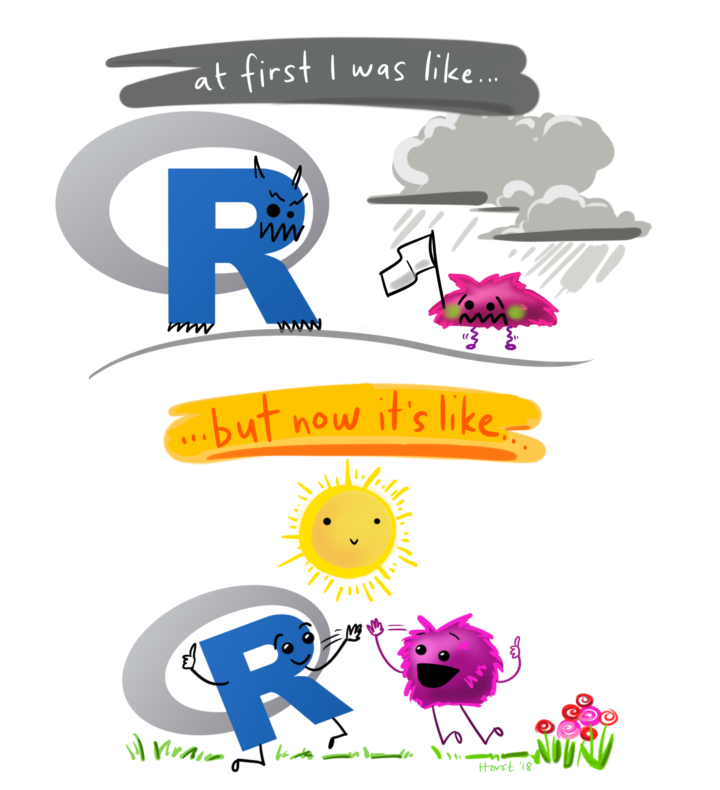
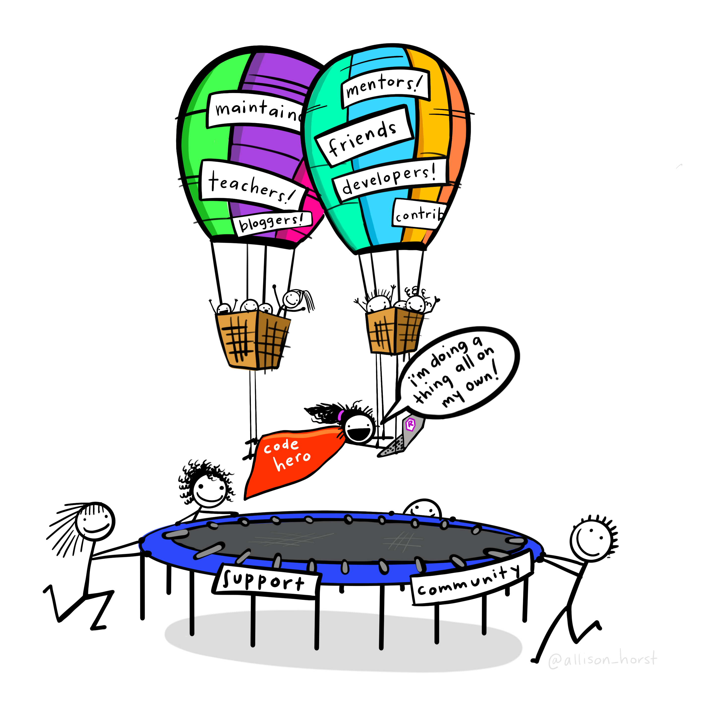
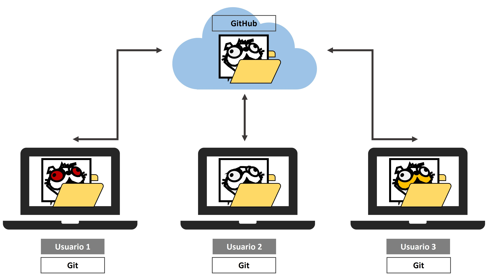
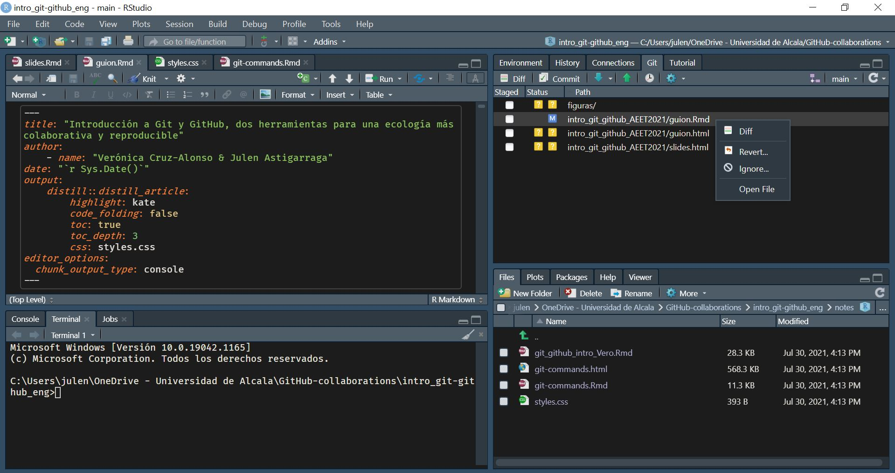
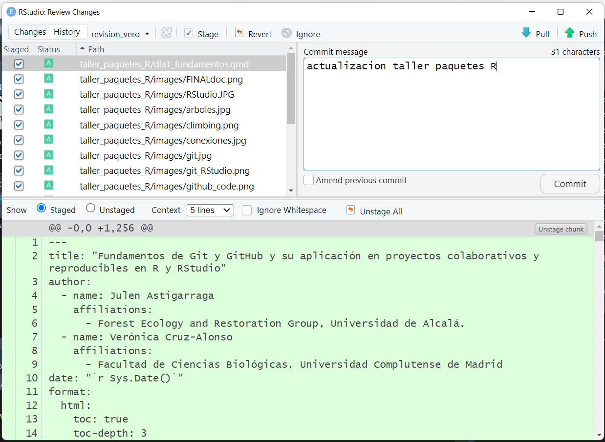

# Introducción al lenguaje R y organización del trabajo en Git y GitHub

Josiah Carberry
01/12/2024

- [<span class="toc-section-number">1</span> Quiénes
  somos](#quiénes-somos)
- [<span class="toc-section-number">2</span>
  Presentación](#presentación)
- [<span class="toc-section-number">3</span> Estructura del
  curso](#estructura-del-curso)
- [<span class="toc-section-number">4</span> Dinámica del
  curso](#dinámica-del-curso)
- [<span class="toc-section-number">5</span> Objetivos del día
  1](#objetivos-del-día-1)
- [<span class="toc-section-number">6</span> Conceptos
  básicos](#conceptos-básicos)
- [<span class="toc-section-number">7</span> Comenzando a trabajar en
  R](#comenzando-a-trabajar-en-r)
  - [<span class="toc-section-number">7.1</span> El espacio de
    trabajo](#el-espacio-de-trabajo)
    - [<span class="toc-section-number">7.1.1</span>
      Ejercicio](#ejercicio)
  - [<span class="toc-section-number">7.2</span> Instalar y cargar
    paquetes](#instalar-y-cargar-paquetes)
    - [<span class="toc-section-number">7.2.1</span>
      Ejercicio](#ejercicio-1)
  - [<span class="toc-section-number">7.3</span> Operaciones aritméticas
    (R como calculadora)](#operaciones-aritméticas-r-como-calculadora)
- [<span class="toc-section-number">8</span> Objetos de
  R](#objetos-de-r)
  - [<span class="toc-section-number">8.1</span> Nombramiento de
    objetos](#nombramiento-de-objetos)
  - [<span class="toc-section-number">8.2</span> Tipos de
    objetos](#tipos-de-objetos)
    - [<span class="toc-section-number">8.2.1</span>
      Vectores](#vectores)
    - [<span class="toc-section-number">8.2.2</span>
      Ejercicio](#ejercicio-2)
    - [<span class="toc-section-number">8.2.3</span>
      Matrices](#matrices)
    - [<span class="toc-section-number">8.2.4</span> Bases de datos
      (data.frames)](#bases-de-datos-dataframes)
    - [<span class="toc-section-number">8.2.5</span> Listas](#listas)
  - [<span class="toc-section-number">8.3</span>
    Indexación](#indexación)
    - [<span class="toc-section-number">8.3.1</span>
      Ejercicio](#ejercicio-3)
- [<span class="toc-section-number">9</span> Enlaces de interés para
  empezar](#enlaces-de-interés-para-empezar)
  - [<span class="toc-section-number">9.1</span> Principios básicos de
    programación](#principios-básicos-de-programación)
  - [<span class="toc-section-number">9.2</span> ¿Quién responde a mis
    dudas en R?](#quién-responde-a-mis-dudas-en-r)
- [<span class="toc-section-number">10</span> Análisis reproducibles en
  R y la importancia de Git y
  GitHub](#análisis-reproducibles-en-r-y-la-importancia-de-git-y-github)
  - [<span class="toc-section-number">10.1</span> Qué es
    Git](#qué-es-git)
  - [<span class="toc-section-number">10.2</span> Qué es
    GitHub](#qué-es-github)
- [<span class="toc-section-number">11</span> Instalación](#instalación)
  - [<span class="toc-section-number">11.1</span>
    Ejercicio](#ejercicio-4)
- [<span class="toc-section-number">12</span> Repositorios y
  proyectos](#repositorios-y-proyectos)
  - [<span class="toc-section-number">12.0.1</span>
    Ejercicio](#ejercicio-5)
  - [<span class="toc-section-number">12.1</span> Git
    ignore](#git-ignore)
  - [<span class="toc-section-number">12.2</span> Estructura del
    repositorio de GitHub](#estructura-del-repositorio-de-github)
- [<span class="toc-section-number">13</span> GitHub: la red
  social](#github-la-red-social)
  - [<span class="toc-section-number">13.0.1</span>
    Ejercicio](#ejercicio-6)
- [<span class="toc-section-number">14</span> Flujo de trabajo en Git y
  GitHub](#flujo-de-trabajo-en-git-y-github)
  - [<span class="toc-section-number">14.1</span> ¿Cómo moverse de una
    zona a otra?](#cómo-moverse-de-una-zona-a-otra)
    - [<span class="toc-section-number">14.1.1</span>
      Ejercicio](#ejercicio-7)
- [<span class="toc-section-number">15</span> Navegar por el
  historial](#navegar-por-el-historial)
- [<span class="toc-section-number">16</span> Enlaces de interés sobre
  Git y GitHub](#enlaces-de-interés-sobre-git-y-github)

## Quiénes somos

Verónica Cruz-Alonso (veronica.cral@gmail.com). Investigadora
postdoctoral de la Universidad Complutense de Madrid y la Universidad de
Alcalá en España.

Imparto cursos de ciencia de datos junto con Julen Astigarraga y Enrique
Andivia. En [DatSciR](https://github.com/DatSciR) publicamos los
materiales de los cursos que impartimos.

Soy co-coordinadora del [grupo de trabajo de
Ecoinformática](https://ecoinfaeet.github.io/website/) de la Asociación
Española de Ecología Terrestre.

Y vosotros ¿quiénes sois?

<https://www.menti.com/als6tisi5e3g>

## Presentación

En este curso exploraremos tanto los fundamentos teóricos como las
aplicaciones prácticas de la ciencia de datos. Abordaremos desde tareas
comunes con las que nos enfrentamos en nuestro día a día, como la
limpieza, visualiación y transformación de datos, hasta nociones más
avanzadas de programación y análisis estadístico. Además, aprenderemos a
utilizar herramientas para generar documentos reproducibles y
colaborativos.

El objetivo principal es que tanto aquellos con conocimientos básicos en
ciencia de datos y análisis estadístico como aquellos con un nivel más
avanzado puedan beneficiarse y llevar consigo nuevos aprendizajes al
finalizar el curso.

<div id="fig-datascience">


Figure 1: Modelo de ciencia de datos de Hadley Wickham, Mine
Çetinkaya-Rundel y Garrett Grolemund. Traducido de
https://r4ds.hadley.nz/intro#fig-ds-diagram

</div>

## Estructura del curso

<table>
<colgroup>
<col style="width: 52%" />
<col style="width: 47%" />
</colgroup>
<thead>
<tr class="header">
<th>Bloques</th>
<th>Contenido</th>
</tr>
</thead>
<tbody>
<tr class="odd">
<td>Introducción al lenguaje de R y organización del trabajo en Git y
GitHub</td>
<td><p>Introducción al curso</p>
<p>Introducción a la programación en R</p>
<p>Introducción a Git y GitHub</p>
<p>Flujo de trabajo en Git y GitHub</p></td>
</tr>
<tr class="even">
<td>Organización de datos y bases de programación funcional</td>
<td><p>Tidyverse</p>
<p>Importar, filtrar, seleccionar, transformar, unir y exportar
datos</p>
<p>Programación funcional: funciones e iteraciones</p></td>
</tr>
<tr class="odd">
<td>Visualización y análisis exploratorio de datos</td>
<td><p>Fundamentos de visualización</p>
<p>Bases: gráficos por capas</p>
<p>Visualización avanzada</p>
<p>Análisis exploratorio de datos</p></td>
</tr>
<tr class="even">
<td>Análisis de datos: modelos lineales habituales en ecología</td>
<td><p>Modelos lineales</p>
<p>Modelos lineales generalizados</p>
<p>Modelos lineales mixtos</p></td>
</tr>
<tr class="odd">
<td>Comunicación de resultados y trabajo colaborativo</td>
<td><p>Introducción a Quarto</p>
<p>R Markdown vs Quarto</p>
<p>Trabajos colaborativos</p></td>
</tr>
</tbody>
</table>

## Dinámica del curso

Cada día combinaremos teoría con ejercicios. Idealmente, el cuarto y
quinto día tendremos tiempo para que cada uno trabaje con sus propios
datos. Todos los apuntes y ejercicios resueltos estarán disponibles en
el [repositorio de GitHub del
curso](https://github.com/DatSciR/ciencia_datos). Los apuntes incluyen
nociones de estilo a la hora de escribir en R que están destacadas con
📝.

Si alguien tiene alguna duda o sugerencia, me puede contactar por correo
electrónico o publicarlo en las [discusiones del repositorio de
GitHub](#0) ¡así aprenderemos entre todos! 😉



## Objetivos del día 1

- Aprender conceptos básicos de la programación en R.

- Comprender la importancia de los flujos de análisis reproducibles.

- Comprender la funcionalidad de Git y GitHub en análisis científicos.

- Comprender el flujo de trabajo entre Git, GitHub y RStudio

- Aprender a trabajar colaborativamente con Git y GitHub

## Conceptos básicos

- [R](https://www.r-project.org/about.html): lenguaje de programación
  dinámico (se interpreta el código en el momento que se ejecuta).

  💡[Un poco de historia de R contada por Jumping
  Rivers](https://www.jumpingrivers.com/misc/timeline/)

- RStudio: entorno de desarrollo integrado para programar en R. Tiene
  cuatro zonas diferenciadas: el editor de código, la consola (donde se
  ejecuta el código), el navegador del espacio de trabajo (con el
  entorno de trabajo –*environment-* y el historial de comandos) y el
  mix de abajo a la derecha (Archivos, Gráficos, Paquetes, Ayuda).

- Objetos: cualquier elemento almacenado con un nombre específico.
  Pueden ser de muchas clases: `numeric`, `integer`, `logical`,
  `data.frame`, `SpatVector`, etc.

- Funciones: objetos de R que toman un vector de entrada y dan como
  resultado otro vector haciendo una acción concreta (funcionalidad
  específica). Son los *bloques de construcción* fundamentales en
  cualquier script de R que es un lenguaje funcional.


> Para comprender la computación en R, resultan útiles dos lemas:
>
> \- Todo lo que existe es un objeto.
>
> \- Todo lo que sucede es una llamada a función.
>
> — John Chambers ([Advanced R](https://adv-r.hadley.nz/index.html))

- Paquetes o librerias: contienen funciones reutilizables, documentación
  sobre cómo usarlas y datos de ejemplo. Son las unidades fundamentales
  de código reproducible en R.

- CRAN: the Comprehensive R Archive Network.

## Comenzando a trabajar en R

### El espacio de trabajo

El directorio de trabajo es la carpeta de nuestro ordenador donde
estamos trabajando, de donde se leeran los archivos de entrada y donde
se guardarán los de salida a menos que especifiquemos lo contrario.

``` r
getwd() # saber directorio de trabajo 
# setwd("C:/Users/veruk/Desktop/Disco/Curso Ciencia de Datos/ciencia_datos") # ojo con la ruta / o \\
```

No es recomendable establecer el directorio de trabajo manualmente
porque el trabajo deja de ser reproducible. Es mejor crear desde el
principio un **proyecto** en R ligado a un directorio relativo que
contenga todos los datos de entrada, los scripts y los resultados del
script. Al abrir el proyecto, el directorio se sincroniza con pestaña
*Files*.

💡Para crear un proyecto: Archivo \> Nuevo proyecto

💡Es recomendable abrir RStudio utilizando el icono del proyecto para
una mejor organización.

#### Ejercicio

Crea un proyecto para realizar los ejercicios del curso de programación
en R y guardalo en curso_R \> ejercicios.

### Instalar y cargar paquetes

💡Para ejecutar un comando: Ctrl + Enter (Ctrl + R)

``` r
# install.packages("tidyverse", dep = T) # dep = T significa instalar dependencias

library(tidyverse)
```

    ── Attaching core tidyverse packages ──────────────────────── tidyverse 2.0.0 ──
    ✔ dplyr     1.1.4     ✔ readr     2.1.5
    ✔ forcats   1.0.0     ✔ stringr   1.5.1
    ✔ ggplot2   3.5.1     ✔ tibble    3.2.1
    ✔ lubridate 1.9.3     ✔ tidyr     1.3.1
    ✔ purrr     1.0.2     
    ── Conflicts ────────────────────────────────────────── tidyverse_conflicts() ──
    ✖ dplyr::filter() masks stats::filter()
    ✖ dplyr::lag()    masks stats::lag()
    ℹ Use the conflicted package (<http://conflicted.r-lib.org/>) to force all conflicts to become errors

``` r
?tidyverse # ayuda de paquetes y funciones
```

    starting httpd help server ... done

``` r
?select
```

#### Ejercicio

Instala el metapaquete tidyverse utilizando la consola.

### Operaciones aritméticas (R como calculadora)

``` r
5 + 6
```

    [1] 11

``` r
5 * 6
```

    [1] 30

``` r
60 / 4
```

    [1] 15

``` r
5 + 4 - 2
```

    [1] 7

``` r
5 + 4 * 5
```

    [1] 25

``` r
(5 + 4) * 5
```

    [1] 45

``` r
log(10) # logaritmo neperiano 
```

    [1] 2.302585

``` r
log10(10) 
```

    [1] 1

``` r
exp(1) 
```

    [1] 2.718282

``` r
3 ^ 2 
```

    [1] 9

``` r
3 ^ 2 / 3 
```

    [1] 3

``` r
sqrt(16) 
```

    [1] 4

``` r
pi 
```

    [1] 3.141593

``` r
sin(pi / 2) # en radianes 
```

    [1] 1

``` r
cos(pi / 2)
```

    [1] 6.123032e-17

``` r
tan(pi / 2)
```

    [1] 1.633124e+16

``` r
asin(1) * 2
```

    [1] 3.141593

``` r
acos(1)
```

    [1] 0

## Objetos de R

### Nombramiento de objetos

Al asignar un nombre a un objeto podemos llamarlos siempre que
necesitemos a lo largo del script. No es necesario guardar (exportar) la
mayoría de los objetos que tenemos en el entorno de trabajo de R a
nuestro ordenador, lo importante es conservar el script con el que se
generan.

``` r
x <- 4.5 # shortcut para la flecha de asignación Alt + "-" 
y <- "objeto" # si el objeto contiene letras, usar comillas 
class(x) # función para ver de que clase es nuestro objeto 
```

    [1] "numeric"

``` r
class(y) 
```

    [1] "character"

``` r
x # Llamar al vector para saber su valor 
```

    [1] 4.5

``` r
y
```

    [1] "objeto"

📝Los nombre de los objetos deben ser descriptivos y no pueden contener
símbolos especiales (`^`, `!`, `$`, `@`, `+`, `-`, `/`, `*`).

📝R es sensible a las mayúsculas. Mejor no usarlas.

### Tipos de objetos

#### Vectores

Un vector es la estructura de datos más sencilla en R. Un vector es una
colección de uno o más datos del mismo tipo.

``` r
v1 <- c(2.4, 4, 6, 3.2) # si quiero asignar mas de un valor uso "c" (concatenar) 
v1 
```

    [1] 2.4 4.0 6.0 3.2

``` r
v1 * 100 # puedo operar con los vectores 
```

    [1] 240 400 600 320

``` r
log(v1)
```

    [1] 0.8754687 1.3862944 1.7917595 1.1631508

``` r
v2 <- c(1, 3, 4, 8) # pero también entre vectores 
v1 + v2
```

    [1]  3.4  7.0 10.0 11.2

``` r
v3 <- v1 - v2 
v3
```

    [1]  1.4  1.0  2.0 -4.8

``` r
mean(x = v2) # funciones ya programadas 
```

    [1] 4

``` r
# ?mean 
sd(v2) 
```

    [1] 2.94392

``` r
length(v2) # n vector 
```

    [1] 4

``` r
max(v2) 
```

    [1] 8

``` r
min(v2)
```

    [1] 1

``` r
# funciones que facilitan la creación de vectores
rep(x = 1, times = 4) 
```

    [1] 1 1 1 1

``` r
1:10 # dos puntos de a a b 
```

     [1]  1  2  3  4  5  6  7  8  9 10

``` r
seq(from = 1, to = 20, by = 2) 
```

     [1]  1  3  5  7  9 11 13 15 17 19

``` r
c(v1, v2) 
```

    [1] 2.4 4.0 6.0 3.2 1.0 3.0 4.0 8.0

``` r
c(v1, rep(0, 3), v1)
```

     [1] 2.4 4.0 6.0 3.2 0.0 0.0 0.0 2.4 4.0 6.0 3.2

#### Ejercicio

Crea un script en tu proyecto y realiza las siguientes operaciones:

- Elije un número y multiplicalo por 3

- Crea un objeto que contenga 100 valores entre 1900 y 2000

- Suma un número a tu objeto

- Multiplica tu objeto por sí mismo

- Crea un objeto que contenga el número 5 repetido 9 veces junto con una
  secuencia de 5 a 50 cada 5 elementos

- ¿Cuál es la longitud del objeto anterior?

Para crear vectores se pueden usar otras estrategias como las que tenéis
recogidas a continuación.

``` r
rep(x = 1, times = 4) 
```

    [1] 1 1 1 1

``` r
rep(1:4, times = 2) 
```

    [1] 1 2 3 4 1 2 3 4

``` r
rep(1:4, each = 2) 
```

    [1] 1 1 2 2 3 3 4 4

``` r
rep(1:4, times = 1:4)
```

     [1] 1 2 2 3 3 3 4 4 4 4

``` r
rep(x = c("gato", "perro", "pez"), times = c(5, 3, 1))
```

    [1] "gato"  "gato"  "gato"  "gato"  "gato"  "perro" "perro" "perro" "pez"  

``` r
rnorm(10, mean = 4, sd = 2.2)
```

     [1]  2.8535639  3.6592880  2.8906665  5.1049570  7.7211645  3.6691881
     [7]  3.4529596  1.9262943  2.8231946 -0.1115736

#### Matrices

Las matrices pueden ser descritas como vectores multidimensionales. Al
igual que un vector, únicamente pueden contener datos de un sólo tipo,
pero además de largo, tienen más dimensiones.

``` r
mivector <- sample(x = 1:10, size = 1000, replace = T) # sample: función para crear numeros aleatorios 

mimatriz <- matrix(mivector, nrow = 100, ncol = 10) # matrix: función para convertir vector en matriz. matrix va a rellenar por columnas por defecto

str(mivector) # mostrar estructura datos 
```

     int [1:1000] 8 10 7 5 3 9 4 5 10 7 ...

``` r
str(mimatriz)
```

     int [1:100, 1:10] 8 10 7 5 3 9 4 5 10 7 ...

``` r
summary(mivector) # resumen de los datos 
```

       Min. 1st Qu.  Median    Mean 3rd Qu.    Max. 
      1.000   3.000   5.000   5.366   8.000  10.000 

``` r
summary(mimatriz)
```

           V1              V2              V3              V4       
     Min.   : 1.00   Min.   : 1.00   Min.   : 1.00   Min.   : 1.00  
     1st Qu.: 3.00   1st Qu.: 3.00   1st Qu.: 3.00   1st Qu.: 3.00  
     Median : 5.00   Median : 6.00   Median : 5.00   Median : 6.00  
     Mean   : 5.49   Mean   : 5.68   Mean   : 5.23   Mean   : 5.66  
     3rd Qu.: 8.00   3rd Qu.: 8.00   3rd Qu.: 7.00   3rd Qu.: 8.00  
     Max.   :10.00   Max.   :10.00   Max.   :10.00   Max.   :10.00  
           V5              V6             V7              V8              V9       
     Min.   : 1.00   Min.   : 1.0   Min.   : 1.00   Min.   : 1.00   Min.   : 1.00  
     1st Qu.: 3.00   1st Qu.: 3.0   1st Qu.: 3.00   1st Qu.: 3.00   1st Qu.: 3.00  
     Median : 5.50   Median : 5.0   Median : 5.00   Median : 5.00   Median : 5.00  
     Mean   : 5.44   Mean   : 5.2   Mean   : 5.34   Mean   : 5.22   Mean   : 5.07  
     3rd Qu.: 8.00   3rd Qu.: 8.0   3rd Qu.: 7.00   3rd Qu.: 8.00   3rd Qu.: 7.00  
     Max.   :10.00   Max.   :10.0   Max.   :10.00   Max.   :10.00   Max.   :10.00  
          V10       
     Min.   : 1.00  
     1st Qu.: 3.00  
     Median : 5.00  
     Mean   : 5.33  
     3rd Qu.: 8.00  
     Max.   :10.00  

``` r
a <- c(1, 2, 3, 4) 
b <- c(1, 2, 3, 4) 
d <- c("hi", "hola", "hola", "hi")

mimatriz_num <- matrix(c(a, b), nrow = 4, ncol = 2) 
mimatriz_num
```

         [,1] [,2]
    [1,]    1    1
    [2,]    2    2
    [3,]    3    3
    [4,]    4    4

``` r
mimatriz_car <- matrix(c(a, b, d), nrow = 4, ncol = 3) 
mimatriz_car
```

         [,1] [,2] [,3]  
    [1,] "1"  "1"  "hi"  
    [2,] "2"  "2"  "hola"
    [3,] "3"  "3"  "hola"
    [4,] "4"  "4"  "hi"  

``` r
summary(mimatriz_num) 
```

           V1             V2      
     Min.   :1.00   Min.   :1.00  
     1st Qu.:1.75   1st Qu.:1.75  
     Median :2.50   Median :2.50  
     Mean   :2.50   Mean   :2.50  
     3rd Qu.:3.25   3rd Qu.:3.25  
     Max.   :4.00   Max.   :4.00  

``` r
summary(mimatriz_car)
```

          V1                 V2                 V3           
     Length:4           Length:4           Length:4          
     Class :character   Class :character   Class :character  
     Mode  :character   Mode  :character   Mode  :character  

#### Bases de datos (data.frames)

Los data.frames son estructuras de datos de dos dimensiones que pueden
contener datos de diferentes tipos. Esta estructura de datos es la más
usada para realizar análisis de datos.

``` r
midataframe <- data.frame(
  mivariable1 = a, 
  mivariable2 = b, 
  mivariable3 = d)

View(midataframe)

# un tibble es un data.frame de tidyverse, con características mejoradas

mitibble <- tibble(
  mivariable1 = a, 
  mivariable2 = b, 
  mivariable3 = d)

str(mitibble) 
```

    tibble [4 × 3] (S3: tbl_df/tbl/data.frame)
     $ mivariable1: num [1:4] 1 2 3 4
     $ mivariable2: num [1:4] 1 2 3 4
     $ mivariable3: chr [1:4] "hi" "hola" "hola" "hi"

``` r
str(midataframe) 
```

    'data.frame':   4 obs. of  3 variables:
     $ mivariable1: num  1 2 3 4
     $ mivariable2: num  1 2 3 4
     $ mivariable3: chr  "hi" "hola" "hola" "hi"

``` r
summary(mitibble) 
```

      mivariable1    mivariable2   mivariable3       
     Min.   :1.00   Min.   :1.00   Length:4          
     1st Qu.:1.75   1st Qu.:1.75   Class :character  
     Median :2.50   Median :2.50   Mode  :character  
     Mean   :2.50   Mean   :2.50                     
     3rd Qu.:3.25   3rd Qu.:3.25                     
     Max.   :4.00   Max.   :4.00                     

``` r
summary(midataframe) 
```

      mivariable1    mivariable2   mivariable3       
     Min.   :1.00   Min.   :1.00   Length:4          
     1st Qu.:1.75   1st Qu.:1.75   Class :character  
     Median :2.50   Median :2.50   Mode  :character  
     Mean   :2.50   Mean   :2.50                     
     3rd Qu.:3.25   3rd Qu.:3.25                     
     Max.   :4.00   Max.   :4.00                     

``` r
mitibble
```

    # A tibble: 4 × 3
      mivariable1 mivariable2 mivariable3
            <dbl>       <dbl> <chr>      
    1           1           1 hi         
    2           2           2 hola       
    3           3           3 hola       
    4           4           4 hi         

``` r
midataframe
```

      mivariable1 mivariable2 mivariable3
    1           1           1          hi
    2           2           2        hola
    3           3           3        hola
    4           4           4          hi

#### Listas

Las listas, al igual que los vectores, son estructuras de datos
unidimensionales, pero a diferencia de los vectores cada uno de sus
elementos puede ser de diferente tipo o incluso de diferente clase, por
lo que son estructuras heterogéneas.

``` r
e <- c(TRUE, TRUE, TRUE, FALSE, FALSE)

milista <- list(a, b, d, e)
milista 
```

    [[1]]
    [1] 1 2 3 4

    [[2]]
    [1] 1 2 3 4

    [[3]]
    [1] "hi"   "hola" "hola" "hi"  

    [[4]]
    [1]  TRUE  TRUE  TRUE FALSE FALSE

``` r
str(milista) 
```

    List of 4
     $ : num [1:4] 1 2 3 4
     $ : num [1:4] 1 2 3 4
     $ : chr [1:4] "hi" "hola" "hola" "hi"
     $ : logi [1:5] TRUE TRUE TRUE FALSE FALSE

``` r
summary(milista)
```

         Length Class  Mode     
    [1,] 4      -none- numeric  
    [2,] 4      -none- numeric  
    [3,] 4      -none- character
    [4,] 5      -none- logical  

``` r
milista2 <- list(a, b, d, e, mivector, mimatriz, midataframe)
str(milista2)
```

    List of 7
     $ : num [1:4] 1 2 3 4
     $ : num [1:4] 1 2 3 4
     $ : chr [1:4] "hi" "hola" "hola" "hi"
     $ : logi [1:5] TRUE TRUE TRUE FALSE FALSE
     $ : int [1:1000] 8 10 7 5 3 9 4 5 10 7 ...
     $ : int [1:100, 1:10] 8 10 7 5 3 9 4 5 10 7 ...
     $ :'data.frame':   4 obs. of  3 variables:
      ..$ mivariable1: num [1:4] 1 2 3 4
      ..$ mivariable2: num [1:4] 1 2 3 4
      ..$ mivariable3: chr [1:4] "hi" "hola" "hola" "hi"

### Indexación

``` r
mivector 
```

       [1]  8 10  7  5  3  9  4  5 10  7  2  5  6  3  2  8  4  5  5  9 10  9  2  3
      [25]  7  3  7  6  3  3  3  3  4  4  6 10  4  5  3  8  3  3  6  2  7  7  4  7
      [49]  7 10  8 10  3  1  3 10  1  4  4  5 10  6  6  4  2  2 10  8  4  3  4  9
      [73]  2  9  1  4  5  8  3  6 10  5  5 10  8  5  7  1  6  9  7  8  2  6  5 10
      [97]  4  3  1  6  6  4  9  9  8  7  5  2  6  6  5  6  4  4  8  8  1  1  2  1
     [121]  5 10 10  1  1 10  2  8 10 10  2  3  5  8 10  9  6  6  8  3  2  9  4  8
     [145]  9  8  9  5  1  4  6  9  2  5  6 10  1  9  5  7  6  5  1 10  2  7  5  6
     [169] 10  1  8  7  5  2  2 10 10  8  3 10  8  8  5  2  9  7  7  2  7  7  4  2
     [193]  1  8  1  9  6  4  2  3  6  4  9  2  5  4  5 10  5  6  6  4  9  2  4  5
     [217]  2  6  2  5  6 10  7  4  9  6  2  9 10  6  7  3  3  5  3  3 10  6  6  1
     [241]  7  5  3  3 10  2  5  3  2  4  7  4 10  5  9  8  9  4 10  4  2  1  7  7
     [265]  5  2  6  8  4  2  3  1  5  3  5  2  8  7  6  9  2  7  9  6  8 10  8  1
     [289]  5  4  7  3  6  2  1  4  5  6  2  3 10  3  3  1  4  8  6  9  3  5  1  5
     [313] 10  7  1  4  4  7 10  4  6  4  5 10  9  1  7  8  1  1  4  6  6 10  3  5
     [337] 10  6  4  4 10  9  3  2  8  8  5  6  9  4  8  8  1  7 10  8  3 10  4  3
     [361]  3  6  2  2  5  7 10  8  2  6  8  8  7  2  5  8  6  7  6  7  1  4  4  6
     [385]  8  3  8  5  3  5 10  2 10  5  2  3  9  7  6  9  2  6  6  7  2  6 10  1
     [409]  9  3  9  2  8  2  9  7  9  3 10  4  4  8  5  9  6  7  3  8  2  9  9  4
     [433]  7  3  8  2  2  4  5  9  3  7  2  3 10  8  4  5 10  2  4  5  7  7  5  9
     [457]  1  2  7  6  1  6  3  2  8  1  8  5  9  7  3  9  3  1  6  2  4  2 10  5
     [481] 10  8  6  8  1  8  1  1 10  4  6  3  3  8  7  2  8  4  5 10  2  2  3  9
     [505]  2  5  4 10  7  4  8  9  9  8  3  4  8  8  1 10  6  5  7  2  3  4  5  6
     [529]  2  2  2  3  5  1  6  7  3  6  2  2  5  9  8  4  1  9  4  7  1  6  2  6
     [553] 10  5  9  7  6  3  2  8  1  8  4  1 10  3  9  8  9  6  9  3  8  6  2  4
     [577]  6 10  3  7  4  3  5  9  2  8  5  2  4  7  2  4  1  6  1  5  9  7  8  4
     [601]  5  9  7  7  3  7  8  6  8  4  4  6  4  5  4  2  4  4  3  6  8  4  4  7
     [625]  9  5 10  1  7  3  8  8 10  3  1  9  8  1  7  4  8  2  6  6  1  8  8  6
     [649]  5  2  8  6  5  5 10  2 10  2  3  8  3  6  4 10  1  5  7  4  3  1  9 10
     [673]  9  6  4  7  1  5  5  7  9  6  7  5  2  9  7  4  2  3  3  1  6  5  5  1
     [697]  5  7  2  4  1  4  3  2  5  2  1  9  8  2  1  6  4  7  6  6  5  2  6 10
     [721]  1  6  1  3  9  8  8 10  5  5  5  2  3 10  2  6  3  3  5  5  8  8  3  6
     [745]  1  9  2  6  6 10  7  6  4  3  6  5  2  4  1  3  8  1  8  2  1 10  8  7
     [769]  5  5  1 10  3  9  9  2  9 10  9  4  7  5  5  7  2  8  4  3  8  8  4  3
     [793]  7  6  4  8  4  3  9  6  7  9  2  9  1  8  8  7  3  4  9  7  4  7  8  2
     [817]  5  5  6  5  9  6  6  1  2  6  4  5  3  2  5  8  8 10  8  2  3  2  2  6
     [841]  6  5  6  7  7  2  8  7  4  4  1  4  6  8  2  1  4  9  4  3  9  1  2  5
     [865]  1  1  6  4  8 10  9  4  6  7  6  5  3  2  2  3  2  7  2  4  7  5  4  8
     [889] 10  1  3  7  6  6  7  7  7  2  5  1  8  8 10  5  6  3  2  8  3  7  7  3
     [913]  4  5  2  3  5  2  5  2  6  2  2  5  1  2 10  4 10  3  5  3 10  1  8  5
     [937]  5  1  2  4  4  1  8  9  1  7  4  3  9  1  4  2  7  7  8  7  5  4  7  2
     [961]  5  3  1  9  6  5  2 10  6  7  9  3  3 10  3  2  5 10  9  3  5 10  9  8
     [985]  8  5  9  9  3 10 10  5  8  4  4 10  9  2  1  6

``` r
mivector[505]
```

    [1] 2

``` r
mimatriz 
```

           [,1] [,2] [,3] [,4] [,5] [,6] [,7] [,8] [,9] [,10]
      [1,]    8    6    6   10    2    2    5    1    7     8
      [2,]   10    4    4    3    6    2    9    4    9     8
      [3,]    7    9    9    3    6    3    7    3    2    10
      [4,]    5    9    2    1    7    9    7    2    9     5
      [5,]    3    8    5    4    2    2    3    5    1     6
      [6,]    9    7    4    8    6    5    7    2    8     3
      [7,]    4    5    5    6   10    4    8    1    8     2
      [8,]    5    2   10    9    1   10    6    9    7     8
      [9,]   10    6    5    3    9    7    8    8    3     3
     [10,]    7    6    6    5    3    4    4    2    4     7
     [11,]    2    5    6    1    9    8    4    1    9     7
     [12,]    5    6    4    5    2    9    6    6    7     3
     [13,]    6    4    9   10    8    9    4    4    4     4
     [14,]    3    4    2    7    2    8    5    7    7     5
     [15,]    2    8    4    1    9    3    4    6    8     2
     [16,]    8    8    5    4    7    4    2    6    2     3
     [17,]    4    1    2    4    9    8    4    5    5     5
     [18,]    5    1    6    7    3    8    4    2    5     2
     [19,]    5    2    2   10   10    1    3    6    6     5
     [20,]    9    1    5    4    4   10    6   10    5     2
     [21,]   10    5    6    6    4    6    8    1    9     6
     [22,]    9   10   10    4    8    5    4    6    6     2
     [23,]    2   10    7    5    5    7    4    1    6     2
     [24,]    3    1    4   10    9    2    7    3    1     5
     [25,]    7    1    9    9    6    3    9    9    2     1
     [26,]    3   10    6    1    7    4    5    8    6     2
     [27,]    7    2    2    7    3    5   10    8    4    10
     [28,]    6    8    9    8    8    6    1   10    5     4
     [29,]    3   10   10    1    2    2    7    5    3    10
     [30,]    3   10    6    1    9    2    3    5    2     3
     [31,]    3    2    7    4    9    2    8    5    5     5
     [32,]    3    3    3    6    4    3    8    2    8     3
     [33,]    4    5    3    6    7    5   10    3    8    10
     [34,]    4    8    5   10    3    1    3   10   10     1
     [35,]    6   10    3    3    8    6    1    2    8     8
     [36,]   10    9    3    5    2    7    9    6    2     5
     [37,]    4    6   10   10    2    3    8    3    3     5
     [38,]    5    6    6    6    4    6    1    3    2     1
     [39,]    3    8    6    4    5    2    7    5    2     2
     [40,]    8    3    1    4    9    2    4    5    6     4
     [41,]    3    2    7   10    3    5    8    8    6     4
     [42,]    3    9    5    9    7    9    2    8    5     1
     [43,]    6    4    3    3    2    8    6    3    6     8
     [44,]    2    8    3    2    3    4    6    6    7     9
     [45,]    7    9   10    8   10    1    1    1    7     1
     [46,]    7    8    2    8    8    9    8    9    2     7
     [47,]    4    9    5    5    4    4    8    2    8     4
     [48,]    7    5    3    6    5    7    6    6    7     3
     [49,]    7    1    2    9   10    1    5    6    4     9
     [50,]   10    4    4    4    2    6    2   10    4     1
     [51,]    8    6    7    8    4    2    8    7    1     4
     [52,]   10    9    4    8    5    6    6    6    4     2
     [53,]    3    2   10    1    7   10    5    4    6     7
     [54,]    1    5    5    7    7    5    5    3    8     7
     [55,]    3    6    9   10    5    9   10    6    2     8
     [56,]   10   10    8    8    9    7    2    5    1     7
     [57,]    1    1    9    3    1    6   10    2    4     5
     [58,]    4    9    4   10    2    3    2    4    9     4
     [59,]    4    5   10    4    7    2    3    1    4     7
     [60,]    5    7    4    3    6    8    8    3    3     2
     [61,]   10    6    2    3    1    1    3    8    9     5
     [62,]    6    5    1    6    6    8    6    1    1     3
     [63,]    6    1    7    2    3    4    4    8    2     1
     [64,]    4   10    7    2    2    1   10    2    5     9
     [65,]    2    2    5    5    8   10    1    1    1     6
     [66,]    2    7    2    7    1    3    5   10    1     5
     [67,]   10    5    6   10    8    9    7    8    6     2
     [68,]    8    6    8    8    5    8    4    7    4    10
     [69,]    4   10    4    2    9    9    3    5    8     6
     [70,]    3    1    2    6    7    6    1    5   10     7
     [71,]    4    8    3    8    3    9    9    1    9     9
     [72,]    9    7    1    8    9    3   10   10    4     3
     [73,]    2    5    5    7    3    8    9    3    6     3
     [74,]    9    2    3    2    1    6    6    9    7    10
     [75,]    1    2    5    5    6    2    4    9    6     3
     [76,]    4   10    2    8    2    4    7    2    5     2
     [77,]    5   10    8    6    4    6    1    9    3     5
     [78,]    8    8    7    7    2   10    5   10    2    10
     [79,]    3    3    6    6   10    3    5    9    2     9
     [80,]    6   10    9    7    5    7    7    4    3     3
     [81,]   10    8    2    1   10    4    9    7    2     5
     [82,]    5    8    7    4    8    3    6    5    7    10
     [83,]    5    5    9    4    6    5    7    5    2     9
     [84,]   10    2    6    6    8    9    5    7    4     8
     [85,]    8    9    8    8    1    2    2    2    7     8
     [86,]    5    7   10    3    8    8    9    8    5     5
     [87,]    7    7    8    8    1    5    7    4    4     9
     [88,]    1    2    1    5    1    2    4    3    8     9
     [89,]    6    7    5    3   10    4    2    8   10     3
     [90,]    9    7    4    5    4    7    3    8    1    10
     [91,]    7    4    7   10    6    2    3    4    3    10
     [92,]    8    2    3    2    3    4    1    3    7     5
     [93,]    2    1    6   10    3    1    6    7    6     8
     [94,]    6    8    2    5    8    6    5    6    6     4
     [95,]    5    1    1    2    7    1    5    4    7     4
     [96,]   10    9    4    3    2    5    1    8    7    10
     [97,]    4    6    5    9    8    9    5    4    7     9
     [98,]    3    4    6    7    4    7    7    3    2     2
     [99,]    1    2    2    6    5    8    2    9    5     1
    [100,]    6    3    3    9   10    4    4    6    1     6

``` r
mimatriz[20, 9] # [filas, columnas] 
```

    [1] 5

``` r
mimatriz[20, ] # selecciono todas las columnas de la fila 20
```

     [1]  9  1  5  4  4 10  6 10  5  2

``` r
mimatriz[, 9] # selecciono todas las filas de la columna 9
```

      [1]  7  9  2  9  1  8  8  7  3  4  9  7  4  7  8  2  5  5  6  5  9  6  6  1  2
     [26]  6  4  5  3  2  5  8  8 10  8  2  3  2  2  6  6  5  6  7  7  2  8  7  4  4
     [51]  1  4  6  8  2  1  4  9  4  3  9  1  2  5  1  1  6  4  8 10  9  4  6  7  6
     [76]  5  3  2  2  3  2  7  2  4  7  5  4  8 10  1  3  7  6  6  7  7  7  2  5  1

``` r
midataframe 
```

      mivariable1 mivariable2 mivariable3
    1           1           1          hi
    2           2           2        hola
    3           3           3        hola
    4           4           4          hi

``` r
midataframe[3, 3] 
```

    [1] "hola"

``` r
midataframe[3, "mivariable3"] 
```

    [1] "hola"

``` r
midataframe[, "mivariable3"] 
```

    [1] "hi"   "hola" "hola" "hi"  

``` r
midataframe$mivariable3
```

    [1] "hi"   "hola" "hola" "hi"  

``` r
milista 
```

    [[1]]
    [1] 1 2 3 4

    [[2]]
    [1] 1 2 3 4

    [[3]]
    [1] "hi"   "hola" "hola" "hi"  

    [[4]]
    [1]  TRUE  TRUE  TRUE FALSE FALSE

``` r
milista[[4]] 
```

    [1]  TRUE  TRUE  TRUE FALSE FALSE

``` r
milista[[4]][4]
```

    [1] FALSE

💡Puedes leer más sobre los tipos de objetos en R
[aquí](https://bookdown.org/jboscomendoza/r-principiantes4/estructuras-de-datos.html).

#### Ejercicio

- Crea una lista que contenga dos data.frame con dos variables cada uno
  (variable1 y variable2) y diez observaciones por variable.

- Accede a la octava observación de variable2 de cada data.frame.

## Enlaces de interés para empezar

### Principios básicos de programación

- [Quince consejos para mejorar nuestro código y flujo de trabajo con
  R](https://www.revistaecosistemas.net/index.php/ecosistemas/article/view/2129)

- [Hands-On Programming with
  R](https://rstudio-education.github.io/hopr/)

### ¿Quién responde a mis dudas en R?

- [RStudio User Guide](https://docs.posit.co/ide/user)

- [Cheatsheet de buenas prácticas en
  R](https://rstudio.github.io/cheatsheets/R-best-practice.pdf)

- [Posit Recipes](https://posit.cloud/learn/recipes) y en general [Posit
  Resources](https://posit.co/resources)

- Ayuda \> Cheat Sheets

- [Stack Overflow: plataforma de preguntas y respuestas para
  programadores profesionales y aficionados](https://stackoverflow.com)

- [Comunidad de RStudio/Posit](RStudio%20community)

- [GitHub copilot](https://github.com/features/copilot)

- [ChatGPT](https://chatgpt.com) y similares

- Slack del [Grupo de Ecoinformática de la
  AEET](https://ecoinfaeet.github.io/website/index.html)

- [Discusiones del repositorio del curso de
  GitHub](https://github.com/DatSciR/ciencia_datos/discussions/2)

- Para dudas relacionadas con errores de paquetes: repositorio de GitHub
  del paquete en cuestión (p. ej.
  <https://github.com/tidyverse/dplyr/issues>)

- Pedir ayuda utilizando ejemplos reproducibles con {[reprex](#0)}.



## Análisis reproducibles en R y la importancia de Git y GitHub

Git (<https://git-scm.com/>) y GitHub
(<a href="#0" class="uri">https://github.com/</a>) están ganando cada
vez más importancia en diversos campos de estudio a medida que el
volumen de datos aumenta y los análisis se hacen más complejos. Git
puede usarse para controlar la trazabilidad de los cambios realizados en
proyectos o archivos y este control de versiones es especialmente útil
en proyectos colaborativos mediante el uso de un servidor de alojamiento
en línea como GitHub.

Aunque existen multitud de manuales disponibles gratuitamente sobre cómo
utilizar Git y GitHub, estas herramientas son complejas. El propósito
original de Git era ayudar a grupos de desarrolladores informáticos a
trabajar en colaboración en grandes proyectos de software, por lo que
puede resultar enrevesado, hay múltiples soluciones para el mismo
problema y tiene una curva de aprendizaje pronunciada. Sin embargo, Git
y GitHub nos pueden ayudar a solucionar algunos problemas comunes
durante el análisis de datos y la escritura de manuscritos:

\- Sobreescritura de un archivo

\- Versiones finales infinitas


\- Trabajo por error en una versión que no era la final

\- Creación de copias “en conflicto” cuando dos personas trabajan a la
vez

\- Ediciones sin control de cambios


### Qué es Git

Git es un sistema avanzado de control de versiones (como el “control de
cambios” de Microsoft Word) distribuido \[@blischak2016; @ram2013\]. Git
permite rastrear el progreso de un proyecto a lo largo del tiempo ya que
hace “capturas” del mismo a medida que evoluciona y los cambios se van
registrando. Este sistema permite ver qué cambios se hicieron, quién los
hizo y por qué, e incluso volver a versiones anteriores.


Además, Git facilita el trabajo en paralelo de varios participantes.
Mientras que en otros sistemas de control de versiones (p. ej.
Subversion (SVN, <https://subversion.apache.org/>) o Concurrent Versions
System (CVS, <http://cvs.nongnu.org/>)) hay un servidor central y
cualquier cambio hecho por un usuario se sincroniza con este servidor y
de ahí con el resto de usuarios, Git es un control de versiones
distribuido que permite a todos los usuarios trabajar en el proyecto
paralelamente e ir haciendo “capturas” del trabajo de cada uno para
luego unirlos. Otras alternativas de control de versiones distribuido
comparables a Git son Mercurial (<https://www.mercurial-scm.org/>) o
Bazaar (<https://bazaar.canonical.com/>), pero Git es con diferencia el
más utilizado.

### Qué es GitHub

GitHub es un servidor de alojamiento en línea o repositorio remoto para
albergar proyectos basados en Git que permite la colaboración entre
diferentes usuarios o con uno mismo \[@galeano2018;
@perez-riverol2016\]. Un repositorio es un directorio donde desarrollar
un proyecto que contiene todos los archivos necesarios para el mismo.
Aunque existen distintos repositorios remotos (p. ej. GitLab,
<https://gitlab.com/>, o Bitbucket, <https://bitbucket.org/>) con
funcionalidad similar, GitHub es hoy en día el más utilizado. GitHub
registra el desarrollo de los proyectos de manera remota, permite
compartir proyectos entre distintos usuarios y proporciona la seguridad
de la nube entre otras funciones.


Cuando se trabaja en proyectos colaborativos, la base de la interacción
entre Git y GitHub es que todos los colaboradores de un proyecto están
de acuerdo en que GitHub contiene la copia principal del proyecto, es
decir, GitHub contiene la copia centralizada del control de versiones
distribuido o descentralizado.



## Instalación

### Ejercicio

En este punto es necesario que tengas instalada la versión más reciente
de R (<https://cloud.r-project.org/>), RStudio
(<https://posit.co/download/rstudio-desktop/>), Git
(<https://happygitwithr.com/install-git.html>) y una cuenta en GitHub
(<https://github.com/>) creada.

1.  Preséntate a Git

    💡**Debes usar el correo electrónico asociado a tu cuenta de
    GitHub**

    ``` r
    #|eval: false  

    # install.packages("usethis") 
    # library(usethis) 
    # use_git_config(user.name = "Monchi", user.email = "monchi@example.org")
    ```

<!-- -->

2.  En el *shell*, compueba que has instalado Git correctamente:

    `git --version`

    Para ver el usuario utilizado para configurar Git:

    `git config user.name`

    Para ver a qué cuenta de correo está asociado Git:

    `git config user.email`

    Para ver tanto el usuario como el correo asociado:

    `git config --global --list`

💡[Tutorial sobre como presentar Git a
RStudio.](https://happygitwithr.com/hello-git.html)

💡Para la resolución de problemas durante la instalación recomendamos
mirar aquí: <https://happygitwithr.com/troubleshooting.html>

3.  Genera un PAT (*Personal Access Token*) para HTTPS

    Git puede comunicarse con un servidor remoto utilizando uno de los
    dos protocolos: HTTPS o SSH. Nosotros utilizaremos HTTPS con
    *personal access token* (PAT,
    <https://happygitwithr.com/https-pat.html>).

``` r
#|eval: false  

# install.packages("gitcreds") 
# library(gitcreds) 
# create_github_token() # generar un token 
# gitcreds_set() # acceder al Git credential store
```

💡Conviene describir el propósito del token en el campo *Note*, porque
se pueden tener varios PATs. No podrás volver a ver este token, así que
no cierres ni salgas de la ventana del navegador hasta que almacenes el
PAT localmente. ¡Trata este PAT como una contraseña!

## Repositorios y proyectos

Un repositorio es un directorio donde desarrollar un proyecto que
contiene todos los archivos necesarios para el mismo. Es como un
“contenedor” donde desarrollar un proyecto.

Para crear un repositorio en GitHub damos a “*+ New repository*”. Aquí
se indica el nombre, una pequeña descripción, y si quieres que sea
público o privado. Se recomienda iniciar el repositorio con un archivo
“README” (*Initialize this repository with a README*) para recoger
cualquier información esencial para el uso del repositorio (estructura,
descripción más detallada del contenido, etc.).

En RStudio, creamos un nuevo proyecto y lo conectamos al repositorio:
File \> New project \> Version control \> Git \> copiar el URL del
repositorio que hemos creado de GitHub (está en la página principal de
nuestro repositorio, en “*clone or download*”). Seleccionamos el
directorio local donde queremos guardar el proyecto y pulsamos en
“*Create project*”.

Si vamos al directorio local seleccionado, encontraremos la carpeta
conectada a Git y GitHub que hemos creado en nuestro ordenador. Podemos
copiar aquí todos los archivos que nos interesan para el proyecto
(datos, imágenes, etc).

#### Ejercicio

1.  Crea un repositorio de prueba en GitHub y conéctalo a un nuevo
    proyecto de RStudio (esto generará un repositorio (carpeta) en tu
    ordenador en la ubicación que hayas especificado). Incluir un
    archivo “*.gitignore”*

2.  Crea un nuevo script de R en el directorio de trabajo (es decir,
    crea un script de R y guárdalo dentro del repositorio que has
    creado)

3.  En RStudio ve a la pestaña Git para ver todos los documentos que han
    sido identificados por Git

Una vez finalizada la instalación podrás ver la pestaña de Git en
RStudio.



💡Para más información sobre cómo clonar el repositorio en GitHub
(repositorio remoto) en nuestro ordenador (repositorio local) ver
<https://happygitwithr.com/rstudio-git-github.html> para hacerlo desde
RStudio y @galeano2018 para hacerlo mediante la línea de comandos.

💡En caso de querer conectar un antiguo proyecto de RStudio a Git y
GitHub, puedes seguir los pasos que se describen aquí:
<https://happygitwithr.com/existing-github-first.html>.

### Git ignore

Al crear un repositorio se recomienda crear un archivo “*.gitignore*”.
Este archivo contendrá los nombres o extensiones de los archivos del
proyecto que por defecto no queremos compartir aunque estén en el
repositorio local (p. ej., el archivo “*.Rhistory*” que RStudio crea por
defecto). Es una buena práctica ignorar archivos que no sean útiles para
el resto de colaboradores así como archivos muy pesados (p. ej., una
base de datos resultado de correr un script) para no subirlos y
descargarlos continuamente de GitHub. Para añadir archivos al
*gitignore* se puede utilizar el botón derecho del ratón sobre el
archivo en la pestaña Git de RStudio pero también se puede añadir el
nombre del archivo que desamos ignorar en el archivo “*.gitignore*”
manualmente.

### Estructura del repositorio de GitHub

En la página principal del repositorio en GitHub podemos encontrar las
siguientes pestañas:

- **Code**: contenido del proyecto

- **Issues**: foro del proyecto para comentar fallos, tareas pendientes,
  hacer peticiones a los desarrolladores, preguntar dudas, etc. Se
  pueden asignar tareas o preguntas a los miembros del proyecto
  escribiendo “@” antes del nombre del colaborador. Una vez resuelto, el
  issue se cierra (*Close issue*).

- **Pull requests**: veremos más adelante para qué sirve.

- **Actions**: son pequeñas aplicaciones que realizan alguna acción cada
  vez que se sube un commit (p. ej. tests).

- **Projects**: es como una hoja de cálculo con tareas, encargados,
  deadlines, status, etc. que se integra con las incidencias y
  solicitudes de incorporación de cambios para ayudar a planificar las
  tareas y realizar el seguimiento del trabajo.

- **Wiki**: es un espacio para documentar el proyecto (hoja de ruta,
  estado, documentación detallada…).

- **Security**: opciones de seguridad.

- **Insights**: estadísticas del proyecto.

- **Settings**


## GitHub: la red social

GitHub no es sólo un repositorio remoto donde almacenar diferentes
versiones de tu trabajo o desarrollar proyectos colaborativos, si no que
también es una red de encuentro para programadores. Como en otras redes
puedes cotillear perfiles, seguir a ciertas personas, tener seguidores,
guardar proyectos que te gustan…

Con el buscador (🔍) puedes buscar aquellos contenidos que te interesan.
La búsqueda está organizada por categorías (*Repositories, Commits,
Issues, Users*…) lo que facilita encontrar lo que buscas. Para seguir a
un usuario tienes la opción *Follow*. Pulsando *Star*⭐ puedes guardar
un enlace a cualquier repositorio en tu cuenta de GitHub y con *Fork*
estarías guardando una copia con la que puedes interaccionar. Con
*Watch*👁️ puedes hacer un seguimiento de un repositorio. *Download* te
permite guardar una copia de cualquier repositorio público en tu
ordenador.

#### Ejercicio

1.  Dale *Star*⭐ al repositorio de los apuntes para estar al tanto de
    cualquier actualización de este y cursos futuros similares.
2.  Clona el repositorio del curso en curso_R \> apuntes para tener los
    apuntes actualizados cada día.

💡Si no logras llegar a este punto, en cualquier caso los apuntes
estarán disponibles siempre *online* abriendo los [archivos .md de cada
sesión](https://github.com/DatSciR/ciencia_datos/tree/main/CADIC_2024).

## Flujo de trabajo en Git y GitHub

Git es capaz de rastrear todos los archivos contenidos en un
repositorio. Para comprender cómo Git registra los cambios y cómo
podemos compartir dichos cambios con nuestros colaboradores es
importante entender cómo se estructura Git y cómo se sincroniza con
GitHub. Hay cuatro “zonas” de trabajo:

1.  **Directorio de trabajo (*working directory*):** es donde se está
    trabajando. Esta zona se sincroniza con los archivos locales del
    ordenador.

2.  **Área de preparación (*staging area* o *Index*):** es la zona
    intermedia entre el directorio de trabajo y el repositorio local de
    Git. Es la zona de borradores. El usuario debe seleccionar los
    archivos que se van a registrar en la siguiente “captura” de Git.

3.  **Repositorio local (*local repository* o *HEAD*):** es donde se
    registran todos los cambios capturados por Git en tu ordenador.

4.  **Repositorio remoto (*remote repository*):** es donde se registran
    todos los cambios capturados por Git en la nube (GitHub).


### ¿Cómo moverse de una zona a otra?

Se puede hacer mediante línea de comandos en la terminal y también
mediante la pestaña integrada en RStudio, pero el proceso es el mismo.

Al principio todos los cambios realizados aparecen en amarillo porque
Git no sabe que hacer con ellos. Estamos en el directorio de trabajo y
puede que no nos interese guardar todos los cambios para el futuro.

Para añadir un cambio del directorio de trabajo al área de preparación
hay que utilizar `git add` (en la pestaña Git de RStudio se hace
seleccionando el archivo). Este comando indica a Git que se quieren
incluir las actualizaciones de algún archivo en la próxima “captura” del
proyecto y que Git las registre. Sin embargo, `git add` no afecta al
repositorio local.

Para registrar los cambios que nos interesen hay que utilizar
`git commit` (en la pestaña Git de RStudio se hace clickando el botón
“*Commit*”). Al ejecutar `git commit` se hace una “captura” del estado
del proyecto. Junto con el *commit* se añade un mensaje con una pequeña
explicación de los cambios realizados y por qué (p. ej. “incluyo las
referencias formateadas”). Cada `git commit` tiene un SHA (*Secure Hash
Algorithm*) que es un código alfanumérico que identifica inequívocamente
ese *commit* (p. ej. 1d21fc3c33cxxc4aeb7823400b9c7c6bc2802be1). Con el
SHA siempre se pueden ver los cambios que se hicieron en ese *commit* y
volver a esa versión fácilmente.

Por último, `git push` permite subir los cambios que hemos hecho a
GitHub y quedarán visibles para nuestros colaboradores (en la pestaña
Git de RStudio se hace clickando el botón “*Push*”). Básicamente,
`git commit` registra los cambios en el repositorio local y `git push`
actualiza el repositorio remoto con los cambios y archivos asociados.

Cuando se retoma un proyecto tras horas, días o incluso meses, con
`git pull` se descargan todas las actualizaciones que haya en GitHub
(nuestras o de nuestros colaboradores), que se fusionarán (*merge*) con
el último *commit* en nuestro repositorio local (en la pestaña Git de
RStudio se hace clickando el botón “*Pull*”).




Además, en la pestaña Git de RStudio podemos observar el botón “*Diff*”
que muestra los cambios que se han hecho a cada archivo desde el último
commit y las ramas (que lo explicaremos más abajo). Clickando con el
botón derecho del ratón podemos abrir los archivos que han sido
modificados mediante “*Open file*” y con el botón “*Revert*” volvemos al
estado del último commit (⚠️cuidado con esto porque te borrará los
cambios realizados en tu directorio de trabajo).

#### Ejercicio

En el proyecto generado y conectado a vuestro repositorio de GitHub,
abrid el archivo *.gitignore* y escribid “.Rproj” para que Git ignore y
no haga trazabilidad de ese archivo. Guardad y subid todos los cambios
realizados a GitHub (`git add` + `git commit` + `git push`)

💡`git status`: muestra la rama en la que estamos y los cambios hechos y
añadidos desde el último commit.

💡Usar `git commit` es para el proyecto como usar anclajes cuando
estamos escalando una pared de roca. Desarrollar un script sin commits
es como escalar sin asegurarse: puedes avanzar mucho más rápido a corto
plazo, pero a largo plazo las probabilidades de fallo catastrófico son
altas. Por otro lado, hacer muchos commits va a ralentizar tu progreso.
Lo mejor: usar más commits cuando estás en un territorio incierto o
peligroso.


En el repositorio remoto de GitHub, en la pestaña *Code* podemos
observar el contenido de nuestro proyecto, incluyendo cada *commit*
realizado:


## Navegar por el historial

El historial de un repositorio (*🕘XX commits*) contiene una lista de
enlaces a todos los commits que se han realizado en cualquiera de las
ramas. Dentro de cada *commit* se pueden ver los archivos añadidos o
borrados en esa “captura” y las líneas de código añadidas (en verde) o
borradas (en rojo) en cada archivo modificado. Además, en el historial,
se pueden añadir comentarios en líneas concretas de código o comentarios
generales al *commit* entero.

En GitHub también se puede acceder a la historia de commits de cada
archivo en concreto (*History*) y al autor de cada parte del código
(*Blame*).

El historial del proyecto y de los archivos también es accesible a
través de RStudio (🕒).

💡Más información sobre como navegar en el pasado del proyecto aquí:
<https://happygitwithr.com/time-travel-see-past.html>


💡En los *issues* se puede referenciar a una línea concreta de código de
un estado concreto del proyecto entrando en el archivo en la pestaña
*Code* y clickando en el número de línea que se quiere comentar, o a un
*commit* entero copiando el SHA.

💡Si quiero volver atrás en el tiempo o si hago un cambio que no quiero
¿cómo lo puedo resolver? Hay múltiples opciones pero
[aquí](https://github.com/DatSciR/intro_git-github/blob/main/centra/dia3_comandos.md)
(en la sección de “La he liado ¿cómo deshago los cambios?”) detallamos
tres: *restore*, *reset* y *revert*.

## Enlaces de interés sobre Git y GitHub

**Ciencia reproducible**

- [Ciencia reproducible: qué, por qué,
  cómo](https://github.com/ecoinfAEET/Reproducibilidad)

**Control de versiones (Git)**

- [Manual de referencia de Git](https://git-scm.com/docs)

- [Software Carpentry](http://swcarpentry.github.io/git-novice/)

- [Atlassian Bitbucket](https://www.atlassian.com/git/tutorials)

- [Oh Shit, Git!?!](https://ohshitgit.com/)

- [git - la guía
  sencilla](https://rogerdudler.github.io/git-guide/index.es.html)

- [Pro Git](https://git-scm.com/book/es/v2)

**Integrar Git, GitHub y RStudio**

- [Happy Git and GitHub for the useR](https://happygitwithr.com/)

- [¡Se puede entender cómo funcionan Git y
  GitHub!](https://www.revistaecosistemas.net/index.php/ecosistemas/article/view/2332)

- [Ciencia reproducible y colaborativa con R, Git y GitHub
  (DatSciR)](https://github.com/DatSciR/intro_git-github)

**Enseñar y aprender con GitHub**

- [GitHub Education para profesores e
  investigadores](https://docs.github.com/en/education/explore-the-benefits-of-teaching-and-learning-with-github-education/use-github-in-your-classroom-and-research/about-github-education-for-educators-and-researchers)

------------------------------------------------------------------------

<details>
<summary>
Session Info
</summary>

``` r
Sys.time()
```

    [1] "2024-12-01 23:31:52 CET"

``` r
sessionInfo()
```

    R version 4.4.2 (2024-10-31 ucrt)
    Platform: x86_64-w64-mingw32/x64
    Running under: Windows 11 x64 (build 22631)

    Matrix products: default


    locale:
    [1] LC_COLLATE=English_United States.utf8 
    [2] LC_CTYPE=English_United States.utf8   
    [3] LC_MONETARY=English_United States.utf8
    [4] LC_NUMERIC=C                          
    [5] LC_TIME=English_United States.utf8    

    time zone: Europe/Paris
    tzcode source: internal

    attached base packages:
    [1] stats     graphics  grDevices utils     datasets  methods   base     

    other attached packages:
     [1] lubridate_1.9.3 forcats_1.0.0   stringr_1.5.1   dplyr_1.1.4    
     [5] purrr_1.0.2     readr_2.1.5     tidyr_1.3.1     tibble_3.2.1   
     [9] ggplot2_3.5.1   tidyverse_2.0.0

    loaded via a namespace (and not attached):
     [1] gtable_0.3.6      jsonlite_1.8.9    compiler_4.4.2    tidyselect_1.2.1 
     [5] scales_1.3.0      yaml_2.3.10       fastmap_1.2.0     R6_2.5.1         
     [9] generics_0.1.3    knitr_1.49        munsell_0.5.1     pillar_1.9.0     
    [13] tzdb_0.4.0        rlang_1.1.4       utf8_1.2.4        stringi_1.8.4    
    [17] xfun_0.49         timechange_0.3.0  cli_3.6.3         withr_3.0.2      
    [21] magrittr_2.0.3    digest_0.6.37     grid_4.4.2        rstudioapi_0.17.1
    [25] hms_1.1.3         lifecycle_1.0.4   vctrs_0.6.5       evaluate_1.0.1   
    [29] glue_1.8.0        fansi_1.0.6       colorspace_2.1-1  rmarkdown_2.29   
    [33] tools_4.4.2       pkgconfig_2.0.3   htmltools_0.5.8.1

</details>
