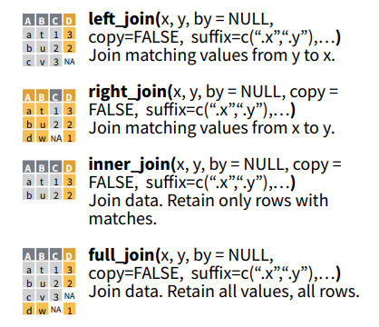
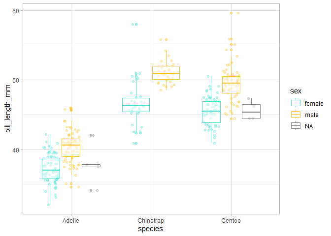
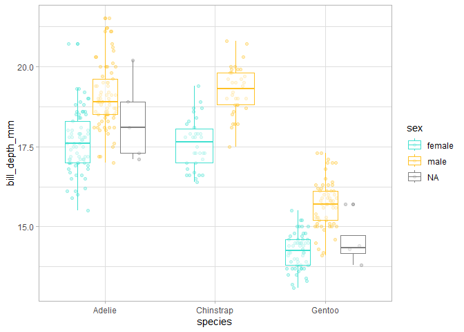
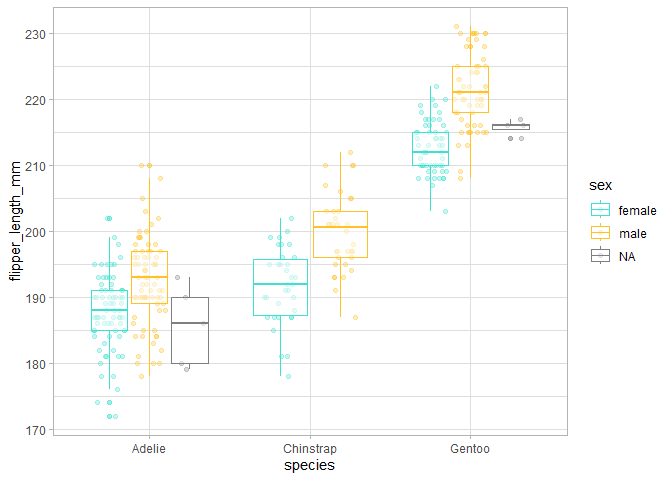
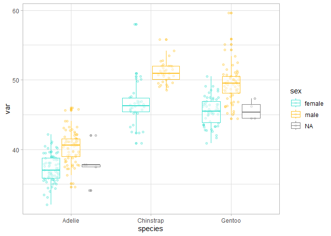
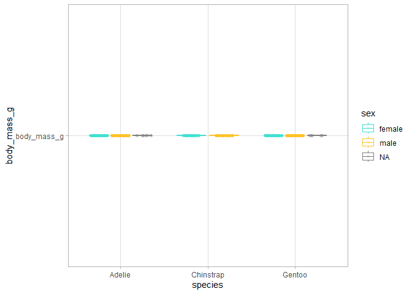
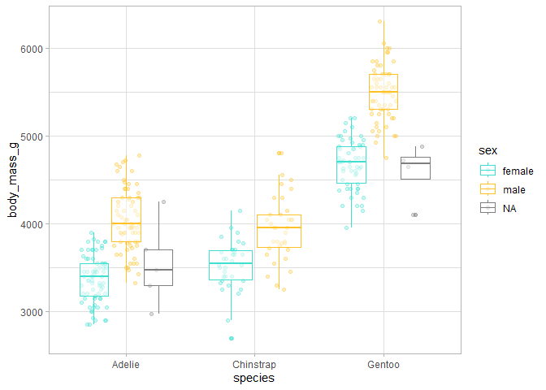
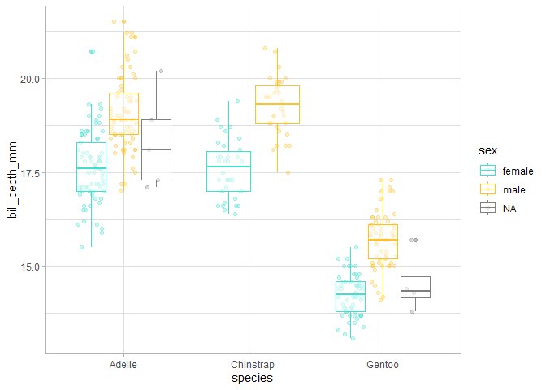
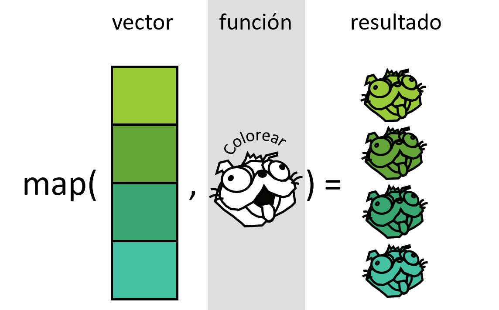
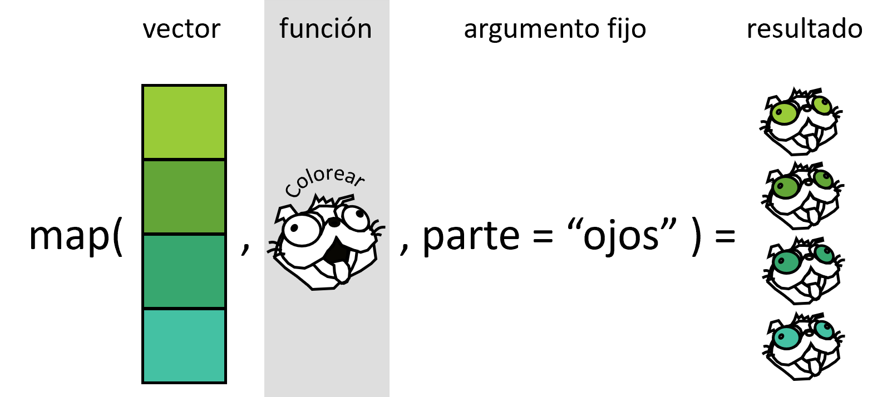

# Organización de datos y bases de programación funcional

Verónica Cruz-Alonso, Julen Astigarraga
03/12/2024

- [<span class="toc-section-number">1</span> Objetivos del día
  2](#objetivos-del-día-2)
- [<span class="toc-section-number">2</span> Introducción a
  tidyverse](#introducción-a-tidyverse)
- [<span class="toc-section-number">3</span> Importar datos y renombrar
  variables](#importar-datos-y-renombrar-variables)
  - [<span class="toc-section-number">3.1</span> Read_delim: leer datos
    desde fuera de R](#read_delim-leer-datos-desde-fuera-de-r)
  - [<span class="toc-section-number">3.2</span> Rename: cambiar nombres
    de variables
    (columnas)](#rename-cambiar-nombres-de-variables-columnas)
- [<span class="toc-section-number">4</span> Funciones básicas de
  filtrado y selección](#funciones-básicas-de-filtrado-y-selección)
  - [<span class="toc-section-number">4.1</span> Slice: filtrar filas
    según el índice
    numérico](#slice-filtrar-filas-según-el-índice-numérico)
  - [<span class="toc-section-number">4.2</span> Arrange: ordenar filas
    por los valores de una o más variables
    (columnas)](#arrange-ordenar-filas-por-los-valores-de-una-o-más-variables-columnas)
  - [<span class="toc-section-number">4.3</span> Filter: filtrar filas
    utilizando
    condiciones](#filter-filtrar-filas-utilizando-condiciones)
    - [<span class="toc-section-number">4.3.1</span>
      Ejercicio](#ejercicio)
  - [<span class="toc-section-number">4.4</span> Select: seleccionar
    columnas utilizando
    condiciones](#select-seleccionar-columnas-utilizando-condiciones)
    - [<span class="toc-section-number">4.4.1</span>
      Ejercicio](#ejercicio-1)
- [<span class="toc-section-number">5</span> Transformar los datos y
  calcular nuevas
  variables](#transformar-los-datos-y-calcular-nuevas-variables)
  - [<span class="toc-section-number">5.1</span> Mutate: crear,
    modificar o eliminar
    columnas](#mutate-crear-modificar-o-eliminar-columnas)
    - [<span class="toc-section-number">5.1.1</span>
      Ejercicio](#ejercicio-2)
  - [<span class="toc-section-number">5.2</span> Summarise y group by:
    generar un nuevo `data.frame` resumiendo cada grupo a una
    fila](#summarise-y-group-by-generar-un-nuevo-dataframe-resumiendo-cada-grupo-a-una-fila)
    - [<span class="toc-section-number">5.2.1</span>
      Ejercicio](#ejercicio-3)
  - [<span class="toc-section-number">5.3</span> Pivot: transformar
    datos a formato ancho a largo y
    viceversa](#pivot-transformar-datos-a-formato-ancho-a-largo-y-viceversa)
- [<span class="toc-section-number">6</span> Joins: unir
  data.frames](#joins-unir-dataframes)
- [<span class="toc-section-number">7</span> Write_delim: guardar
  datos](#write_delim-guardar-datos)
- [<span class="toc-section-number">8</span> Enlaces de interés sobre
  manipulación de
  datos](#enlaces-de-interés-sobre-manipulación-de-datos)
- [<span class="toc-section-number">9</span> Introducción a la
  programación funcional](#introducción-a-la-programación-funcional)
  - [<span class="toc-section-number">9.1</span> ¿Cuándo hay que usar
    una función?](#cuándo-hay-que-usar-una-función)
- [<span class="toc-section-number">10</span> Teoría sobre funciones en
  R](#teoría-sobre-funciones-en-r)
- [<span class="toc-section-number">11</span> Cómo escribir
  funciones](#sec-writefun)
  - [<span class="toc-section-number">11.0.1</span>
    Ejercicio](#ejercicio-4)
  - [<span class="toc-section-number">11.0.2</span>
    Ejercicio](#ejercicio-5)
  - [<span class="toc-section-number">11.1</span>
    Argumentos](#argumentos)
- [<span class="toc-section-number">12</span> Iteraciones con bucles
  *for*](#iteraciones-con-bucles-for)
- [<span class="toc-section-number">13</span> Iteraciones con
  funcionales](#iteraciones-con-funcionales)
  - [<span class="toc-section-number">13.1</span> Nuestro primer
    funcional: generando listas,
    `map()`](#nuestro-primer-funcional-generando-listas-map)
    - [<span class="toc-section-number">13.1.1</span>
      Ejercicio](#ejercicio-6)
  - [<span class="toc-section-number">13.2</span> Nuestro segundo
    funcional: generando vectores y data.frames,
    `map_*()`](#nuestro-segundo-funcional-generando-vectores-y-dataframes-map_)
    - [<span class="toc-section-number">13.2.1</span>
      Ejercicio](#ejercicio-7)
  - [<span class="toc-section-number">13.3</span> Enlaces de interés
    sobre programación
    funcional](#enlaces-de-interés-sobre-programación-funcional)

## Objetivos del día 2

- Entender la filosofía de {tidyverse}.

- Aprender funciones básicas que nos permitan importar, explorar,
  limpiar, transformar y manejar datos.

- Aprender a escribir funciones.

- Entender la programación iterativa mediante el paquete {purrr} de
  {tidyverse}.

## Introducción a tidyverse

[*Tidyverse*](https://www.tidyverse.org/) es una colección de paquetes
(meta-paquete) de R. El núcleo contiene ocho paquetes principales
(`readr`, `tibble`, `dplyr`, `tidyr`, `stringr`, `forcats`, `ggplot2` y
`purrr`), que comparten el diseño, la gramática y la estructura de los
datos que necesitan. En el centro de la filosofía de tidyverse se
encuentra la noción de “datos ordenados” (*tidy data*). Hadley Wickham
(principal desarrollador de *tidyverse*) los define como “fáciles de
manipular, modelar y visualizar, y que tienen una estructura específica:
cada variable es una columna, cada observación es una fila y cada valor
es una celda”. *Tidyverse* puede considerarse un dialecto del lenguaje
de programación R que discretiza funciones amplias de R base (p. ej.
`merge`) en diversas funciones específicas (p. ej. `left_join`,
`right_join`).

Los [tres principios
básicos](https://design.tidyverse.org/unifying.html) de este
meta-paquete son:

- **Centrado en humanos**: tiene un diseño intuitivo que facilita su uso
  y accesibilidad para el usuario, ya que está diseñado específicamente
  para respaldar las actividades de un analista de datos humano.

- **Consistencia**: todos los paquetes están diseñados para trabajar con
  datos ordenados (*tidy data*), y las funciones de los paquetes tienen
  una nomenclatura común y congruente. Esto permite que un usuario que
  aprende sobre una función o paquete pueda aplicar ese conocimiento a
  otros, facilitando así la tarea de recordar y deducir código.

- **Componiblidad**: permite al usuario resolver problemas complejos
  dividiéndolos en pequeñas partes, que pueden combinarse utilizando el
  operador *pipe*, ya sea el del paquete `magrittr` (`%>%`) o el creado
  recientemente en R base (`|>`).

💡Los dos operador *pipe* tienen pequeñas
[diferencias](https://www.tidyverse.org/blog/2023/04/base-vs-magrittr-pipe/)
pero en general el comportamiento es el mismo.

💡Para más información sobre *tidyverse* y las diferencias con R base te
recomendamos leer [*Tidyverse: colección de paquetes de R para la
ciencia de
datos*](https://revistaecosistemas.net/index.php/ecosistemas/article/view/2745).

``` r
library(tidyverse)

d <- c("hi", "hola", "hola", "hi")

length(unique(d))  
```

    [1] 2

``` r
d |> unique() |> length() # Ctrl + Shift + M para poner un pipe
```

    [1] 2

En este curso realizaremos las distintas tareas que forman parte de la
ciencia de datos utilizando *tidyverse*, aunque también se podrían
llevar a cabo con R base.

## Importar datos y renombrar variables

### [Read_delim](https://readr.tidyverse.org/reference/read_delim.html): leer datos desde fuera de R

``` r
taludes <- read_delim(file = "taludes.csv", delim = ",")

taludes
```

    # A tibble: 91 × 3
       Biomasa Luz     Agua          
         <dbl> <chr>   <chr>         
     1    3.04 Nivel 1 Sequia estival
     2    3.57 Nivel 1 Sequia estival
     3    3.67 Nivel 1 Sequia estival
     4    4.59 Nivel 1 Sequia estival
     5    4.34 Nivel 1 Sequia estival
     6    2.25 Nivel 1 Sequia estival
     7    4.12 Nivel 1 Sequia estival
     8    2.45 Nivel 1 Sequia estival
     9    4.46 Nivel 1 Sequia estival
    10    3.51 Nivel 1 Sequia estival
    # ℹ 81 more rows

``` r
taludes_bien <- read_delim(file = "taludes.csv", 
  delim = ",", col_types = list(Luz = "f", Agua = "f"))

taludes_bien
```

    # A tibble: 91 × 3
       Biomasa Luz     Agua          
         <dbl> <fct>   <fct>         
     1    3.04 Nivel 1 Sequia estival
     2    3.57 Nivel 1 Sequia estival
     3    3.67 Nivel 1 Sequia estival
     4    4.59 Nivel 1 Sequia estival
     5    4.34 Nivel 1 Sequia estival
     6    2.25 Nivel 1 Sequia estival
     7    4.12 Nivel 1 Sequia estival
     8    2.45 Nivel 1 Sequia estival
     9    4.46 Nivel 1 Sequia estival
    10    3.51 Nivel 1 Sequia estival
    # ℹ 81 more rows

``` r
View(taludes_bien)
summary(taludes_bien)
```

        Biomasa           Luz                 Agua   
     Min.   :2.120   Nivel 1:30   Sequia estival:46  
     1st Qu.:3.531   Nivel 2:31   Lluvia estival:45  
     Median :4.053   Nivel 3:30                      
     Mean   :3.993                                   
     3rd Qu.:4.609                                   
     Max.   :5.347                                   

``` r
glimpse(taludes_bien)
```

    Rows: 91
    Columns: 3
    $ Biomasa <dbl> 3.039767, 3.573515, 3.669172, 4.592334, 4.337278, 2.254230, 4.…
    $ Luz     <fct> Nivel 1, Nivel 1, Nivel 1, Nivel 1, Nivel 1, Nivel 1, Nivel 1,…
    $ Agua    <fct> Sequia estival, Sequia estival, Sequia estival, Sequia estival…

### [Rename](https://dplyr.tidyverse.org/reference/rename.html): cambiar nombres de variables (columnas)

``` r
names(taludes_bien)
```

    [1] "Biomasa" "Luz"     "Agua"   

``` r
taludes_bien <- taludes_bien |>    
  rename(biomasa = Biomasa, # nombre nuevo = nombre viejo          
         nivel_luz = Luz, 
         agua_estival = Agua)
```

📝 Ajustar sangría de código: Ctrl + i; Reformatear código: Ctrl +
Shift + a

📝 Usar espacios antes y después de `=` y después de `,` hace mucho más
fácil identificar los argumentos de la función y, en general, todos los
componentes.

``` r
set.seed(123) 
mean(rnorm(10, mean = 50, sd = 25) / 12, trim = 0.2)  
```

    [1] 3.966805

``` r
set.seed(123) 
mean(rnorm(10,mean=50,sd=25)/12,trim=0.2)
```

    [1] 3.966805

## Funciones básicas de filtrado y selección

### [Slice](https://dplyr.tidyverse.org/reference/slice.html): filtrar filas según el índice numérico

``` r
taludes_bien |> 
  slice(1) # shortcut para el pipe: CTRL + SHIFT + M 
```

    # A tibble: 1 × 3
      biomasa nivel_luz agua_estival  
        <dbl> <fct>     <fct>         
    1    3.04 Nivel 1   Sequia estival

``` r
taludes_bien |>
  slice(1, 5)
```

    # A tibble: 2 × 3
      biomasa nivel_luz agua_estival  
        <dbl> <fct>     <fct>         
    1    3.04 Nivel 1   Sequia estival
    2    4.34 Nivel 1   Sequia estival

``` r
taludes_bien |> 
  slice(1:6)
```

    # A tibble: 6 × 3
      biomasa nivel_luz agua_estival  
        <dbl> <fct>     <fct>         
    1    3.04 Nivel 1   Sequia estival
    2    3.57 Nivel 1   Sequia estival
    3    3.67 Nivel 1   Sequia estival
    4    4.59 Nivel 1   Sequia estival
    5    4.34 Nivel 1   Sequia estival
    6    2.25 Nivel 1   Sequia estival

``` r
taludes_bien |>
  slice(-c(1:5))
```

    # A tibble: 86 × 3
       biomasa nivel_luz agua_estival  
         <dbl> <fct>     <fct>         
     1    2.25 Nivel 1   Sequia estival
     2    4.12 Nivel 1   Sequia estival
     3    2.45 Nivel 1   Sequia estival
     4    4.46 Nivel 1   Sequia estival
     5    3.51 Nivel 1   Sequia estival
     6    3.49 Nivel 1   Sequia estival
     7    2.80 Nivel 1   Sequia estival
     8    3.91 Nivel 1   Sequia estival
     9    3.16 Nivel 1   Sequia estival
    10    3.81 Nivel 1   Sequia estival
    # ℹ 76 more rows

### [Arrange](https://dplyr.tidyverse.org/reference/arrange.html): ordenar filas por los valores de una o más variables (columnas)

``` r
taludes_bien |>
  arrange(biomasa)
```

    # A tibble: 91 × 3
       biomasa nivel_luz agua_estival  
         <dbl> <fct>     <fct>         
     1    2.12 Nivel 2   Lluvia estival
     2    2.25 Nivel 1   Sequia estival
     3    2.35 Nivel 3   Lluvia estival
     4    2.45 Nivel 1   Sequia estival
     5    2.49 Nivel 3   Lluvia estival
     6    2.54 Nivel 3   Lluvia estival
     7    2.70 Nivel 3   Lluvia estival
     8    2.73 Nivel 3   Lluvia estival
     9    2.80 Nivel 1   Sequia estival
    10    2.86 Nivel 3   Lluvia estival
    # ℹ 81 more rows

``` r
taludes_bien |> 
  arrange(desc(biomasa))
```

    # A tibble: 91 × 3
       biomasa nivel_luz agua_estival  
         <dbl> <fct>     <fct>         
     1    5.35 Nivel 3   Sequia estival
     2    5.30 Nivel 3   Sequia estival
     3    5.21 Nivel 1   Lluvia estival
     4    5.17 Nivel 2   Lluvia estival
     5    5.16 Nivel 1   Lluvia estival
     6    5.13 Nivel 2   Sequia estival
     7    5.10 Nivel 2   Lluvia estival
     8    5.06 Nivel 3   Sequia estival
     9    4.98 Nivel 2   Lluvia estival
    10    4.94 Nivel 1   Lluvia estival
    # ℹ 81 more rows

### [Filter](https://dplyr.tidyverse.org/reference/filter.html): filtrar filas utilizando condiciones

Se necesita un vector de filtrado que contenga valores lógicos
(TRUE/FALSE).

``` r
taludes_bien |>
  filter(nivel_luz == "Nivel 1") # filtrar por filas que cumplen un patrón 
```

    # A tibble: 30 × 3
       biomasa nivel_luz agua_estival  
         <dbl> <fct>     <fct>         
     1    3.04 Nivel 1   Sequia estival
     2    3.57 Nivel 1   Sequia estival
     3    3.67 Nivel 1   Sequia estival
     4    4.59 Nivel 1   Sequia estival
     5    4.34 Nivel 1   Sequia estival
     6    2.25 Nivel 1   Sequia estival
     7    4.12 Nivel 1   Sequia estival
     8    2.45 Nivel 1   Sequia estival
     9    4.46 Nivel 1   Sequia estival
    10    3.51 Nivel 1   Sequia estival
    # ℹ 20 more rows

``` r
taludes_bien |>
  filter(nivel_luz == "Nivel 1" & biomasa > 4) # combinar criterios: AND
```

    # A tibble: 16 × 3
       biomasa nivel_luz agua_estival  
         <dbl> <fct>     <fct>         
     1    4.59 Nivel 1   Sequia estival
     2    4.34 Nivel 1   Sequia estival
     3    4.12 Nivel 1   Sequia estival
     4    4.46 Nivel 1   Sequia estival
     5    4.73 Nivel 1   Lluvia estival
     6    4.94 Nivel 1   Lluvia estival
     7    4.37 Nivel 1   Lluvia estival
     8    4.79 Nivel 1   Lluvia estival
     9    5.16 Nivel 1   Lluvia estival
    10    4.55 Nivel 1   Lluvia estival
    11    4.72 Nivel 1   Lluvia estival
    12    4.23 Nivel 1   Lluvia estival
    13    4.83 Nivel 1   Lluvia estival
    14    4.48 Nivel 1   Lluvia estival
    15    4.58 Nivel 1   Lluvia estival
    16    5.21 Nivel 1   Lluvia estival

``` r
taludes_bien |>
  filter(nivel_luz == "Nivel 1" | biomasa > 5) # combinar criterios: OR
```

    # A tibble: 36 × 3
       biomasa nivel_luz agua_estival  
         <dbl> <fct>     <fct>         
     1    3.04 Nivel 1   Sequia estival
     2    3.57 Nivel 1   Sequia estival
     3    3.67 Nivel 1   Sequia estival
     4    4.59 Nivel 1   Sequia estival
     5    4.34 Nivel 1   Sequia estival
     6    2.25 Nivel 1   Sequia estival
     7    4.12 Nivel 1   Sequia estival
     8    2.45 Nivel 1   Sequia estival
     9    4.46 Nivel 1   Sequia estival
    10    3.51 Nivel 1   Sequia estival
    # ℹ 26 more rows

``` r
taludes_bien |>
  filter(nivel_luz %in% c("Nivel 1", "Nivel 3")) # combinar criterios: %in% 
```

    # A tibble: 60 × 3
       biomasa nivel_luz agua_estival  
         <dbl> <fct>     <fct>         
     1    3.04 Nivel 1   Sequia estival
     2    3.57 Nivel 1   Sequia estival
     3    3.67 Nivel 1   Sequia estival
     4    4.59 Nivel 1   Sequia estival
     5    4.34 Nivel 1   Sequia estival
     6    2.25 Nivel 1   Sequia estival
     7    4.12 Nivel 1   Sequia estival
     8    2.45 Nivel 1   Sequia estival
     9    4.46 Nivel 1   Sequia estival
    10    3.51 Nivel 1   Sequia estival
    # ℹ 50 more rows

#### Ejercicio

- Lee el data.frame “Macrobenthos.txt”. Pista: el delimitador entre
  datos es el tabulador (“\t”). <!--# No sale bien el simbolo -->

💡“Macrobenthos.txt” es una base de datos sobre la abundancia de
distintos grupos taxonómicos de macroinvertebrados marinos ([Zuur et
al. 2009](https://link.springer.com/book/10.1007/978-0-387-93837-0)).

- Crea un subset de datos que contenga las filas de la 1 a la 10 y de la
  390 a la 400.

- De la tabla original, crea un subset que NO contenga el Taxon
  número 1. Pista: revisa los [operadores de
  R](https://bookdown.org/jboscomendoza/r-principiantes4/operadores-relacionales.html).

- Crea un subset con las observaciones del Taxon 2 donde se haya
  registrado una abundancia mayor de 50 o menor o igual a 5. Pista:
  necesitarás paréntesis para filtrar. ¿Cuántas filas han quedado?

### [Select](https://dplyr.tidyverse.org/reference/select.html): seleccionar columnas utilizando condiciones

Se necesita un vector de selección que contenga valores lógicos
(TRUE/FALSE).

``` r
taludes_bien |>
  select(biomasa, agua_estival)
```

    # A tibble: 91 × 2
       biomasa agua_estival  
         <dbl> <fct>         
     1    3.04 Sequia estival
     2    3.57 Sequia estival
     3    3.67 Sequia estival
     4    4.59 Sequia estival
     5    4.34 Sequia estival
     6    2.25 Sequia estival
     7    4.12 Sequia estival
     8    2.45 Sequia estival
     9    4.46 Sequia estival
    10    3.51 Sequia estival
    # ℹ 81 more rows

``` r
?select # operators y selection helpers

taludes_bien |>
  select(contains("a"))
```

    # A tibble: 91 × 2
       biomasa agua_estival  
         <dbl> <fct>         
     1    3.04 Sequia estival
     2    3.57 Sequia estival
     3    3.67 Sequia estival
     4    4.59 Sequia estival
     5    4.34 Sequia estival
     6    2.25 Sequia estival
     7    4.12 Sequia estival
     8    2.45 Sequia estival
     9    4.46 Sequia estival
    10    3.51 Sequia estival
    # ℹ 81 more rows

``` r
# se pueden utilizar todo tipo de patrones de texto: https://rstudio.github.io/cheatsheets/strings.pdf

taludes_bien |>
  select(nivel_luz, everything()) # se puede usar para reordenar variables
```

    # A tibble: 91 × 3
       nivel_luz biomasa agua_estival  
       <fct>       <dbl> <fct>         
     1 Nivel 1      3.04 Sequia estival
     2 Nivel 1      3.57 Sequia estival
     3 Nivel 1      3.67 Sequia estival
     4 Nivel 1      4.59 Sequia estival
     5 Nivel 1      4.34 Sequia estival
     6 Nivel 1      2.25 Sequia estival
     7 Nivel 1      4.12 Sequia estival
     8 Nivel 1      2.45 Sequia estival
     9 Nivel 1      4.46 Sequia estival
    10 Nivel 1      3.51 Sequia estival
    # ℹ 81 more rows

#### Ejercicio

- Con el data.frame “Macrobenthos.txt”, crea un nuevo data.frame que
  contenga las variables relacionadas con el medio (de *organic matter*
  a *temperature*). Pista: mira la ayuda de select para ahorrar
  caracteres.

- Crea un nuevo objeto con el taxon al principio y que incluya las demás
  columnas excepto el esfuerzo de muestreo (*effort*).

## Transformar los datos y calcular nuevas variables

### [Mutate](https://dplyr.tidyverse.org/reference/mutate.html): crear, modificar o eliminar columnas

``` r
taludes_bien |>
  mutate(
    # definir una variable desde cero
    ID = 1:nrow(taludes_bien), 
    supervivencia = as.factor(sample(
      c(0, 1),
      size = nrow(taludes_bien),
      replace = TRUE
    )),
    # utilizar una variable para calcular otra
    carbono = biomasa * rnorm(
      n = nrow(taludes_bien),
      mean = 0.4,
      sd = 0.2
    )
  ) |> 
  select(ID, everything())
```

    # A tibble: 91 × 6
          ID biomasa nivel_luz agua_estival   supervivencia carbono
       <int>   <dbl> <fct>     <fct>          <fct>           <dbl>
     1     1    3.04 Nivel 1   Sequia estival 0               0.931
     2     2    3.57 Nivel 1   Sequia estival 1               0.877
     3     3    3.67 Nivel 1   Sequia estival 0               3.05 
     4     4    4.59 Nivel 1   Sequia estival 1               0.611
     5     5    4.34 Nivel 1   Sequia estival 1               2.17 
     6     6    2.25 Nivel 1   Sequia estival 0               1.46 
     7     7    4.12 Nivel 1   Sequia estival 0               2.17 
     8     8    2.45 Nivel 1   Sequia estival 0               1.18 
     9     9    4.46 Nivel 1   Sequia estival 0               2.49 
    10    10    3.51 Nivel 1   Sequia estival 1               1.30 
    # ℹ 81 more rows

``` r
taludes_bien |> 
  mutate(
    # sobreescribir una variable. En concreto fct_recode 
    # sirve para redefinir los niveles de un factor
    agua_estival = fct_recode(
      agua_estival, sequia = "Sequia estival", lluvia = "Lluvia estival"),
    nivel_luz = fct_recode(
      nivel_luz,
      `1` = "Nivel 1",
      `2` = "Nivel 2",
      `3` = "Nivel 3"
    )
  )
```

    # A tibble: 91 × 3
       biomasa nivel_luz agua_estival
         <dbl> <fct>     <fct>       
     1    3.04 1         sequia      
     2    3.57 1         sequia      
     3    3.67 1         sequia      
     4    4.59 1         sequia      
     5    4.34 1         sequia      
     6    2.25 1         sequia      
     7    4.12 1         sequia      
     8    2.45 1         sequia      
     9    4.46 1         sequia      
    10    3.51 1         sequia      
    # ℹ 81 more rows

``` r
taludes_bien |>
  mutate(
    # utilizar varias variables para calcular otra nueva
    estres = case_when(
      # "Si el nivel de luz es 1 y hay sequia, el estrés será alto"
      nivel_luz == "Nivel 1" & agua_estival == "Sequia estival" ~ "alto",
      nivel_luz == "Nivel 3" & agua_estival == "Lluvia estival" ~ "bajo",
      TRUE ~ "intermedio"
    )
  )
```

    # A tibble: 91 × 4
       biomasa nivel_luz agua_estival   estres
         <dbl> <fct>     <fct>          <chr> 
     1    3.04 Nivel 1   Sequia estival alto  
     2    3.57 Nivel 1   Sequia estival alto  
     3    3.67 Nivel 1   Sequia estival alto  
     4    4.59 Nivel 1   Sequia estival alto  
     5    4.34 Nivel 1   Sequia estival alto  
     6    2.25 Nivel 1   Sequia estival alto  
     7    4.12 Nivel 1   Sequia estival alto  
     8    2.45 Nivel 1   Sequia estival alto  
     9    4.46 Nivel 1   Sequia estival alto  
    10    3.51 Nivel 1   Sequia estival alto  
    # ℹ 81 more rows

``` r
# repetimos todo lo anterior concatenando todo el proceso:

taludes_trans <- taludes_bien |> 
  mutate(
  ID = 1:nrow(taludes_bien),
  supervivencia = as.factor(sample(
    c(0, 1),
    size = nrow(taludes_bien),
    prob = c(0.4, 0.6),
    replace = TRUE
  )),
  carbono = biomasa * rnorm(
    n = nrow(taludes_bien),
    mean = 0.4,
    sd = 0.2
  )
) |>
  mutate(
    agua_estival = fct_recode(agua_estival, sequia = "Sequia estival", lluvia = "Lluvia estival"),
    nivel_luz = fct_recode(
      nivel_luz,
      `1` = "Nivel 1",
      `2` = "Nivel 2",
      `3` = "Nivel 3"
    )
  ) |>
  mutate(
    estres = case_when(
      nivel_luz == 1 &
        agua_estival == "sequia" ~ "alto",
      nivel_luz == 3 &
        agua_estival == "lluvia" ~ "bajo",
      TRUE ~ "intermedio"
    )
  )
```

#### Ejercicio

- Con el data.frame macrobenthos genera una nueva columna con la
  relación (división) entre la turbidez del agua y la materia orgánica.

### [Summarise](https://dplyr.tidyverse.org/reference/summarise.html) y [group by](https://dplyr.tidyverse.org/reference/group_by.html): generar un nuevo `data.frame` resumiendo cada grupo a una fila

``` r
taludes_trans |> 
  summarise(c_min = min(carbono),
            c_max = max(carbono))
```

    # A tibble: 1 × 2
      c_min c_max
      <dbl> <dbl>
    1 0.165  3.86

``` r
taludes_trans |>
  group_by(estres) |>  
  summarise(biomasa_min = min(biomasa),
            biomasa_mean = mean(biomasa),
            biomasa_max = max(biomasa))
```

    # A tibble: 3 × 4
      estres     biomasa_min biomasa_mean biomasa_max
      <chr>            <dbl>        <dbl>       <dbl>
    1 alto              2.25         3.51        4.59
    2 bajo              2.35         3.30        4.58
    3 intermedio        2.12         4.32        5.35

#### Ejercicio

- Con el data.frame macrobenthos, cuenta el número de casos que hay en
  cada periodo de muestreo.

- Cuenta el número de casos distintos que hay de esfuerzo de muestreo.

- Calcula la media de la turbidez para cada taxón.

### [Pivot](https://tidyr.tidyverse.org/reference/pivot_longer.html): transformar datos a formato ancho a largo y viceversa

.](images/tidy_pivot_longer.png)

``` r
stocks <- tibble(
  year   = c(2015, 2015, 2016, 2016),
  half  = c(   1,    2,     1,    2),
  return = c(1.88, 0.59, 0.92, 0.17)
)

stocks |> 
  pivot_wider(names_from = year, values_from = return) 
```

    # A tibble: 2 × 3
       half `2015` `2016`
      <dbl>  <dbl>  <dbl>
    1     1   1.88   0.92
    2     2   0.59   0.17

``` r
stocks |> 
  pivot_wider(names_from = year, values_from = return) |> 
  pivot_longer(cols = `2015`:`2016`, names_to = "year", values_to = "return")
```

    # A tibble: 4 × 3
       half year  return
      <dbl> <chr>  <dbl>
    1     1 2015    1.88
    2     1 2016    0.92
    3     2 2015    0.59
    4     2 2016    0.17

## [Joins](https://dplyr.tidyverse.org/reference/mutate-joins.html): unir data.frames

`*_join()` añade columnas de `y` (segundo data.frame) a `x` (primer
data.frame), haciendo coincidir las observaciones en función de la
variable común.



``` r
# join: left, right, full, inner

set.seed(123)

bloques <- tibble(ID = 1:nrow(taludes_trans), 
  bloque = sample(x = 1:2, size = nrow(taludes_trans), replace = TRUE))

taludes_trans <- taludes_trans |> 
  left_join(bloques) |> 
  select(ID, bloque, everything())
```

## [Write_delim](https://readr.tidyverse.org/reference/write_delim.html): guardar datos

``` r
write_delim(taludes_trans, file = "taludes_trans.csv", delim = ";")

# en file hay que especificar el directorio donde queremos que se guarde. Si no, se guardará en el directorio de trabajo (getwd())
```

## Enlaces de interés sobre manipulación de datos

- [Cheat sheet de
  dplyr](https://nyu-cdsc.github.io/learningr/assets/data-transformation.pdf)

- [R for data Science (Data
  transformation)](https://r4ds.had.co.nz/transform.html)

- [Página web de *tidyverse*](https://www.tidyverse.org)

- [Style guide](http://adv-r.had.co.nz/Style.html)

## Introducción a la programación funcional

La creciente disponibilidad de datos y de versatilidad de los programas
de análisis han provocado el incremento en la cantidad y complejidad de
los análisis que realizamos. Esto hace cada vez más necesaria la
eficiencia en el proceso de gestión y análisis de datos. Una de las
posibles formas para optimizar estos procesos y acortar los tiempos de
trabajo para los usuarios de R es la programación basada en funciones.
Las funciones permiten automatizar tareas comunes (por ejemplo, leer
diferentes bases de datos) simplificando el código.

Como las funciones en R son objetos, es posible llamarlas a través de
otras funciones e iterar este proceso, lo que constituye la base de la
programación funcional y convierte a R en una herramienta muy poderosa.
Las iteraciones sirven para realizar la misma acción a múltiples
entradas.

``` r
# install.packages("palmerpenguins")
library(palmerpenguins)

df <- penguins |>
  select(bill_length_mm, bill_depth_mm, flipper_length_mm, body_mass_g)

df_rescaled1 <- df |>
  mutate(
    bill_length_mm = (bill_length_mm - min(bill_length_mm, na.rm = TRUE)) / (
      max(bill_length_mm, na.rm = TRUE) - min(bill_length_mm, na.rm = TRUE)
    ),
    bill_depth_mm = (bill_depth_mm - min(bill_depth_mm, na.rm = TRUE)) / (
      max(bill_depth_mm, na.rm = TRUE) - min(bill_length_mm, na.rm = TRUE)
    ),
    flipper_length_mm = (flipper_length_mm - min(flipper_length_mm, na.rm = TRUE)) / (
      max(flipper_length_mm, na.rm = TRUE) - min(flipper_length_mm, na.rm = TRUE)
    ),
    body_mass_g = (body_mass_g - min(body_mass_g, na.rm = TRUE)) / (max(body_mass_g, na.rm = TRUE) - min(body_mass_g, na.rm = TRUE))
  )

View(df_rescaled1)

rescale01 <- function(x) { 
  rng <- range(x, na.rm = TRUE)      
  (x - rng[1]) / (rng[2] - rng[1])
}

df_rescaled2 <- df |>
  mutate(
    bill_length_mm = rescale01(x = bill_length_mm),
    bill_depth_mm = rescale01(x = bill_depth_mm),
    flipper_length_mm = rescale01(x = flipper_length_mm),
    body_mass_g = rescale01(x = body_mass_g)
  )

View(df_rescaled2)

df_rescaled3 <- lapply(df, rescale01)

View(df_rescaled3)
```

Las principales **ventajas de la programación funcional** (uso de
funciones e iteraciones) son:

- Facilidad para ver la intención del código y, por tanto, mejorar la
  **comprensión** para uno mismo, colaboradores y revisores:
  - Las funciones tienen un nombre evocativo.
  - El código queda más ordenado.
- **Rapidez** si se necesitan hacer cambios ya que las funciones son
  piezas independientes que resuelven un problema concreto.
- **Disminuye la probabilidad de error**.

### ¿Cuándo hay que usar una función?

Se recomienda seguir el principio “do not repeat yourself” ([DRY
principle](https://en.wikipedia.org/wiki/Don%27t_repeat_yourself#:~:text=%22Don't%20repeat%20yourself%22,redundancy%20in%20the%20first%20place.)):
cada unidad de conocimiento o información debe tener una representación
única, inequívoca y autoritativa en un sistema.

Escribir una función ya merece la pena cuando has copiado y pegado más
de dos veces lo mismo (don’t be WET! - Write Everything Twice). Cuantas
más veces esté repetido un código, en más sitios necesitarás
actualizarlo si hay algun cambio y más aumenta la probabilidad de error.

## Teoría sobre funciones en R

Según el tipo de output generado (última expresión ejecutada dentro de
la función) hay dos tipos de funciones:

- Las **funciones de transformación** transforman el objeto que entra en
  la función (primer argumento) y devuelven otro objeto o el anterior
  modificado. Los funcionales son tipos especiales de funciones de
  transformación.

  

- Las **funciones secundarias** (*side-effect functions*) tienen efectos
  colaterales y ejecutan una acción, como guardar un archivo o dibujar
  un plot. Algunos ejemplos de funciones secundarias que se usan
  comunmente son: `library()`, `setwd()`, `plot()`, `write_delim()`…
  Estas funciones retornan *de forma invisible* el primer argumento, que
  no se guarda, pero puede ser usado en un *pipeline*.

En general, sintácticamente, las funciones tienen tres componentes:

- Función `function()`
- Argumentos: lista de entradas.
- Cuerpo: trozo de código que sigue a `function()`, tradicionalmente
  entre llaves.

``` r
nombre1_v1 <- function(x, y) {
  paste(x, y, sep = "_")
}

nombre1_v2 <- function(x, y) paste(x, y, sep = "_")

nombre1_v3 <- \(x, y) paste(x, y, sep = "_")

nombre1_v1("Vero", "Cruz")
```

    [1] "Vero_Cruz"

``` r
nombre1_v2("Vero", "Cruz")
```

    [1] "Vero_Cruz"

``` r
nombre1_v3("Vero", "Cruz")
```

    [1] "Vero_Cruz"

📝 Si la función tiene más de dos lineas es mejor usar llaves siempre
para que quede bien delimitada. La llave de apertura nunca debe ir sola
pero sí la de cierre (excepto con *else*). Las sangrías también ayudan
mucho a entender la jerarquía del código dentro de las funciones.

En general las funciones tienen un nombre que se ejecuta cuando se
necesita como hemos visto hasta ahora, pero esto no es obligatorio.
Algunos paquetes como {purrr} o las funciones de la familia `apply`
permiten el uso de **funciones anónimas** para iterar.

``` r
map(penguins, function(x) length(unique(x)))  
```

    $species
    [1] 3

    $island
    [1] 3

    $bill_length_mm
    [1] 165

    $bill_depth_mm
    [1] 81

    $flipper_length_mm
    [1] 56

    $body_mass_g
    [1] 95

    $sex
    [1] 3

    $year
    [1] 3

``` r
penguins |>    
  map(function(x) length(unique(x)))
```

    $species
    [1] 3

    $island
    [1] 3

    $bill_length_mm
    [1] 165

    $bill_depth_mm
    [1] 81

    $flipper_length_mm
    [1] 56

    $body_mass_g
    [1] 95

    $sex
    [1] 3

    $year
    [1] 3

📝 Mejor reservar el uso de funciones anónimas para funciones cortas y
simples. Si la función es larga, ocupa varias líneas o tenemos que
usarla con frecuencia mejor darle un nombre.

## Cómo escribir funciones

#### Ejercicio

Genera tu primera función que divida un valor siempre entre 100.

💡Atajo para escribir funciones: escribir la palabra fun + tabulador

Imaginad que para un set de datos quisieramos hacer un gráfico de
distribución de cada variable numérica, en función de otra variable
categórica que nos interese especialmente, para ver cómo se distribuye.

``` r
penguins_num <- penguins |>
  select(species, sex, where(is.numeric))  # nos interesan las diferencias entre especie y sexo

ggplot(penguins_num, aes(x = species, y = bill_length_mm, color = sex)) +     geom_point(position = position_jitterdodge(), alpha = 0.3) +
  geom_boxplot(alpha = 0.5) +
  scale_color_manual(values = c("turquoise", "goldenrod1")) +
  theme_light()
```



``` r
ggplot(penguins_num, aes(x = species, y = bill_depth_mm, color = sex)) +   geom_point(position = position_jitterdodge(), alpha = 0.3) +
  geom_boxplot(alpha = 0.5) +
  scale_color_manual(values = c("turquoise", "goldenrod1")) +
  theme_light()
```



``` r
ggplot(penguins_num, aes(x = species, y = flipper_length_mm, color = sex)) +   geom_point(position = position_jitterdodge(), alpha = 0.3) +
  geom_boxplot(alpha = 0.5) +
  scale_color_manual(values = c("turquoise", "goldenrod1")) +
  theme_light()  # etc
```



Hemos copiado un código más de dos veces para realizar una misma acción
(es decir, un gráfico para ver como se distribuye una variable en
función de otras dos que se mantienen constantes) así que hay que
considerar la posibilidad de que estemos necesitando una función. A
continuación vamos a seguir unos **sencillos pasos para transformar
cualquier código repetido en función**.

1.  Analizar el código: ¿cuáles son las partes replicadas? ¿cuantas
    entradas tenemos? ¿cuáles varían y cuáles no?

2.  Simplificar y reanalizar duplicaciones

``` r
var <- penguins_num$bill_length_mm  

ggplot(penguins_num, aes(x = species, y = var, color = sex)) +   
  geom_point(position = position_jitterdodge(), alpha = 0.3) +   
  geom_boxplot(alpha = 0.5) +   
  scale_color_manual(values = c("turquoise", "goldenrod1")) +   
  theme_light()
```



``` r
var <- body_mass_g 
```

    Error: object 'body_mass_g' not found

``` r
var <- "body_mass_g"  

ggplot(penguins_num, aes(x = species, y = var, color = sex)) +   
  geom_point(position = position_jitterdodge(), alpha = 0.3) +   
  geom_boxplot(alpha = 0.5) +   
  scale_color_manual(values = c("turquoise", "goldenrod1")) +   
  theme_light() +   
  ylab(var) # grafico erroneo  
```



``` r
ggplot(penguins_num, aes(x = species, y = .data[[var]], color = sex)) +   
  geom_point(position = position_jitterdodge(), alpha = 0.3) +   
  geom_boxplot(alpha = 0.5) +   
  scale_color_manual(values = c("turquoise", "goldenrod1")) +   
  theme_light() +   
  ylab(var) # grafico correcto
```



👀 La función `ggplot` necesita argumentos (data-variable) que estén
dentro del `data.frame` que va a representar. Para poder generalizar la
función hemos guardado el nombre de la variable en un objeto (tipo
`character`), pero `ggplot` no acepta `characters`. Por ello necesitamos
utilizar una función intermedia que sí los acepte. Para resolver
problemas comunes de programación funcional derivados de la
*non-standard evaluation* de *tidyverse* [mira este
enlace](https://dplyr.tidyverse.org/articles/programming.html#introduction).

3.  Elegir un nombre para la función (📝). Idealmente tiene que ser
    corto y evocar lo que la función hace. En general, debe ser un verbo
    (p. ej. imputar_valores) mientras que los argumentos son sustantivos
    (p. ej. data, variable, etc.). Usar un sustantivo para una función
    está permitido si la función calcula algo muy conocido (p. ej.
    `mean()`) o si sirve para acceder a partes de un objeto (p. ej.
    `residuals()`). También se recomienda evitar verbos muy genéricos
    (p. ej. calcular) y si el nombre tiene varias palabras separarlas
    con guión bajo o mayúsculas, pero ser consistente. Si programas
    varias funciones que hacen cosas parecidas se recomienda usar el
    mismo prefijo para todas (p. ej. “str\_” en el paquete {stringr}).

4.  Enumerar los argumentos dentro de `function()` y poner el código
    simplificado dentro de las llaves.

``` r
explorar_penguins <- function (var) {
  ggplot(penguins_num, aes(x = species, y = .data[[var]], color = sex)) + 
    geom_point(position = position_jitterdodge(), alpha = 0.3) +     
    geom_boxplot(alpha = 0.5) +     
    scale_color_manual(values = c("turquoise", "goldenrod1")) +     
    theme_light() +     
    ylab(var)
}
```

📝 Utiliza comentarios (#) para explicar el razonamiento detrás de tus
funciones. Se debe evitar explicar qué se está haciendo o cómo, ya que
el propio código ya lo comunica. También se recomienda usar \# para
separar apartados (Cmd/Ctrl + Shift + R).

5.  Probar la función con entradas diferentes

``` r
explorar_penguins(var = "body_mass_g")  
```

    Warning: Removed 2 rows containing non-finite outside the scale range
    (`stat_boxplot()`).

    Warning: Removed 2 rows containing missing values or values outside the scale range
    (`geom_point()`).


``` r
explorar_penguins(var = "flipper_length_mm")  
```

    Warning: Removed 2 rows containing non-finite outside the scale range
    (`stat_boxplot()`).
    Removed 2 rows containing missing values or values outside the scale range
    (`geom_point()`).


``` r
explorar_penguins(var = "bill_depth_mm")
```

    Warning: Removed 2 rows containing non-finite outside the scale range
    (`stat_boxplot()`).
    Removed 2 rows containing missing values or values outside the scale range
    (`geom_point()`).



#### Ejercicio

Genera una función para estandarizar (es decir, restar la media y
dividir por la desviación típica) las variables numéricas de penguins.

### Argumentos

En general hay dos grupos: los que especifican los **datos** y los que
especifican **detalles** de la ejecución de la función. Normalmente los
que especifican datos se colocan primero y los de detalle después. Estos
últimos suelen tener valores por defecto (los más comunes), para cuando
no se especifique nada.

<!--# Ver ayuda de quantile -->

📝 Los nombres de los argumentos deben ser cortos y descriptivos. Hay
algunos comunes pero poco descriptivos que ya son conocidos para la
mayoría de los usuarios y está bien aprovecharlos:

`x, y, z`: vectores

`w`: vector de pesos

`df`: data frame

`i, j`: indices numericos, filas y columnas respectivamente

`n`: longitud o número de filas

`p`: numero de columnas

`na.rm`: valores faltantes

## Iteraciones con bucles *for*

Los bucles son recomendables para adentrarse en el mundo de las
iteraciones porque hacen cada iteración muy explícita para que quede
claro lo que está pasando.


Para programar un bucle es necesario definir tres partes diferentes: la
salida, la secuencia y el cuerpo.

``` r
set.seed(123)  

df_ej <- data.frame(
  a = sample(1:5),
  b = sample(1:5),
  c = sample(1:5) )  

salida <- vector("double", 3)           # 1. salida 

for (i in 1:3) {                        # 2. secuencia   
  salida[[i]] <- first(df_ej[[i]])      # 3. cuerpo 
}  

salida  
```

    [1] 3 3 2

``` r
# podriamos generalizar el for 

salida <- vector("double", ncol(df_ej))   # 1. salida 

for (i in seq_along(df_ej)) {             # 2. secuencia   
  salida[[i]] <- first(df_ej[[i]])        # 3. cuerpo 
}  

salida  
```

    [1] 3 3 2

``` r
# tambien podriamos iterar sobre filas 

salida <- vector("double", nrow(df_ej))  

for(i in 1:nrow(df_ej)) {     
  salida[[i]] <- sum(df_ej[i, ]) 
}  

salida
```

    [1]  8  6  8 13 10

1.  Salida: aquí determinamos el espacio de la salida, es decir, primero
    tenemos que crear la libreta donde vamos a ir apuntando todos los
    resultados.

2.  Secuencia: aquí determinamos sobre lo que queremos iterar. Cada
    ejecución del bucle *for* asignará un valor diferente de
    `seq_along(y)` a `i`.

3.  Cuerpo: aquí determinamos lo que queremos que haga cada iteración.
    Se ejecuta repetidamente, cada vez con un valor diferente para `i`.

Existe la creencia de que los bucles *for* son lentos, pero la
desventaja real de *los bucles for es que son demasiado flexibles* y
pueden realizar muchas tareas diferentes. En cambio, cada funcional
({[purrr](https://purrr.tidyverse.org/)},
[`apply`](https://www.r-bloggers.com/2022/03/complete-tutorial-on-using-apply-functions-in-r/))
está diseñado para una tarea específica, por lo que en cuanto lo ves en
el código, inmediatamente sabes por qué se está utilizando. Es decir, la
principal ventaja es su claridad al hacer que el código sea más fácil de
escribir y de leer.

Los bucles pueden ser más explícitos en cuanto a que se ve claramente la
iteración, pero se necesita más tiempo para entender qué se está
haciendo. Por el contrario, los funcionales necesitan un paso más de
abstracción. Lo más importante es que soluciones el problema y poco a
poco ir escribiendo código cada vez más sencillo y elegante.

## Iteraciones con funcionales


Un funcional es una función que toma una función como entrada y devuelve
un vector u otro tipo de objeto como salida.

Para programar un funcional, primero, solucionamos el problema para un
elemento. Después, generamos una función que nos permita envolver la
solución en una función (como lo hicimos en
<a href="#sec-writefun" class="quarto-xref">Section 11</a>). Por último,
*aplicamos la función a todos los elementos que estamos interesados.* Es
decir, dividimos los problemas grandes en problemas más pequeños y
resolvemos cada tarea con una o más funciones.

En *tidyverse* se iteran procesos mediante el paquete {purrr}.
Comparando los funcionales con los bucles, el foco está en la operación
que se está ejecutando, y no en el código necesario para iterar sobre
cada elemento y guardar la salida.

``` r
map(df_ej, first)  
```

    $a
    [1] 3

    $b
    [1] 3

    $c
    [1] 2

``` r
df_ej |>    
  map(first)  
```

    $a
    [1] 3

    $b
    [1] 3

    $c
    [1] 2

``` r
salida <- vector("list", length = 3) 

for (i in 1:3) {   
  salida[[i]] <- first(df_ej[[i]]) 
} 

salida
```

    [[1]]
    [1] 3

    [[2]]
    [1] 3

    [[3]]
    [1] 2

### Nuestro primer funcional: generando listas, `map()`

`map_*()` está vectorizado sobre un argumento, p. ej. `(x)`. La función
operará en todos los elementos de `x`, es decir, cada valor si `x` es un
vector, cada columna si `x` es un `data.frame`, o cada elemento si `x`
es una lista.

Toma un vector y una función, llama a la función una vez por cada
elemento del vector y devuelve los resultados en una lista.
`map(1:3, f)` es equivalente a `list(f(1), f(2), f(3))`. Es el
equivalente de `lapply()` de R base.

``` r
cuadratica <- function(x) {   
  x ^ 2 
}  

map_ouput_list <- map(.x = 1:4, .f = cuadratica)  
lapply_ouput_list <- lapply(X = 1:4, FUN = cuadratica)  
```



#### Ejercicio

Generad un vector, una función y aplicadle la función a cada uno de los
elementos del vector utilizando `map()`.

Los argumentos que varían para cada ejecución se ponen antes de la
función y los argumentos que son los mismos para cada ejecución se ponen
después (p. ej. `na.rm = T`).



### Nuestro segundo funcional: generando vectores y data.frames, `map_*()`

#### Ejercicio

Dedicadle un par de minutos a entender lo que hacen las siguientes
funciones:

``` r
map_df(df_ej, first)
```

    # A tibble: 1 × 3
          a     b     c
      <int> <int> <int>
    1     3     3     2

``` r
map_lgl(penguins, is.numeric) 
```

              species            island    bill_length_mm     bill_depth_mm 
                FALSE             FALSE              TRUE              TRUE 
    flipper_length_mm       body_mass_g               sex              year 
                 TRUE              TRUE             FALSE              TRUE 

``` r
penguins_num <- penguins[ , map_lgl(penguins, is.numeric)]  

map_dbl(penguins_num, median, na.rm = T) 
```

       bill_length_mm     bill_depth_mm flipper_length_mm       body_mass_g 
                44.45             17.30            197.00           4050.00 
                 year 
              2008.00 

``` r
map_chr(penguins, class) 
```

              species            island    bill_length_mm     bill_depth_mm 
             "factor"          "factor"         "numeric"         "numeric" 
    flipper_length_mm       body_mass_g               sex              year 
            "integer"         "integer"          "factor"         "integer" 

``` r
map_int(penguins, \(x) length(unique(x))) 
```

              species            island    bill_length_mm     bill_depth_mm 
                    3                 3               165                81 
    flipper_length_mm       body_mass_g               sex              year 
                   56                95                 3                 3 

``` r
1:4 |>
  map_vec(\(x) as.Date(ISOdate(x + 2024, 12, 03)))
```

    [1] "2025-12-03" "2026-12-03" "2027-12-03" "2028-12-03"

### Enlaces de interés sobre programación funcional

- [Introducción a la programación funcional
  (DatSciR)](https://github.com/DatSciR/intro_prog_fun/tree/main/lleida)

- [R for data Science
  (functions)](https://r4ds.had.co.nz/functions.html)

- [Advanced R (functions)](https://adv-r.hadley.nz/functions.html)

- [R for data Science
  (iteration)](https://r4ds.had.co.nz/iteration.html)

- [Advanced R (functionals)](https://adv-r.hadley.nz/functionals.html)

- [purrr 1.0.0](https://www.tidyverse.org/blog/2022/12/purrr-1-0-0/)

- [Learn to purrr (Rebecca
  Barter)](https://www.rebeccabarter.com/blog/2019-08-19_purrr)

------------------------------------------------------------------------

<details>
<summary>
Session Info
</summary>

``` r
Sys.time()
```

    [1] "2024-12-03 22:47:06 CET"

``` r
sessionInfo()
```

    R version 4.4.2 (2024-10-31 ucrt)
    Platform: x86_64-w64-mingw32/x64
    Running under: Windows 11 x64 (build 22631)

    Matrix products: default


    locale:
    [1] LC_COLLATE=English_United States.utf8 
    [2] LC_CTYPE=English_United States.utf8   
    [3] LC_MONETARY=English_United States.utf8
    [4] LC_NUMERIC=C                          
    [5] LC_TIME=English_United States.utf8    

    time zone: Europe/Paris
    tzcode source: internal

    attached base packages:
    [1] stats     graphics  grDevices utils     datasets  methods   base     

    other attached packages:
     [1] palmerpenguins_0.1.1 lubridate_1.9.3      forcats_1.0.0       
     [4] stringr_1.5.1        dplyr_1.1.4          purrr_1.0.2         
     [7] readr_2.1.5          tidyr_1.3.1          tibble_3.2.1        
    [10] ggplot2_3.5.1        tidyverse_2.0.0     

    loaded via a namespace (and not attached):
     [1] bit_4.5.0         gtable_0.3.6      jsonlite_1.8.9    crayon_1.5.3     
     [5] compiler_4.4.2    tidyselect_1.2.1  parallel_4.4.2    scales_1.3.0     
     [9] yaml_2.3.10       fastmap_1.2.0     R6_2.5.1          labeling_0.4.3   
    [13] generics_0.1.3    knitr_1.49        munsell_0.5.1     pillar_1.9.0     
    [17] tzdb_0.4.0        rlang_1.1.4       utf8_1.2.4        stringi_1.8.4    
    [21] xfun_0.49         bit64_4.5.2       timechange_0.3.0  cli_3.6.3        
    [25] withr_3.0.2       magrittr_2.0.3    digest_0.6.37     grid_4.4.2       
    [29] vroom_1.6.5       rstudioapi_0.17.1 hms_1.1.3         lifecycle_1.0.4  
    [33] vctrs_0.6.5       evaluate_1.0.1    glue_1.8.0        farver_2.1.2     
    [37] fansi_1.0.6       colorspace_2.1-1  rmarkdown_2.29    tools_4.4.2      
    [41] pkgconfig_2.0.3   htmltools_0.5.8.1

</details>
