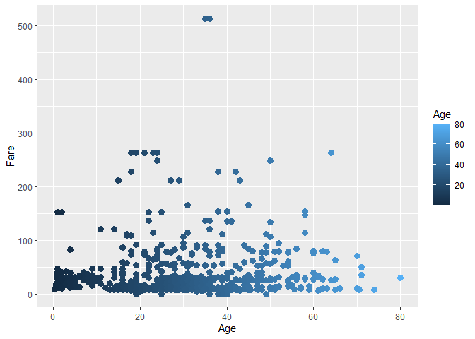
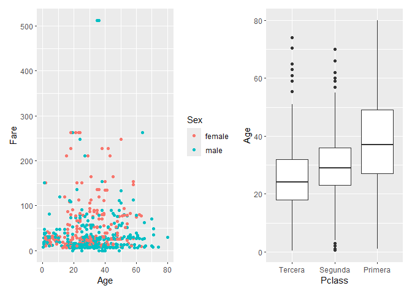
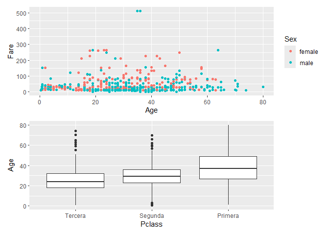
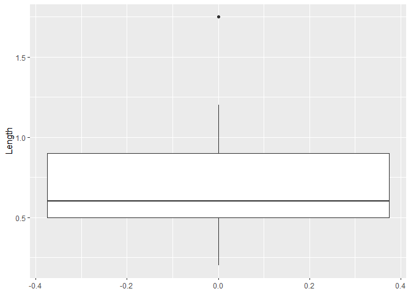
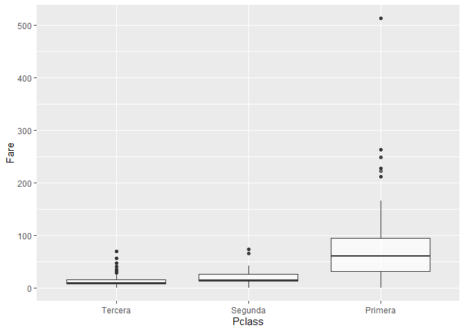
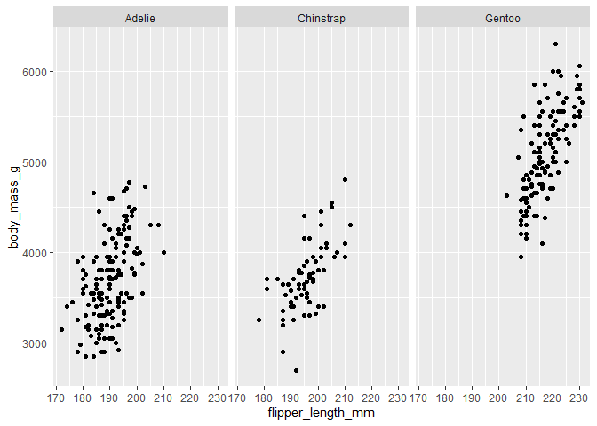
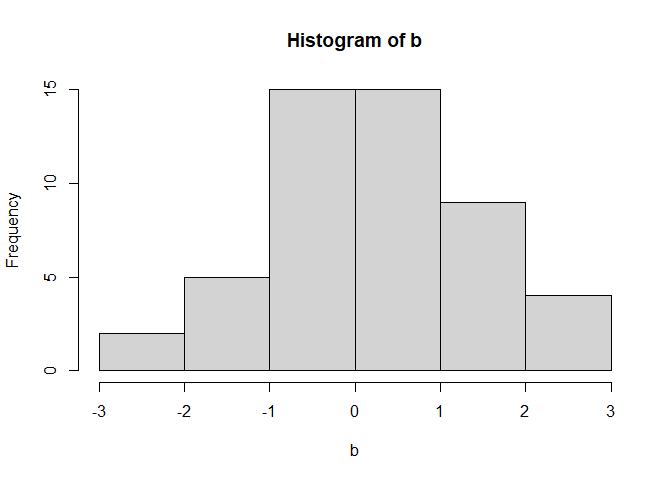

# Visualización y análisis exploratorio de datos

Verónica Cruz-Alonso
04/12/2024

<link href="dia_3_visualizacion_files/libs/htmltools-fill-0.5.8.1/fill.css" rel="stylesheet" />

<script src="dia_3_visualizacion_files/libs/htmlwidgets-1.6.4/htmlwidgets.js"></script>

<script src="dia_3_visualizacion_files/libs/plotly-binding-4.10.4/plotly.js"></script>

<script src="dia_3_visualizacion_files/libs/setprototypeof-0.1/setprototypeof.js"></script>

<script src="dia_3_visualizacion_files/libs/typedarray-0.1/typedarray.min.js"></script>

<script src="dia_3_visualizacion_files/libs/jquery-3.5.1/jquery.min.js"></script>

<link href="dia_3_visualizacion_files/libs/crosstalk-1.2.1/css/crosstalk.min.css" rel="stylesheet" />

<script src="dia_3_visualizacion_files/libs/crosstalk-1.2.1/js/crosstalk.min.js"></script>

<link href="dia_3_visualizacion_files/libs/plotly-htmlwidgets-css-2.11.1/plotly-htmlwidgets.css" rel="stylesheet" />

<script src="dia_3_visualizacion_files/libs/plotly-main-2.11.1/plotly-latest.min.js"></script>



- [<span class="toc-section-number">1</span> Objetivos del día
  3](#objetivos-del-día-3)
- [<span class="toc-section-number">2</span> Introducción a la
  visualización de datos](#introducción-a-la-visualización-de-datos)
- [<span class="toc-section-number">3</span> Elementos básicos en un
  gráfico de {ggplot2}](#elementos-básicos-en-un-gráfico-de-ggplot2)
  - [<span class="toc-section-number">3.0.1</span>
    Ejercicio](#ejercicio)
  - [<span class="toc-section-number">3.1</span> Aesthetics
    vs. argumentos](#aesthetics-vs-argumentos)
    - [<span class="toc-section-number">3.1.1</span>
      Ejercicio](#ejercicio-1)
- [<span class="toc-section-number">4</span> {Ggplot2}: funciones
  avanzadas](#ggplot2-funciones-avanzadas)
  - [<span class="toc-section-number">4.1</span> Etiquetas](#etiquetas)
  - [<span class="toc-section-number">4.2</span> Sistema de
    coordenadas](#sistema-de-coordenadas)
    - [<span class="toc-section-number">4.2.1</span>
      Ejercicio](#ejercicio-2)
  - [<span class="toc-section-number">4.3</span> Faceting](#faceting)
  - [<span class="toc-section-number">4.4</span> Posición](#posición)
  - [<span class="toc-section-number">4.5</span> Escalas](#escalas)
    - [<span class="toc-section-number">4.5.1</span>
      Ejercicio](#ejercicio-3)
  - [<span class="toc-section-number">4.6</span> Los colores en
    R](#los-colores-en-r)
  - [<span class="toc-section-number">4.7</span> Temas](#temas)
    - [<span class="toc-section-number">4.7.1</span>
      Ejercicio](#ejercicio-4)
    - [<span class="toc-section-number">4.7.2</span>
      GgthemeAssist](#ggthemeassist)
- [<span class="toc-section-number">5</span> Gráficos
  multipaneles](#gráficos-multipaneles)
- [<span class="toc-section-number">6</span> Enlaces de interés sobre
  visualización de
  datos](#enlaces-de-interés-sobre-visualización-de-datos)
- [<span class="toc-section-number">7</span> La exploración de datos y
  su importancia](#la-exploración-de-datos-y-su-importancia)
  - [<span class="toc-section-number">7.1</span> Detección de
    outliers](#detección-de-outliers)
    - [<span class="toc-section-number">7.1.1</span> En una
      variable](#en-una-variable)
    - [<span class="toc-section-number">7.1.2</span> Outliers
      condicionales](#outliers-condicionales)
    - [<span class="toc-section-number">7.1.3</span> ¿Qué podemos hacer
      con los outliers?](#qué-podemos-hacer-con-los-outliers)
  - [<span class="toc-section-number">7.2</span> Normalidad y
    homogeneidad de Y](#normalidad-y-homogeneidad-de-y)
    - [<span class="toc-section-number">7.2.1</span>
      Ejercicio](#ejercicio-5)
  - [<span class="toc-section-number">7.3</span> Cantidad de
    ceros](#cantidad-de-ceros)
  - [<span class="toc-section-number">7.4</span> Relaciones entre
    variables](#relaciones-entre-variables)
    - [<span class="toc-section-number">7.4.1</span> Variables
      cualitativas](#variables-cualitativas)
    - [<span class="toc-section-number">7.4.2</span>
      Ejercicio](#ejercicio-6)
    - [<span class="toc-section-number">7.4.3</span> Variables
      cuantitativas](#variables-cuantitativas)
    - [<span class="toc-section-number">7.4.4</span> Variable
      cualitativa
      vs. cuantitativa](#variable-cualitativa-vs-cuantitativa)
    - [<span class="toc-section-number">7.4.5</span> Múltiples
      covariables](#múltiples-covariables)

## Objetivos del día 3

- Aprender la filosofía y funciones básicas del paquete de visualización
  de datos {ggplot2}.

- Entender funciones avanzadas de {ggplot2}.

- Ser capaces de generar gráficos publicables en un artículo científico.

- Aprender a explorar diferentes tipos de datos para su posterior
  análisis.

## Introducción a la visualización de datos

La visualización de datos es una disciplina cuyo fin es mapear datos de
forma gráfica para comunicar un mensaje. En investigación se usa
principalmente en los análisis exploratorios (durante la fase de
entendimiento de los datos) y en la comunicación de los resultados.

La representación gráfica de nuestras ideas o resultados de
investigación es esencial para comunicar de forma efectiva nuestra
interpretación de los datos y es clave si queremos causar cierto impacto
en el interlocutor. Algunos estudios sugieren que el tiempo medio que el
usuario emplea en ojear una página web es de unos segundos, pero si hay
algo que consigue atraer su atención entonces el tiempo se incrementa
exponencialmente. Este atractor en el mundo científico puede ser un buen
gráfico de resultados o un buen resumen gráfico.


En este bloque vamos a aprender como representar de manera efectiva
muestros datos utilizando el paquete
{[ggplot2](https://ggplot2.tidyverse.org/)} de *tidyverse*. {ggplot2}
permite hacer gráficos razonablemente claros y estéticamente bonitos (es
decir, bien ejecutados) con poco tiempo y un esfuerzo pequeño. Es
extremadamente flexible y potente por lo que ha alcanzado gran
popularidad.

{ggplot2} está escrito en R siguiendo la [gramática de gráficos
(gg)](https://www.amazon.com/Grammar-Graphics-Statistics-Computing/dp/0387245448/ref=as_li_ss_tl).
Por ello, al utilizarlo, el usuario tiene que pensar como cuando está
haciendo un dibujo a mano y pensar en ir añadiendo diferentes capas a la
creación. El flujo de trabajo es crear un gráfico vacío, añadir una capa
con los datos, añadir una capa con las etiquetas, etc.


Como otros paquetes de *tidyverse*, {ggplot2} precisa de datos ordenados
para que ejecutarse de forma óptima.

💡Recordamos que en una tabla de datos ordenados (*Tidy data*) cada
columna representa una variable, cada fila es una observación y cada
celda contiene un único valor.

## Elementos básicos en un gráfico de {[ggplot2](https://ggplot2.tidyverse.org/)}

Se necesitan tres capas básicas para crear un gráfico con {ggplot2}:

- Los **datos** (*data*).

- Las **geometrías** (*geom*): definen el tipo de gráfico (de puntos, de
  barras, etc.).

- Los ***aesthetics***: características visuales de las geometrías
  (p. ej. la posición, el color) definidas por las variables de nuestros
  datos.

Las capas se conectan entre sí con el símbolo `+`, que siempre debe ir
colocado al final de la línea de código si queremos seguir añadiendo
capas al gráfico. Todas las capas que se pueden incluir están recogidas
en la [cheat sheet de {ggplot2} de
Posit](https://diegokoz.github.io/intro_ds/fuentes/ggplot2-cheatsheet-2.1-Spanish.pdf).

💡 Se utiliza el símbolo `+` porque {ggplot2} es anterior al *pipe*
(`|>`) y cambiar `+` por el *pipe* requeríría muchos reajustes en un
montón de paquetes.

``` r
# install.packages("titanic")
library(tidyverse)

#Cargamos los datos
titanic <- titanic::titanic_train 

head(titanic)
```

      PassengerId Survived Pclass
    1           1        0      3
    2           2        1      1
    3           3        1      3
    4           4        1      1
    5           5        0      3
    6           6        0      3
                                                     Name    Sex Age SibSp Parch
    1                             Braund, Mr. Owen Harris   male  22     1     0
    2 Cumings, Mrs. John Bradley (Florence Briggs Thayer) female  38     1     0
    3                              Heikkinen, Miss. Laina female  26     0     0
    4        Futrelle, Mrs. Jacques Heath (Lily May Peel) female  35     1     0
    5                            Allen, Mr. William Henry   male  35     0     0
    6                                    Moran, Mr. James   male  NA     0     0
                Ticket    Fare Cabin Embarked
    1        A/5 21171  7.2500              S
    2         PC 17599 71.2833   C85        C
    3 STON/O2. 3101282  7.9250              S
    4           113803 53.1000  C123        S
    5           373450  8.0500              S
    6           330877  8.4583              Q

``` r
# PassengerId: Id del pasajero
# Survived: 1-si, 0-no
# Pclass: clase del pasajero
# Name: nombre Name
# Sex: sexo
# Age: edad
# SibSp: numero de hermanos + parejas a bordo
# Parch: numero de progenitores + hijos a bordo
# Ticket: numero de billete
# Fare: tarifa
# Cabin: camarote
# Embarked: puerta de embarque

ggplot(data = titanic)
```


``` r
ggplot(data = titanic, aes(x = Age, y = Fare)) 
```


``` r
ggplot() + 
  geom_point(data = titanic, aes(x = Age, y = Fare)) #Los datos se pueden colocar dentro de la funcion ggplot si se van a usar los mismos en todas las geometrias
```


``` r
ggplot() + 
  geom_jitter(data = titanic, aes(x = Pclass, y = Fare))
```


``` r
# Se pueden combinar varias geometrias

ggplot(data = titanic) + 
  geom_point(aes(x = Age, y = Fare)) + 
  geom_smooth(aes(x = Age, y = Fare))
```


``` r
# Como guardar plots satisfactorios

plotqmegusta <- ggplot() + 
  geom_point(data = titanic, aes(x = Age, y = Fare))

ggsave(filename = "farebyage.jpg", plot = plotqmegusta, width = 12, height = 9, units = "cm", dpi = 300)

ggsave(filename = "farebyage.pdf", plot = plotqmegusta, width = 12, height = 9, units = "cm")
```

💡Algunas revistas científicas dan especificaciones muy detalladas sobre
cómo tienen que ser los gráficos (p. ej.
[Science](https://www.science.org/content/page/instructions-preparing-initial-manuscript#preparation-of-figures)).
Cuando no tenemos una referencia clara recomendamos pensar en formato A4
(21 x 29,7 cm) y que todos los elementos visuales del gráfico queden
visibles cuando se guarda dentro de estos límites de tamaño.

#### Ejercicio

Representa un gráfico para ver la relación entre el sexo de los
pasajeros y la clase con la base de datos titanic.

### Aesthetics vs. argumentos

Los aesthetics cambian cada elemento de las geometrías. Los argumentos
estéticos cambian toda la geometría en conjunto.

``` r
ggplot(data = titanic) + 
  geom_point(aes(x = Age, y = Fare, color = Sex))
```


``` r
# No es lo mismo que... 

ggplot(data = titanic) + 
  geom_point(aes(x = Age, y = Fare), color = "darkred") 
```


En la ayuda de las funciones de {ggplot2} aparece una lista de los
*aesthetics* y los argumentos estéticos que acepta esa función. Se
pueden incluir tantos *aesthetics* como se deseen.

``` r
ggplot(data = titanic) + 
  geom_point(aes(x = Age, y = Fare, size = Pclass, shape = Sex, color = Embarked))
```


``` r
summary(titanic$Pclass)
```

       Min. 1st Qu.  Median    Mean 3rd Qu.    Max. 
      1.000   2.000   3.000   2.309   3.000   3.000 

``` r
titanic <- titanic |> 
  mutate(Pclass = factor(Pclass, levels = c(3, 2, 1), 
    labels = c("Tercera", "Segunda", "Primera")))

summary(titanic$Pclass)
```

    Tercera Segunda Primera 
        491     184     216 

``` r
ggplot(data = titanic) + 
  geom_point(aes(x = Age, y = Fare, size = Pclass, shape = Sex, color = Embarked), alpha = 0.5)
```


#### Ejercicio

¿Cómo modificarías el siguiente código para representar la puerta de
embarque con diferentes formas pero los puntos de color rosa?

``` r
ggplot(data = titanic) + 
  geom_point(aes(x = Age, y = Fare))
```


## {Ggplot2}: funciones avanzadas

<!--# ver la chuleta de ggplot2 -->

### Etiquetas

``` r
pnumcat <- ggplot(data = titanic) +    
  geom_boxplot(aes(x = Pclass, y = Age))  
pnumcat  
```


``` r
pnumcat +    
  labs(title = "Edad de los pasajeros según su clase",      
    x = "Clase",      
    y = "Edad (años)") #title, subtitle, x, y, caption
```


### Sistema de coordenadas

El sistema de coordenadas por defecto en un gráfico de `ggplot()` es el
cartesiano. Si queremos hacer zoom en nuestro gráfico tendremos que
cambiar los límites del sistema de coordenadas.

``` r
pnumcat +   
  coord_cartesian(ylim = c(0, 100))  
```


#### Ejercicio

Cambia la posición de los ejes X e Y en el sistema de coordenadas de
pnumcat.

### Faceting

Los *facets* dividen el gráfico en subgráficos basados en el valor de
una o varias variables categóricas. Las facetas son muy útiles en
exploración de datos. Hay dos funciones para facetar: `facet_grid()` y
`facet_wrap()`.

``` r
miplot <- ggplot(data = titanic,    
  aes(x = Age, y = Fare, color = Sex)) +    
  geom_point()  
miplot  
```


``` r
miplot +    
  facet_grid(Pclass~., scales = "free")  
```


``` r
miplot +    
  facet_grid(Pclass~Embarked)  
```


``` r
miplot +    
  facet_wrap(Embarked~., ncol=3)
```


### Posición

Con las funciones y argumenos de posición podemos recolocar geometrias
que de otro modo ocuparían el mismo espacio.

``` r
ggplot(data = titanic) +    
  geom_bar(aes(x = Pclass, fill = Sex))  
```


``` r
ggplot(data = titanic) +    
  geom_bar(aes(x = Pclass, fill = Sex), 
    position = "dodge") #esquivar  
```


``` r
ggplot(data = titanic) +    
  geom_bar(aes(x = Pclass, fill = Sex), 
    position = "fill") #rellenar 
```


### Escalas

Sirven para personalizar los *aesthetics*. Las funciones de la familia
`scale` siempre tienen la misma estructura: scale \_ aesthetic que se
personaliza \_ tipo de escala (p. ej. continua, discreta, manual, etc.).

``` r
miplot +
  scale_color_manual(values = c("darkgreen", "chartreuse")) +
  scale_y_sqrt(breaks = c(9, 16, 25), labels = c("a", "b", "c"))  
```


👀 Un error muy común es cambiar los ejes del gráfico con las funciones
`scale_x_continuous()` o `scale_y_continuous()` cuando lo que queremos
es hacer zoom. Fijate en las diferencias en el siguiente ejemplo.

``` r
ggplot(data = titanic) +    
  geom_boxplot(aes(x = Pclass, y = Age))  
```


``` r
ggplot(data = titanic) +    
  geom_boxplot(aes(x = Pclass, y = Age)) + 
  scale_y_continuous(limits = c(10, 80))  
```


``` r
ggplot(data = titanic) +    
  geom_boxplot(aes(x = Pclass, y = Age)) +   
  coord_cartesian(ylim = c(10, 80)) 
```


#### Ejercicio

¿Qué harías para cambiar la escala de la edad a un degradado de colores
de azul a amarillo en el siguiente gráfico?

``` r
ggplot(data = titanic, aes(x = Age, y = Fare, color = Age)) +   
  geom_point(size = 3)  
```

    Warning: Removed 177 rows containing missing values or values outside the scale range
    (`geom_point()`).



### Los colores en R

Las paletas de colores tipo *manual* y *gradient* se personalizan con el
nombre o código del color.

💡Con [esta herramienta](https://r-charts.com/colors/) puedes elegir
entre cientos de colores y con
[esta](https://medialab.github.io/iwanthue/) crear tu propia paleta.

Las paletas tipo *brewer* y *distiller* utilizan paletas de colores que
pueden ser secuenciales, cualitativas o divergentes, que aunque tienen
utilidad en gran variedad de situaciones, están diseñadas para trabajar
[con mapas o a escalas
pequeñas](https://colorbrewer2.org/#type=sequential&scheme=BuGn&n=3).

Las paletas HCL (*hue-chroma-luminance*) son paletas muy populares que
tienen su propia función (p. ej. colores para representar batimetría).
De entre ellas, *Viridis* se he vuelto muy popular porque está diseñada
para que personas con distintos tipos de daltonismo puedan distinguir
los colores.

``` r
RColorBrewer::display.brewer.all()   
```


``` r
RColorBrewer::brewer.pal(name = "Set3", n = 6) # para crear paleta  
```

    [1] "#8DD3C7" "#FFFFB3" "#BEBADA" "#FB8072" "#80B1D3" "#FDB462"

``` r
grDevices::hcl.pals() # HCL Palettes   
```

      [1] "Pastel 1"      "Dark 2"        "Dark 3"        "Set 2"        
      [5] "Set 3"         "Warm"          "Cold"          "Harmonic"     
      [9] "Dynamic"       "Grays"         "Light Grays"   "Blues 2"      
     [13] "Blues 3"       "Purples 2"     "Purples 3"     "Reds 2"       
     [17] "Reds 3"        "Greens 2"      "Greens 3"      "Oslo"         
     [21] "Purple-Blue"   "Red-Purple"    "Red-Blue"      "Purple-Orange"
     [25] "Purple-Yellow" "Blue-Yellow"   "Green-Yellow"  "Red-Yellow"   
     [29] "Heat"          "Heat 2"        "Terrain"       "Terrain 2"    
     [33] "Viridis"       "Plasma"        "Inferno"       "Rocket"       
     [37] "Mako"          "Dark Mint"     "Mint"          "BluGrn"       
     [41] "Teal"          "TealGrn"       "Emrld"         "BluYl"        
     [45] "ag_GrnYl"      "Peach"         "PinkYl"        "Burg"         
     [49] "BurgYl"        "RedOr"         "OrYel"         "Purp"         
     [53] "PurpOr"        "Sunset"        "Magenta"       "SunsetDark"   
     [57] "ag_Sunset"     "BrwnYl"        "YlOrRd"        "YlOrBr"       
     [61] "OrRd"          "Oranges"       "YlGn"          "YlGnBu"       
     [65] "Reds"          "RdPu"          "PuRd"          "Purples"      
     [69] "PuBuGn"        "PuBu"          "Greens"        "BuGn"         
     [73] "GnBu"          "BuPu"          "Blues"         "Lajolla"      
     [77] "Turku"         "Hawaii"        "Batlow"        "Blue-Red"     
     [81] "Blue-Red 2"    "Blue-Red 3"    "Red-Green"     "Purple-Green" 
     [85] "Purple-Brown"  "Green-Brown"   "Blue-Yellow 2" "Blue-Yellow 3"
     [89] "Green-Orange"  "Cyan-Magenta"  "Tropic"        "Broc"         
     [93] "Cork"          "Vik"           "Berlin"        "Lisbon"       
     [97] "Tofino"        "ArmyRose"      "Earth"         "Fall"         
    [101] "Geyser"        "TealRose"      "Temps"         "PuOr"         
    [105] "RdBu"          "RdGy"          "PiYG"          "PRGn"         
    [109] "BrBG"          "RdYlBu"        "RdYlGn"        "Spectral"     
    [113] "Zissou 1"      "Cividis"       "Roma"         

``` r
X11() 
example("hcl.colors") 
```


    hcl.cl> require("graphics")

    hcl.cl> # color wheels in RGB/HSV and HCL space
    hcl.cl> par(mfrow = c(2, 2))

    hcl.cl> pie(rep(1, 12), col = rainbow(12), main = "RGB/HSV")


    hcl.cl> pie(rep(1, 12), col = hcl.colors(12, "Set 2"), main = "HCL")


    hcl.cl> par(mfrow = c(1, 1))

    hcl.cl> ## color swatches for RGB/HSV palettes
    hcl.cl> demo.pal <-
    hcl.cl+   function(n, border = if (n < 32) "light gray" else NA,
    hcl.cl+            main = paste("color palettes;  n=", n),
    hcl.cl+            ch.col = c("rainbow(n, start=.7, end=.1)", "heat.colors(n)",
    hcl.cl+                       "terrain.colors(n)", "topo.colors(n)",
    hcl.cl+                       "cm.colors(n)"))
    hcl.cl+ {
    hcl.cl+     nt <- length(ch.col)
    hcl.cl+     i <- 1:n; j <- n / nt; d <- j/6; dy <- 2*d
    hcl.cl+     plot(i, i+d, type = "n", yaxt = "n", ylab = "", main = main)
    hcl.cl+     for (k in 1:nt) {
    hcl.cl+         rect(i-.5, (k-1)*j+ dy, i+.4, k*j,
    hcl.cl+              col = eval(str2lang(ch.col[k])), border = border)
    hcl.cl+         text(2*j,  k * j + dy/4, ch.col[k])
    hcl.cl+     }
    hcl.cl+ }

    hcl.cl> demo.pal(16)


    hcl.cl> ## color swatches for HCL palettes
    hcl.cl> hcl.swatch <- function(type = NULL, n = 5, nrow = 11,
    hcl.cl+   border = if (n < 15) "black" else NA) {
    hcl.cl+     palette <- hcl.pals(type)
    hcl.cl+     cols <- sapply(palette, hcl.colors, n = n)
    hcl.cl+     ncol <- ncol(cols)
    hcl.cl+     nswatch <- min(ncol, nrow)
    hcl.cl+ 
    hcl.cl+     par(mar = rep(0.1, 4),
    hcl.cl+         mfrow = c(1, min(5, ceiling(ncol/nrow))),
    hcl.cl+         pin = c(1, 0.5 * nswatch),
    hcl.cl+         cex = 0.7)
    hcl.cl+ 
    hcl.cl+     while (length(palette)) {
    hcl.cl+         subset <- 1:min(nrow, ncol(cols))
    hcl.cl+         plot.new()
    hcl.cl+         plot.window(c(0, n), c(0, nrow + 1))
    hcl.cl+         text(0, rev(subset) + 0.1, palette[subset], adj = c(0, 0))
    hcl.cl+         y <- rep(subset, each = n)
    hcl.cl+         rect(rep(0:(n-1), n), rev(y), rep(1:n, n), rev(y) - 0.5,
    hcl.cl+              col = cols[, subset], border = border)
    hcl.cl+         palette <- palette[-subset]
    hcl.cl+         cols <- cols[, -subset, drop = FALSE]
    hcl.cl+     }
    hcl.cl+ 
    hcl.cl+     par(mfrow = c(1, 1), mar = c(5.1, 4.1, 4.1, 2.1), cex = 1)
    hcl.cl+ }

    hcl.cl> hcl.swatch()


    hcl.cl> hcl.swatch("qualitative")


    hcl.cl> hcl.swatch("sequential")


    hcl.cl> hcl.swatch("diverging")


    hcl.cl> hcl.swatch("divergingx")


    hcl.cl> ## heat maps with sequential HCL palette (purple)
    hcl.cl> image(volcano, col = hcl.colors(11, "purples", rev = TRUE))


    hcl.cl> filled.contour(volcano, nlevels = 10,
    hcl.cl+                color.palette = function(n, ...)
    hcl.cl+                    hcl.colors(n, "purples", rev = TRUE, ...))


    hcl.cl> ## list available HCL color palettes
    hcl.cl> hcl.pals("qualitative")
    [1] "Pastel 1" "Dark 2"   "Dark 3"   "Set 2"    "Set 3"    "Warm"     "Cold"    
    [8] "Harmonic" "Dynamic" 

    hcl.cl> hcl.pals("sequential")
     [1] "Grays"         "Light Grays"   "Blues 2"       "Blues 3"      
     [5] "Purples 2"     "Purples 3"     "Reds 2"        "Reds 3"       
     [9] "Greens 2"      "Greens 3"      "Oslo"          "Purple-Blue"  
    [13] "Red-Purple"    "Red-Blue"      "Purple-Orange" "Purple-Yellow"
    [17] "Blue-Yellow"   "Green-Yellow"  "Red-Yellow"    "Heat"         
    [21] "Heat 2"        "Terrain"       "Terrain 2"     "Viridis"      
    [25] "Plasma"        "Inferno"       "Rocket"        "Mako"         
    [29] "Dark Mint"     "Mint"          "BluGrn"        "Teal"         
    [33] "TealGrn"       "Emrld"         "BluYl"         "ag_GrnYl"     
    [37] "Peach"         "PinkYl"        "Burg"          "BurgYl"       
    [41] "RedOr"         "OrYel"         "Purp"          "PurpOr"       
    [45] "Sunset"        "Magenta"       "SunsetDark"    "ag_Sunset"    
    [49] "BrwnYl"        "YlOrRd"        "YlOrBr"        "OrRd"         
    [53] "Oranges"       "YlGn"          "YlGnBu"        "Reds"         
    [57] "RdPu"          "PuRd"          "Purples"       "PuBuGn"       
    [61] "PuBu"          "Greens"        "BuGn"          "GnBu"         
    [65] "BuPu"          "Blues"         "Lajolla"       "Turku"        
    [69] "Hawaii"        "Batlow"       

    hcl.cl> hcl.pals("diverging")
     [1] "Blue-Red"      "Blue-Red 2"    "Blue-Red 3"    "Red-Green"    
     [5] "Purple-Green"  "Purple-Brown"  "Green-Brown"   "Blue-Yellow 2"
     [9] "Blue-Yellow 3" "Green-Orange"  "Cyan-Magenta"  "Tropic"       
    [13] "Broc"          "Cork"          "Vik"           "Berlin"       
    [17] "Lisbon"        "Tofino"       

    hcl.cl> hcl.pals("divergingx")
     [1] "ArmyRose" "Earth"    "Fall"     "Geyser"   "TealRose" "Temps"   
     [7] "PuOr"     "RdBu"     "RdGy"     "PiYG"     "PRGn"     "BrBG"    
    [13] "RdYlBu"   "RdYlGn"   "Spectral" "Zissou 1" "Cividis"  "Roma"    

``` r
hcl.colors(n = 6, palette = "Lajolla") # para crear paleta 
```

    [1] "#FCFFC9" "#EBCE7B" "#DE9529" "#BE5A32" "#7F2B3F" "#1D0B14"

``` r
# Viridis   
ggplot(data = titanic, aes(x = Age, y = Fare, color = Age)) +
  geom_point() +    
  scale_color_gradientn(colours = hcl.colors(12, "viridis")) 

ggplot(data = titanic, aes(x = Age, y = Fare, color = Age)) +    
  geom_point() +    
  scale_color_viridis_c()
```

💡[Aquí](https://ggplot2-book.org/scales-colour) puedes encontrar más
información sobre cómo utilizar colores en {ggplot2}.

### Temas

`theme()` permite la personalización completa de todos los elementos del
gráfico. Los argumentos dentro de la función definen la parte del
gráfico a cambiar. Se les asigna una función de cambio según el elemento
a cambiar dentro de esa parte (parte.del.gráfico =
elemento_a_cambiar(…)): *line*, *rect*, *text*.

``` r
?theme  
miplot +    
  theme(axis.title.x = element_text(color = "red", face = "bold"))  
```


#### Ejercicio

Dibuja una linea negra que represente los ejes de miplot y quita el
fondo del gráfico.

Existen temas configurados por defecto y un asistente que te ayuda a
personalizar el gráfico.

``` r
miplot + theme_classic()  
```


``` r
miplot + theme_light()  
```


``` r
miplot + theme_void() 
```


#### GgthemeAssist

``` r
# install.packages("ggThemeAssist")  
miplot
```

    Warning: Removed 177 rows containing missing values or values outside the scale range
    (`geom_point()`).


## Gráficos multipaneles

La librería {patchwork} permite añadir gráficos ([y también
tablas](https://www.tidyverse.org/blog/2024/09/patchwork-1-3-0/)) entre
sí como si fueran diferentes capas.

``` r
# install.packages("patchwork") 
library(patchwork)  

miplot + pnumcat 
```



``` r
miplot / pnumcat   
```



``` r
miplot / pnumcat +    
  plot_annotation(tag_levels = "a", tag_suffix = ")")  
```


En [este
enlace](https://patchwork.data-imaginist.com/articles/guides/layout.html)
puedes ver cómo personalizar mucho más la disposición de los diferentes
elementos de la composición.

## Enlaces de interés sobre visualización de datos

- [Guía de {ggplot2} de
  Posit](https://diegokoz.github.io/intro_ds/fuentes/ggplot2-cheatsheet-2.1-Spanish.pdf)

- [Construye un gráfico capa a
  capa](https://rpubs.com/hadley/ggplot2-layers)

- [Elegant graphics for data analysis](https://ggplot2-book.org/)

- [Tutorial de {ggplot2} de Cedric
  Scherer](https://www.cedricscherer.com/2019/08/05/a-ggplot2-tutorial-for-beautiful-plotting-in-r/)

- [Effective Visual Communication for the Quantitative
  Scientist](https://ascpt.onlinelibrary.wiley.com/doi/full/10.1002/psp4.12455)

- [Graphics principles](https://graphicsprinciples.github.io/): el tipo
  de gráfico que escojamos va a depender del tipo de variable y del
  mensaje que queramos transmitir (es decir, del propósito).

## La exploración de datos y su importancia

Cuando queremos entender y/o predecir un patrón o un proceso (variable
dependiente o respuesta; *y*), lo modelizamos en función de otras
variables que pensamos que lo explican o lo predicen (variables
independientes, covariables o explicativas; *x*). Todas ellas pueden ser
a su vez **cualitativas o cuantitativas**.


La exploración de datos puede llevar hasta el 50% del tiempo de
análisis. Es imprescindible para evitar errores tipo I (determinar que
hay relación entre dos variables cuando no existe), errores tipo II
(determinar que no hay relación entre dos variables cuando existe),
encontrar patrones no lineales o evitar que el resultado esté
determinados por unos pocos puntos discordantes (*outliers*). A
continuación nos vamos a enfocar en herramientas gráficas para la
exploración de variables cualitativas y cuantitativas aunque también
mostraremos test estadísticos que pueden servir (de normalidad,
homogeneidad, etc.). Seguiremos el protocolo de análisis exploratorio de
datos publicado por Zuur, Ieno, and Elphick (2010).

### Detección de outliers

#### En una variable

``` r
# Boxplots
ggplot(data = titanic) + 
  geom_boxplot(aes(y = Age))
```


``` r
# Jitter
ggplot(data = titanic) + 
  geom_jitter(aes(x = 1, y = Age))
```


``` r
# group = 1 hace que considere toda la variable como un todo

library(palmerpenguins)

# Cleveland plot
penguins |> 
  mutate(orden = 1:nrow(penguins)) |> 
  ggplot() + 
  geom_point(aes(x = body_mass_g, y = orden)) +
  theme(panel.grid = element_blank(),
    panel.grid.major.y = element_line(size = 0.1, color = "grey90"), 
    panel.background = element_rect(fill = "white", color = "black")) 
```


#### Outliers condicionales

``` r
# De variables continuas codicionados por variables categóricas

# Cleveland plot por grupos
penguins |> 
  group_by(island) |> 
  mutate(orden = 1:n()) |> 
  ggplot() + 
  geom_point(aes(x = body_mass_g, y = orden, col = island)) +
  facet_grid(island ~ ., scales = "free_y", space = "free_y") + 
  theme(panel.grid = element_blank(),
        panel.grid.major.y = element_line(size = 0.1, color = "grey90"), 
    panel.background = element_rect(fill = "white", color = "black"),
        legend.position = "none")
```


``` r
# Boxplot
ggplot(data = titanic) + 
  geom_boxplot(aes(x = Pclass, y = Age)) 
```


``` r
# De variables continuas codicionados por otras variables continuas

ggplot(data = titanic) + 
  geom_point(aes(x = Age, y = Fare))
```


#### ¿Qué podemos hacer con los outliers?

``` r
# Identificar outliers: ¿a qué observación pertenecen?

# install.packages("plotly")
library(plotly)

ggplotly(miplot) 
```

<div class="plotly html-widget html-fill-item" id="htmlwidget-86ed2fffea7e43eb535b" style="width:672px;height:480px;"></div>
<script type="application/json" data-for="htmlwidget-86ed2fffea7e43eb535b">{"x":{"data":[{"x":[38,26,35,27,14,4,58,14,55,31,null,15,8,38,null,null,null,18,14,40,27,3,19,null,18,49,29,21,5,38,29,17,16,30,null,17,33,23,34,28,21,null,14.5,20,17,2,32.5,null,47,29,19,null,22,24,9,22,16,40,null,45,1,50,null,4,null,32,19,44,58,null,24,2,16,35,31,27,32,null,35,5,null,8,null,null,25,24,29,41,29,null,30,35,50,null,58,35,41,null,63,45,35,22,26,19,24,2,50,null,null,null,17,30,24,18,26,26,24,31,40,30,22,36,36,31,16,null,null,41,24,24,40,null,22,38,null,null,45,60,null,null,24,3,null,22,42,1,35,36,17,23,24,31,28,21,20,null,33,null,34,18,10,28,28,19,null,42,14,21,24,45,28,13,5,null,50,0.75,33,23,22,2,63,null,35,54,25,21,null,37,16,33,54,34,36,30,44,50,2,null,30,7,30,22,36,9,11,19,22,48,39,36,null,29,53,null,34,39,null,25,39,18,52,null,null,24,22,40,39,null,24,26,4,21,9,28,41,24,2,0.75,23,18,null,18,32,null,40,18,43,null,15,4,null,18,18,45,22,24,38,27,6,30,null,25,29,48,21,30,4,48,33,36,51,30.5,57,54,5,43,13,17,18,null,49,31,30,31,18,33,6,23,52,27,62,15,39,30,null,9,16,44,18,45,24,48,null,42,27,47,28,15,56,25,22,39,19,null],"y":[71.283299999999997,7.9249999999999998,53.100000000000001,11.1333,30.070799999999998,16.699999999999999,26.550000000000001,7.8541999999999996,16,18,7.2249999999999996,8.0291999999999994,21.074999999999999,31.387499999999999,7.8792,146.52080000000001,7.75,18,11.2417,9.4749999999999996,21,41.5792,7.8792,7.75,17.800000000000001,76.729200000000006,26,10.5,27.75,80,10.5,7.9249999999999998,46.899999999999999,12.475,7.7874999999999996,10.5,15.85,263,23,7.8958000000000004,7.6500000000000004,24.149999999999999,14.4542,9.8249999999999993,14.458299999999999,31.274999999999999,13,22.3583,14.5,26,26.283300000000001,15.245799999999999,7.75,15.85,34.375,66.599999999999994,7.7332999999999998,15.75,55,27.899999999999999,11.1333,28.712499999999999,69.549999999999997,22.024999999999999,15.5,13,7.8541999999999996,27.720800000000001,146.52080000000001,7.75,13,10.4625,7.75,21,113.27500000000001,7.9249999999999998,76.291700000000006,25.466699999999999,83.474999999999994,31.387499999999999,7.5499999999999998,26.25,14.4542,15.5,7.7750000000000004,14.5,10.4625,20.212499999999999,15.245799999999999,79.200000000000003,86.5,512.32920000000001,26,7.75,153.46250000000001,135.63329999999999,19.5,7.75,77.958299999999994,7.75,20.25,7.75,78.849999999999994,91.0792,8.8499999999999996,151.55000000000001,247.52080000000001,7.75,12.35,110.88330000000001,108.90000000000001,56.929200000000002,83.158299999999997,262.375,26,7.8541999999999996,26,164.86670000000001,134.5,12.35,29,135.63329999999999,13,20.524999999999999,57.979199999999999,23.25,133.65000000000001,134.5,263,13,13,16.100000000000001,55,13,7.8792,7.8792,14.4542,75.25,7.2291999999999996,7.75,69.299999999999997,21.074999999999999,82.1708,7.25,227.52500000000001,15.7417,52,13,12,113.27500000000001,16.699999999999999,7.8541999999999996,12.65,9.8249999999999993,8.6624999999999996,25.466699999999999,90,8.0500000000000007,32.5,13,24.149999999999999,14.4,26,26,16.100000000000001,26,120,34.375,18.75,26.25,13,19.5,19.258299999999998,51.862499999999997,10.5,19.258299999999998,27.75,13.791700000000001,9.8375000000000004,12.2875,9.5875000000000004,25.466699999999999,90,78.2667,151.55000000000001,7.75,7.6292,9.5875000000000004,86.5,26,59.399999999999999,10.5,26,93.5,57.979199999999999,10.5,26,22.3583,8.6624999999999996,26.25,106.425,49.5,71,31.274999999999999,31.274999999999999,26,7.7750000000000004,39.600000000000001,79.650000000000006,17.399999999999999,8.0500000000000007,21.074999999999999,51.479199999999999,7.75,13,55.899999999999999,14.458299999999999,30,110.88330000000001,79.650000000000006,78.2667,7.75,33,27,41.5792,153.46250000000001,31.274999999999999,15.5,65,16.100000000000001,39,77.958299999999994,27.899999999999999,13,39.6875,69.299999999999997,27.899999999999999,19.258299999999998,7.5499999999999998,23,7.8292000000000002,6.75,15.5,52,39,9.8416999999999994,46.899999999999999,8.1374999999999993,211.33750000000001,13.416700000000001,7.7332999999999998,227.52500000000001,14.4542,13.5,151.55000000000001,49.504199999999997,227.52500000000001,10.5,33,21,7.7374999999999998,7.9249999999999998,211.33750000000001,34.375,262.375,13,23,65,86.5,120,77.958299999999994,7.75,10.5,23,12.475,211.33750000000001,7.2291999999999996,57,7.4958,69.549999999999997,25.929200000000002,8.6832999999999991,24.149999999999999,26.25,7.7750000000000004,53.100000000000001,31.274999999999999,7.9249999999999998,93.5,12.475,80,14.4542,83.158299999999997,31,89.104200000000006,15.245799999999999,39.399999999999999,26,9.3499999999999996,164.86670000000001,19.258299999999998,25.929200000000002,69.549999999999997,13,13.8583,52.554200000000002,24,7.2249999999999996,83.158299999999997,26,10.5167,29.125,30,23.449999999999999],"text":["Age: 38.00<br />Fare:  71.2833<br />Sex: female","Age: 26.00<br />Fare:   7.9250<br />Sex: female","Age: 35.00<br />Fare:  53.1000<br />Sex: female","Age: 27.00<br />Fare:  11.1333<br />Sex: female","Age: 14.00<br />Fare:  30.0708<br />Sex: female","Age:  4.00<br />Fare:  16.7000<br />Sex: female","Age: 58.00<br />Fare:  26.5500<br />Sex: female","Age: 14.00<br />Fare:   7.8542<br />Sex: female","Age: 55.00<br />Fare:  16.0000<br />Sex: female","Age: 31.00<br />Fare:  18.0000<br />Sex: female","Age:    NA<br />Fare:   7.2250<br />Sex: female","Age: 15.00<br />Fare:   8.0292<br />Sex: female","Age:  8.00<br />Fare:  21.0750<br />Sex: female","Age: 38.00<br />Fare:  31.3875<br />Sex: female","Age:    NA<br />Fare:   7.8792<br />Sex: female","Age:    NA<br />Fare: 146.5208<br />Sex: female","Age:    NA<br />Fare:   7.7500<br />Sex: female","Age: 18.00<br />Fare:  18.0000<br />Sex: female","Age: 14.00<br />Fare:  11.2417<br />Sex: female","Age: 40.00<br />Fare:   9.4750<br />Sex: female","Age: 27.00<br />Fare:  21.0000<br />Sex: female","Age:  3.00<br />Fare:  41.5792<br />Sex: female","Age: 19.00<br />Fare:   7.8792<br />Sex: female","Age:    NA<br />Fare:   7.7500<br />Sex: female","Age: 18.00<br />Fare:  17.8000<br />Sex: female","Age: 49.00<br />Fare:  76.7292<br />Sex: female","Age: 29.00<br />Fare:  26.0000<br />Sex: female","Age: 21.00<br />Fare:  10.5000<br />Sex: female","Age:  5.00<br />Fare:  27.7500<br />Sex: female","Age: 38.00<br />Fare:  80.0000<br />Sex: female","Age: 29.00<br />Fare:  10.5000<br />Sex: female","Age: 17.00<br />Fare:   7.9250<br />Sex: female","Age: 16.00<br />Fare:  46.9000<br />Sex: female","Age: 30.00<br />Fare:  12.4750<br />Sex: female","Age:    NA<br />Fare:   7.7875<br />Sex: female","Age: 17.00<br />Fare:  10.5000<br />Sex: female","Age: 33.00<br />Fare:  15.8500<br />Sex: female","Age: 23.00<br />Fare: 263.0000<br />Sex: female","Age: 34.00<br />Fare:  23.0000<br />Sex: female","Age: 28.00<br />Fare:   7.8958<br />Sex: female","Age: 21.00<br />Fare:   7.6500<br />Sex: female","Age:    NA<br />Fare:  24.1500<br />Sex: female","Age: 14.50<br />Fare:  14.4542<br />Sex: female","Age: 20.00<br />Fare:   9.8250<br />Sex: female","Age: 17.00<br />Fare:  14.4583<br />Sex: female","Age:  2.00<br />Fare:  31.2750<br />Sex: female","Age: 32.50<br />Fare:  13.0000<br />Sex: female","Age:    NA<br />Fare:  22.3583<br />Sex: female","Age: 47.00<br />Fare:  14.5000<br />Sex: female","Age: 29.00<br />Fare:  26.0000<br />Sex: female","Age: 19.00<br />Fare:  26.2833<br />Sex: female","Age:    NA<br />Fare:  15.2458<br />Sex: female","Age: 22.00<br />Fare:   7.7500<br />Sex: female","Age: 24.00<br />Fare:  15.8500<br />Sex: female","Age:  9.00<br />Fare:  34.3750<br />Sex: female","Age: 22.00<br />Fare:  66.6000<br />Sex: female","Age: 16.00<br />Fare:   7.7333<br />Sex: female","Age: 40.00<br />Fare:  15.7500<br />Sex: female","Age:    NA<br />Fare:  55.0000<br />Sex: female","Age: 45.00<br />Fare:  27.9000<br />Sex: female","Age:  1.00<br />Fare:  11.1333<br />Sex: female","Age: 50.00<br />Fare:  28.7125<br />Sex: female","Age:    NA<br />Fare:  69.5500<br />Sex: female","Age:  4.00<br />Fare:  22.0250<br />Sex: female","Age:    NA<br />Fare:  15.5000<br />Sex: female","Age: 32.00<br />Fare:  13.0000<br />Sex: female","Age: 19.00<br />Fare:   7.8542<br />Sex: female","Age: 44.00<br />Fare:  27.7208<br />Sex: female","Age: 58.00<br />Fare: 146.5208<br />Sex: female","Age:    NA<br />Fare:   7.7500<br />Sex: female","Age: 24.00<br />Fare:  13.0000<br />Sex: female","Age:  2.00<br />Fare:  10.4625<br />Sex: female","Age: 16.00<br />Fare:   7.7500<br />Sex: female","Age: 35.00<br />Fare:  21.0000<br />Sex: female","Age: 31.00<br />Fare: 113.2750<br />Sex: female","Age: 27.00<br />Fare:   7.9250<br />Sex: female","Age: 32.00<br />Fare:  76.2917<br />Sex: female","Age:    NA<br />Fare:  25.4667<br />Sex: female","Age: 35.00<br />Fare:  83.4750<br />Sex: female","Age:  5.00<br />Fare:  31.3875<br />Sex: female","Age:    NA<br />Fare:   7.5500<br />Sex: female","Age:  8.00<br />Fare:  26.2500<br />Sex: female","Age:    NA<br />Fare:  14.4542<br />Sex: female","Age:    NA<br />Fare:  15.5000<br />Sex: female","Age: 25.00<br />Fare:   7.7750<br />Sex: female","Age: 24.00<br />Fare:  14.5000<br />Sex: female","Age: 29.00<br />Fare:  10.4625<br />Sex: female","Age: 41.00<br />Fare:  20.2125<br />Sex: female","Age: 29.00<br />Fare:  15.2458<br />Sex: female","Age:    NA<br />Fare:  79.2000<br />Sex: female","Age: 30.00<br />Fare:  86.5000<br />Sex: female","Age: 35.00<br />Fare: 512.3292<br />Sex: female","Age: 50.00<br />Fare:  26.0000<br />Sex: female","Age:    NA<br />Fare:   7.7500<br />Sex: female","Age: 58.00<br />Fare: 153.4625<br />Sex: female","Age: 35.00<br />Fare: 135.6333<br />Sex: female","Age: 41.00<br />Fare:  19.5000<br />Sex: female","Age:    NA<br />Fare:   7.7500<br />Sex: female","Age: 63.00<br />Fare:  77.9583<br />Sex: female","Age: 45.00<br />Fare:   7.7500<br />Sex: female","Age: 35.00<br />Fare:  20.2500<br />Sex: female","Age: 22.00<br />Fare:   7.7500<br />Sex: female","Age: 26.00<br />Fare:  78.8500<br />Sex: female","Age: 19.00<br />Fare:  91.0792<br />Sex: female","Age: 24.00<br />Fare:   8.8500<br />Sex: female","Age:  2.00<br />Fare: 151.5500<br />Sex: female","Age: 50.00<br />Fare: 247.5208<br />Sex: female","Age:    NA<br />Fare:   7.7500<br />Sex: female","Age:    NA<br />Fare:  12.3500<br />Sex: female","Age:    NA<br />Fare: 110.8833<br />Sex: female","Age: 17.00<br />Fare: 108.9000<br />Sex: female","Age: 30.00<br />Fare:  56.9292<br />Sex: female","Age: 24.00<br />Fare:  83.1583<br />Sex: female","Age: 18.00<br />Fare: 262.3750<br />Sex: female","Age: 26.00<br />Fare:  26.0000<br />Sex: female","Age: 26.00<br />Fare:   7.8542<br />Sex: female","Age: 24.00<br />Fare:  26.0000<br />Sex: female","Age: 31.00<br />Fare: 164.8667<br />Sex: female","Age: 40.00<br />Fare: 134.5000<br />Sex: female","Age: 30.00<br />Fare:  12.3500<br />Sex: female","Age: 22.00<br />Fare:  29.0000<br />Sex: female","Age: 36.00<br />Fare: 135.6333<br />Sex: female","Age: 36.00<br />Fare:  13.0000<br />Sex: female","Age: 31.00<br />Fare:  20.5250<br />Sex: female","Age: 16.00<br />Fare:  57.9792<br />Sex: female","Age:    NA<br />Fare:  23.2500<br />Sex: female","Age:    NA<br />Fare: 133.6500<br />Sex: female","Age: 41.00<br />Fare: 134.5000<br />Sex: female","Age: 24.00<br />Fare: 263.0000<br />Sex: female","Age: 24.00<br />Fare:  13.0000<br />Sex: female","Age: 40.00<br />Fare:  13.0000<br />Sex: female","Age:    NA<br />Fare:  16.1000<br />Sex: female","Age: 22.00<br />Fare:  55.0000<br />Sex: female","Age: 38.00<br />Fare:  13.0000<br />Sex: female","Age:    NA<br />Fare:   7.8792<br />Sex: female","Age:    NA<br />Fare:   7.8792<br />Sex: female","Age: 45.00<br />Fare:  14.4542<br />Sex: female","Age: 60.00<br />Fare:  75.2500<br />Sex: female","Age:    NA<br />Fare:   7.2292<br />Sex: female","Age:    NA<br />Fare:   7.7500<br />Sex: female","Age: 24.00<br />Fare:  69.3000<br />Sex: female","Age:  3.00<br />Fare:  21.0750<br />Sex: female","Age:    NA<br />Fare:  82.1708<br />Sex: female","Age: 22.00<br />Fare:   7.2500<br />Sex: female","Age: 42.00<br />Fare: 227.5250<br />Sex: female","Age:  1.00<br />Fare:  15.7417<br />Sex: female","Age: 35.00<br />Fare:  52.0000<br />Sex: female","Age: 36.00<br />Fare:  13.0000<br />Sex: female","Age: 17.00<br />Fare:  12.0000<br />Sex: female","Age: 23.00<br />Fare: 113.2750<br />Sex: female","Age: 24.00<br />Fare:  16.7000<br />Sex: female","Age: 31.00<br />Fare:   7.8542<br />Sex: female","Age: 28.00<br />Fare:  12.6500<br />Sex: female","Age: 21.00<br />Fare:   9.8250<br />Sex: female","Age: 20.00<br />Fare:   8.6625<br />Sex: female","Age:    NA<br />Fare:  25.4667<br />Sex: female","Age: 33.00<br />Fare:  90.0000<br />Sex: female","Age:    NA<br />Fare:   8.0500<br />Sex: female","Age: 34.00<br />Fare:  32.5000<br />Sex: female","Age: 18.00<br />Fare:  13.0000<br />Sex: female","Age: 10.00<br />Fare:  24.1500<br />Sex: female","Age: 28.00<br />Fare:  14.4000<br />Sex: female","Age: 28.00<br />Fare:  26.0000<br />Sex: female","Age: 19.00<br />Fare:  26.0000<br />Sex: female","Age:    NA<br />Fare:  16.1000<br />Sex: female","Age: 42.00<br />Fare:  26.0000<br />Sex: female","Age: 14.00<br />Fare: 120.0000<br />Sex: female","Age: 21.00<br />Fare:  34.3750<br />Sex: female","Age: 24.00<br />Fare:  18.7500<br />Sex: female","Age: 45.00<br />Fare:  26.2500<br />Sex: female","Age: 28.00<br />Fare:  13.0000<br />Sex: female","Age: 13.00<br />Fare:  19.5000<br />Sex: female","Age:  5.00<br />Fare:  19.2583<br />Sex: female","Age:    NA<br />Fare:  51.8625<br />Sex: female","Age: 50.00<br />Fare:  10.5000<br />Sex: female","Age:  0.75<br />Fare:  19.2583<br />Sex: female","Age: 33.00<br />Fare:  27.7500<br />Sex: female","Age: 23.00<br />Fare:  13.7917<br />Sex: female","Age: 22.00<br />Fare:   9.8375<br />Sex: female","Age:  2.00<br />Fare:  12.2875<br />Sex: female","Age: 63.00<br />Fare:   9.5875<br />Sex: female","Age:    NA<br />Fare:  25.4667<br />Sex: female","Age: 35.00<br />Fare:  90.0000<br />Sex: female","Age: 54.00<br />Fare:  78.2667<br />Sex: female","Age: 25.00<br />Fare: 151.5500<br />Sex: female","Age: 21.00<br />Fare:   7.7500<br />Sex: female","Age:    NA<br />Fare:   7.6292<br />Sex: female","Age: 37.00<br />Fare:   9.5875<br />Sex: female","Age: 16.00<br />Fare:  86.5000<br />Sex: female","Age: 33.00<br />Fare:  26.0000<br />Sex: female","Age: 54.00<br />Fare:  59.4000<br />Sex: female","Age: 34.00<br />Fare:  10.5000<br />Sex: female","Age: 36.00<br />Fare:  26.0000<br />Sex: female","Age: 30.00<br />Fare:  93.5000<br />Sex: female","Age: 44.00<br />Fare:  57.9792<br />Sex: female","Age: 50.00<br />Fare:  10.5000<br />Sex: female","Age:  2.00<br />Fare:  26.0000<br />Sex: female","Age:    NA<br />Fare:  22.3583<br />Sex: female","Age: 30.00<br />Fare:   8.6625<br />Sex: female","Age:  7.00<br />Fare:  26.2500<br />Sex: female","Age: 30.00<br />Fare: 106.4250<br />Sex: female","Age: 22.00<br />Fare:  49.5000<br />Sex: female","Age: 36.00<br />Fare:  71.0000<br />Sex: female","Age:  9.00<br />Fare:  31.2750<br />Sex: female","Age: 11.00<br />Fare:  31.2750<br />Sex: female","Age: 19.00<br />Fare:  26.0000<br />Sex: female","Age: 22.00<br />Fare:   7.7750<br />Sex: female","Age: 48.00<br />Fare:  39.6000<br />Sex: female","Age: 39.00<br />Fare:  79.6500<br />Sex: female","Age: 36.00<br />Fare:  17.4000<br />Sex: female","Age:    NA<br />Fare:   8.0500<br />Sex: female","Age: 29.00<br />Fare:  21.0750<br />Sex: female","Age: 53.00<br />Fare:  51.4792<br />Sex: female","Age:    NA<br />Fare:   7.7500<br />Sex: female","Age: 34.00<br />Fare:  13.0000<br />Sex: female","Age: 39.00<br />Fare:  55.9000<br />Sex: female","Age:    NA<br />Fare:  14.4583<br />Sex: female","Age: 25.00<br />Fare:  30.0000<br />Sex: female","Age: 39.00<br />Fare: 110.8833<br />Sex: female","Age: 18.00<br />Fare:  79.6500<br />Sex: female","Age: 52.00<br />Fare:  78.2667<br />Sex: female","Age:    NA<br />Fare:   7.7500<br />Sex: female","Age:    NA<br />Fare:  33.0000<br />Sex: female","Age: 24.00<br />Fare:  27.0000<br />Sex: female","Age: 22.00<br />Fare:  41.5792<br />Sex: female","Age: 40.00<br />Fare: 153.4625<br />Sex: female","Age: 39.00<br />Fare:  31.2750<br />Sex: female","Age:    NA<br />Fare:  15.5000<br />Sex: female","Age: 24.00<br />Fare:  65.0000<br />Sex: female","Age: 26.00<br />Fare:  16.1000<br />Sex: female","Age:  4.00<br />Fare:  39.0000<br />Sex: female","Age: 21.00<br />Fare:  77.9583<br />Sex: female","Age:  9.00<br />Fare:  27.9000<br />Sex: female","Age: 28.00<br />Fare:  13.0000<br />Sex: female","Age: 41.00<br />Fare:  39.6875<br />Sex: female","Age: 24.00<br />Fare:  69.3000<br />Sex: female","Age:  2.00<br />Fare:  27.9000<br />Sex: female","Age:  0.75<br />Fare:  19.2583<br />Sex: female","Age: 23.00<br />Fare:   7.5500<br />Sex: female","Age: 18.00<br />Fare:  23.0000<br />Sex: female","Age:    NA<br />Fare:   7.8292<br />Sex: female","Age: 18.00<br />Fare:   6.7500<br />Sex: female","Age: 32.00<br />Fare:  15.5000<br />Sex: female","Age:    NA<br />Fare:  52.0000<br />Sex: female","Age: 40.00<br />Fare:  39.0000<br />Sex: female","Age: 18.00<br />Fare:   9.8417<br />Sex: female","Age: 43.00<br />Fare:  46.9000<br />Sex: female","Age:    NA<br />Fare:   8.1375<br />Sex: female","Age: 15.00<br />Fare: 211.3375<br />Sex: female","Age:  4.00<br />Fare:  13.4167<br />Sex: female","Age:    NA<br />Fare:   7.7333<br />Sex: female","Age: 18.00<br />Fare: 227.5250<br />Sex: female","Age: 18.00<br />Fare:  14.4542<br />Sex: female","Age: 45.00<br />Fare:  13.5000<br />Sex: female","Age: 22.00<br />Fare: 151.5500<br />Sex: female","Age: 24.00<br />Fare:  49.5042<br />Sex: female","Age: 38.00<br />Fare: 227.5250<br />Sex: female","Age: 27.00<br />Fare:  10.5000<br />Sex: female","Age:  6.00<br />Fare:  33.0000<br />Sex: female","Age: 30.00<br />Fare:  21.0000<br />Sex: female","Age:    NA<br />Fare:   7.7375<br />Sex: female","Age: 25.00<br />Fare:   7.9250<br />Sex: female","Age: 29.00<br />Fare: 211.3375<br />Sex: female","Age: 48.00<br />Fare:  34.3750<br />Sex: female","Age: 21.00<br />Fare: 262.3750<br />Sex: female","Age: 30.00<br />Fare:  13.0000<br />Sex: female","Age:  4.00<br />Fare:  23.0000<br />Sex: female","Age: 48.00<br />Fare:  65.0000<br />Sex: female","Age: 33.00<br />Fare:  86.5000<br />Sex: female","Age: 36.00<br />Fare: 120.0000<br />Sex: female","Age: 51.00<br />Fare:  77.9583<br />Sex: female","Age: 30.50<br />Fare:   7.7500<br />Sex: female","Age: 57.00<br />Fare:  10.5000<br />Sex: female","Age: 54.00<br />Fare:  23.0000<br />Sex: female","Age:  5.00<br />Fare:  12.4750<br />Sex: female","Age: 43.00<br />Fare: 211.3375<br />Sex: female","Age: 13.00<br />Fare:   7.2292<br />Sex: female","Age: 17.00<br />Fare:  57.0000<br />Sex: female","Age: 18.00<br />Fare:   7.4958<br />Sex: female","Age:    NA<br />Fare:  69.5500<br />Sex: female","Age: 49.00<br />Fare:  25.9292<br />Sex: female","Age: 31.00<br />Fare:   8.6833<br />Sex: female","Age: 30.00<br />Fare:  24.1500<br />Sex: female","Age: 31.00<br />Fare:  26.2500<br />Sex: female","Age: 18.00<br />Fare:   7.7750<br />Sex: female","Age: 33.00<br />Fare:  53.1000<br />Sex: female","Age:  6.00<br />Fare:  31.2750<br />Sex: female","Age: 23.00<br />Fare:   7.9250<br />Sex: female","Age: 52.00<br />Fare:  93.5000<br />Sex: female","Age: 27.00<br />Fare:  12.4750<br />Sex: female","Age: 62.00<br />Fare:  80.0000<br />Sex: female","Age: 15.00<br />Fare:  14.4542<br />Sex: female","Age: 39.00<br />Fare:  83.1583<br />Sex: female","Age: 30.00<br />Fare:  31.0000<br />Sex: female","Age:    NA<br />Fare:  89.1042<br />Sex: female","Age:  9.00<br />Fare:  15.2458<br />Sex: female","Age: 16.00<br />Fare:  39.4000<br />Sex: female","Age: 44.00<br />Fare:  26.0000<br />Sex: female","Age: 18.00<br />Fare:   9.3500<br />Sex: female","Age: 45.00<br />Fare: 164.8667<br />Sex: female","Age: 24.00<br />Fare:  19.2583<br />Sex: female","Age: 48.00<br />Fare:  25.9292<br />Sex: female","Age:    NA<br />Fare:  69.5500<br />Sex: female","Age: 42.00<br />Fare:  13.0000<br />Sex: female","Age: 27.00<br />Fare:  13.8583<br />Sex: female","Age: 47.00<br />Fare:  52.5542<br />Sex: female","Age: 28.00<br />Fare:  24.0000<br />Sex: female","Age: 15.00<br />Fare:   7.2250<br />Sex: female","Age: 56.00<br />Fare:  83.1583<br />Sex: female","Age: 25.00<br />Fare:  26.0000<br />Sex: female","Age: 22.00<br />Fare:  10.5167<br />Sex: female","Age: 39.00<br />Fare:  29.1250<br />Sex: female","Age: 19.00<br />Fare:  30.0000<br />Sex: female","Age:    NA<br />Fare:  23.4500<br />Sex: female"],"type":"scatter","mode":"markers","marker":{"autocolorscale":false,"color":"rgba(248,118,109,1)","opacity":1,"size":5.6692913385826778,"symbol":"circle","line":{"width":1.8897637795275593,"color":"rgba(248,118,109,1)"}},"hoveron":"points","name":"female","legendgroup":"female","showlegend":true,"xaxis":"x","yaxis":"y","hoverinfo":"text","frame":null},{"x":[22,35,null,54,2,20,39,2,null,35,34,28,null,19,null,40,66,28,42,null,21,null,null,null,null,7,21,65,null,28.5,11,22,45,4,null,null,19,26,32,21,26,32,25,null,null,0.82999999999999996,22,29,28,16,null,24,29,20,46,26,59,null,71,23,34,null,21,33,37,28,null,38,47,22,21,70.5,29,24,21,null,32.5,54,12,null,24,45,33,20,25,23,37,16,24,19,18,19,27,36.5,42,51,55.5,40.5,null,51,30,null,null,44,26,17,1,9,null,28,61,4,21,56,18,null,30,36,null,9,1,null,45,40,36,19,3,null,42,28,null,34,45.5,18,32,26,40,24,22,30,null,42,30,16,27,51,null,38,22,19,20.5,18,29,59,24,44,19,33,29,22,30,44,37,54,null,62,30,null,3,52,40,36,16,25,null,25,37,null,7,65,28,16,19,null,33,30,22,42,36,24,null,23.5,null,null,19,null,0.92000000000000004,30,28,43,54,22,27,null,61,45.5,38,16,null,29,45,45,2,28,25,36,3,42,23,null,15,25,null,28,40,29,35,null,30,25,18,19,22,27,20,19,32,null,18,1,null,36,21,28,22,46,23,39,26,28,34,51,3,21,null,null,null,44,30,null,21,29,18,null,null,32,28,17,50,64,31,20,25,null,4,34,52,36,null,30,49,null,29,65,null,48,34,47,48,null,38,null,56,null,null,38,null,34,29,22,9,null,50,25,58,30,9,null,21,55,71,21,null,null,24,17,18,null,28,26,29,null,36,24,47,null,32,22,null,null,40.5,null,39,23,null,17,45,null,32,50,64,null,33,8,17,27,null,22,62,null,null,40,28,null,24,19,null,32,62,36,16,19,32,54,36,null,47,60,22,null,35,47,37,36,49,null,49,null,null,44,35,36,30,27,null,null,35,34,26,27,42,20,21,21,61,57,26,null,80,51,32,null,32,31,null,20,null,48,19,56,null,null,21,24,null,23,58,50,40,47,36,20,32,25,null,43,31,70,31,null,18,24.5,36,27,20,14,60,25,14,19,18,31,null,25,60,52,44,49,42,35,25,26,39,42,null,null,48,29,52,19,null,33,17,34,50,27,20,25,11,null,23,23,28.5,35,null,null,null,36,24,31,70,16,19,31,6,33,23,0.67000000000000004,28,18,34,null,41,20,16,null,null,32,24,48,null,18,null,null,29,null,25,25,8,1,46,null,16,null,25,39,30,34,11,0.41999999999999998,27,31,39,39,26,39,35,30.5,null,31,43,10,27,38,2,null,null,1,null,0.82999999999999996,null,23,18,21,null,32,null,20,16,34.5,17,42,null,35,28,4,74,51,null,41,21,24,31,null,4,26,33,47,20,19,null,33,28,25,27,26,32],"y":[7.25,8.0500000000000007,8.4582999999999995,51.862499999999997,21.074999999999999,8.0500000000000007,31.274999999999999,29.125,13,26,13,35.5,7.2249999999999996,263,7.8958000000000004,27.720800000000001,10.5,82.1708,52,7.2291999999999996,8.0500000000000007,7.8958000000000004,8.0500000000000007,15.5,21.679200000000002,39.6875,7.7999999999999998,61.979199999999999,35.5,7.2291999999999996,46.899999999999999,7.2291999999999996,83.474999999999994,27.899999999999999,27.720800000000001,15.245799999999999,8.1583000000000006,8.6624999999999996,10.5,73.5,14.4542,56.495800000000003,7.6500000000000004,7.8958000000000004,8.0500000000000007,29,9,9.5,47.100000000000001,34.375,8.0500000000000007,8.0500000000000007,8.0500000000000007,7.8541999999999996,61.174999999999997,20.574999999999999,7.25,8.0500000000000007,34.654200000000003,63.3583,26,7.8958000000000004,77.287499999999994,8.6541999999999994,7.9249999999999998,7.8958000000000004,7.7750000000000004,7.8958000000000004,52,8.0500000000000007,7.9249999999999998,7.75,21,247.52080000000001,73.5,8.0500000000000007,30.070799999999998,77.287499999999994,11.2417,7.75,7.1417000000000002,6.9749999999999996,7.8958000000000004,7.0499999999999998,13,15.0458,53.100000000000001,9.2166999999999994,79.200000000000003,6.75,11.5,36.75,7.7957999999999998,26,13,12.525,8.0500000000000007,14.5,7.3125,61.379199999999997,8.0500000000000007,8.6624999999999996,69.549999999999997,16.100000000000001,7.7750000000000004,8.6624999999999996,39.6875,20.524999999999999,25.925000000000001,56.495800000000003,33.5,29.125,7.9249999999999998,30.695799999999998,7.8541999999999996,25.466699999999999,13,0,15.050000000000001,31.387499999999999,39,50,26.550000000000001,15.5,7.8958000000000004,13,26,7.75,8.4041999999999994,9.5,69.549999999999997,6.4958,7.2249999999999996,8.0500000000000007,15.85,18.787500000000001,31,7.0499999999999998,7.25,13,7.75,27,10.5,8.0500000000000007,13,8.0500000000000007,7.8958000000000004,90,9.3499999999999996,10.5,7.25,13,7.7750000000000004,13.5,10.5,26,10.5,12.275,10.5,7.125,7.2249999999999996,90,52.554200000000002,26,7.25,26.550000000000001,16.100000000000001,7.75,31.387499999999999,79.650000000000006,0,10.5,39.6875,7.7750000000000004,31,0,29.699999999999999,0,29.125,7.75,7.8541999999999996,9.5,8.0500000000000007,26,8.6624999999999996,9.5,7.8958000000000004,13,12.875,7.8958000000000004,27.720800000000001,7.2291999999999996,30.5,23.25,0,8.0500000000000007,151.55000000000001,24,7.8958000000000004,26.25,14,7.25,7.8958000000000004,69.549999999999997,6.2374999999999998,28.5,153.46250000000001,18,7.8958000000000004,66.599999999999994,8.0500000000000007,35.5,26,13,13,13,15.9,8.6624999999999996,9.2249999999999996,35,7.2291999999999996,17.800000000000001,7.2249999999999996,9.5,27.899999999999999,27.720800000000001,7.0499999999999998,15.5,7.25,55.441699999999997,6.4958,8.0500000000000007,135.63329999999999,211.5,4.0125000000000002,7.7750000000000004,7.9249999999999998,7.8958000000000004,73.5,46.899999999999999,7.7291999999999996,120,7.7957999999999998,7.9249999999999998,7.7957999999999998,26,10.5,7.9249999999999998,8.0500000000000007,15.85,21,7.75,18.75,7.7750000000000004,7.8958000000000004,6.8582999999999998,0,7.9249999999999998,13,7.8958000000000004,7.7332999999999998,7.875,20.212499999999999,7.25,7.75,8.0500000000000007,26.550000000000001,7.125,55.899999999999999,263,10.5,9.5,7.7750000000000004,8.1125000000000007,81.8583,26.550000000000001,30.5,27.75,19.966699999999999,27.75,89.104200000000006,8.0500000000000007,7.8958000000000004,26.550000000000001,7.75,26.550000000000001,8.0500000000000007,38.5,13,8.0500000000000007,7.0499999999999998,0,26.550000000000001,7.7249999999999996,7.25,8.6624999999999996,52,21,7.0457999999999998,7.5208000000000004,46.899999999999999,0,8.0500000000000007,91.0792,29.699999999999999,8.0500000000000007,15.9,19.966699999999999,7.25,30.5,49.504199999999997,8.0500000000000007,14.458299999999999,15.1,7.7957999999999998,8.6624999999999996,108.90000000000001,26.550000000000001,22.524999999999999,56.495800000000003,7.75,8.0500000000000007,26.287500000000001,7.4958,34.020800000000001,24.149999999999999,7.8958000000000004,7.8958000000000004,7.2249999999999996,7.2291999999999996,7.75,221.7792,7.9249999999999998,11.5,7.2291999999999996,7.2291999999999996,26.550000000000001,14.5,26,106.425,26,13.862500000000001,20.524999999999999,36.75,110.88330000000001,26,7.8292000000000002,7.2249999999999996,26.550000000000001,227.52500000000001,7.75,7.8958000000000004,13.5,8.0500000000000007,24.149999999999999,7.8958000000000004,7.2291999999999996,7.8541999999999996,10.5,26.387499999999999,8.0500000000000007,14.5,7.9249999999999998,26,40.125,8.7125000000000004,15,79.200000000000003,8.0500000000000007,8.0500000000000007,7.125,7.25,26,24.149999999999999,0,7.2249999999999996,56.929200000000002,7.8958000000000004,42.399999999999999,8.0500000000000007,26.550000000000001,15.550000000000001,7.8958000000000004,30.5,7.0499999999999998,7.75,8.0500000000000007,14.4,10.5,14.4542,52.554200000000002,15.7417,7.8541999999999996,16.100000000000001,32.320799999999998,12.35,7.8958000000000004,7.7332999999999998,30,7.0541999999999998,30.5,0,7.9249999999999998,26.25,16.100000000000001,7.8541999999999996,56.495800000000003,76.729200000000006,7.8958000000000004,35.5,7.5499999999999998,7.8958000000000004,8.4332999999999991,73.5,7.8958000000000004,13,113.27500000000001,133.65000000000001,7.2249999999999996,25.587499999999999,7.4958,7.9249999999999998,73.5,13,7.7750000000000004,8.0500000000000007,52,10.5,13,0,7.7750000000000004,8.0500000000000007,512.32920000000001,76.729200000000006,9.2249999999999996,46.899999999999999,39,41.5792,39.6875,10.1708,7.7957999999999998,57,56.495800000000003,7.2249999999999996,26.550000000000001,13.5,8.0500000000000007,110.88330000000001,7.6500000000000004,26.287500000000001,7.7416999999999998,7.8541999999999996,26,26.287500000000001,15.245799999999999,26.550000000000001,52,9.4832999999999998,13,7.6500000000000004,15.5,7.7750000000000004,7.0541999999999998,13,13,53.100000000000001,8.6624999999999996,26,18.787500000000001,0,13,13,16.100000000000001,512.32920000000001,7.8958000000000004,7.8958000000000004,30,78.849999999999994,16.100000000000001,7.9249999999999998,71,20.25,53.100000000000001,7.75,12.475,9.5,7.8958000000000004,14.5,7.7957999999999998,11.5,8.0500000000000007,14.5,7.125,7.2291999999999996,7.7750000000000004,39.600000000000001,24.149999999999999,8.3625000000000007,9.5,7.8541999999999996,7.2249999999999996,7.75,7.75,7.7374999999999998,30,23.449999999999999,7.0499999999999998,7.25,29.125,20.574999999999999,79.200000000000003,7.75,26,30.695799999999998,7.8958000000000004,13,7.2291999999999996,13,120,8.5167000000000002,6.9749999999999996,7.7750000000000004,0,13,7.8875000000000002,24.149999999999999,10.5,8.0500000000000007,0,37.004199999999997,6.4500000000000002,27.899999999999999,8.6624999999999996,0,39.6875,6.9500000000000002,56.495800000000003,37.004199999999997,7.75,18.75,7.2291999999999996,7.8541999999999996,8.3000000000000007,8.6624999999999996,8.0500000000000007,56.495800000000003,29.699999999999999,7.9249999999999998,10.5,6.4375,8.6624999999999996,7.5499999999999998,69.549999999999997,7.8958000000000004,33,31.274999999999999,7.7750000000000004,26.550000000000001,7.2291999999999996,14.1083,11.5,13,50.495800000000003,9.5,11.1333,7.8958000000000004,5,9,9.8458000000000006,7.8958000000000004,7.8958000000000004,7.8958000000000004,10.5,7.0499999999999998,13,30,7.75],"text":["Age: 22.00<br />Fare:   7.2500<br />Sex: male","Age: 35.00<br />Fare:   8.0500<br />Sex: male","Age:    NA<br />Fare:   8.4583<br />Sex: male","Age: 54.00<br />Fare:  51.8625<br />Sex: male","Age:  2.00<br />Fare:  21.0750<br />Sex: male","Age: 20.00<br />Fare:   8.0500<br />Sex: male","Age: 39.00<br />Fare:  31.2750<br />Sex: male","Age:  2.00<br />Fare:  29.1250<br />Sex: male","Age:    NA<br />Fare:  13.0000<br />Sex: male","Age: 35.00<br />Fare:  26.0000<br />Sex: male","Age: 34.00<br />Fare:  13.0000<br />Sex: male","Age: 28.00<br />Fare:  35.5000<br />Sex: male","Age:    NA<br />Fare:   7.2250<br />Sex: male","Age: 19.00<br />Fare: 263.0000<br />Sex: male","Age:    NA<br />Fare:   7.8958<br />Sex: male","Age: 40.00<br />Fare:  27.7208<br />Sex: male","Age: 66.00<br />Fare:  10.5000<br />Sex: male","Age: 28.00<br />Fare:  82.1708<br />Sex: male","Age: 42.00<br />Fare:  52.0000<br />Sex: male","Age:    NA<br />Fare:   7.2292<br />Sex: male","Age: 21.00<br />Fare:   8.0500<br />Sex: male","Age:    NA<br />Fare:   7.8958<br />Sex: male","Age:    NA<br />Fare:   8.0500<br />Sex: male","Age:    NA<br />Fare:  15.5000<br />Sex: male","Age:    NA<br />Fare:  21.6792<br />Sex: male","Age:  7.00<br />Fare:  39.6875<br />Sex: male","Age: 21.00<br />Fare:   7.8000<br />Sex: male","Age: 65.00<br />Fare:  61.9792<br />Sex: male","Age:    NA<br />Fare:  35.5000<br />Sex: male","Age: 28.50<br />Fare:   7.2292<br />Sex: male","Age: 11.00<br />Fare:  46.9000<br />Sex: male","Age: 22.00<br />Fare:   7.2292<br />Sex: male","Age: 45.00<br />Fare:  83.4750<br />Sex: male","Age:  4.00<br />Fare:  27.9000<br />Sex: male","Age:    NA<br />Fare:  27.7208<br />Sex: male","Age:    NA<br />Fare:  15.2458<br />Sex: male","Age: 19.00<br />Fare:   8.1583<br />Sex: male","Age: 26.00<br />Fare:   8.6625<br />Sex: male","Age: 32.00<br />Fare:  10.5000<br />Sex: male","Age: 21.00<br />Fare:  73.5000<br />Sex: male","Age: 26.00<br />Fare:  14.4542<br />Sex: male","Age: 32.00<br />Fare:  56.4958<br />Sex: male","Age: 25.00<br />Fare:   7.6500<br />Sex: male","Age:    NA<br />Fare:   7.8958<br />Sex: male","Age:    NA<br />Fare:   8.0500<br />Sex: male","Age:  0.83<br />Fare:  29.0000<br />Sex: male","Age: 22.00<br />Fare:   9.0000<br />Sex: male","Age: 29.00<br />Fare:   9.5000<br />Sex: male","Age: 28.00<br />Fare:  47.1000<br />Sex: male","Age: 16.00<br />Fare:  34.3750<br />Sex: male","Age:    NA<br />Fare:   8.0500<br />Sex: male","Age: 24.00<br />Fare:   8.0500<br />Sex: male","Age: 29.00<br />Fare:   8.0500<br />Sex: male","Age: 20.00<br />Fare:   7.8542<br />Sex: male","Age: 46.00<br />Fare:  61.1750<br />Sex: male","Age: 26.00<br />Fare:  20.5750<br />Sex: male","Age: 59.00<br />Fare:   7.2500<br />Sex: male","Age:    NA<br />Fare:   8.0500<br />Sex: male","Age: 71.00<br />Fare:  34.6542<br />Sex: male","Age: 23.00<br />Fare:  63.3583<br />Sex: male","Age: 34.00<br />Fare:  26.0000<br />Sex: male","Age:    NA<br />Fare:   7.8958<br />Sex: male","Age: 21.00<br />Fare:  77.2875<br />Sex: male","Age: 33.00<br />Fare:   8.6542<br />Sex: male","Age: 37.00<br />Fare:   7.9250<br />Sex: male","Age: 28.00<br />Fare:   7.8958<br />Sex: male","Age:    NA<br />Fare:   7.7750<br />Sex: male","Age: 38.00<br />Fare:   7.8958<br />Sex: male","Age: 47.00<br />Fare:  52.0000<br />Sex: male","Age: 22.00<br />Fare:   8.0500<br />Sex: male","Age: 21.00<br />Fare:   7.9250<br />Sex: male","Age: 70.50<br />Fare:   7.7500<br />Sex: male","Age: 29.00<br />Fare:  21.0000<br />Sex: male","Age: 24.00<br />Fare: 247.5208<br />Sex: male","Age: 21.00<br />Fare:  73.5000<br />Sex: male","Age:    NA<br />Fare:   8.0500<br />Sex: male","Age: 32.50<br />Fare:  30.0708<br />Sex: male","Age: 54.00<br />Fare:  77.2875<br />Sex: male","Age: 12.00<br />Fare:  11.2417<br />Sex: male","Age:    NA<br />Fare:   7.7500<br />Sex: male","Age: 24.00<br />Fare:   7.1417<br />Sex: male","Age: 45.00<br />Fare:   6.9750<br />Sex: male","Age: 33.00<br />Fare:   7.8958<br />Sex: male","Age: 20.00<br />Fare:   7.0500<br />Sex: male","Age: 25.00<br />Fare:  13.0000<br />Sex: male","Age: 23.00<br />Fare:  15.0458<br />Sex: male","Age: 37.00<br />Fare:  53.1000<br />Sex: male","Age: 16.00<br />Fare:   9.2167<br />Sex: male","Age: 24.00<br />Fare:  79.2000<br />Sex: male","Age: 19.00<br />Fare:   6.7500<br />Sex: male","Age: 18.00<br />Fare:  11.5000<br />Sex: male","Age: 19.00<br />Fare:  36.7500<br />Sex: male","Age: 27.00<br />Fare:   7.7958<br />Sex: male","Age: 36.50<br />Fare:  26.0000<br />Sex: male","Age: 42.00<br />Fare:  13.0000<br />Sex: male","Age: 51.00<br />Fare:  12.5250<br />Sex: male","Age: 55.50<br />Fare:   8.0500<br />Sex: male","Age: 40.50<br />Fare:  14.5000<br />Sex: male","Age:    NA<br />Fare:   7.3125<br />Sex: male","Age: 51.00<br />Fare:  61.3792<br />Sex: male","Age: 30.00<br />Fare:   8.0500<br />Sex: male","Age:    NA<br />Fare:   8.6625<br />Sex: male","Age:    NA<br />Fare:  69.5500<br />Sex: male","Age: 44.00<br />Fare:  16.1000<br />Sex: male","Age: 26.00<br />Fare:   7.7750<br />Sex: male","Age: 17.00<br />Fare:   8.6625<br />Sex: male","Age:  1.00<br />Fare:  39.6875<br />Sex: male","Age:  9.00<br />Fare:  20.5250<br />Sex: male","Age:    NA<br />Fare:  25.9250<br />Sex: male","Age: 28.00<br />Fare:  56.4958<br />Sex: male","Age: 61.00<br />Fare:  33.5000<br />Sex: male","Age:  4.00<br />Fare:  29.1250<br />Sex: male","Age: 21.00<br />Fare:   7.9250<br />Sex: male","Age: 56.00<br />Fare:  30.6958<br />Sex: male","Age: 18.00<br />Fare:   7.8542<br />Sex: male","Age:    NA<br />Fare:  25.4667<br />Sex: male","Age: 30.00<br />Fare:  13.0000<br />Sex: male","Age: 36.00<br />Fare:   0.0000<br />Sex: male","Age:    NA<br />Fare:  15.0500<br />Sex: male","Age:  9.00<br />Fare:  31.3875<br />Sex: male","Age:  1.00<br />Fare:  39.0000<br />Sex: male","Age:    NA<br />Fare:  50.0000<br />Sex: male","Age: 45.00<br />Fare:  26.5500<br />Sex: male","Age: 40.00<br />Fare:  15.5000<br />Sex: male","Age: 36.00<br />Fare:   7.8958<br />Sex: male","Age: 19.00<br />Fare:  13.0000<br />Sex: male","Age:  3.00<br />Fare:  26.0000<br />Sex: male","Age:    NA<br />Fare:   7.7500<br />Sex: male","Age: 42.00<br />Fare:   8.4042<br />Sex: male","Age: 28.00<br />Fare:   9.5000<br />Sex: male","Age:    NA<br />Fare:  69.5500<br />Sex: male","Age: 34.00<br />Fare:   6.4958<br />Sex: male","Age: 45.50<br />Fare:   7.2250<br />Sex: male","Age: 18.00<br />Fare:   8.0500<br />Sex: male","Age: 32.00<br />Fare:  15.8500<br />Sex: male","Age: 26.00<br />Fare:  18.7875<br />Sex: male","Age: 40.00<br />Fare:  31.0000<br />Sex: male","Age: 24.00<br />Fare:   7.0500<br />Sex: male","Age: 22.00<br />Fare:   7.2500<br />Sex: male","Age: 30.00<br />Fare:  13.0000<br />Sex: male","Age:    NA<br />Fare:   7.7500<br />Sex: male","Age: 42.00<br />Fare:  27.0000<br />Sex: male","Age: 30.00<br />Fare:  10.5000<br />Sex: male","Age: 16.00<br />Fare:   8.0500<br />Sex: male","Age: 27.00<br />Fare:  13.0000<br />Sex: male","Age: 51.00<br />Fare:   8.0500<br />Sex: male","Age:    NA<br />Fare:   7.8958<br />Sex: male","Age: 38.00<br />Fare:  90.0000<br />Sex: male","Age: 22.00<br />Fare:   9.3500<br />Sex: male","Age: 19.00<br />Fare:  10.5000<br />Sex: male","Age: 20.50<br />Fare:   7.2500<br />Sex: male","Age: 18.00<br />Fare:  13.0000<br />Sex: male","Age: 29.00<br />Fare:   7.7750<br />Sex: male","Age: 59.00<br />Fare:  13.5000<br />Sex: male","Age: 24.00<br />Fare:  10.5000<br />Sex: male","Age: 44.00<br />Fare:  26.0000<br />Sex: male","Age: 19.00<br />Fare:  10.5000<br />Sex: male","Age: 33.00<br />Fare:  12.2750<br />Sex: male","Age: 29.00<br />Fare:  10.5000<br />Sex: male","Age: 22.00<br />Fare:   7.1250<br />Sex: male","Age: 30.00<br />Fare:   7.2250<br />Sex: male","Age: 44.00<br />Fare:  90.0000<br />Sex: male","Age: 37.00<br />Fare:  52.5542<br />Sex: male","Age: 54.00<br />Fare:  26.0000<br />Sex: male","Age:    NA<br />Fare:   7.2500<br />Sex: male","Age: 62.00<br />Fare:  26.5500<br />Sex: male","Age: 30.00<br />Fare:  16.1000<br />Sex: male","Age:    NA<br />Fare:   7.7500<br />Sex: male","Age:  3.00<br />Fare:  31.3875<br />Sex: male","Age: 52.00<br />Fare:  79.6500<br />Sex: male","Age: 40.00<br />Fare:   0.0000<br />Sex: male","Age: 36.00<br />Fare:  10.5000<br />Sex: male","Age: 16.00<br />Fare:  39.6875<br />Sex: male","Age: 25.00<br />Fare:   7.7750<br />Sex: male","Age:    NA<br />Fare:  31.0000<br />Sex: male","Age: 25.00<br />Fare:   0.0000<br />Sex: male","Age: 37.00<br />Fare:  29.7000<br />Sex: male","Age:    NA<br />Fare:   0.0000<br />Sex: male","Age:  7.00<br />Fare:  29.1250<br />Sex: male","Age: 65.00<br />Fare:   7.7500<br />Sex: male","Age: 28.00<br />Fare:   7.8542<br />Sex: male","Age: 16.00<br />Fare:   9.5000<br />Sex: male","Age: 19.00<br />Fare:   8.0500<br />Sex: male","Age:    NA<br />Fare:  26.0000<br />Sex: male","Age: 33.00<br />Fare:   8.6625<br />Sex: male","Age: 30.00<br />Fare:   9.5000<br />Sex: male","Age: 22.00<br />Fare:   7.8958<br />Sex: male","Age: 42.00<br />Fare:  13.0000<br />Sex: male","Age: 36.00<br />Fare:  12.8750<br />Sex: male","Age: 24.00<br />Fare:   7.8958<br />Sex: male","Age:    NA<br />Fare:  27.7208<br />Sex: male","Age: 23.50<br />Fare:   7.2292<br />Sex: male","Age:    NA<br />Fare:  30.5000<br />Sex: male","Age:    NA<br />Fare:  23.2500<br />Sex: male","Age: 19.00<br />Fare:   0.0000<br />Sex: male","Age:    NA<br />Fare:   8.0500<br />Sex: male","Age:  0.92<br />Fare: 151.5500<br />Sex: male","Age: 30.00<br />Fare:  24.0000<br />Sex: male","Age: 28.00<br />Fare:   7.8958<br />Sex: male","Age: 43.00<br />Fare:  26.2500<br />Sex: male","Age: 54.00<br />Fare:  14.0000<br />Sex: male","Age: 22.00<br />Fare:   7.2500<br />Sex: male","Age: 27.00<br />Fare:   7.8958<br />Sex: male","Age:    NA<br />Fare:  69.5500<br />Sex: male","Age: 61.00<br />Fare:   6.2375<br />Sex: male","Age: 45.50<br />Fare:  28.5000<br />Sex: male","Age: 38.00<br />Fare: 153.4625<br />Sex: male","Age: 16.00<br />Fare:  18.0000<br />Sex: male","Age:    NA<br />Fare:   7.8958<br />Sex: male","Age: 29.00<br />Fare:  66.6000<br />Sex: male","Age: 45.00<br />Fare:   8.0500<br />Sex: male","Age: 45.00<br />Fare:  35.5000<br />Sex: male","Age:  2.00<br />Fare:  26.0000<br />Sex: male","Age: 28.00<br />Fare:  13.0000<br />Sex: male","Age: 25.00<br />Fare:  13.0000<br />Sex: male","Age: 36.00<br />Fare:  13.0000<br />Sex: male","Age:  3.00<br />Fare:  15.9000<br />Sex: male","Age: 42.00<br />Fare:   8.6625<br />Sex: male","Age: 23.00<br />Fare:   9.2250<br />Sex: male","Age:    NA<br />Fare:  35.0000<br />Sex: male","Age: 15.00<br />Fare:   7.2292<br />Sex: male","Age: 25.00<br />Fare:  17.8000<br />Sex: male","Age:    NA<br />Fare:   7.2250<br />Sex: male","Age: 28.00<br />Fare:   9.5000<br />Sex: male","Age: 40.00<br />Fare:  27.9000<br />Sex: male","Age: 29.00<br />Fare:  27.7208<br />Sex: male","Age: 35.00<br />Fare:   7.0500<br />Sex: male","Age:    NA<br />Fare:  15.5000<br />Sex: male","Age: 30.00<br />Fare:   7.2500<br />Sex: male","Age: 25.00<br />Fare:  55.4417<br />Sex: male","Age: 18.00<br />Fare:   6.4958<br />Sex: male","Age: 19.00<br />Fare:   8.0500<br />Sex: male","Age: 22.00<br />Fare: 135.6333<br />Sex: male","Age: 27.00<br />Fare: 211.5000<br />Sex: male","Age: 20.00<br />Fare:   4.0125<br />Sex: male","Age: 19.00<br />Fare:   7.7750<br />Sex: male","Age: 32.00<br />Fare:   7.9250<br />Sex: male","Age:    NA<br />Fare:   7.8958<br />Sex: male","Age: 18.00<br />Fare:  73.5000<br />Sex: male","Age:  1.00<br />Fare:  46.9000<br />Sex: male","Age:    NA<br />Fare:   7.7292<br />Sex: male","Age: 36.00<br />Fare: 120.0000<br />Sex: male","Age: 21.00<br />Fare:   7.7958<br />Sex: male","Age: 28.00<br />Fare:   7.9250<br />Sex: male","Age: 22.00<br />Fare:   7.7958<br />Sex: male","Age: 46.00<br />Fare:  26.0000<br />Sex: male","Age: 23.00<br />Fare:  10.5000<br />Sex: male","Age: 39.00<br />Fare:   7.9250<br />Sex: male","Age: 26.00<br />Fare:   8.0500<br />Sex: male","Age: 28.00<br />Fare:  15.8500<br />Sex: male","Age: 34.00<br />Fare:  21.0000<br />Sex: male","Age: 51.00<br />Fare:   7.7500<br />Sex: male","Age:  3.00<br />Fare:  18.7500<br />Sex: male","Age: 21.00<br />Fare:   7.7750<br />Sex: male","Age:    NA<br />Fare:   7.8958<br />Sex: male","Age:    NA<br />Fare:   6.8583<br />Sex: male","Age:    NA<br />Fare:   0.0000<br />Sex: male","Age: 44.00<br />Fare:   7.9250<br />Sex: male","Age: 30.00<br />Fare:  13.0000<br />Sex: male","Age:    NA<br />Fare:   7.8958<br />Sex: male","Age: 21.00<br />Fare:   7.7333<br />Sex: male","Age: 29.00<br />Fare:   7.8750<br />Sex: male","Age: 18.00<br />Fare:  20.2125<br />Sex: male","Age:    NA<br />Fare:   7.2500<br />Sex: male","Age:    NA<br />Fare:   7.7500<br />Sex: male","Age: 32.00<br />Fare:   8.0500<br />Sex: male","Age: 28.00<br />Fare:  26.5500<br />Sex: male","Age: 17.00<br />Fare:   7.1250<br />Sex: male","Age: 50.00<br />Fare:  55.9000<br />Sex: male","Age: 64.00<br />Fare: 263.0000<br />Sex: male","Age: 31.00<br />Fare:  10.5000<br />Sex: male","Age: 20.00<br />Fare:   9.5000<br />Sex: male","Age: 25.00<br />Fare:   7.7750<br />Sex: male","Age:    NA<br />Fare:   8.1125<br />Sex: male","Age:  4.00<br />Fare:  81.8583<br />Sex: male","Age: 34.00<br />Fare:  26.5500<br />Sex: male","Age: 52.00<br />Fare:  30.5000<br />Sex: male","Age: 36.00<br />Fare:  27.7500<br />Sex: male","Age:    NA<br />Fare:  19.9667<br />Sex: male","Age: 30.00<br />Fare:  27.7500<br />Sex: male","Age: 49.00<br />Fare:  89.1042<br />Sex: male","Age:    NA<br />Fare:   8.0500<br />Sex: male","Age: 29.00<br />Fare:   7.8958<br />Sex: male","Age: 65.00<br />Fare:  26.5500<br />Sex: male","Age:    NA<br />Fare:   7.7500<br />Sex: male","Age: 48.00<br />Fare:  26.5500<br />Sex: male","Age: 34.00<br />Fare:   8.0500<br />Sex: male","Age: 47.00<br />Fare:  38.5000<br />Sex: male","Age: 48.00<br />Fare:  13.0000<br />Sex: male","Age:    NA<br />Fare:   8.0500<br />Sex: male","Age: 38.00<br />Fare:   7.0500<br />Sex: male","Age:    NA<br />Fare:   0.0000<br />Sex: male","Age: 56.00<br />Fare:  26.5500<br />Sex: male","Age:    NA<br />Fare:   7.7250<br />Sex: male","Age:    NA<br />Fare:   7.2500<br />Sex: male","Age: 38.00<br />Fare:   8.6625<br />Sex: male","Age:    NA<br />Fare:  52.0000<br />Sex: male","Age: 34.00<br />Fare:  21.0000<br />Sex: male","Age: 29.00<br />Fare:   7.0458<br />Sex: male","Age: 22.00<br />Fare:   7.5208<br />Sex: male","Age:  9.00<br />Fare:  46.9000<br />Sex: male","Age:    NA<br />Fare:   0.0000<br />Sex: male","Age: 50.00<br />Fare:   8.0500<br />Sex: male","Age: 25.00<br />Fare:  91.0792<br />Sex: male","Age: 58.00<br />Fare:  29.7000<br />Sex: male","Age: 30.00<br />Fare:   8.0500<br />Sex: male","Age:  9.00<br />Fare:  15.9000<br />Sex: male","Age:    NA<br />Fare:  19.9667<br />Sex: male","Age: 21.00<br />Fare:   7.2500<br />Sex: male","Age: 55.00<br />Fare:  30.5000<br />Sex: male","Age: 71.00<br />Fare:  49.5042<br />Sex: male","Age: 21.00<br />Fare:   8.0500<br />Sex: male","Age:    NA<br />Fare:  14.4583<br />Sex: male","Age:    NA<br />Fare:  15.1000<br />Sex: male","Age: 24.00<br />Fare:   7.7958<br />Sex: male","Age: 17.00<br />Fare:   8.6625<br />Sex: male","Age: 18.00<br />Fare: 108.9000<br />Sex: male","Age:    NA<br />Fare:  26.5500<br />Sex: male","Age: 28.00<br />Fare:  22.5250<br />Sex: male","Age: 26.00<br />Fare:  56.4958<br />Sex: male","Age: 29.00<br />Fare:   7.7500<br />Sex: male","Age:    NA<br />Fare:   8.0500<br />Sex: male","Age: 36.00<br />Fare:  26.2875<br />Sex: male","Age: 24.00<br />Fare:   7.4958<br />Sex: male","Age: 47.00<br />Fare:  34.0208<br />Sex: male","Age:    NA<br />Fare:  24.1500<br />Sex: male","Age: 32.00<br />Fare:   7.8958<br />Sex: male","Age: 22.00<br />Fare:   7.8958<br />Sex: male","Age:    NA<br />Fare:   7.2250<br />Sex: male","Age:    NA<br />Fare:   7.2292<br />Sex: male","Age: 40.50<br />Fare:   7.7500<br />Sex: male","Age:    NA<br />Fare: 221.7792<br />Sex: male","Age: 39.00<br />Fare:   7.9250<br />Sex: male","Age: 23.00<br />Fare:  11.5000<br />Sex: male","Age:    NA<br />Fare:   7.2292<br />Sex: male","Age: 17.00<br />Fare:   7.2292<br />Sex: male","Age: 45.00<br />Fare:  26.5500<br />Sex: male","Age:    NA<br />Fare:  14.5000<br />Sex: male","Age: 32.00<br />Fare:  26.0000<br />Sex: male","Age: 50.00<br />Fare: 106.4250<br />Sex: male","Age: 64.00<br />Fare:  26.0000<br />Sex: male","Age:    NA<br />Fare:  13.8625<br />Sex: male","Age: 33.00<br />Fare:  20.5250<br />Sex: male","Age:  8.00<br />Fare:  36.7500<br />Sex: male","Age: 17.00<br />Fare: 110.8833<br />Sex: male","Age: 27.00<br />Fare:  26.0000<br />Sex: male","Age:    NA<br />Fare:   7.8292<br />Sex: male","Age: 22.00<br />Fare:   7.2250<br />Sex: male","Age: 62.00<br />Fare:  26.5500<br />Sex: male","Age:    NA<br />Fare: 227.5250<br />Sex: male","Age:    NA<br />Fare:   7.7500<br />Sex: male","Age: 40.00<br />Fare:   7.8958<br />Sex: male","Age: 28.00<br />Fare:  13.5000<br />Sex: male","Age:    NA<br />Fare:   8.0500<br />Sex: male","Age: 24.00<br />Fare:  24.1500<br />Sex: male","Age: 19.00<br />Fare:   7.8958<br />Sex: male","Age:    NA<br />Fare:   7.2292<br />Sex: male","Age: 32.00<br />Fare:   7.8542<br />Sex: male","Age: 62.00<br />Fare:  10.5000<br />Sex: male","Age: 36.00<br />Fare:  26.3875<br />Sex: male","Age: 16.00<br />Fare:   8.0500<br />Sex: male","Age: 19.00<br />Fare:  14.5000<br />Sex: male","Age: 32.00<br />Fare:   7.9250<br />Sex: male","Age: 54.00<br />Fare:  26.0000<br />Sex: male","Age: 36.00<br />Fare:  40.1250<br />Sex: male","Age:    NA<br />Fare:   8.7125<br />Sex: male","Age: 47.00<br />Fare:  15.0000<br />Sex: male","Age: 60.00<br />Fare:  79.2000<br />Sex: male","Age: 22.00<br />Fare:   8.0500<br />Sex: male","Age:    NA<br />Fare:   8.0500<br />Sex: male","Age: 35.00<br />Fare:   7.1250<br />Sex: male","Age: 47.00<br />Fare:   7.2500<br />Sex: male","Age: 37.00<br />Fare:  26.0000<br />Sex: male","Age: 36.00<br />Fare:  24.1500<br />Sex: male","Age: 49.00<br />Fare:   0.0000<br />Sex: male","Age:    NA<br />Fare:   7.2250<br />Sex: male","Age: 49.00<br />Fare:  56.9292<br />Sex: male","Age:    NA<br />Fare:   7.8958<br />Sex: male","Age:    NA<br />Fare:  42.4000<br />Sex: male","Age: 44.00<br />Fare:   8.0500<br />Sex: male","Age: 35.00<br />Fare:  26.5500<br />Sex: male","Age: 36.00<br />Fare:  15.5500<br />Sex: male","Age: 30.00<br />Fare:   7.8958<br />Sex: male","Age: 27.00<br />Fare:  30.5000<br />Sex: male","Age:    NA<br />Fare:   7.0500<br />Sex: male","Age:    NA<br />Fare:   7.7500<br />Sex: male","Age: 35.00<br />Fare:   8.0500<br />Sex: male","Age: 34.00<br />Fare:  14.4000<br />Sex: male","Age: 26.00<br />Fare:  10.5000<br />Sex: male","Age: 27.00<br />Fare:  14.4542<br />Sex: male","Age: 42.00<br />Fare:  52.5542<br />Sex: male","Age: 20.00<br />Fare:  15.7417<br />Sex: male","Age: 21.00<br />Fare:   7.8542<br />Sex: male","Age: 21.00<br />Fare:  16.1000<br />Sex: male","Age: 61.00<br />Fare:  32.3208<br />Sex: male","Age: 57.00<br />Fare:  12.3500<br />Sex: male","Age: 26.00<br />Fare:   7.8958<br />Sex: male","Age:    NA<br />Fare:   7.7333<br />Sex: male","Age: 80.00<br />Fare:  30.0000<br />Sex: male","Age: 51.00<br />Fare:   7.0542<br />Sex: male","Age: 32.00<br />Fare:  30.5000<br />Sex: male","Age:    NA<br />Fare:   0.0000<br />Sex: male","Age: 32.00<br />Fare:   7.9250<br />Sex: male","Age: 31.00<br />Fare:  26.2500<br />Sex: male","Age:    NA<br />Fare:  16.1000<br />Sex: male","Age: 20.00<br />Fare:   7.8542<br />Sex: male","Age:    NA<br />Fare:  56.4958<br />Sex: male","Age: 48.00<br />Fare:  76.7292<br />Sex: male","Age: 19.00<br />Fare:   7.8958<br />Sex: male","Age: 56.00<br />Fare:  35.5000<br />Sex: male","Age:    NA<br />Fare:   7.5500<br />Sex: male","Age:    NA<br />Fare:   7.8958<br />Sex: male","Age: 21.00<br />Fare:   8.4333<br />Sex: male","Age: 24.00<br />Fare:  73.5000<br />Sex: male","Age:    NA<br />Fare:   7.8958<br />Sex: male","Age: 23.00<br />Fare:  13.0000<br />Sex: male","Age: 58.00<br />Fare: 113.2750<br />Sex: male","Age: 50.00<br />Fare: 133.6500<br />Sex: male","Age: 40.00<br />Fare:   7.2250<br />Sex: male","Age: 47.00<br />Fare:  25.5875<br />Sex: male","Age: 36.00<br />Fare:   7.4958<br />Sex: male","Age: 20.00<br />Fare:   7.9250<br />Sex: male","Age: 32.00<br />Fare:  73.5000<br />Sex: male","Age: 25.00<br />Fare:  13.0000<br />Sex: male","Age:    NA<br />Fare:   7.7750<br />Sex: male","Age: 43.00<br />Fare:   8.0500<br />Sex: male","Age: 31.00<br />Fare:  52.0000<br />Sex: male","Age: 70.00<br />Fare:  10.5000<br />Sex: male","Age: 31.00<br />Fare:  13.0000<br />Sex: male","Age:    NA<br />Fare:   0.0000<br />Sex: male","Age: 18.00<br />Fare:   7.7750<br />Sex: male","Age: 24.50<br />Fare:   8.0500<br />Sex: male","Age: 36.00<br />Fare: 512.3292<br />Sex: male","Age: 27.00<br />Fare:  76.7292<br />Sex: male","Age: 20.00<br />Fare:   9.2250<br />Sex: male","Age: 14.00<br />Fare:  46.9000<br />Sex: male","Age: 60.00<br />Fare:  39.0000<br />Sex: male","Age: 25.00<br />Fare:  41.5792<br />Sex: male","Age: 14.00<br />Fare:  39.6875<br />Sex: male","Age: 19.00<br />Fare:  10.1708<br />Sex: male","Age: 18.00<br />Fare:   7.7958<br />Sex: male","Age: 31.00<br />Fare:  57.0000<br />Sex: male","Age:    NA<br />Fare:  56.4958<br />Sex: male","Age: 25.00<br />Fare:   7.2250<br />Sex: male","Age: 60.00<br />Fare:  26.5500<br />Sex: male","Age: 52.00<br />Fare:  13.5000<br />Sex: male","Age: 44.00<br />Fare:   8.0500<br />Sex: male","Age: 49.00<br />Fare: 110.8833<br />Sex: male","Age: 42.00<br />Fare:   7.6500<br />Sex: male","Age: 35.00<br />Fare:  26.2875<br />Sex: male","Age: 25.00<br />Fare:   7.7417<br />Sex: male","Age: 26.00<br />Fare:   7.8542<br />Sex: male","Age: 39.00<br />Fare:  26.0000<br />Sex: male","Age: 42.00<br />Fare:  26.2875<br />Sex: male","Age:    NA<br />Fare:  15.2458<br />Sex: male","Age:    NA<br />Fare:  26.5500<br />Sex: male","Age: 48.00<br />Fare:  52.0000<br />Sex: male","Age: 29.00<br />Fare:   9.4833<br />Sex: male","Age: 52.00<br />Fare:  13.0000<br />Sex: male","Age: 19.00<br />Fare:   7.6500<br />Sex: male","Age:    NA<br />Fare:  15.5000<br />Sex: male","Age: 33.00<br />Fare:   7.7750<br />Sex: male","Age: 17.00<br />Fare:   7.0542<br />Sex: male","Age: 34.00<br />Fare:  13.0000<br />Sex: male","Age: 50.00<br />Fare:  13.0000<br />Sex: male","Age: 27.00<br />Fare:  53.1000<br />Sex: male","Age: 20.00<br />Fare:   8.6625<br />Sex: male","Age: 25.00<br />Fare:  26.0000<br />Sex: male","Age: 11.00<br />Fare:  18.7875<br />Sex: male","Age:    NA<br />Fare:   0.0000<br />Sex: male","Age: 23.00<br />Fare:  13.0000<br />Sex: male","Age: 23.00<br />Fare:  13.0000<br />Sex: male","Age: 28.50<br />Fare:  16.1000<br />Sex: male","Age: 35.00<br />Fare: 512.3292<br />Sex: male","Age:    NA<br />Fare:   7.8958<br />Sex: male","Age:    NA<br />Fare:   7.8958<br />Sex: male","Age:    NA<br />Fare:  30.0000<br />Sex: male","Age: 36.00<br />Fare:  78.8500<br />Sex: male","Age: 24.00<br />Fare:  16.1000<br />Sex: male","Age: 31.00<br />Fare:   7.9250<br />Sex: male","Age: 70.00<br />Fare:  71.0000<br />Sex: male","Age: 16.00<br />Fare:  20.2500<br />Sex: male","Age: 19.00<br />Fare:  53.1000<br />Sex: male","Age: 31.00<br />Fare:   7.7500<br />Sex: male","Age:  6.00<br />Fare:  12.4750<br />Sex: male","Age: 33.00<br />Fare:   9.5000<br />Sex: male","Age: 23.00<br />Fare:   7.8958<br />Sex: male","Age:  0.67<br />Fare:  14.5000<br />Sex: male","Age: 28.00<br />Fare:   7.7958<br />Sex: male","Age: 18.00<br />Fare:  11.5000<br />Sex: male","Age: 34.00<br />Fare:   8.0500<br />Sex: male","Age:    NA<br />Fare:  14.5000<br />Sex: male","Age: 41.00<br />Fare:   7.1250<br />Sex: male","Age: 20.00<br />Fare:   7.2292<br />Sex: male","Age: 16.00<br />Fare:   7.7750<br />Sex: male","Age:    NA<br />Fare:  39.6000<br />Sex: male","Age:    NA<br />Fare:  24.1500<br />Sex: male","Age: 32.00<br />Fare:   8.3625<br />Sex: male","Age: 24.00<br />Fare:   9.5000<br />Sex: male","Age: 48.00<br />Fare:   7.8542<br />Sex: male","Age:    NA<br />Fare:   7.2250<br />Sex: male","Age: 18.00<br />Fare:   7.7500<br />Sex: male","Age:    NA<br />Fare:   7.7500<br />Sex: male","Age:    NA<br />Fare:   7.7375<br />Sex: male","Age: 29.00<br />Fare:  30.0000<br />Sex: male","Age:    NA<br />Fare:  23.4500<br />Sex: male","Age: 25.00<br />Fare:   7.0500<br />Sex: male","Age: 25.00<br />Fare:   7.2500<br />Sex: male","Age:  8.00<br />Fare:  29.1250<br />Sex: male","Age:  1.00<br />Fare:  20.5750<br />Sex: male","Age: 46.00<br />Fare:  79.2000<br />Sex: male","Age:    NA<br />Fare:   7.7500<br />Sex: male","Age: 16.00<br />Fare:  26.0000<br />Sex: male","Age:    NA<br />Fare:  30.6958<br />Sex: male","Age: 25.00<br />Fare:   7.8958<br />Sex: male","Age: 39.00<br />Fare:  13.0000<br />Sex: male","Age: 30.00<br />Fare:   7.2292<br />Sex: male","Age: 34.00<br />Fare:  13.0000<br />Sex: male","Age: 11.00<br />Fare: 120.0000<br />Sex: male","Age:  0.42<br />Fare:   8.5167<br />Sex: male","Age: 27.00<br />Fare:   6.9750<br />Sex: male","Age: 31.00<br />Fare:   7.7750<br />Sex: male","Age: 39.00<br />Fare:   0.0000<br />Sex: male","Age: 39.00<br />Fare:  13.0000<br />Sex: male","Age: 26.00<br />Fare:   7.8875<br />Sex: male","Age: 39.00<br />Fare:  24.1500<br />Sex: male","Age: 35.00<br />Fare:  10.5000<br />Sex: male","Age: 30.50<br />Fare:   8.0500<br />Sex: male","Age:    NA<br />Fare:   0.0000<br />Sex: male","Age: 31.00<br />Fare:  37.0042<br />Sex: male","Age: 43.00<br />Fare:   6.4500<br />Sex: male","Age: 10.00<br />Fare:  27.9000<br />Sex: male","Age: 27.00<br />Fare:   8.6625<br />Sex: male","Age: 38.00<br />Fare:   0.0000<br />Sex: male","Age:  2.00<br />Fare:  39.6875<br />Sex: male","Age:    NA<br />Fare:   6.9500<br />Sex: male","Age:    NA<br />Fare:  56.4958<br />Sex: male","Age:  1.00<br />Fare:  37.0042<br />Sex: male","Age:    NA<br />Fare:   7.7500<br />Sex: male","Age:  0.83<br />Fare:  18.7500<br />Sex: male","Age:    NA<br />Fare:   7.2292<br />Sex: male","Age: 23.00<br />Fare:   7.8542<br />Sex: male","Age: 18.00<br />Fare:   8.3000<br />Sex: male","Age: 21.00<br />Fare:   8.6625<br />Sex: male","Age:    NA<br />Fare:   8.0500<br />Sex: male","Age: 32.00<br />Fare:  56.4958<br />Sex: male","Age:    NA<br />Fare:  29.7000<br />Sex: male","Age: 20.00<br />Fare:   7.9250<br />Sex: male","Age: 16.00<br />Fare:  10.5000<br />Sex: male","Age: 34.50<br />Fare:   6.4375<br />Sex: male","Age: 17.00<br />Fare:   8.6625<br />Sex: male","Age: 42.00<br />Fare:   7.5500<br />Sex: male","Age:    NA<br />Fare:  69.5500<br />Sex: male","Age: 35.00<br />Fare:   7.8958<br />Sex: male","Age: 28.00<br />Fare:  33.0000<br />Sex: male","Age:  4.00<br />Fare:  31.2750<br />Sex: male","Age: 74.00<br />Fare:   7.7750<br />Sex: male","Age: 51.00<br />Fare:  26.5500<br />Sex: male","Age:    NA<br />Fare:   7.2292<br />Sex: male","Age: 41.00<br />Fare:  14.1083<br />Sex: male","Age: 21.00<br />Fare:  11.5000<br />Sex: male","Age: 24.00<br />Fare:  13.0000<br />Sex: male","Age: 31.00<br />Fare:  50.4958<br />Sex: male","Age:    NA<br />Fare:   9.5000<br />Sex: male","Age:  4.00<br />Fare:  11.1333<br />Sex: male","Age: 26.00<br />Fare:   7.8958<br />Sex: male","Age: 33.00<br />Fare:   5.0000<br />Sex: male","Age: 47.00<br />Fare:   9.0000<br />Sex: male","Age: 20.00<br />Fare:   9.8458<br />Sex: male","Age: 19.00<br />Fare:   7.8958<br />Sex: male","Age:    NA<br />Fare:   7.8958<br />Sex: male","Age: 33.00<br />Fare:   7.8958<br />Sex: male","Age: 28.00<br />Fare:  10.5000<br />Sex: male","Age: 25.00<br />Fare:   7.0500<br />Sex: male","Age: 27.00<br />Fare:  13.0000<br />Sex: male","Age: 26.00<br />Fare:  30.0000<br />Sex: male","Age: 32.00<br />Fare:   7.7500<br />Sex: male"],"type":"scatter","mode":"markers","marker":{"autocolorscale":false,"color":"rgba(0,191,196,1)","opacity":1,"size":5.6692913385826778,"symbol":"circle","line":{"width":1.8897637795275593,"color":"rgba(0,191,196,1)"}},"hoveron":"points","name":"male","legendgroup":"male","showlegend":true,"xaxis":"x","yaxis":"y","hoverinfo":"text","frame":null}],"layout":{"margin":{"t":26.228310502283104,"r":7.3059360730593621,"b":40.182648401826491,"l":43.105022831050235},"plot_bgcolor":"rgba(235,235,235,1)","paper_bgcolor":"rgba(255,255,255,1)","font":{"color":"rgba(0,0,0,1)","family":"","size":14.611872146118724},"xaxis":{"domain":[0,1],"automargin":true,"type":"linear","autorange":false,"range":[-3.5590000000000002,83.978999999999999],"tickmode":"array","ticktext":["0","20","40","60","80"],"tickvals":[0,20,40,60.000000000000007,80],"categoryorder":"array","categoryarray":["0","20","40","60","80"],"nticks":null,"ticks":"outside","tickcolor":"rgba(51,51,51,1)","ticklen":3.6529680365296811,"tickwidth":0.66417600664176002,"showticklabels":true,"tickfont":{"color":"rgba(77,77,77,1)","family":"","size":11.68949771689498},"tickangle":-0,"showline":false,"linecolor":null,"linewidth":0,"showgrid":true,"gridcolor":"rgba(255,255,255,1)","gridwidth":0.66417600664176002,"zeroline":false,"anchor":"y","title":{"text":"Age","font":{"color":"rgba(0,0,0,1)","family":"","size":14.611872146118724}},"hoverformat":".2f"},"yaxis":{"domain":[0,1],"automargin":true,"type":"linear","autorange":false,"range":[-25.616460000000004,537.94565999999998],"tickmode":"array","ticktext":["0","100","200","300","400","500"],"tickvals":[-3.5527136788005009e-15,99.999999999999986,200,300,400,499.99999999999994],"categoryorder":"array","categoryarray":["0","100","200","300","400","500"],"nticks":null,"ticks":"outside","tickcolor":"rgba(51,51,51,1)","ticklen":3.6529680365296811,"tickwidth":0.66417600664176002,"showticklabels":true,"tickfont":{"color":"rgba(77,77,77,1)","family":"","size":11.68949771689498},"tickangle":-0,"showline":false,"linecolor":null,"linewidth":0,"showgrid":true,"gridcolor":"rgba(255,255,255,1)","gridwidth":0.66417600664176002,"zeroline":false,"anchor":"x","title":{"text":"Fare","font":{"color":"rgba(0,0,0,1)","family":"","size":14.611872146118724}},"hoverformat":".2f"},"shapes":[{"type":"rect","fillcolor":null,"line":{"color":null,"width":0,"linetype":[]},"yref":"paper","xref":"paper","x0":0,"x1":1,"y0":0,"y1":1}],"showlegend":true,"legend":{"bgcolor":"rgba(255,255,255,1)","bordercolor":"transparent","borderwidth":1.8897637795275593,"font":{"color":"rgba(0,0,0,1)","family":"","size":11.68949771689498},"title":{"text":"Sex","font":{"color":"rgba(0,0,0,1)","family":"","size":14.611872146118724}}},"hovermode":"closest","barmode":"relative"},"config":{"doubleClick":"reset","modeBarButtonsToAdd":["hoverclosest","hovercompare"],"showSendToCloud":false},"source":"A","attrs":{"6dc453b41f6c":{"x":{},"y":{},"colour":{},"type":"scatter"}},"cur_data":"6dc453b41f6c","visdat":{"6dc453b41f6c":["function (y) ","x"]},"highlight":{"on":"plotly_click","persistent":false,"dynamic":false,"selectize":false,"opacityDim":0.20000000000000001,"selected":{"opacity":1},"debounce":0},"shinyEvents":["plotly_hover","plotly_click","plotly_selected","plotly_relayout","plotly_brushed","plotly_brushing","plotly_clickannotation","plotly_doubleclick","plotly_deselect","plotly_afterplot","plotly_sunburstclick"],"base_url":"https://plot.ly"},"evals":[],"jsHooks":[]}</script>

``` r
titanic |> 
  mutate(orden = 1:nrow(titanic)) |> 
  ggplot() + 
  geom_point(aes(x = Age, y = Fare)) +
  geom_text(aes(x = Age, y = Fare, label = orden), col = "red", size = 2) 
```



``` r
# Tras su identificación podemos: ¿quitarlos?, ¿ignorarlos?, comprobar los residuos del modelo que ajustemos para estas observaciones, ajustar el modelo con y sin estos datos, transformar la variable.

# Gestionar outliers con transformaciones

pellets <- read_delim(file = "pellets.txt") 
# Longitud y peso de heces de un gusano marino

ggplot(data = pellets) +
  geom_boxplot(aes(y = Length)) 
```


``` r
ggplot(data = pellets) +
  geom_boxplot(aes(y = log10(Length))) 
```


``` r
# Esta transformación acorta distancia en valores altos (quita outliers)
# pero alarga distancias en valores bajos, sobre todo cuanto más cerca de 0 
```

### Normalidad y homogeneidad de Y

Los supuestos de normalidad y homogeneidad en las regresiones lineales
deberían comprobarse sobre los residuos (diferencia entre el valor
observado y el valor predicho) de la regresión a lo largo de las
variables explicativas. Sin embargo, para esto necesitaríamos tener
muchas observaciones en cada valor de la variable explicativa. En
ecología esto rara vez ocurre así que se acaban comprobando los
supuestos sobre el total de los residuos. También se exploran las
variables respuesta en este sentido, ya que si estas son normales y
homogéneas es probable que los residuos también lo sean.


``` r
# Una variable respuesta en las categorias de otra explicativa

ggplot(data = titanic) + 
  geom_boxplot(aes(y = Fare, x = Pclass), alpha = 0.7)
```



``` r
# La relación de dos variables en las categorias de otra

ggplot(data = penguins) + 
  geom_point(aes(y = body_mass_g, x = flipper_length_mm)) +
  facet_wrap(.~species)
```



``` r
# Test de homogeneidad

# instal.packages(lawstat)
library(lawstat)

bartlett.test(Fare~Pclass, data = titanic) 
```


        Bartlett test of homogeneity of variances

    data:  Fare by Pclass
    Bartlett's K-squared = 1306.9, df = 2, p-value < 2.2e-16

``` r
# p < 0.05 se rechaza hipótesis nula 
# H0: distribución de la variable = distribución homogénea

lawstat::levene.test(y = titanic$Fare, group = titanic$Pclass)
```


        Modified robust Brown-Forsythe Levene-type test based on the absolute
        deviations from the median

    data:  titanic$Fare
    Test Statistic = 118.57, p-value < 2.2e-16

``` r
# Pensar en los plots, en los residuos del modelo y no fiarse 100% de estos tests
```

``` r
# Histogramas y curvas de densidad para una variable

ggplot(data = titanic) + 
  geom_histogram(aes(x = Age))
```


``` r
ggplot(data = titanic) + 
  geom_density(aes(x = Age))
```


``` r
ggplot(data = titanic) + 
  geom_boxplot(aes(x = Age))
```


``` r
#Con variables cualitativas

summary(titanic$Pclass)
```

    Tercera Segunda Primera 
        491     184     216 

``` r
ggplot(data = titanic) + 
  geom_bar(aes(x = Pclass))
```


``` r
# Una variable en las categorias de otra

titanic |> 
  ggplot() +
  geom_histogram(aes(x = Age), bins = 20) +
  facet_grid(Pclass~.) 
```


``` r
ggplot(penguins) +
  geom_density(aes(x = body_mass_g), color = "darkred") +
  geom_density(aes(x = body_mass_g, group = island, linetype = island))
```


``` r
# Q-Q plots 

ggplot(titanic) +
  geom_qq(aes(sample = Age)) +
  geom_qq_line(aes(sample = Age), color = "darkred") +
  labs(x = "Cuantiles teóricos", y = "Edad")
```


``` r
ggplot(titanic) +
  geom_qq(aes(sample = Age)) +
  geom_qq_line(aes(sample = Age), color = "darkred") +
  labs(x = "Cuantiles teóricos", y = "Edad") +
  facet_grid(.~Pclass)
```


``` r
# Tests de normalidad 

a <- rnorm(800, mean = 0, sd = 1) # Creo dos variables normales y estandarizadas 
b <- rnorm(50, mean = 0, sd = 1)

hist(a)
```


``` r
hist(b)
```



``` r
shapiro.test(a) # p < 0.05 se rechaza hipótesis nula 
```


        Shapiro-Wilk normality test

    data:  a
    W = 0.9984, p-value = 0.6842

``` r
# H0: distribución de la variable = distribución normal
shapiro.test(b)
```


        Shapiro-Wilk normality test

    data:  b
    W = 0.97213, p-value = 0.2819

``` r
ks.test(a, "pnorm") # Kolmogorow-Smirnoff
```


        Asymptotic one-sample Kolmogorov-Smirnov test

    data:  a
    D = 0.023175, p-value = 0.7835
    alternative hypothesis: two-sided

``` r
ks.test(b, "pnorm")
```


        Exact one-sample Kolmogorov-Smirnov test

    data:  b
    D = 0.19381, p-value = 0.04042
    alternative hypothesis: two-sided

``` r
# OJO No se recomienda usar tests para comprobar el supuesto de la normalidad de los residuos/variables, ya que están muy sesgados al número de observaciones. Además, también se permite cierta desviación de la normalidad en los residuos. Los tests son muy restrictivos
```

#### Ejercicio

- Describe la distribución de las tarifas pagadas por los pasajeros con
  la base de datos titanic.

- Haz un histograma de las tarifas y cambia el número de intervalos para
  ver como cambia la distribución de la variable.

### Cantidad de ceros

``` r
# En una variable

titanic |> 
  ggplot() + 
  geom_bar(aes(x = SibSp == 0))
```


``` r
# En una variable respecto a la otra

titanic |> 
  ggplot() + 
  geom_count(aes(x = SibSp == 0, y = Parch == 0))
```


### Relaciones entre variables

La **colinealidad** es la existencia de correlación entre covariables de
un modelo. Un ejemplo típico en ecología es la altitud con la
precipitación o la temperatura. Si se ignora puede ocurrir que no haya
nada significativo en el modelo o situaciones absurdas como que al
quitar una covariable, el resto se hagan significativas. Si introducimos
una variable en el modelo correlacionada con otras significa que la
información proporcionada por esta variable ya está incluida en el resto
y, además, aumentamos la varianza asociada a la estimación de nuestros
parámetros por lo que podemos estar influyendo la significación de los
mismos.

Aparte de las relaciones entre covariables, es necesario explorar las
**relaciones entre la variable respuesta y las explicativas**, sobre
todo para encontrar posibles patrones no lineales que gestionar en los
modelos de regresión lineal. Explorando las relaciones entre la variable
respuesta y alguna explicativa en los niveles de otras variables
explicatvas podremos explorar **interacciones**.

#### Variables cualitativas

``` r
ggplot(data = titanic) + 
  geom_count(aes(x = Sex, y = Survived))
```


``` r
titanic <- titanic |> 
  mutate(Survived = factor(Survived, levels = c(0, 1), labels = c("Muerto", "Vivo")))

ggplot(data = titanic) + 
  geom_count(aes(x = Sex, y = Survived))
```


``` r
table(titanic$Sex, titanic$Survived)
```

            
             Muerto Vivo
      female     81  233
      male      468  109

#### Ejercicio

Haz un gráfico para explorar la relación entre la clase del billete y la
supervivencia con la base de datos titanic.

#### Variables cuantitativas

``` r
pnum <- ggplot(data = titanic, aes(x = Age, y = Fare)) + 
  geom_point(alpha = 0.5)

pnum
```


``` r
pnum + 
  geom_smooth()
```


``` r
# Relación entre variables en los niveles de una tercera

pnum + 
  geom_smooth() +
  facet_grid(.~Pclass)
```


Cuando encontramos relaciones no lineales, podemos **transformar la
variable explicativa** para mejorar la linealidad con `log()`, `sqrt()`,
etc. Esto puede reducir el peso de los outliers y mejorar también la
normalidad y homogeneidad de los residuos. Las desventajas son que la
transformación puede afectar a la relación entre X e Y y entre las
covariables y sus interacciones y es necesario deshacer la
transformación a la hora de representar.

#### Variable cualitativa vs. cuantitativa

``` r
ggplot(data = titanic) + 
  geom_boxplot(aes(x = Pclass, y = Age))
```


``` r
ggplot(data = titanic) + 
  geom_violin(aes(x = Pclass, y = Age), draw_quantiles = 0.5) 
```


``` r
ggplot(data = titanic) + 
  geom_violin(aes(x = Pclass, y = Age, fill = Sex), draw_quantiles = 0.5)
```


💡Echa un vistazo al paquete
{[ggdist](https://mjskay.github.io/ggdist/)} y los [raincloud
plots](https://www.cedricscherer.com/2021/06/06/visualizing-distributions-with-raincloud-plots-and-how-to-create-them-with-ggplot2/)
para combinar diferentes geoms relacionadas con la distribución de los
datos.

#### Múltiples covariables

[ggpairs()](https://ggobi.github.io/ggally/reference/ggpairs.html) de
{GGally} permite hacer **gráficos multipanel** donde, de un vistazo, se
ve la distribución de cada variable dentro de una base de datos y la
relación de las variables todas entre sí. Es muy útil en exploración de
datos.

``` r
# install.packages("GGally")
library(GGally)

penguins |> select(bill_length_mm:body_mass_g) |> 
  ggpairs()
```


``` r
penguins |> select(bill_length_mm:body_mass_g, sex) |> 
  filter(!is.na(sex)) |> 
  ggpairs(aes(color = sex),
  lower = list(continuous = wrap("smooth", method = "loess", color = "darkslategrey", alpha = 0.1)),
  diag = list(continuous = wrap("barDiag")))
```


Los **correlogramas**, gráficos cuadrados o triangulares que representan
matrices de correlaciones entre variables, son muy útiles para resumir
en un vistazo las relaciones entre las variables de una base de datos.
En [este artículo](https://rpubs.com/Alema/1000474) encontrarás
tutoriales para realizarlos utilizando diferente paquetes.

``` r
penguins_cor <- penguins |> select(bill_length_mm:body_mass_g) |> 
  na.omit() |> 
  cor() 

# install.packages("corrplot")

library(corrplot)
```

    corrplot 0.95 loaded

``` r
corrplot(penguins_cor)
```


<details>
<summary>
Session Info
</summary>

``` r
Sys.time()
```

    [1] "2024-12-04 01:06:45 CET"

``` r
sessionInfo()
```

    R version 4.4.2 (2024-10-31 ucrt)
    Platform: x86_64-w64-mingw32/x64
    Running under: Windows 11 x64 (build 22631)

    Matrix products: default


    locale:
    [1] LC_COLLATE=English_United States.utf8 
    [2] LC_CTYPE=English_United States.utf8   
    [3] LC_MONETARY=English_United States.utf8
    [4] LC_NUMERIC=C                          
    [5] LC_TIME=English_United States.utf8    

    time zone: Europe/Paris
    tzcode source: internal

    attached base packages:
    [1] stats     graphics  grDevices utils     datasets  methods   base     

    other attached packages:
     [1] corrplot_0.95        GGally_2.2.1         lawstat_3.6         
     [4] plotly_4.10.4        palmerpenguins_0.1.1 patchwork_1.3.0     
     [7] lubridate_1.9.3      forcats_1.0.0        stringr_1.5.1       
    [10] dplyr_1.1.4          purrr_1.0.2          readr_2.1.5         
    [13] tidyr_1.3.1          tibble_3.2.1         ggplot2_3.5.1       
    [16] tidyverse_2.0.0     

    loaded via a namespace (and not attached):
     [1] gtable_0.3.6       xfun_0.49          htmlwidgets_1.6.4  lattice_0.22-6    
     [5] tzdb_0.4.0         Rdpack_2.6.2       vctrs_0.6.5        tools_4.4.2       
     [9] crosstalk_1.2.1    generics_0.1.3     parallel_4.4.2     fansi_1.0.6       
    [13] pkgconfig_2.0.3    Matrix_1.7-1       data.table_1.16.2  RColorBrewer_1.1-3
    [17] lifecycle_1.0.4    compiler_4.4.2     farver_2.1.2       textshaping_0.4.0 
    [21] Kendall_2.2.1      munsell_0.5.1      htmltools_0.5.8.1  yaml_2.3.10       
    [25] lazyeval_0.2.2     pillar_1.9.0       crayon_1.5.3       boot_1.3-31       
    [29] nlme_3.1-166       ggstats_0.7.0      tidyselect_1.2.1   digest_0.6.37     
    [33] mvtnorm_1.3-2      stringi_1.8.4      labeling_0.4.3     splines_4.4.2     
    [37] fastmap_1.2.0      grid_4.4.2         colorspace_2.1-1   cli_3.6.3         
    [41] magrittr_2.0.3     utf8_1.2.4         withr_3.0.2        scales_1.3.0      
    [45] bit64_4.5.2        timechange_0.3.0   rmarkdown_2.29     httr_1.4.7        
    [49] bit_4.5.0          ragg_1.3.3         titanic_0.1.0      hms_1.1.3         
    [53] evaluate_1.0.1     knitr_1.49         rbibutils_2.3      viridisLite_0.4.2 
    [57] mgcv_1.9-1         rlang_1.1.4        Rcpp_1.0.13-1      glue_1.8.0        
    [61] rstudioapi_0.17.1  vroom_1.6.5        jsonlite_1.8.9     plyr_1.8.9        
    [65] R6_2.5.1           systemfonts_1.1.0 

</details>

<div id="refs" class="references csl-bib-body hanging-indent"
entry-spacing="0">

<div id="ref-zuur2010" class="csl-entry">

Zuur, Alain F., Elena N. Ieno, and Chris S. Elphick. 2010. “A Protocol
for Data Exploration to Avoid Common Statistical Problems: *Data
Exploration*.” *Methods in Ecology and Evolution* 1 (1): 3–14.
<https://doi.org/10.1111/j.2041-210X.2009.00001.x>.

</div>

</div>
