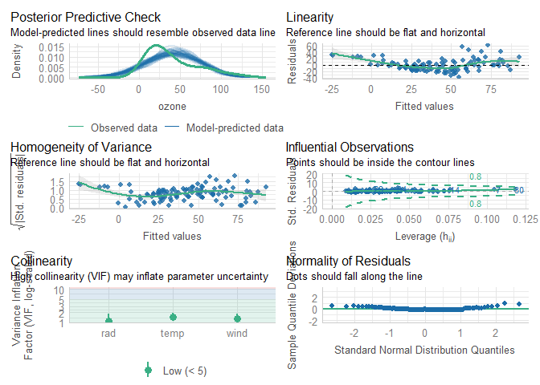
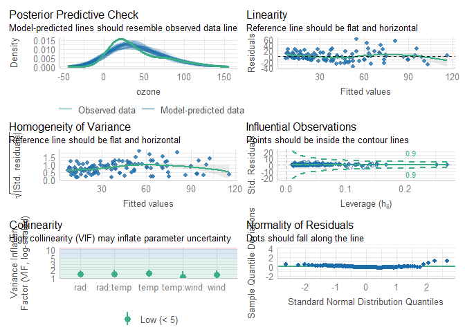
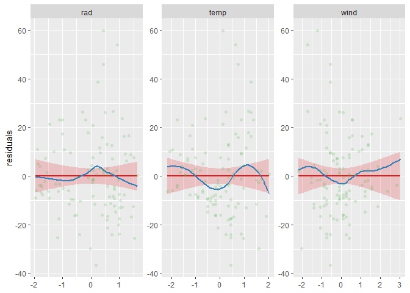
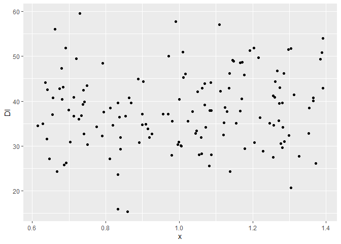
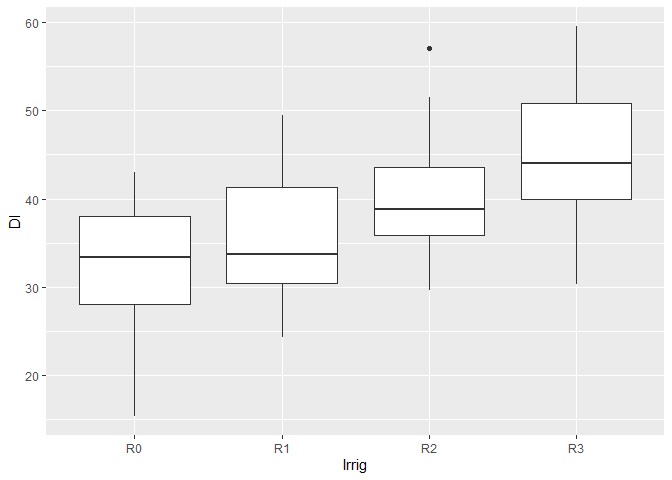
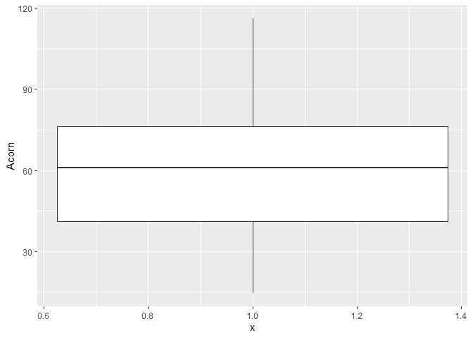
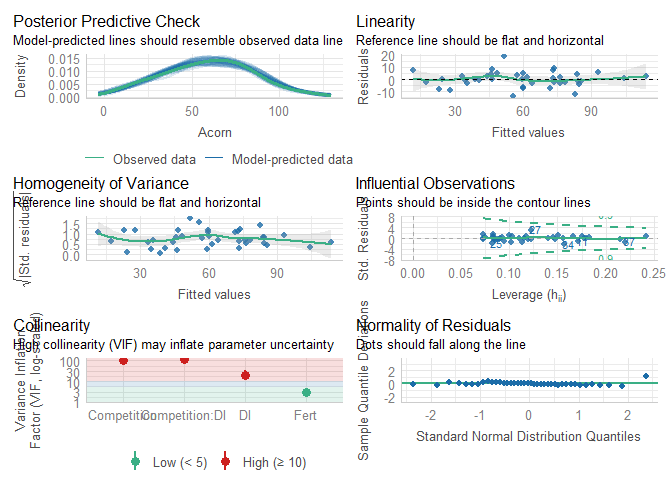

# Análisis de datos: modelos lineales habituales en ecología

Verónica Cruz-Alonso, Enrique Andivia
06/12/2024

- [<span class="toc-section-number">1</span> Objetivos del día
  4](#objetivos-del-día-4)
- [<span class="toc-section-number">2</span> Introducción a los modelos
  de regresión](#introducción-a-los-modelos-de-regresión)
- [<span class="toc-section-number">3</span> Supuestos de los modelos
  lineales](#supuestos-de-los-modelos-lineales)
- [<span class="toc-section-number">4</span> Fundamentos matemáticos de
  una regresión lineal
  simple](#fundamentos-matemáticos-de-una-regresión-lineal-simple)
- [<span class="toc-section-number">5</span> Ajustando modelos lineales
  en R](#ajustando-modelos-lineales-en-r)
  - [<span class="toc-section-number">5.1</span> Regresión lineal
    multiple](#regresión-lineal-multiple)
  - [<span class="toc-section-number">5.2</span> ANOVA (ANalysis Of
    VAriance)](#anova-analysis-of-variance)
  - [<span class="toc-section-number">5.3</span> ANCOVA](#ancova)
- [<span class="toc-section-number">6</span> Modelos lineales
  mixtos](#modelos-lineales-mixtos)
- [<span class="toc-section-number">7</span> Modelos lineales
  generalizados](#modelos-lineales-generalizados)
- [<span class="toc-section-number">8</span> Bibliografía de
  interés](#bibliografía-de-interés)

## Objetivos del día 4

Los objetivos del día de hoy son:

- Aprender los fundamentos de los modelos lineales en R.

- Aprender qué son los modelos generalizados y mixtos y para qué se
  usan.

- Aprender a reportar los resultados de los modelos.

## Introducción a los modelos de regresión

El objetivo de un análisis estadístico es estimar los parámetros del
modelo que conducen al mejor ajuste del mismo a nuestros datos. El mejor
modelo es aquel que explica la mayor variabilidad posible de la variable
respuesta, siempre que los parámetros del modelo sean estadísticamente
significativos. No existe un único modelo sino una gran cantidad de
modelos que se ajustan a nuestros datos en mayor o menor medida. De
entre dos modelos que expliquen la misma variabilidad debemos quedarnos
con el más simple de todos (el más parsimonioso).

> All models are wrong, but some are useful
>
> — George E. P. Box

El **análisis de regresión** se usa para explicar o predecir la relación
lineal entre una variable Y (variable respuesta o dependiente), y una o
más variables explicativas o independientes. Cuando hay una variable
explicativa hablamos de regresión simple y cuando hay varias es
regresión múltiple. Si la(s) variable(s) explicativas son categóricas
estamos ante un análisis de la varianza o ANOVA, que al igual que antes
puede ser unifactorial si solo hay una variable explicativa (one-way
ANOVA) o multifactorial si hay más. Por último, si las variables
explicativas son una combinación de categóricas y continuas estaremos
antes un ANCOVA (análisis de la covarianza) (Cayuela and De la Cruz
2022). Todos estos nombres hacen referencia a tipos de análisis de
regresión que en R se pueden calcular con una única función: `lm()`.

## Supuestos de los modelos lineales

La aplicación de un modelo lineal queda supeditado al cumplimiento de
una serie de supuestos.

- **Independencia**: las observaciones y, por tanto, los residuos del
  modelo deben ser independientes entre sí. Las formas más comunes de
  violar el supuesto de independencia son la **autocorrelación**
  espacial, cuando distintas observaciones están más próximas entre sí
  que otras, y la autocorrelación temporal cuando se realizan distintas
  mediciones de la variable dependiente en los mismos individuos o
  parcelas a lo largo del tiempo. El supuesto de independencia está muy
  relacionado con el diseño del estudio. Se puede lidiar con la
  dependencia de las observaciones promediando el valor de las que sean
  dependientes entre sí, a través de modelos mixtos que tienen en cuenta
  la no independencia sin perder la variabilidad asociada a ella, o con
  modelos autorregresivos.

- **Normalidad**: los modelos lineales asumen una distribución normal de
  los residuos del modelo. El criterio de normalidad se refiere a los
  residuos del modelo y no a la variable dependiente, aunque en gran
  parte la distribución de los residuos viene definida por la
  distribución de la variable dependiente. Por eso, una forma de cumplir
  el supuesto de normalidad es transformar la variable respuesta. Si la
  variable dependiente son unos y ceros (presencia/ausencia o
  vivo/muerto), o bien es un conteo (nº individuos) los residuos no van
  a ser normales. En estos casos específicos utilizaremos modelos
  lineales generalizados.

- **Homocedasticidad**: se asume que la varianza de los residuos es
  homogenea en todo el rango de la variable independiente. Esto implica
  que la varianza residual de nuestro modelo debe ser constante. La
  violación de este supuesto puede hacernos caer en errores de tipo I
  (falsos positivos). Para evaluar este aspecto se representan los
  residuos frente a los valores ajustados por el modelo. Uno de los
  principales problemas que suele haber es que los residuos aumenten
  conforme aumentan los valores ajustados por el modelo. Puede deberse a
  que alguna variable no se ha tenido en cuenta o también a la presencia
  de *outliers* en nuestros datos. Una forma de lidiar con este aspecto
  es transformar la variable respuesta.

- **Linealidad**: la relación entre la variable dependiente y la
  independiente es lineal o puede expresarse como una combinación lineal
  de parámetros.

## Fundamentos matemáticos de una regresión lineal simple

Asumiendo la hipótesis de que *y* se puede explicar como una función
lineal de *x*, podemos expresar *y* como:

$$
y = a + bx
$$

Al parámetro *a* se le denomina **intercepto** y es el valor de la
variable respuesta cuando la variable independiente es igual a cero. Al
parámetro *b* se le denomina **pendiente** y representa cuánto aumenta
la variable respuesta por unidad de la variable independiente. Basta
estimar los parámetros *a* y *b* para conocer el valor de la variable
respuesta para cada valor de la variable independiente.

Para entender cómo se estiman recordemos que los datos de una regresión
son tomados de manera pareada, es decir que en una misma observación
tenemos un dato para la variable respuesta (y<sub>i</sub>) y para la
variable independiente (x<sub>i</sub>). Sin embargo, los parámetros *a*
y *b* son los mismos para todos los pares de datos por lo que a menos
que el modelo prediga con exactitud cada una de las observaciones
tendremos un error asociado al modelo. Dicho **error o residuo**
(𝜀<sub>𝑖</sub>) es la diferencia entre el valor predicho de la variable
respuesta (Ŷ<sub>i</sub>) para un determinado valor de la variable
independiente y el valor real observado de nuestra variable respuesta
(y<sub>i</sub>) en dicha observación. Para cada observación tendremos:

$$
y_{i} = a + bx_{i} + 𝜀_{i}
$$

Los “mejores” parámetros del modelo se estiman mediante **máxima
verosimilitud**, es decir, dados los datos, el valor de los parámetros
será aquel que haga los datos más verosímiles. Si los supuestos de los
modelos lineales se cumplen, la máxima verosimilitud viene dada por el
**método de los mínimos cuadrados.** El término mínimos cuadrados se
refiere a la **suma de los residuos al cuadrado** (RSS - Residual Sum of
Squares). Los mejores parámetros del modelo serán aquellos que minimicen
la suma de los residuos cuadrados del modelo . La RSS representa la
variabilidad que el modelo NO es capaz de explicar.

El **error del modelo** (residuos) es una variable aleatoria que sigue
una distribución normal, de ahí el supuesto de normalidad, con media
igual a cero y varianza 𝜎<sup>2</sup>. El valor de la varianza residual
de la muestra es lo que se denomina **cuadrados medios residuales**
(RMS). La varianza del error estará más cercana a cero cuando las
observaciones estén más cerca de las predicciones. Para calcularla, la
RSS se divide por n-2, calculando una especie de valor *medio* de la
RSS.

$$RMS = \frac{RSS}{n-2}$$ Asociado a los errores del modelo podemos
calcular el grado de ajuste del mismo para lo que se utiliza el
**coeficiente de determinación** (R<sup><sub>2</sub></sup>), que se
define como la fracción de la variabilidad de la variable respuesta
explicada por la variación de la variable independiente. Si la
variabilidad total de la variable respuesta es SSY (la suma de las
diferencias entre y<sub>i</sub> y la media de *y* al cuadrado) y la
parte no explicada por el modelo es RSS, definimos el coeficiente de
determinación como:

$$R^2 = \frac{SSY-RSS}{SSY} $$ Al ser una proporción, el coeficiente de
determinación se define entre 0 y 1, cuanto más se acerque a 1 mayor
será la variabilidad explicada y mejor se ajustará el modelo a los
datos.

Los parámetros del modelo son realmente una estimación de los verdaderos
valores de los parámetros poblacionales. Por ello, estos parámetros
llevan asociados una incertidumbre y se necesita **testar
estadísticamente si los parámetros estimados son estadísticamente
distintos de cero**. Esto es especialmente importante para la pendiente
ya que su significación nos indicaría que hay un efecto de la variable
independiente sobre la variable respuesta. La hipótesis nula es que *b*
no es diferente de cero. La significación de estos parámetros se
comprueba mediante un t-test en la función `lm()` (evalúa la relación
entre cada variable y la variable respuesta mientras se controlan las
demás). Mediante F-ratio con `anova()` se evalúa la relación entre la
variabilidad explicada por el modelo y la variabilidad explicada por esa
variable.

``` r
library(tidyverse)

cars |> 
  ggplot() +
  geom_point(aes(x = speed, y = dist)) +
  labs(x = "Velocidad (millas/h)", y = "Distancia de frenado (pies)")
```


``` r
m_cars <- lm(dist ~ speed, data = cars)

summary(m_cars)
```


    Call:
    lm(formula = dist ~ speed, data = cars)

    Residuals:
        Min      1Q  Median      3Q     Max 
    -29.069  -9.525  -2.272   9.215  43.201 

    Coefficients:
                Estimate Std. Error t value Pr(>|t|)    
    (Intercept) -17.5791     6.7584  -2.601   0.0123 *  
    speed         3.9324     0.4155   9.464 1.49e-12 ***
    ---
    Signif. codes:  0 '***' 0.001 '**' 0.01 '*' 0.05 '.' 0.1 ' ' 1

    Residual standard error: 15.38 on 48 degrees of freedom
    Multiple R-squared:  0.6511,    Adjusted R-squared:  0.6438 
    F-statistic: 89.57 on 1 and 48 DF,  p-value: 1.49e-12

``` r
# Calculamos a mano la bondad de ajuste del modelo:
res <- resid(m_cars)

summary(res)
```

       Min. 1st Qu.  Median    Mean 3rd Qu.    Max. 
    -29.069  -9.525  -2.272   0.000   9.215  43.201 

``` r
RSS <- sum(res^2)
RMS <- RSS/(nrow(cars)-2) 
sqrt(RMS)
```

    [1] 15.37959

``` r
SSY <- sum((cars$dist - mean(cars$dist))^2)
R2 <- (SSY-RSS)/SSY

anova(m_cars) 
```

    Analysis of Variance Table

    Response: dist
              Df Sum Sq Mean Sq F value   Pr(>F)    
    speed      1  21186 21185.5  89.567 1.49e-12 ***
    Residuals 48  11354   236.5                     
    ---
    Signif. codes:  0 '***' 0.001 '**' 0.01 '*' 0.05 '.' 0.1 ' ' 1

``` r
# La tabla ANOVA tiene una serie de columnas que resumen la partición de la suma de cuadrados
# La F se calcula bajo el supuesto de b = 0
# Un p-valor de X quiere decir que X de cada 10 veces obtendremos por azar un F-ratio igual al que hemos obtenido con las observaciones.
```

## Ajustando modelos lineales en R

### Regresión lineal multiple

La regresión lineal múltiple es un modelo lineal con dos o más variables
independientes continuas. El efecto de las variables explicativas sobre
la variable respuesta puede no ser exclusivamente independiente. Pudiera
ser que la relación entre la variable respuesta y una variable
explicativa estuviera modulada por otra variable explicativa y
tendríamos una interacción.

💡La inclusión de variables en el modelo aumenta el número de parámetros
a estimar. De forma general se suele recomendar tener al menos 10
observaciones independientes por parámetro a estimar, aunque como
siempre esto no debe tomarse a raja tabla.

``` r
# install.packages("performance")
library(performance)
# install.packages("")
library(sjPlot)
# install.packages("broom")
library(broom) # https://broom.tidymodels.org/articles/broom.html
library(GGally)

ozono <- read_delim(file = "Ozone.txt", delim = "\t") 
ozono
```

    # A tibble: 110 × 4
         rad  temp  wind ozone
       <dbl> <dbl> <dbl> <dbl>
     1   190    67   7.4    41
     2   118    72   8      36
     3   149    74  12.6    12
     4   313    62  11.5    18
     5   299    65   8.6    23
     6    99    59  13.8    19
     7    19    61  20.1     8
     8   256    69   9.7    16
     9   290    66   9.2    11
    10   274    68  10.9    14
    # ℹ 100 more rows

``` r
ggpairs(ozono |> select(rad, temp, wind, ozone),
        lower = list(continuous = wrap("smooth", method = "loess", color = "darkslategrey", alpha = 0.1)),
        diag = list(continuous = wrap("barDiag")))  
```


``` r
m_ozono <- lm(ozone ~ rad + temp + wind, data = ozono)
summary(m_ozono)
```


    Call:
    lm(formula = ozone ~ rad + temp + wind, data = ozono)

    Residuals:
        Min      1Q  Median      3Q     Max 
    -38.760 -13.268  -1.992   9.971  62.020 

    Coefficients:
                 Estimate Std. Error t value Pr(>|t|)    
    (Intercept) -76.76676   20.85138  -3.682 0.000366 ***
    rad           0.05403    0.02086   2.590 0.010940 *  
    temp          1.74138    0.22842   7.623 1.11e-11 ***
    wind         -2.76591    0.59804  -4.625 1.06e-05 ***
    ---
    Signif. codes:  0 '***' 0.001 '**' 0.01 '*' 0.05 '.' 0.1 ' ' 1

    Residual standard error: 19.03 on 106 degrees of freedom
    Multiple R-squared:  0.6373,    Adjusted R-squared:  0.627 
    F-statistic: 62.08 on 3 and 106 DF,  p-value: < 2.2e-16

``` r
anova(m_ozono)
```

    Analysis of Variance Table

    Response: ozone
               Df Sum Sq Mean Sq F value    Pr(>F)    
    rad         1  13152   13152  36.324 2.462e-08 ***
    temp        1  46531   46531 128.514 < 2.2e-16 ***
    wind        1   7745    7745  21.390 1.063e-05 ***
    Residuals 106  38379     362                      
    ---
    Signif. codes:  0 '***' 0.001 '**' 0.01 '*' 0.05 '.' 0.1 ' ' 1

``` r
# Comprobamos residuos
check_model(m_ozono)
```



``` r
# Comprobamos residuos parciales
plot_model(m_ozono, terms = c("rad", "temp", "wind"), show.data = TRUE, type = "resid")
```


``` r
# Comprobamos colinealidad
check_collinearity(m_ozono)
```

    # Check for Multicollinearity

    Low Correlation

     Term  VIF   VIF 95% CI Increased SE Tolerance Tolerance 95% CI
      rad 1.09 [1.01, 1.86]         1.05      0.91     [0.54, 0.99]
     temp 1.44 [1.21, 1.93]         1.20      0.70     [0.52, 0.83]
     wind 1.33 [1.14, 1.80]         1.15      0.75     [0.55, 0.88]

``` r
# El factor de inflación de la varianza (VIF) proporciona una estimación cuantitativa de la multicolinealidad entre covariables en un análisis de regresión. Este índice mide hasta qué punto la varianza de un coeficiente de regresión se incrementa a causa de la colinealidad. En cuanto a los valores de VIF a partir de los cuales hay que tomar en serio la colinealidad no existe un consenso claro (5 o 10). En caso de alta colinealidad se puede eliminar la variable con un VIF superior y volver a calcular el VIF.

# Modelo con interacciones 

ozono <- ozono |> 
  mutate(rad = as.vector(scale(rad)),
    temp = as.vector(scale(temp)),
    wind = as.vector(scale(wind)))

m_ozono_int <- lm(ozone ~ rad*temp + wind*temp, data = ozono)
summary(m_ozono_int)
```


    Call:
    lm(formula = ozone ~ rad * temp + wind * temp, data = ozono)

    Residuals:
        Min      1Q  Median      3Q     Max 
    -36.749  -9.885  -1.977   8.566  59.868 

    Coefficients:
                Estimate Std. Error t value Pr(>|t|)    
    (Intercept)   36.492      1.792  20.358  < 2e-16 ***
    rad            7.756      1.892   4.101 8.20e-05 ***
    temp          16.552      1.932   8.565 1.06e-13 ***
    wind          -9.810      1.861  -5.272 7.36e-07 ***
    rad:temp       4.824      1.818   2.653 0.009234 ** 
    temp:wind     -6.187      1.602  -3.862 0.000196 ***
    ---
    Signif. codes:  0 '***' 0.001 '**' 0.01 '*' 0.05 '.' 0.1 ' ' 1

    Residual standard error: 16.82 on 104 degrees of freedom
    Multiple R-squared:  0.7219,    Adjusted R-squared:  0.7086 
    F-statistic:    54 on 5 and 104 DF,  p-value: < 2.2e-16

``` r
anova(m_ozono_int)
```

    Analysis of Variance Table

    Response: ozone
               Df Sum Sq Mean Sq F value    Pr(>F)    
    rad         1  13152   13152  46.490 6.224e-10 ***
    temp        1  46531   46531 164.480 < 2.2e-16 ***
    wind        1   7745    7745  27.376 8.737e-07 ***
    rad:temp    1   4739    4739  16.753 8.429e-05 ***
    temp:wind   1   4219    4219  14.912  0.000196 ***
    Residuals 104  29421     283                      
    ---
    Signif. codes:  0 '***' 0.001 '**' 0.01 '*' 0.05 '.' 0.1 ' ' 1

``` r
confint(m_ozono_int)
```

                     2.5 %    97.5 %
    (Intercept)  32.937578 40.046755
    rad           4.005437 11.507317
    temp         12.719685 20.384019
    wind        -13.499787 -6.120223
    rad:temp      1.217851  8.429653
    temp:wind    -9.363888 -3.009754

``` r
# comprobar supuestos
check_model(m_ozono_int)
```



``` r
plot_model(m_ozono_int, terms = c("rad", "temp", "wind"), show.data = TRUE, type = "resid")
```



``` r
# Para representar las predicciones del gráfico

plot_model(m_ozono_int, type = "pred",
  terms = c("temp","rad[90, 270]")) +
  labs(title = "", 
    x = "Temperature", y = "Ozone concentration", color = "Radiation") + 
  theme_bw()
```


``` r
plot_model(m_ozono_int, type = "pred",
  terms = c("temp","wind[7, 13]")) +
  labs(title = "", 
    x = "Temperature", y = "Ozone concentration", color = "Wind") +
  theme_bw()
```


``` r
# Tablas de resultados

tidy(m_ozono_int) 
```

    # A tibble: 6 × 5
      term        estimate std.error statistic  p.value
      <chr>          <dbl>     <dbl>     <dbl>    <dbl>
    1 (Intercept)    36.5       1.79     20.4  4.58e-38
    2 rad             7.76      1.89      4.10 8.20e- 5
    3 temp           16.6       1.93      8.57 1.06e-13
    4 wind           -9.81      1.86     -5.27 7.36e- 7
    5 rad:temp        4.82      1.82      2.65 9.23e- 3
    6 temp:wind      -6.19      1.60     -3.86 1.96e- 4

``` r
tidy(anova(m_ozono_int))
```

    # A tibble: 6 × 6
      term         df  sumsq meansq statistic   p.value
      <chr>     <int>  <dbl>  <dbl>     <dbl>     <dbl>
    1 rad           1 13152. 13152.      46.5  6.22e-10
    2 temp          1 46531. 46531.     164.   3.79e-23
    3 wind          1  7745.  7745.      27.4  8.74e- 7
    4 rad:temp      1  4739.  4739.      16.8  8.43e- 5
    5 temp:wind     1  4219.  4219.      14.9  1.96e- 4
    6 Residuals   104 29421.   283.      NA   NA       

``` r
glance(m_ozono_int)
```

    # A tibble: 1 × 12
      r.squared adj.r.squared sigma statistic  p.value    df logLik   AIC   BIC
          <dbl>         <dbl> <dbl>     <dbl>    <dbl> <dbl>  <dbl> <dbl> <dbl>
    1     0.722         0.709  16.8      54.0 2.26e-27     5  -463.  941.  960.
    # ℹ 3 more variables: deviance <dbl>, df.residual <int>, nobs <int>

### ANOVA (ANalysis Of VAriance)

Al calcular un ANOVA ajustamos un modelo lineal utilizando variables
dummies (es decir, que toman valores de 0 o 1). El modelo ajusta tantas
pendientes como n – 1 niveles del factor existan. El intercepto toma el
valor de la variable respuesta para el nivel de referencia del factor (R
lo identifica por orden alfabético). El valor de los parámetros estimado
para el resto de niveles nos indica la diferencia que existe entre el
valor medio de la variable respuesta para dichos niveles y el del nivel
de referencia.

``` r
# install.packages("emmeans")
library(emmeans)
# Guia de emmeans: https://rvlenth.github.io/emmeans/articles/AQuickStart.html

pinos <- read_delim(file = "RxF_growth.csv", delim = ",",
           col_types = list(Irrig = "f",
             Fert = "f"))

# pinos contiene datos de un experimento en el que se plantaron 144 plántulas de Pinus pinea en un campo abandonado y se sometieron a un experimento factorial con 4 niveles de riego (0, 150, 300 y 600 mm año⁻¹) y 3 tratamientos de fertilización nitrogenada (0, 150 y 300 kg N ha⁻¹) distribuidos aleatoriamente.

# Queremos saber si el incremento en diamétro (DI) estuvo condicionado por la irrigación

pinos
```

    # A tibble: 144 × 5
       Plant Block Irrig Fert     DI
       <dbl> <dbl> <fct> <fct> <dbl>
     1     1     1 R0    F0     27.2
     2     2     1 R0    F0     15.4
     3     3     1 R0    F0     35.0
     4    37     2 R0    F0     28.1
     5    38     2 R0    F0     23.6
     6    39     2 R0    F0     34.3
     7    73     3 R0    F0     34.2
     8    74     3 R0    F0     20.7
     9    75     3 R0    F0     15.9
    10   109     4 R0    F0     30.0
    # ℹ 134 more rows

``` r
# Exploración de las variables

# Outliers

ggplot(pinos) +
  geom_boxplot(aes(y = DI)) 
```


``` r
ggplot(pinos) +
  geom_jitter(aes(y = DI, x = 1)) 
```



``` r
# considero que no hay

# Normalidad y homogeneidad

ggplot(pinos) + #normal
  geom_histogram(aes(x = DI)) 
```


``` r
ggplot(pinos) +
  geom_boxplot(aes(x = Irrig, y = DI)) 
```



``` r
# Ajustamos un modelo lineal

m_pinos <- lm(DI ~ Irrig, data = pinos)
summary(m_pinos)
```


    Call:
    lm(formula = DI ~ Irrig, data = pinos)

    Residuals:
         Min       1Q   Median       3Q      Max 
    -16.8187  -4.3861  -0.7638   5.5471  17.3473 

    Coefficients:
                Estimate Std. Error t value Pr(>|t|)    
    (Intercept)   32.245      1.157  27.873  < 2e-16 ***
    IrrigR1        3.158      1.636   1.931   0.0556 .  
    IrrigR2        7.429      1.636   4.541 1.20e-05 ***
    IrrigR3       12.676      1.636   7.748 1.72e-12 ***
    ---
    Signif. codes:  0 '***' 0.001 '**' 0.01 '*' 0.05 '.' 0.1 ' ' 1

    Residual standard error: 6.941 on 140 degrees of freedom
    Multiple R-squared:  0.3258,    Adjusted R-squared:  0.3114 
    F-statistic: 22.55 on 3 and 140 DF,  p-value: 5.682e-12

``` r
# ¿Qué significa cada parámetro?
# intercept = media del nivel de referencia, variables dummy

pinos <- pinos |> 
  mutate(f1 = fitted(m_pinos))

ggplot(pinos) +
  geom_point(aes(x = f1, y = DI)) +
  labs(y = "Observados", x = "Predichos")
```


``` r
# Tabla del anova

anova(m_pinos)
```

    Analysis of Variance Table

    Response: DI
               Df Sum Sq Mean Sq F value    Pr(>F)    
    Irrig       3 3259.6 1086.53  22.553 5.682e-12 ***
    Residuals 140 6744.8   48.18                      
    ---
    Signif. codes:  0 '***' 0.001 '**' 0.01 '*' 0.05 '.' 0.1 ' ' 1

``` r
# Irrig SumSq / (Irrig SumSq + Residuals SumSq) = R2 
3259.6/(3259.6+6744.8)
```

    [1] 0.3258166

``` r
# Check residuals
x11()
check_model(m_pinos)

# Pero... no hemos acabado
# Una de las principales razones de usar factores es conocer las diferencias entre los niveles del factor

paircomp <- emmeans(m_pinos, specs = pairwise ~ Irrig)
paircomp
```

    $emmeans
     Irrig emmean   SE  df lower.CL upper.CL
     R0      32.2 1.16 140     30.0     34.5
     R1      35.4 1.16 140     33.1     37.7
     R2      39.7 1.16 140     37.4     42.0
     R3      44.9 1.16 140     42.6     47.2

    Confidence level used: 0.95 

    $contrasts
     contrast estimate   SE  df t.ratio p.value
     R0 - R1     -3.16 1.64 140  -1.931  0.2200
     R0 - R2     -7.43 1.64 140  -4.541  0.0001
     R0 - R3    -12.68 1.64 140  -7.748  <.0001
     R1 - R2     -4.27 1.64 140  -2.610  0.0487
     R1 - R3     -9.52 1.64 140  -5.817  <.0001
     R2 - R3     -5.25 1.64 140  -3.207  0.0089

    P value adjustment: tukey method for comparing a family of 4 estimates 

``` r
# Representación del modelo

plot_model(m_pinos, type = "pred", terms = "Irrig", show.data = TRUE, jitter = 0.5, alpha = 0.2) +
  labs(title = "", 
    x = "Tratamiento de riego", y = "Incremento en diámetro") +
  theme_bw()

plot(paircomp, comparison = TRUE) +
  labs(title = "", 
    x = "Tratamiento de riego", y = "Incremento en diámetro") +
  theme_bw()

# Tablas de resultados

tidy(m_pinos)
```

    # A tibble: 4 × 5
      term        estimate std.error statistic  p.value
      <chr>          <dbl>     <dbl>     <dbl>    <dbl>
    1 (Intercept)    32.2       1.16     27.9  5.36e-59
    2 IrrigR1         3.16      1.64      1.93 5.56e- 2
    3 IrrigR2         7.43      1.64      4.54 1.20e- 5
    4 IrrigR3        12.7       1.64      7.75 1.72e-12

``` r
tidy(anova(m_pinos))
```

    # A tibble: 2 × 6
      term         df sumsq meansq statistic   p.value
      <chr>     <int> <dbl>  <dbl>     <dbl>     <dbl>
    1 Irrig         3 3260. 1087.       22.6  5.68e-12
    2 Residuals   140 6745.   48.2      NA   NA       

``` r
glance(m_pinos)
```

    # A tibble: 1 × 12
      r.squared adj.r.squared sigma statistic  p.value    df logLik   AIC   BIC
          <dbl>         <dbl> <dbl>     <dbl>    <dbl> <dbl>  <dbl> <dbl> <dbl>
    1     0.326         0.311  6.94      22.6 5.68e-12     3  -481.  973.  987.
    # ℹ 3 more variables: deviance <dbl>, df.residual <int>, nobs <int>

### ANCOVA

``` r
encinas <- read_delim(file = "bellotas.csv", delim = ",",
           col_types = list(Competition = "f",
             Fert = "f"))

# encinas contiene información de 40 árboles adultos de encina (Quercus ilex). En alrededor de la mitad de ellos se eliminaron todas las plantas competidoras (herbáceas), dando lugar a dos tratamientos de competencia (sí y no). La mitad de las encinas en cada tratamiento de competencia se sometieron a fertilización durante tres años, mientras que la otra mitad se dejó como control. Después de 3 años, se midió el diámetro y se calculó el crecimiento como el aumento en diámetro (DI). La variable de respuesta fue la producción de bellotas por árbol.

# El nombre "Acorn " tiene un espacio
encinas <- encinas |> 
  rename(Acorn = `Acorn `)

# La hipótesis es que aquellos árboles que crezcan más también mostrarán una mayor producción de bellotas y que esta relación dependerá de la disponibilidad de recursos, es decir, más nutrientes y agua debido a la fertilización y la falta de competencia.

# Comprobaciones: outliers, normalidad, linealidad

ggplot(encinas) +
  geom_boxplot(aes(y = Acorn, x = 1)) 
```



``` r
ggplot(encinas) +
  geom_boxplot(aes(y = Acorn, x = Fert))
```


``` r
ggplot(data = encinas) +
  geom_boxplot(aes(y = Acorn, x = Competition))
```


``` r
ggplot(encinas) +
  geom_point(aes(x = Acorn, y = DI))
```


``` r
ggplot(encinas) +
  geom_histogram(aes(x = Acorn), bins = 10) 
```


``` r
# Ajustamos el modelo

m_encinas <- lm(Acorn ~ Fert * DI + Competition * DI, data = encinas)

summary(m_encinas)
```


    Call:
    lm(formula = Acorn ~ Fert * DI + Competition * DI, data = encinas)

    Residuals:
         Min       1Q   Median       3Q      Max 
    -13.9525  -3.1552   0.2527   3.5782  19.1172 

    Coefficients:
                      Estimate Std. Error t value Pr(>|t|)    
    (Intercept)       -53.0252    25.5490  -2.075   0.0456 *  
    FertFertilized    -26.9843    23.3641  -1.155   0.2562    
    DI                 18.0298     3.7641   4.790 3.21e-05 ***
    Competitionyes    -41.4797    21.0138  -1.974   0.0566 .  
    FertFertilized:DI  -0.9199     3.3445  -0.275   0.7850    
    DI:Competitionyes   5.8043     2.9130   1.993   0.0544 .  
    ---
    Signif. codes:  0 '***' 0.001 '**' 0.01 '*' 0.05 '.' 0.1 ' ' 1

    Residual standard error: 6.651 on 34 degrees of freedom
    Multiple R-squared:  0.9367,    Adjusted R-squared:  0.9273 
    F-statistic: 100.6 on 5 and 34 DF,  p-value: < 2.2e-16

``` r
anova(m_encinas)
```

    Analysis of Variance Table

    Response: Acorn
                   Df  Sum Sq Mean Sq  F value    Pr(>F)    
    Fert            1  2910.4  2910.4  65.7946 1.852e-09 ***
    DI              1 19148.9 19148.9 432.8892 < 2.2e-16 ***
    Competition     1     2.9     2.9   0.0650   0.80034    
    Fert:DI         1     2.0     2.0   0.0443   0.83458    
    DI:Competition  1   175.6   175.6   3.9704   0.05438 .  
    Residuals      34  1504.0    44.2                       
    ---
    Signif. codes:  0 '***' 0.001 '**' 0.01 '*' 0.05 '.' 0.1 ' ' 1

``` r
check_model(m_encinas)
```


``` r
# ¿Quitaríais la interacción Fert * DI?

m_encinas2 <- lm(Acorn ~ Fert + Competition * DI, data = encinas)

summary(m_encinas2)
```


    Call:
    lm(formula = Acorn ~ Fert + Competition * DI, data = encinas)

    Residuals:
         Min       1Q   Median       3Q      Max 
    -14.1955  -2.9304   0.1738   3.7067  18.9633 

    Coefficients:
                      Estimate Std. Error t value Pr(>|t|)    
    (Intercept)        -49.566     21.943  -2.259   0.0302 *  
    FertFertilized     -33.334      3.545  -9.404 4.13e-11 ***
    Competitionyes     -41.915     20.676  -2.027   0.0503 .  
    DI                  17.506      3.203   5.465 3.92e-06 ***
    Competitionyes:DI    5.778      2.873   2.011   0.0520 .  
    ---
    Signif. codes:  0 '***' 0.001 '**' 0.01 '*' 0.05 '.' 0.1 ' ' 1

    Residual standard error: 6.563 on 35 degrees of freedom
    Multiple R-squared:  0.9365,    Adjusted R-squared:  0.9293 
    F-statistic: 129.1 on 4 and 35 DF,  p-value: < 2.2e-16

``` r
anova(m_encinas2)
```

    Analysis of Variance Table

    Response: Acorn
                   Df  Sum Sq Mean Sq  F value    Pr(>F)    
    Fert            1  2910.4  2910.4  67.5794 1.094e-09 ***
    Competition     1   103.3   103.3   2.3992   0.13040    
    DI              1 19048.5 19048.5 442.2996 < 2.2e-16 ***
    Competition:DI  1   174.2   174.2   4.0459   0.05203 .  
    Residuals      35  1507.3    43.1                       
    ---
    Signif. codes:  0 '***' 0.001 '**' 0.01 '*' 0.05 '.' 0.1 ' ' 1

``` r
check_model(m_encinas2)
```



``` r
# Interpretación de los parámetros

# Figura con la relación entre las variables continuas para cada nivel del tratamiento
plot_model(m_encinas2, type = "pred", terms = c("DI","Competition")) +
  labs(title = "", 
    x = "Crecimiento", y = "Producción de bellotas", color = "Competencia") +
  theme_bw()
```


## Modelos lineales mixtos

Los modelos mixtos estiman parámetros (interceptos o pendientes) que
varían según unos niveles de agregación especificados en vez de
considerarse plenamente independientes. Ahora el intercepto *a* o la
pendiente *b* van a seguir una distribución normal que depende de otro/s
predictor/es:

$$
a_{j} \sim N(𝜇_{j}, 𝜎^2)\\
𝜇_{j}=𝛾+𝛿×predictor_{j}
$$

Este tipo de modelos es muy útil para modelizar datos estructurados en
el espacio o en el tiempo (medidas repetidas) a la vez que permiten
aprovechar todos los datos. No se recomienda ajustar modelos mixtos
cuando hay menos de 5-6 niveles del factor y 10-20 observaciones por
nivel (Crawley 2007; Bolker et al. 2009).

💡Si te interesan los modelos mixtos, puedes leer el capítulo
*Multilevel linear models: the basics* de Gelman and Hill (2006).

``` r
# install.packages("glmmTMB")
library(glmmTMB)

# install.packages("broom.mixed")
library(broom.mixed)

library(palmerpenguins)

# Un solo grupo de datos

lm(flipper_length_mm ~ body_mass_g, data = penguins)
```


    Call:
    lm(formula = flipper_length_mm ~ body_mass_g, data = penguins)

    Coefficients:
    (Intercept)  body_mass_g  
      136.72956      0.01528  

``` r
# Sin agrupamiento: un intercepto independiente por grupo.

lm(flipper_length_mm ~ body_mass_g + factor(year), data = penguins)
```


    Call:
    lm(formula = flipper_length_mm ~ body_mass_g + factor(year), 
        data = penguins)

    Coefficients:
         (Intercept)       body_mass_g  factor(year)2008  factor(year)2009  
           134.48739           0.01513           3.76753           4.62878  

``` r
# Con agrupamiento parcial: interceptos interrelacionados

glmmTMB(flipper_length_mm ~ body_mass_g + (1|year), data = penguins)
```

    Formula:          flipper_length_mm ~ body_mass_g + (1 | year)
    Data: penguins
          AIC       BIC    logLik  df.resid 
     2279.361  2294.700 -1135.680       338 
    Random-effects (co)variances:

    Conditional model:
     Groups   Name        Std.Dev.
     year     (Intercept) 1.907   
     Residual             6.629   

    Number of obs: 342 / Conditional model: year, 3

    Dispersion estimate for gaussian family (sigma^2): 43.9 

    Fixed Effects:

    Conditional model:
    (Intercept)  body_mass_g  
      137.23098      0.01514  

``` r
# Ojo, esto es solo un ejemplo. No se recomienda ajustar modelos mixtos cuando hay menos de 5-6 niveles del factor. 

# Ajustamos modelo mixto

ggplot(penguins, aes(x = body_mass_g, y = flipper_length_mm, color = factor(year))) +
  geom_point(alpha = 0.5) +
  geom_smooth(method = "lm")
```


``` r
m_mixto <- glmmTMB(flipper_length_mm ~ body_mass_g + (1|year), data = penguins)

summary(m_mixto)
```

     Family: gaussian  ( identity )
    Formula:          flipper_length_mm ~ body_mass_g + (1 | year)
    Data: penguins

         AIC      BIC   logLik deviance df.resid 
      2279.4   2294.7  -1135.7   2271.4      338 

    Random effects:

    Conditional model:
     Groups   Name        Variance Std.Dev.
     year     (Intercept)  3.638   1.907   
     Residual             43.946   6.629   
    Number of obs: 342, groups:  year, 3

    Dispersion estimate for gaussian family (sigma^2): 43.9 

    Conditional model:
                 Estimate Std. Error z value Pr(>|z|)    
    (Intercept) 1.372e+02  2.213e+00   62.02   <2e-16 ***
    body_mass_g 1.514e-02  4.489e-04   33.73   <2e-16 ***
    ---
    Signif. codes:  0 '***' 0.001 '**' 0.01 '*' 0.05 '.' 0.1 ' ' 1

``` r
check_model(m_mixto)
```


``` r
tidy(m_mixto)
```

    # A tibble: 4 × 8
      effect   component group    term       estimate std.error statistic    p.value
      <chr>    <chr>     <chr>    <chr>         <dbl>     <dbl>     <dbl>      <dbl>
    1 fixed    cond      <NA>     (Intercep… 137.      2.21          62.0  0        
    2 fixed    cond      <NA>     body_mass…   0.0151  0.000449      33.7  1.79e-249
    3 ran_pars cond      year     sd__(Inte…   1.91   NA             NA   NA        
    4 ran_pars cond      Residual sd__Obser…   6.63   NA             NA   NA        

``` r
plot_model(m_mixto, terms = c("body_mass_g"), show.data = TRUE, type = "pred")
```


``` r
plot_model(m_mixto, terms = c("year"), show.data = TRUE, type = "re")
```


``` r
# + (1 | group) varian interceptos
# + (1 + x | group) varian interceptos y pendientes
# + (1 | group/subgroup) varian interceptos anidados
# + (1 | group1) + (1 | group2) # varian interceptos según 2 grupos independientes
# + (1 + x | group1) + (1 + x | group2) # varian interceptos y pendientes según dos grupos
```

## Modelos lineales generalizados

Los residuos dependen en gran medida de la naturaleza de la variable
respuesta. ¿Que ocurre cuando no son normales ni la varianza homogénea?
En ecología esto ocurre a menudo con variables binarias (0/1; datos de
supervivencia, presencia-ausencia, sexo, etc.) y con conteos (0, 1, 2,
3…; nº de individiuos, nº de avistamientos, etc.).

``` r
library(titanic)

titanic <- titanic_train |> 
  mutate(Pclass = factor(Pclass))


m_lin <- lm(Survived ~ Pclass, data = titanic)

hist(resid(m_lin))
```


Las **funciones de enlace** sirven para linealizar la relación entre la
variable respuesta y la independiente. Para cada distribución de la
variable respuesta y, por tanto de sus residuos, hay funciones de enlace
por defecto (canónicas).


``` r
# install.packages("DHARMa")
library(DHARMa)

ggplot(titanic) +
  geom_count(aes(x = Pclass, y = Survived))
```


``` r
m_binomial <- glmmTMB(Survived ~ Pclass, data = titanic, family = "binomial")

summary(m_binomial)
```

     Family: binomial  ( logit )
    Formula:          Survived ~ Pclass
    Data: titanic

         AIC      BIC   logLik deviance df.resid 
      1089.1   1103.5   -541.6   1083.1      888 


    Conditional model:
                Estimate Std. Error z value Pr(>|z|)    
    (Intercept)   0.5306     0.1409   3.766 0.000166 ***
    Pclass2      -0.6394     0.2041  -3.133 0.001731 ** 
    Pclass3      -1.6704     0.1759  -9.496  < 2e-16 ***
    ---
    Signif. codes:  0 '***' 0.001 '**' 0.01 '*' 0.05 '.' 0.1 ' ' 1

``` r
# La estimación de los parámetros (= probabilidad de supervivencia) está en escala logit. logit(p) = ln(p / (1-p))

# Intercepto: probabilidad de supervivencia del nivel de referencia (primera clase)

co_binomial <- fixef(m_binomial)
plogis(co_binomial[[1]][1])
```

    (Intercept) 
      0.6296297 

``` r
titanic |> 
  group_by(Pclass) |> 
  mutate(n_class = n()) |> 
  group_by(Pclass, n_class, Survived) |> 
  summarise(n_sur = n()) |> 
  mutate(per_sur = n_sur/n_class)
```

    # A tibble: 6 × 5
    # Groups:   Pclass, n_class [3]
      Pclass n_class Survived n_sur per_sur
      <fct>    <int>    <int> <int>   <dbl>
    1 1          216        0    80   0.370
    2 1          216        1   136   0.630
    3 2          184        0    97   0.527
    4 2          184        1    87   0.473
    5 3          491        0   372   0.758
    6 3          491        1   119   0.242

``` r
# Para el resto de parámetros:

plogis(co_binomial[[1]][1]+co_binomial[[1]][2])
```

    (Intercept) 
      0.4728261 

``` r
plot_model(m_binomial, type = "pred")
```


``` r
tidy(m_binomial)
```

    # A tibble: 3 × 7
      effect component term        estimate std.error statistic  p.value
      <chr>  <chr>     <chr>          <dbl>     <dbl>     <dbl>    <dbl>
    1 fixed  cond      (Intercept)    0.531     0.141      3.77 1.66e- 4
    2 fixed  cond      Pclass2       -0.639     0.204     -3.13 1.73e- 3
    3 fixed  cond      Pclass3       -1.67      0.176     -9.50 2.19e-21

``` r
simulateResiduals(m_binomial, plot = TRUE)
```


    Object of Class DHARMa with simulated residuals based on 250 simulations with refit = FALSE . See ?DHARMa::simulateResiduals for help. 
     
    Scaled residual values: 0.5820151 0.8080241 0.9228156 0.9842659 0.2333578 0.4973875 0.1898462 0.1908719 0.9960875 0.7314862 0.9679369 0.9849238 0.3600107 0.3893774 0.4193544 0.6189507 0.3593321 0.5994035 0.2163067 0.9662837 ...

``` r
# DHARMa simula residuos utilizando las predicciones del modelo para generar múltiples conjuntos simulados de valores de respuesta, basándose en la distribución estadística asumida, en este caso y ~ binomial(n, p). Los residuos de DHARMa son redisuos simulados entre el nº de simulaciones, lo que hace que tome valores entre 0 y 1 a lo largo de toda la variable predictora.

# Sobredispersión: varianza residual entre grados de libertad de la varianza residual. Debería estar en torno a uno. Zuur et al. 2013 (A beginner’s guide to GLM and GLMM with R. A frequentist and Bayesian persperctive for ecologists.)

e <- resid(m_binomial, type = "pearson")
n <- nrow(m_binomial$frame)
p <- length(fixef(m_binomial))
sum(e^2)/(n-p)
```

    [1] 1.003378

``` r
check_overdispersion(m_binomial)
```

    # Overdispersion test

     dispersion ratio = 1.001
              p-value = 0.952

## Bibliografía de interés

<div id="refs" class="references csl-bib-body hanging-indent"
entry-spacing="0">

<div id="ref-bolker2009" class="csl-entry">

Bolker, Benjamin M., Mollie E. Brooks, Connie J. Clark, Shane W. Geange,
John R. Poulsen, M. Henry H. Stevens, and Jada-Simone S. White. 2009.
“Generalized Linear Mixed Models: A Practical Guide for Ecology and
Evolution.” *Trends in Ecology & Evolution* 24 (3): 127–35.
<https://doi.org/10.1016/j.tree.2008.10.008>.

</div>

<div id="ref-cayuela2022" class="csl-entry">

Cayuela, Luis, and Marcelino De la Cruz. 2022. *Análisis de Datos
Ecológicos En r*. MundiPrensa.

</div>

<div id="ref-crawley2007" class="csl-entry">

Crawley, Michael J. 2007. *The r Book.* Chichester, UK: Wiley.

</div>

<div id="ref-gelman2006" class="csl-entry">

Gelman, Andrew, and Jennifer Hill. 2006. *Data Analysis Using Regression
and Multilevel/Hierarchical Models*. Analytical Methods for Social
Research. Cambridge: Cambridge University Press.

</div>

</div>
