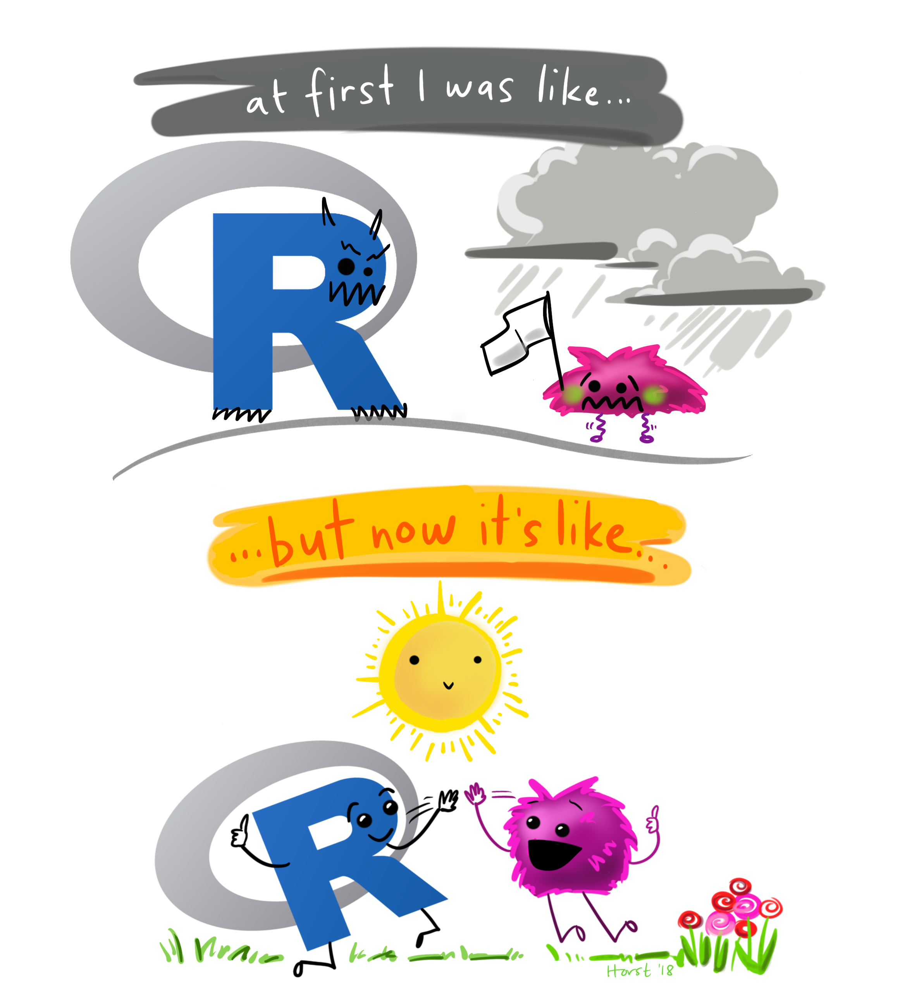

# Ciencia de datos en R


Julen Astigarraga and Verónica Cruz-Alonso
22/09/2024

- [<span class="toc-section-number">1</span> Quiénes
  somos](#quiénes-somos)
- [<span class="toc-section-number">2</span>
  Presentación](#presentación)
- [<span class="toc-section-number">3</span> Estructura del
  curso](#estructura-del-curso)
- [<span class="toc-section-number">4</span> Dinámica del
  curso](#dinámica-del-curso)
- [<span class="toc-section-number">5</span> Objetivos del día
  1](#objetivos-del-día-1)
- [<span class="toc-section-number">6</span> Conceptos
  básicos](#conceptos-básicos)
- [<span class="toc-section-number">7</span> Comenzando a trabajar en
  R](#comenzando-a-trabajar-en-r)
  - [<span class="toc-section-number">7.1</span> El espacio de
    trabajo](#el-espacio-de-trabajo)
    - [<span class="toc-section-number">7.1.1</span>
      Ejercicio](#ejercicio)
  - [<span class="toc-section-number">7.2</span> Instalar y cargar
    paquetes](#instalar-y-cargar-paquetes)
  - [<span class="toc-section-number">7.3</span> Operaciones aritméticas
    (R como calculadora)](#operaciones-aritméticas-r-como-calculadora)
- [<span class="toc-section-number">8</span> Objetos de
  R](#objetos-de-r)
  - [<span class="toc-section-number">8.1</span> Nombramiento de
    objetos](#nombramiento-de-objetos)
  - [<span class="toc-section-number">8.2</span> Tipos de
    objetos](#tipos-de-objetos)
    - [<span class="toc-section-number">8.2.1</span>
      Vectores](#vectores)
    - [<span class="toc-section-number">8.2.2</span>
      Ejercicio](#ejercicio-1)
    - [<span class="toc-section-number">8.2.3</span>
      Matrices](#matrices)
    - [<span class="toc-section-number">8.2.4</span> Bases de datos
      (data.frame)](#bases-de-datos-dataframe)
    - [<span class="toc-section-number">8.2.5</span> Listas](#listas)
  - [<span class="toc-section-number">8.3</span>
    Indexación](#indexación)
    - [<span class="toc-section-number">8.3.1</span>
      Ejercicio](#ejercicio-2)
  - [<span class="toc-section-number">8.4</span> Tidyverse](#tidyverse)
  - [<span class="toc-section-number">8.5</span> ¿Quién responde a mis
    dudas?](#quién-responde-a-mis-dudas)

## Quiénes somos

Verónica Cruz-Alonso (veronica.cral@gmail.com) y Julen Astigarraga
(julenastigarraga@gmail.com). Coordinamos el [grupo de trabajo de
Ecoinformática](https://ecoinfaeet.github.io/website/index.html) de la
Asociación Española de Ecología Terrestre. En
[DatSciR](https://github.com/DatSciR) publicamos los materiales de los
cursos que impartimos.

Y vosotros ¿quiénes sois?

<https://www.menti.com/alpvk2yr4cao>

¿Y qué es R y de dónde procede?

[R es un lenguaje y un entorno para la computación estadística y
gráfica](https://www.r-project.org/about.html)

[Un poco de historia de R contada por Jumping
Rivers](https://www.jumpingrivers.com/misc/timeline/)

## Presentación

En este curso exploraremos tanto los fundamentos teóricos como las
aplicaciones prácticas de la ciencia de datos en R. Abordaremos desde
tareas comunes con las que nos enfrentamos en nuestro día a día, como la
limpieza y transformación de datos, hasta nociones más avanzadas de
visualización y programación. Además, aprenderemos a utilizar
herramientas para generar documentos reproducibles y colaborativos.
Durante el curso, combinaremos la teoría con la práctica, adaptando las
lecciones a los problemas específicos de cada asistente, los cuales irán
evolucionando día a día.

El objetivo principal es que tanto aquellos con conocimientos básicos en
ciencia de datos como aquellos con un nivel más avanzado puedan
beneficiarse y llevar consigo nuevos aprendizajes al finalizar el curso.


## Estructura del curso

<table>
<colgroup>
<col style="width: 43%" />
<col style="width: 56%" />
</colgroup>
<thead>
<tr class="header">
<th>Bloques</th>
<th>Contenido</th>
</tr>
</thead>
<tbody>
<tr class="odd">
<td>Organizar datos: el día a día</td>
<td><p>Introducción a la programación en R</p>
<p>Tidyverse</p>
<p>Importar, filtrar, seleccionar, transformar, unir y exportar
datos</p></td>
</tr>
<tr class="even">
<td>Visualización: contando historias</td>
<td><p>Fundamentos de visualización</p>
<p>Bases: gráficos por capas</p>
<p>Visualización avanzada</p>
<p>Introducción a la creación de mapas</p></td>
</tr>
<tr class="odd">
<td>Programación: aprendiendo a programar con funciones</td>
<td><p>Funciones</p>
<p>Estilo de código</p>
<p>Iteraciones</p>
<p>Programación funcional</p></td>
</tr>
<tr class="even">
<td>Comunicación: generando documentos reproducibles</td>
<td><p>Introducción a R Markdown</p>
<p>Introducción a Quarto</p>
<p>R Markdown vs Quarto</p>
<p>Trabajos reproducibles</p></td>
</tr>
<tr class="odd">
<td>Colaboración: trabajando en equipo</td>
<td><p>Introducción a Git</p>
<p>Introducción a GitHub</p>
<p>Flujo de trabajo en Git y GitHub</p>
<p>Trabajos colaborativos</p></td>
</tr>
</tbody>
</table>

## Dinámica del curso

Cada día combinaremos teoría con ejercicios. Idealmente, el cuarto y
quinto día tendremos tiempo para que cada uno trabaje con sus propios
datos. Todos los apuntes y ejercicios resueltos estarán disponibles en
el [repositorio de GitHub del
curso](https://github.com/DatSciR/ciencia_datos). Si alguien tiene
alguna duda o sugerencia, nos puede contactar por correo electrónico o
publicarlo en las [discusiones del repositorio de
GitHub](https://github.com/DatSciR/ciencia_datos/discussions/2) ¡así
aprenderemos entre todos! 😉



## Objetivos del día 1

- Aprender conceptos básicos de la programación en R.

- Aprender funciones básicas que nos permitan importar, explorar,
  limpiar, transformar y manejar datos.

- Aprender estilos de código que facilitan su comprensión (📝)

## Conceptos básicos

- R: lenguaje de programación dinámico (se interpreta el código en el
  momento que se ejecuta).

- RStudio: entorno de desarrollo integrado para programar en R. Tiene
  cuatro zonas diferenciadas: el editor de código, la consola (donde se
  ejecuta el código), el navegador del espacio de trabajo (con el
  entorno –*environment-* y el historial de comandos) y el mix de abajo
  a la derecha (Archivos, Gráficos, Paquetes, Ayuda).

- Objetos: cualquier elemento almacenado con un nombre específico.
  Pueden ser de muchos tipos: `numeric`, `integer`, `logical`,
  `data.frame`, `SpatVector`, etc.

- Funciones: objetos de R que toman un vector de entrada y dan como
  resultado otro vector haciendo una acción concreta (funcionalidad
  específica). Son los *bloques de construcción* fundamentales en
  cualquier script de R que es un lenguaje funcional.


> Para comprender la computación en R, resultan útiles dos lemas:
>
> \- Todo lo que existe es un objeto.
>
> \- Todo lo que sucede es una llamada a función.
>
> — John Chambers ([Advanced R](https://adv-r.hadley.nz/index.html))

- Paquetes o librerias: contienen funciones reutilizables, documentación
  sobre cómo usarlas y datos de ejemplo. Son las unidades fundamentales
  de código reproducible en R.

- CRAN: the Comprehensive R Archive Network.

## Comenzando a trabajar en R

### El espacio de trabajo

El directorio de trabajo es la carpeta de nuestro ordenador donde
estamos trabajando.

``` r
getwd() # saber directorio de trabajo 
setwd("C:/Users/veruk/Desktop/Disco/curso_ciencia_datos") # ojo con la ruta / o \\
```

No es recomendable establecer el directorio de trabajo manualmente
porque el trabajo deja de ser reproducible. Es mejor crear desde el
principio un proyecto en R ligado a un directorio relativo que contenga
todos los datos de entrada, los scripts y los resultados del script. Al
abrir el proyecto, se sincroniza con pestaña Files.

💡Para crear un proyecto: Archivo \> Nuevo proyecto

#### Ejercicio

Crea un proyecto para el curso de de ciencia de datos

### Instalar y cargar paquetes

💡Para ejecutar un comando: Ctrl + Enter (Ctrl + R)

``` r
# install.packages("tidyverse", dep = T) # dep = T significa instalar dependencias

library(tidyverse)
```

    Warning: package 'ggplot2' was built under R version 4.3.3

    Warning: package 'tidyr' was built under R version 4.3.3

    Warning: package 'readr' was built under R version 4.3.2

    Warning: package 'purrr' was built under R version 4.3.2

    Warning: package 'dplyr' was built under R version 4.3.2

    Warning: package 'stringr' was built under R version 4.3.2

    Warning: package 'lubridate' was built under R version 4.3.2

    ── Attaching core tidyverse packages ──────────────────────── tidyverse 2.0.0 ──
    ✔ dplyr     1.1.4     ✔ readr     2.1.5
    ✔ forcats   1.0.0     ✔ stringr   1.5.1
    ✔ ggplot2   3.5.0     ✔ tibble    3.2.1
    ✔ lubridate 1.9.3     ✔ tidyr     1.3.1
    ✔ purrr     1.0.2     
    ── Conflicts ────────────────────────────────────────── tidyverse_conflicts() ──
    ✖ dplyr::filter() masks stats::filter()
    ✖ dplyr::lag()    masks stats::lag()
    ℹ Use the conflicted package (<http://conflicted.r-lib.org/>) to force all conflicts to become errors

``` r
?tidyverse
```

    starting httpd help server ... done

``` r
?select
```

### Operaciones aritméticas (R como calculadora)

``` r
5 + 6
```

    [1] 11

``` r
5 * 6
```

    [1] 30

``` r
60 / 4
```

    [1] 15

``` r
5 + 4 - 2
```

    [1] 7

``` r
5 + 4 * 5
```

    [1] 25

``` r
(5 + 4) * 5
```

    [1] 45

``` r
log(10) # logaritmo neperiano 
```

    [1] 2.302585

``` r
log10(10) 
```

    [1] 1

``` r
exp(1) 
```

    [1] 2.718282

``` r
3 ^ 2 
```

    [1] 9

``` r
3 ^ 2 / 3 
```

    [1] 3

``` r
sqrt(16) 
```

    [1] 4

``` r
pi 
```

    [1] 3.141593

``` r
sin(pi / 2) # en radianes 
```

    [1] 1

``` r
cos(pi / 2)
```

    [1] 6.123032e-17

``` r
tan(pi / 2)
```

    [1] 1.633124e+16

``` r
asin(1) * 2
```

    [1] 3.141593

``` r
acos(1)
```

    [1] 0

## Objetos de R

### Nombramiento de objetos

Al asignar un nombre a un objeto podemos llamarlos siempre que
necesitemos a lo largo del script. No es necesario guardar (exportar) la
mayoría de los objetos que tenemos en el entorno de trabajo de R a
nuestro ordenador, lo importante es conservar el script con el que se
generan.

``` r
x <- 4.5 # shortcut para la flecha de asignación Alt + "-" 
y <- "objeto" # si el objeto contiene letras, usar comillas 
class(x) # función para ver de que clase es nuestro objeto 
```

    [1] "numeric"

``` r
class(y) 
```

    [1] "character"

``` r
x # Llamar al vector para saber su valor 
```

    [1] 4.5

``` r
y
```

    [1] "objeto"

📝Los nombre de los objetos deben ser descriptivos y no pueden contener
símbolos especiales (`^`, `!`, `$`, `@`, `+`, `-`, `/`, `*`).

📝R es sensible a las mayúsculas. Mejor no usarlas.

### Tipos de objetos

#### Vectores

Un vector es la estructura de datos más sencilla en R. Un vector es una
colección de uno o más datos del mismo tipo.

``` r
v1 <- c(2.4, 4, 6, 3.2) # si quiero asignar mas de un valor uso "c" (concatenar) 
v1 
```

    [1] 2.4 4.0 6.0 3.2

``` r
v1 * 100 # puedo operar con los vectores 
```

    [1] 240 400 600 320

``` r
log(v1)
```

    [1] 0.8754687 1.3862944 1.7917595 1.1631508

``` r
v2 <- c(1, 3, 4, 8) # pero también entre vectores 
v1 + v2
```

    [1]  3.4  7.0 10.0 11.2

``` r
v3 <- v1 - v2 
v3
```

    [1]  1.4  1.0  2.0 -4.8

``` r
mean(x = v2) # funciones ya programadas 
```

    [1] 4

``` r
# ?mean # ayuda de funciones
sd(v2) 
```

    [1] 2.94392

``` r
length(v2) # n vector 
```

    [1] 4

``` r
max(v2) 
```

    [1] 8

``` r
min(v2)
```

    [1] 1

``` r
# funciones que facilitan la creación de vectores
rep(x = 1, times = 4) 
```

    [1] 1 1 1 1

``` r
1:10 # dos puntos de a a b 
```

     [1]  1  2  3  4  5  6  7  8  9 10

``` r
seq(from = 1, to = 20, by = 2) 
```

     [1]  1  3  5  7  9 11 13 15 17 19

``` r
c(v1, v2) 
```

    [1] 2.4 4.0 6.0 3.2 1.0 3.0 4.0 8.0

``` r
c(v1, rep(0, 3), v1)
```

     [1] 2.4 4.0 6.0 3.2 0.0 0.0 0.0 2.4 4.0 6.0 3.2

#### Ejercicio

- Elije un número y multiplicalo por 3

- Crea un objeto que contenga 100 valores entre 1900 y 2000

- Suma un número a tu objeto

- Multiplica tu objeto por sí mismo

- Crea un único objeto que contenga el número 5 repetido 9 veces junto
  con una secuencia de 5 a 50 cada 5 elementos

- ¿Cuál es la longitud del objeto anterior?

Para crear vectores se pueden usar otras estrategias como las que tenéis
recogidas a continuación.

``` r
rep(x = 1, times = 4) 
```

    [1] 1 1 1 1

``` r
rep(1:4, times = 2) 
```

    [1] 1 2 3 4 1 2 3 4

``` r
rep(1:4, each = 2) 
```

    [1] 1 1 2 2 3 3 4 4

``` r
rep(1:4, times = 1:4)
```

     [1] 1 2 2 3 3 3 4 4 4 4

``` r
rep(x = c("gato", "perro", "pez"), times = c(5, 3, 1))
```

    [1] "gato"  "gato"  "gato"  "gato"  "gato"  "perro" "perro" "perro" "pez"  

``` r
rnorm(10, mean = 4, sd = 2.2)
```

     [1] 10.513004  1.275830  4.847018  1.142788  7.443501  6.982390  4.215901
     [8]  1.319265  3.909487  5.206153

#### Matrices

Las matrices pueden ser descritas como vectores multidimensionales. Al
igual que un vector, únicamente pueden contener datos de un sólo tipo,
pero además de largo, tienen más dimensiones.

``` r
mivector <- sample(x = 1:10, size = 1000, replace = T) # sample: función para crear numeros aleatorios 

mimatriz <- matrix(mivector, nrow = 100, ncol = 10) # matrix: función para convertir vector en matriz. matrix va a rellenar por columnas por defecto

str(mivector) # mostrar estructura datos 
```

     int [1:1000] 3 1 4 6 3 8 9 5 3 2 ...

``` r
str(mimatriz)
```

     int [1:100, 1:10] 3 1 4 6 3 8 9 5 3 2 ...

``` r
summary(mivector) # resumen de los datos 
```

       Min. 1st Qu.  Median    Mean 3rd Qu.    Max. 
       1.00    3.00    5.00    5.32    8.00   10.00 

``` r
summary(mimatriz)
```

           V1             V2              V3             V4              V5      
     Min.   : 1.0   Min.   : 1.00   Min.   : 1.0   Min.   : 1.00   Min.   : 1.0  
     1st Qu.: 3.0   1st Qu.: 3.00   1st Qu.: 3.0   1st Qu.: 3.00   1st Qu.: 2.0  
     Median : 5.0   Median : 5.00   Median : 5.0   Median : 5.50   Median : 4.5  
     Mean   : 5.3   Mean   : 5.54   Mean   : 5.1   Mean   : 5.53   Mean   : 5.0  
     3rd Qu.: 8.0   3rd Qu.: 8.25   3rd Qu.: 7.0   3rd Qu.: 8.00   3rd Qu.: 8.0  
     Max.   :10.0   Max.   :10.00   Max.   :10.0   Max.   :10.00   Max.   :10.0  
           V6              V7              V8              V9       
     Min.   : 1.00   Min.   : 1.00   Min.   : 1.00   Min.   : 1.00  
     1st Qu.: 3.00   1st Qu.: 3.75   1st Qu.: 3.00   1st Qu.: 3.00  
     Median : 5.00   Median : 6.00   Median : 6.00   Median : 5.50  
     Mean   : 5.11   Mean   : 5.61   Mean   : 5.52   Mean   : 5.37  
     3rd Qu.: 7.00   3rd Qu.: 8.00   3rd Qu.: 8.00   3rd Qu.: 8.00  
     Max.   :10.00   Max.   :10.00   Max.   :10.00   Max.   :10.00  
          V10       
     Min.   : 1.00  
     1st Qu.: 2.00  
     Median : 5.00  
     Mean   : 5.12  
     3rd Qu.: 8.00  
     Max.   :10.00  

``` r
a <- c(1, 2, 3, 4) 
b <- c(1, 2, 3, 4) 
d <- c("hi", "hola", "hola", "hi")

mimatriz_num <- matrix(c(a, b), nrow = 4, ncol = 2) 
mimatriz_num
```

         [,1] [,2]
    [1,]    1    1
    [2,]    2    2
    [3,]    3    3
    [4,]    4    4

``` r
mimatriz_car <- matrix(c(a, b, d), nrow = 4, ncol = 3) 
mimatriz_car
```

         [,1] [,2] [,3]  
    [1,] "1"  "1"  "hi"  
    [2,] "2"  "2"  "hola"
    [3,] "3"  "3"  "hola"
    [4,] "4"  "4"  "hi"  

``` r
summary(mimatriz_num) 
```

           V1             V2      
     Min.   :1.00   Min.   :1.00  
     1st Qu.:1.75   1st Qu.:1.75  
     Median :2.50   Median :2.50  
     Mean   :2.50   Mean   :2.50  
     3rd Qu.:3.25   3rd Qu.:3.25  
     Max.   :4.00   Max.   :4.00  

``` r
summary(mimatriz_car)
```

          V1                 V2                 V3           
     Length:4           Length:4           Length:4          
     Class :character   Class :character   Class :character  
     Mode  :character   Mode  :character   Mode  :character  

#### Bases de datos (data.frame)

Los data.frames son estructuras de datos de dos dimensiones
(rectangulares) que pueden contener datos de diferentes tipos, por lo
tanto, son heterogéneas. Esta estructura de datos es la más usada para
realizar análisis de datos.

``` r
midataframe <- data.frame(
  mivariable1 = a, 
  mivariable2 = b, 
  mivariable3 = d)

View(midataframe)

# un tibble es un data.frame de tidyverse, con características mejoradas

mitibble <- tibble(
  mivariable1 = a, 
  mivariable2 = b, 
  mivariable3 = d)

str(mitibble) 
```

    tibble [4 × 3] (S3: tbl_df/tbl/data.frame)
     $ mivariable1: num [1:4] 1 2 3 4
     $ mivariable2: num [1:4] 1 2 3 4
     $ mivariable3: chr [1:4] "hi" "hola" "hola" "hi"

``` r
str(midataframe) 
```

    'data.frame':   4 obs. of  3 variables:
     $ mivariable1: num  1 2 3 4
     $ mivariable2: num  1 2 3 4
     $ mivariable3: chr  "hi" "hola" "hola" "hi"

``` r
summary(mitibble) 
```

      mivariable1    mivariable2   mivariable3       
     Min.   :1.00   Min.   :1.00   Length:4          
     1st Qu.:1.75   1st Qu.:1.75   Class :character  
     Median :2.50   Median :2.50   Mode  :character  
     Mean   :2.50   Mean   :2.50                     
     3rd Qu.:3.25   3rd Qu.:3.25                     
     Max.   :4.00   Max.   :4.00                     

``` r
summary(midataframe) 
```

      mivariable1    mivariable2   mivariable3       
     Min.   :1.00   Min.   :1.00   Length:4          
     1st Qu.:1.75   1st Qu.:1.75   Class :character  
     Median :2.50   Median :2.50   Mode  :character  
     Mean   :2.50   Mean   :2.50                     
     3rd Qu.:3.25   3rd Qu.:3.25                     
     Max.   :4.00   Max.   :4.00                     

``` r
mitibble
```

    # A tibble: 4 × 3
      mivariable1 mivariable2 mivariable3
            <dbl>       <dbl> <chr>      
    1           1           1 hi         
    2           2           2 hola       
    3           3           3 hola       
    4           4           4 hi         

``` r
midataframe
```

      mivariable1 mivariable2 mivariable3
    1           1           1          hi
    2           2           2        hola
    3           3           3        hola
    4           4           4          hi

#### Listas

Las listas, al igual que los vectores, son estructuras de datos
unidimensionales, sólo tienen largo, pero a diferencia de los vectores
cada uno de sus elementos puede ser de diferente tipo o incluso de
diferente clase, por lo que son estructuras heterogéneas.

``` r
e <- c(TRUE, TRUE, TRUE, FALSE, FALSE)

milista <- list(a, b, d, e)
milista 
```

    [[1]]
    [1] 1 2 3 4

    [[2]]
    [1] 1 2 3 4

    [[3]]
    [1] "hi"   "hola" "hola" "hi"  

    [[4]]
    [1]  TRUE  TRUE  TRUE FALSE FALSE

``` r
str(milista) 
```

    List of 4
     $ : num [1:4] 1 2 3 4
     $ : num [1:4] 1 2 3 4
     $ : chr [1:4] "hi" "hola" "hola" "hi"
     $ : logi [1:5] TRUE TRUE TRUE FALSE FALSE

``` r
summary(milista)
```

         Length Class  Mode     
    [1,] 4      -none- numeric  
    [2,] 4      -none- numeric  
    [3,] 4      -none- character
    [4,] 5      -none- logical  

``` r
milista2 <- list(a, b, d, e, mivector, mimatriz, midataframe)
str(milista2)
```

    List of 7
     $ : num [1:4] 1 2 3 4
     $ : num [1:4] 1 2 3 4
     $ : chr [1:4] "hi" "hola" "hola" "hi"
     $ : logi [1:5] TRUE TRUE TRUE FALSE FALSE
     $ : int [1:1000] 3 1 4 6 3 8 9 5 3 2 ...
     $ : int [1:100, 1:10] 3 1 4 6 3 8 9 5 3 2 ...
     $ :'data.frame':   4 obs. of  3 variables:
      ..$ mivariable1: num [1:4] 1 2 3 4
      ..$ mivariable2: num [1:4] 1 2 3 4
      ..$ mivariable3: chr [1:4] "hi" "hola" "hola" "hi"

### Indexación

``` r
mivector 
```

       [1]  3  1  4  6  3  8  9  5  3  2  4  3  3  9  8  2  1  1  3  1  9  1  5  7
      [25]  5  4  1  6  9  3  1  1  4  3 10 10  8  3  2  1  1  7  9  2  6  3  7  8
      [49] 10  6  2  6  3  1  4 10 10 10  3  3  1 10  8  6  1  6  6  9  7  8  9  5
      [73]  8  6  6  5  9  1  9 10  1  2  5 10  8  9  4  9  5  7  4  3  8  7  4  9
      [97]  5  9  6  2 10 10  3  3  3  3  2 10  7  3  9 10  7  2  5  5  2  3 10 10
     [121]  9 10  3  7 10  3  2 10  8  6  8  1  7  8  7  2  1 10  2  3  1 10  4 10
     [145]  1  2  9  1  5  1 10  2 10  3 10  7 10  9  4  2  3  2  5 10  7  5  4  3
     [169]  7  6  3  4  3  9  1 10  7  5  5  8  5  2  5  8  7  6  8  3  7  3  6  2
     [193]  2  7 10  4  1 10  4  2  9  5  3  6  6 10  5  6  6  8  5  5  2  1  9  2
     [217]  2  6  7  2  9  9  5  9  2  2  9  3  1 10  9  8  5  5  2  1 10  3  3  4
     [241] 10  1  6 10  2  5  7  3  1  4  1  4  1  7  6  3  3  4  3  7  2  6  9  1
     [265]  4  9  5  5  4 10  3  3  3  2  1  3  7  5  6  4  6  6  9  6  2  7  8  3
     [289]  8  5  3  7  3  6  6 10  4  4  4  9  6  7  5  2  9  2  9  8 10 10  4  7
     [313]  7 10  7  3 10  3  5  6  7  6  8  7  4  4  3  1  7 10  7  5  8  5  9  1
     [337]  3  4  4  3  6  9  3  1 10 10  9  2 10  4  5  3  8  7  4  5  2 10  6  5
     [361]  1  2  3  4  9 10  2  4  2  9  8  1  2  2  6  9  9  6  4  5  7  1  7  7
     [385]  4  1  5  9  6  5  6  7  8  1 10  2  1  2  6  5  6  9  2  8  3 10  6  7
     [409]  8  8  8  7  8  2  6  9  4 10  5  2  9  6  8  2  3  8  1  2 10  6  3  6
     [433]  3  9  3  3  3  2  3  3  7  8  2  3  6  2  9  8  1  7  5  4  8  9  4  2
     [457]  1  4  6  2  1  1  8  1  1  5  4 10  4  2  9 10  6  9 10 10  4  5  2  2
     [481]  1  3  5  1 10  4  2  1  6 10  2  2  1  6  3  1  2  1  7  9  3  5  1  4
     [505]  3  7  7 10  5  4  6  4  4  2  8  4  2  5  5  1  1 10  3  7  7  5  1  2
     [529]  7  4  4  4  2  2  2  5  9  9  2  2  8  5  5  7  3  7  4  6  7  8  4  9
     [553]  9  8  8  6  4  5  4  5  8  3  6  7  6  4  5  1  1  2 10  2  3  7  2 10
     [577]  5  2  3  1  3  6  4  9  9 10  8  4 10  8  3  5  1  3  7  9  8  5 10  1
     [601]  4  6  5  7  3  4  8  8  2  3  5  5  6  1 10  6  6  4  6  5  5  3  7 10
     [625]  1  9  2  9  4  4  9  3 10  4  8  6  4  9  5 10  7  2  5  6  2 10 10  6
     [649]  2  5  5  1  2  4  9  2  2  4  5  4 10  3  6  4  8  9  8  7 10  2  3  2
     [673]  7  8  9  6  1  4 10  8  8  8  1  8  2  7  5  7  6  3  1  9  9  7  9  5
     [697]  7  8  1  6  4  2  2  2  5  6  7  1  2  5 10  4  1  5  6  9  6  5  6  8
     [721]  2 10  2  3  4  8  4  2  5  7  9 10  6  9 10  1 10  6  4  7 10  6  4 10
     [745] 10  7  7  1  2 10  4  1  6  2  6 10  3  2  9  3  7  6  1  3  1  6  8  6
     [769]  1  2  9  5  7  9  8  2  1 10  7  3  9  5 10  8  8 10 10  7  9  4  3  5
     [793]  3  2  9  4  5  9  1  1  3  5  6  2  6  6  3  6 10  5  9  2  8  3  1  7
     [817]  8  6  5  2 10  3  4  1  9  6  6 10  7  2  9  2  3  8  2  9 10  3  6  4
     [841]  9  2  3  5  3  6  2  2  6  2  9 10  2  9  7  7  1  8 10  1  2  3  3  5
     [865]  3  6 10  6  6  5  7  4  5  4  8  1  7 10  5  4  9  8 10  3  2  4  5  7
     [889]  6  2  5  1  6  1  9 10 10  6  2  6  6  5  3  8  1  9  8  8  3  5  1  4
     [913]  6  6  4  2  1  6  8  8  6  5  5  5  2  2  2  6  8  5  2  3  7  8  7  8
     [937] 10  9  1 10 10  2  2  1  5  5  5  5  1  7  9 10  1  5  7  2  8  4  3  7
     [961]  3  6  3 10 10  4  2 10  7  7  1  2  2  4  2  6  1  3  6  3  4  4  3  8
     [985]  8  9  1  9  2  9  5  1  8  1 10  1 10  4  1 10

``` r
mivector[505]
```

    [1] 3

``` r
mimatriz 
```

           [,1] [,2] [,3] [,4] [,5] [,6] [,7] [,8] [,9] [,10]
      [1,]    3   10    9    6    6    3    4    4    3     6
      [2,]    1   10    5    7    9    5    6    2    5     5
      [3,]    4    3    3    5    2    1    5    2    6     3
      [4,]    6    3    6    2    8    4    7    2    2     8
      [5,]    3    3    6    9    3    3    3    5    6     1
      [6,]    8    3   10    2   10    7    4    6    6     9
      [7,]    9    2    5    9    6    7    8    7    3     8
      [8,]    5   10    6    8    7   10    8    1    6     8
      [9,]    3    7    6   10    8    5    2    2   10     3
     [10,]    2    3    8   10    8    4    3    5    5     5
     [11,]    4    9    5    4    8    6    5   10    9     1
     [12,]    3   10    5    7    7    4    5    4    2     4
     [13,]    3    7    2    7    8    4    6    1    8     6
     [14,]    9    2    1   10    2    2    1    5    3     6
     [15,]    8    5    9    7    6    8   10    6    1     4
     [16,]    2    5    2    3    9    4    6    9    7     2
     [17,]    1    2    2   10    4    2    6    6    8     1
     [18,]    1    3    6    3   10    5    4    5    6     6
     [19,]    3   10    7    5    5    5    6    6    5     8
     [20,]    1   10    2    6    2    1    5    8    2     8
     [21,]    9    9    9    7    9    1    5    2   10     6
     [22,]    1   10    9    6    6   10    3   10    3     5
     [23,]    5    3    5    8    8    3    7    2    4     5
     [24,]    7    7    9    7    2    7   10    3    1     5
     [25,]    5   10    2    4    3    7    1    4    9     2
     [26,]    4    3    2    4    8    5    9    8    6     2
     [27,]    1    2    9    3    1    1    2    4    6     2
     [28,]    6   10    3    1    2    2    9    2   10     6
     [29,]    9    8    1    7   10    7    4    5    7     8
     [30,]    3    6   10   10    6    4    4    7    2     5
     [31,]    1    8    9    7    3    4    9    9    9     2
     [32,]    1    1    8    5    6    4    3   10    2     3
     [33,]    4    7    5    8    3    2   10    6    3     7
     [34,]    3    8    5    5    9    2    4    9    8     8
     [35,]   10    7    2    9    3    2    8   10    2     7
     [36,]   10    2    1    1    3    5    6    1    9     8
     [37,]    8    1   10    3    3    9    4   10   10    10
     [38,]    3   10    3    4    2    9    9    6    3     9
     [39,]    2    2    3    4    3    2    5    4    6     1
     [40,]    1    3    4    3    3    2   10    7    4    10
     [41,]    1    1   10    6    7    8    7   10    9    10
     [42,]    7   10    1    9    8    5    2    6    2     2
     [43,]    9    4    6    3    2    5    5    4    3     2
     [44,]    2   10   10    1    3    7    6   10    5     1
     [45,]    6    1    2   10    6    3    2   10    3     5
     [46,]    3    2    5   10    2    7   10    7    6     5
     [47,]    7    9    7    9    9    4   10    7    2     5
     [48,]    8    1    3    2    8    6    6    1    2     5
     [49,]   10    5    1   10    1    7    2    2    6     1
     [50,]    6    1    4    4    7    8    5   10    2     7
     [51,]    2   10    1    5    5    4    5    4    9     9
     [52,]    6    2    4    3    4    9    1    1   10    10
     [53,]    3   10    1    8    8    9    2    6    2     1
     [54,]    1    3    7    7    9    8    4    2    9     5
     [55,]    4   10    6    4    4    8    9    6    7     7
     [56,]   10    7    3    5    2    6    2   10    7     2
     [57,]   10   10    3    2    1    4    2    3    1     8
     [58,]   10    9    4   10    4    5    4    2    8     4
     [59,]    3    4    3    6    6    4    5    9   10     3
     [60,]    3    2    7    5    2    5    4    3    1     7
     [61,]    1    3    2    1    1    8   10    7    2     3
     [62,]   10    2    6    2    1    3    3    6    3     6
     [63,]    8    5    9    3    8    6    6    1    3     3
     [64,]    6   10    1    4    1    7    4    3    5    10
     [65,]    1    7    4    9    1    6    8    1    3    10
     [66,]    6    5    9   10    5    4    9    6    6     4
     [67,]    6    4    5    2    4    5    8    8   10     2
     [68,]    9    3    5    4   10    1    7    6    6    10
     [69,]    7    7    4    2    4    1   10    1    6     7
     [70,]    8    6   10    9    2    2    2    2    5     7
     [71,]    9    3    3    8    9   10    3    9    7     1
     [72,]    5    4    3    1   10    2    2    5    4     2
     [73,]    8    3    3    2    6    3    7    7    5     2
     [74,]    6    9    2    2    9    7    8    9    4     4
     [75,]    6    1    1    6   10    2    9    8    8     2
     [76,]    5   10    3    9   10   10    6    2    1     6
     [77,]    9    7    7    9    4    5    1    1    7     1
     [78,]    1    5    5    6    5    2    4   10   10     3
     [79,]    9    5    6    4    2    3   10    7    5     6
     [80,]   10    8    4    5    2    1    8    3    4     3
     [81,]    1    5    6    7    1    3    8    9    9     4
     [82,]    2    2    6    1    3    6    8    5    8     4
     [83,]    5    5    9    7    5    4    1   10   10     3
     [84,]   10    8    6    7    1    9    8    8    3     8
     [85,]    8    7    2    4   10    9    2    8    2     8
     [86,]    9    6    7    1    4   10    7   10    4     9
     [87,]    4    8    8    5    2    8    5   10    5     1
     [88,]    9    3    3    9    1    4    7    7    7     9
     [89,]    5    7    8    6    6   10    6    9    6     2
     [90,]    7    3    5    5   10    8    3    4    2     9
     [91,]    4    6    3    6    2    3    1    3    5     5
     [92,]    3    2    7    7    2    5    9    5    1     1
     [93,]    8    2    3    8    1    1    9    3    6     8
     [94,]    7    7    6    1    6    3    7    2    1     1
     [95,]    4   10    6   10    3    7    9    9    9    10
     [96,]    9    4   10    2    1    9    5    4   10     1
     [97,]    5    1    4    1    2    8    7    5   10    10
     [98,]    9   10    4    2    1    5    8    9    6     4
     [99,]    6    4    4    6    7   10    1    1    2     1
    [100,]    2    2    9    5    9    1    6    1    6    10

``` r
mimatriz[20, 9] # [filas, columnas] 
```

    [1] 2

``` r
mimatriz[20, ] # selecciono todas las columnas de la fila 20
```

     [1]  1 10  2  6  2  1  5  8  2  8

``` r
mimatriz[, 9] # selecciono todas las filas de la columna 9
```

      [1]  3  5  6  2  6  6  3  6 10  5  9  2  8  3  1  7  8  6  5  2 10  3  4  1  9
     [26]  6  6 10  7  2  9  2  3  8  2  9 10  3  6  4  9  2  3  5  3  6  2  2  6  2
     [51]  9 10  2  9  7  7  1  8 10  1  2  3  3  5  3  6 10  6  6  5  7  4  5  4  8
     [76]  1  7 10  5  4  9  8 10  3  2  4  5  7  6  2  5  1  6  1  9 10 10  6  2  6

``` r
midataframe 
```

      mivariable1 mivariable2 mivariable3
    1           1           1          hi
    2           2           2        hola
    3           3           3        hola
    4           4           4          hi

``` r
midataframe[3, 3] 
```

    [1] "hola"

``` r
midataframe[3, "mivariable3"] 
```

    [1] "hola"

``` r
midataframe[, "mivariable3"] 
```

    [1] "hi"   "hola" "hola" "hi"  

``` r
midataframe$mivariable3
```

    [1] "hi"   "hola" "hola" "hi"  

``` r
milista 
```

    [[1]]
    [1] 1 2 3 4

    [[2]]
    [1] 1 2 3 4

    [[3]]
    [1] "hi"   "hola" "hola" "hi"  

    [[4]]
    [1]  TRUE  TRUE  TRUE FALSE FALSE

``` r
milista[[4]] 
```

    [1]  TRUE  TRUE  TRUE FALSE FALSE

``` r
milista[[4]][4]
```

    [1] FALSE

💡Puedes leer más sobre los tipos de objetos en R
[aquí](https://bookdown.org/jboscomendoza/r-principiantes4/estructuras-de-datos.html).

📝 Usar espacios antes y después de `=` y después de `,` hace mucho más
fácil identificar los argumentos de la función y, en general, todos los
componentes.

``` r
set.seed(123)
mean(rnorm(10, mean = 50, sd = 25) / 12, trim = 0.2)
```

    [1] 3.966805

``` r
set.seed(123)
mean(rnorm(10,mean=50,sd=25)/12,trim=0.2)
```

    [1] 3.966805

#### Ejercicio

- Crea una lista que contenga dos `data.frame` con dos variables cada
  uno (`variable1` y `variable2`) y diez observaciones por variable.

- Accede a la octava observación de variable2 de cada `data.frame`.

### Tidyverse

[*Tidyverse*](https://www.tidyverse.org/) es una colección de paquetes
(meta-paquete) de R. El núcleo contiene ocho paquetes principales
(`readr`, `tibble`, `dplyr`, `tidyr`, `stringr`, `forcats`, `ggplot2` y
`purrr`), que comparten el diseño, la gramática y la estructura de los
datos que necesitan. En el centro de la filosofía de tidyverse se
encuentra la noción de “datos ordenados” (*tidy data*). Hadley Wickham
(principal desarrollador de *tidyverse*) los define como “fáciles de
manipular, modelar y visualizar, y que tienen una estructura específica:
cada variable es una columna, cada observación es una fila y cada valor
es una celda”. *Tidyverse* puede considerarse un dialecto del lenguaje
de programación R que discretiza funciones amplias de R base (p. ej.
`merge`) en diversas funciones específicas (p. ej. `left_join`,
`right_join`).

Los [cuatro principios
básicos](https://design.tidyverse.org/unifying.html) de este
meta-paquete son:

- Centrado en humanos: tiene un diseño intuitivo que facilita su uso y
  accesibilidad para el usuario, ya que está diseñado específicamente
  para respaldar las actividades de un analista de datos humano.

- Consistencia: todos los paquetes están diseñados para trabajar con
  datos ordenados (*tidy data*), y las funciones de los paquetes tienen
  una nomenclatura común y congruente. Esto permite que un usuario que
  aprende sobre una función o paquete pueda aplicar ese conocimiento a
  otros, facilitando así la tarea de recordar y deducir código.

- Componiblidad: permite al usuario resolver problemas complejos
  dividiéndolos en pequeñas partes, que pueden combinarse utilizando el
  operador *pipe*, ya sea el del paquete `magrittr` (`%>%`) o el creado
  recientemente en R base (`|>`).

💡Los dos operador *pipe* tienen pequeñas
[diferencias](https://www.tidyverse.org/blog/2023/04/base-vs-magrittr-pipe/)
pero en general el comportamiento es el mismo.

](images/nota_workflow_v2_white.png)

💡Para más información sobre *tidyverse* y las diferencias con R base te
recomendamos leer [*Tidyverse: colección de paquetes de R para la
ciencia de
datos*](https://revistaecosistemas.net/index.php/ecosistemas/article/view/2745).

``` r
mivector <- c(6, 4)
mean(mivector)
```

    [1] 5

``` r
mivector |> 
  mean() # Ctrl + Shift + M para poner un pipe
```

    [1] 5

En este curso realizaremos las distintas tareas que forman parte de la
ciencia de datos utilizando *tidyverse*, aunque también se podrían
llevar a cabo con R base. Consideramos que los cuatro pilares básicos de
*tidyverse* (centrado en humanos, consistencia y componibilidad)
facilitan tanto el aprendizaje como el trabajo diario, permitiendo
realizar las mismas acciones de manera más sencilla, aunque reconocemos
que esto puede variar según la persona.

### ¿Quién responde a mis dudas?

- [RStudio User Guide](https://docs.posit.co/ide/user)

- [Cheatsheet de buenas prácticas en
  R](https://rstudio.github.io/cheatsheets/R-best-practice.pdf)

- [Posit Recipes](https://posit.cloud/learn/recipes) y en general [Posit
  Resources](https://posit.co/resources)

- Ayuda \> Cheat Sheets

- [Stack Overflow: plataforma de preguntas y respuestas para
  programadores profesionales y aficionados](https://stackoverflow.com)

- [Comunidad de RStudio/Posit](RStudio%20community)

- [GitHub copilot](https://github.com/features/copilot)

- [ChatGPT](https://chatgpt.com) y similares

- Slack del [Grupo de Ecoinformática de la
  AEET](https://ecoinfaeet.github.io/website/index.html)

- Para dudas relacionadas con errores de paquetes: repositorio de GitHub
  del paquete en cuestión (p. ej.
  <https://github.com/tidyverse/dplyr/issues>)

- Pedir ayuda utilizando ejemplos reproducibles con {[reprex](#0)}.


------------------------------------------------------------------------

<details>
<summary>
Session Info
</summary>

``` r
Sys.time()
```

    [1] "2024-09-22 21:10:37 CEST"

``` r
sessionInfo()
```

    R version 4.3.1 (2023-06-16 ucrt)
    Platform: x86_64-w64-mingw32/x64 (64-bit)
    Running under: Windows 11 x64 (build 22631)

    Matrix products: default


    locale:
    [1] LC_COLLATE=English_United States.utf8 
    [2] LC_CTYPE=English_United States.utf8   
    [3] LC_MONETARY=English_United States.utf8
    [4] LC_NUMERIC=C                          
    [5] LC_TIME=English_United States.utf8    

    time zone: Europe/Paris
    tzcode source: internal

    attached base packages:
    [1] stats     graphics  grDevices utils     datasets  methods   base     

    other attached packages:
     [1] lubridate_1.9.3 forcats_1.0.0   stringr_1.5.1   dplyr_1.1.4    
     [5] purrr_1.0.2     readr_2.1.5     tidyr_1.3.1     tibble_3.2.1   
     [9] ggplot2_3.5.0   tidyverse_2.0.0

    loaded via a namespace (and not attached):
     [1] gtable_0.3.4      jsonlite_1.8.8    compiler_4.3.1    tidyselect_1.2.1 
     [5] scales_1.3.0      yaml_2.3.8        fastmap_1.1.1     R6_2.5.1         
     [9] generics_0.1.3    knitr_1.45        munsell_0.5.0     pillar_1.9.0     
    [13] tzdb_0.4.0        rlang_1.1.3       utf8_1.2.4        stringi_1.8.3    
    [17] xfun_0.42         timechange_0.3.0  cli_3.6.1         withr_3.0.0      
    [21] magrittr_2.0.3    digest_0.6.35     grid_4.3.1        rstudioapi_0.15.0
    [25] hms_1.1.3         lifecycle_1.0.4   vctrs_0.6.5       evaluate_0.23    
    [29] glue_1.7.0        fansi_1.0.6       colorspace_2.1-0  rmarkdown_2.26   
    [33] tools_4.3.1       pkgconfig_2.0.3   htmltools_0.5.7  

</details>
