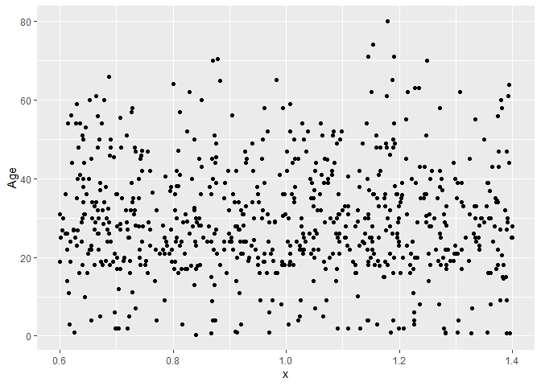
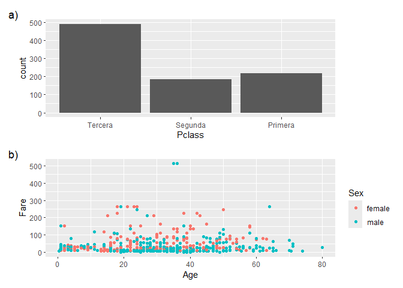

# Ciencia de datos en R


Verónica Cruz-Alonso and Julen Astigarraga
24/09/2024

- [<span class="toc-section-number">1</span> Objetivos del día
  2](#objetivos-del-día-2)
- [<span class="toc-section-number">2</span>
  Introducción](#introducción)
- [<span class="toc-section-number">3</span> Elementos básicos en un
  gráfico de {ggplot2}](#elementos-básicos-en-un-gráfico-de-ggplot2)
  - [<span class="toc-section-number">3.0.1</span>
    Ejercicio](#ejercicio)
  - [<span class="toc-section-number">3.1</span> Aesthetics
    vs. argumentos](#aesthetics-vs-argumentos)
    - [<span class="toc-section-number">3.1.1</span>
      Ejercicio](#ejercicio-1)
- [<span class="toc-section-number">4</span> Tipos de gráfico
  (geoms)](#tipos-de-gráfico-geoms)
  - [<span class="toc-section-number">4.1</span> Exploración de
    variables cualitativas](#exploración-de-variables-cualitativas)
    - [<span class="toc-section-number">4.1.1</span> Conteo](#conteo)
    - [<span class="toc-section-number">4.1.2</span>
      Proporciones](#proporciones)
  - [<span class="toc-section-number">4.2</span> Exploración de
    variables cuantitativas](#exploración-de-variables-cuantitativas)
    - [<span class="toc-section-number">4.2.1</span>
      Ejercicio](#ejercicio-2)
  - [<span class="toc-section-number">4.3</span> Relaciones entre
    variables](#relaciones-entre-variables)
    - [<span class="toc-section-number">4.3.1</span> Variables
      cualitativas](#variables-cualitativas)
    - [<span class="toc-section-number">4.3.2</span>
      Ejercicio](#ejercicio-3)
    - [<span class="toc-section-number">4.3.3</span> Variables
      cuantitativas](#variables-cuantitativas)
    - [<span class="toc-section-number">4.3.4</span> Variable
      cualitativa
      vs. cuantitativa](#variable-cualitativa-vs-cuantitativa)
- [<span class="toc-section-number">5</span> {Ggplot2}: funciones
  avanzadas](#ggplot2-funciones-avanzadas)
  - [<span class="toc-section-number">5.1</span> Etiquetas](#etiquetas)
  - [<span class="toc-section-number">5.2</span> Sistema de
    coordenadas](#sistema-de-coordenadas)
    - [<span class="toc-section-number">5.2.1</span>
      Ejercicio](#ejercicio-4)
  - [<span class="toc-section-number">5.3</span> Faceting](#faceting)
  - [<span class="toc-section-number">5.4</span> Posición](#posición)
  - [<span class="toc-section-number">5.5</span> Escalas](#escalas)
    - [<span class="toc-section-number">5.5.1</span>
      Ejercicio](#ejercicio-5)
  - [<span class="toc-section-number">5.6</span> Los colores en
    R](#los-colores-en-r)
  - [<span class="toc-section-number">5.7</span> Temas](#temas)
    - [<span class="toc-section-number">5.7.1</span>
      Ejercicio](#ejercicio-6)
- [<span class="toc-section-number">6</span>
  Multipaneles](#multipaneles)
- [<span class="toc-section-number">7</span> Mapas](#mapas)
  - [<span class="toc-section-number">7.1</span> Raster](#raster)
  - [<span class="toc-section-number">7.2</span> Vectorial](#vectorial)
- [<span class="toc-section-number">8</span> Enlaces de
  interés](#enlaces-de-interés)

## Objetivos del día 2

- Aprender la filosofía y funciones básicas del paquete de visualización
  de datos {ggplot2}.

- Entender y aplicar funciones avanzadas de {ggplot2}.

- Ser capaces de generar gráficos publicables en un artículo científico.


## Introducción

La visualización de datos es una disciplina cuyo fin es mapear datos de
forma gráfica para comunicar un mensaje. En investigación se usa
principalmente en los análisis exploratorios (durante la fase de
entendimiento de los datos) y en la comunicación de los resultados.

La representación gráfica de nuestras ideas o resultados de
investigación es esencial para comunicar de forma efectiva nuestra
interpretación de los datos y es clave si queremos causar cierto impacto
en el interlocutor. El hombre de Vitruvio de Leonardo Da Vinci, el árbol
de la vida de Charles Darwin o la primera foto de la doble hélice del
ADN de Rosalind Franklin son visualizaciones de conceptos que han
cambiado profundamente nuestro entendimiento del mundo y ejemplos de la
importancia de la visualización de las ideas.

Algunos estudios sugieren que el tiempo medio que el usuario emplea en
ojear una página web es de unos segundos, pero si hay algo que consigue
atraer su atención entonces el tiempo se incrementa exponencialmente.
Este atractor en el mundo científico puede ser un buen gráfico de
resultados o un buen resumen gráfico.


En este bloque vamos a aprender como representar de manera efectiva
muestros datos utilizando el paquete
{[ggplot2](https://ggplot2.tidyverse.org/)} de *tidyverse*. {ggplot2}
permite hacer gráficos razonablemente claros y estéticamente bonitos (es
decir, bien ejecutados) con poco tiempo y un esfuerzo pequeño. Es
extremadamente flexible y potente por lo que ha alcanzado gran
popularidad.

{ggplot2} está escrito en R siguiendo la [gramática de gráficos
(gg)](https://www.amazon.com/Grammar-Graphics-Statistics-Computing/dp/0387245448/ref=as_li_ss_tl).
Por ello, al utilizarlo, el usuario tiene que pensar como cuando está
haciendo un dibujo a mano y pensar en ir añadiendo diferentes capas a la
creación. El flujo de trabajo es crear un gráfico vacío, añadir una capa
con los datos, añadir una capa con las etiquetas, etc.


Otra característica de {ggplot2} además del trabajo por capas es que
precisa de datos ordenados para que se ejecute de forma óptima.

💡Recordamos que en una tabla de datos ordenados (*Tidy data*) cada
columna representa una variable, cada fila es una observación y cada
celda contiene un único valor.

## Elementos básicos en un gráfico de {[ggplot2](https://ggplot2.tidyverse.org/)}

Se necesitan tres capas básicas para crear un gráfico con {ggplot2}:

- Los datos (*data*).

- Las geometrías (*geom*): definen el tipo de gráfico (de puntos, de
  barras, etc.).

- Los *aesthetics*: características visuales de las geometrías (p. ej.
  la posición, el color) definidas por las variables de nuestros datos.

Las capas se conectan entre sí con el símbolo `+`, que siempre debe ir
colocado al final de la línea de código si queremos seguir añadiendo
capas al gráfico. Todas las capas que se pueden incluir están recogidas
en la [guía de {ggplot2} de
Posit](https://diegokoz.github.io/intro_ds/fuentes/ggplot2-cheatsheet-2.1-Spanish.pdf).

💡 Se utiliza el símbolo `+` porque {ggplot2} es anterior al *pipe*
(`|>`) y cambiar `+` por el *pipe* requeríría muchos reajustes en un
montón de paquetes.

``` r
library(tidyverse)
# install.packages("titanic")

#Cargamos los datos
titanic <- titanic::titanic_train 

head(titanic)
```

      PassengerId Survived Pclass
    1           1        0      3
    2           2        1      1
    3           3        1      3
    4           4        1      1
    5           5        0      3
    6           6        0      3
                                                     Name    Sex Age SibSp Parch
    1                             Braund, Mr. Owen Harris   male  22     1     0
    2 Cumings, Mrs. John Bradley (Florence Briggs Thayer) female  38     1     0
    3                              Heikkinen, Miss. Laina female  26     0     0
    4        Futrelle, Mrs. Jacques Heath (Lily May Peel) female  35     1     0
    5                            Allen, Mr. William Henry   male  35     0     0
    6                                    Moran, Mr. James   male  NA     0     0
                Ticket    Fare Cabin Embarked
    1        A/5 21171  7.2500              S
    2         PC 17599 71.2833   C85        C
    3 STON/O2. 3101282  7.9250              S
    4           113803 53.1000  C123        S
    5           373450  8.0500              S
    6           330877  8.4583              Q

``` r
# PassengerId: Id del pasajero
# Survived: 1-si, 0-no
# Pclass: clase del pasajero
# Name: nombre Name
# Sex: sexo
# Age: edad
# SibSp: numero de hermanos + parejas a bordo
# Parch: numero de progenitores + hijos a bordo
# Ticket: numero de billete
# Fare: tarifa
# Cabin: camarote
# Embarked: puerta de embarque

ggplot(data = titanic)
```


``` r
ggplot(data = titanic, aes(x = Age, y = Fare)) 
```


``` r
ggplot() + 
  geom_point(data = titanic, aes(x = Age, y = Fare)) #Los datos se pueden colocar dentro de la funcion ggplot si se van a usar los mismos en todas las geometrias
```


``` r
ggplot() + 
  geom_jitter(data = titanic, aes(x = Pclass, y = Fare))
```


``` r
# Como guardar plots satisfactorios

plotqmegusta <- ggplot() + 
  geom_point(data = titanic, aes(x = Age, y = Fare))

ggsave(filename = "farebyage.jpg", plot = plotqmegusta, width = 12, height = 9, units = "cm", dpi = 300)

ggsave(filename = "farebyage.pdf", plot = plotqmegusta, width = 12, height = 9, units = "cm")
```

💡Algunas revistas científicas dan especificaciones muy detalladas sobre
cómo tienen que ser los gráficos (p. ej.
[Science](https://www.science.org/content/page/instructions-preparing-initial-manuscript#preparation-of-figures)).
Cuando no tenemos una referencia clara recomendamos pensar en formato A4
(21 x 29,7 cm) y que todos los elementos visuales del gráfico queden
visibles cuando se guarda dentro de estos límites de tamaño.

#### Ejercicio

Representa un gráfico para ver la relación entre el sexo de los
pasajeros y la clase.

### Aesthetics vs. argumentos

Los aesthetics cambian cada elemento de las geometrías. Los argumentos
estéticos cambian toda la geometría en conjunto.

``` r
ggplot(data = titanic) + 
  geom_point(aes(x = Age, y = Fare, color = Sex))
```


``` r
# No es lo mismo que... 

ggplot(data = titanic) + 
  geom_point(aes(x = Age, y = Fare), color = "darkred") 
```


En la ayuda de las funciones de {ggplot2} aparece una lista de los
*aesthetics* y los argumentos estéticos que acepta esa función. Se
pueden incluir tantos *aesthetics* como se deseen.

``` r
ggplot(data = titanic) + 
  geom_point(aes(x = Age, y = Fare, size = Pclass, shape = Sex, color = Embarked))
```


``` r
summary(titanic$Pclass)
```

       Min. 1st Qu.  Median    Mean 3rd Qu.    Max. 
      1.000   2.000   3.000   2.309   3.000   3.000 

``` r
titanic <- titanic |> 
  mutate(Pclass = factor(Pclass, levels = c(3, 2, 1), 
    labels = c("Tercera", "Segunda", "Primera")))

summary(titanic$Pclass)
```

    Tercera Segunda Primera 
        491     184     216 

``` r
ggplot(data = titanic) + 
  geom_point(aes(x = Age, y = Fare, size = Pclass, shape = Sex, color = Embarked), alpha = 0.5)
```


#### Ejercicio

¿Cómo modificarías el siguiente código para representar la puerta de
embarque con diferentes formas pero los puntos de color rosa?

``` r
ggplot(data = titanic) + 
  geom_point(aes(x = Age, y = Fare))
```


## Tipos de gráfico (geoms)

El tipo de gráfico que escojamos va a depender del tipo de variable y
del mensaje que queramos transmitir (es decir, del propósito).


💡Para elegir qué tipo de gráfico nos conviene según el propósito una
herrramienta muy útil es la [chuleta sobre los principios de los
gráficos](https://graphicsprinciples.github.io/cheatsheet.html).

``` r
ggplot(data = titanic) + 
  geom_point(aes(x = Age, y = Fare, color = Sex)) + 
  geom_smooth(aes(x = Age, y = Fare, color = Sex, fill = Sex))
```


A continuación vamos a ver algunos tipos de gráficos útiles en
exploración de datos para diferentes tipos de variables.

### Exploración de variables cualitativas

#### Conteo

``` r
summary(titanic$Pclass)
```

    Tercera Segunda Primera 
        491     184     216 

``` r
ggplot(data = titanic) + 
  geom_bar(aes(x = Pclass))
```


#### Proporciones

``` r
miplot <- ggplot(data = titanic) + 
  geom_bar(aes(x = Pclass, group = 1)) 

miplot # group = 1 hace que considere toda la variable como un todo
```


``` r
miplot_data <- ggplot_build(miplot) 
head(miplot_data$data)
```

    [[1]]
        y count      prop x flipped_aes group PANEL ymin ymax xmin xmax colour
    1 491   491 0.5510662 1       FALSE     1     1    0  491 0.55 1.45     NA
    2 184   184 0.2065095 2       FALSE     1     1    0  184 1.55 2.45     NA
    3 216   216 0.2424242 3       FALSE     1     1    0  216 2.55 3.45     NA
        fill linewidth linetype alpha
    1 grey35       0.5        1    NA
    2 grey35       0.5        1    NA
    3 grey35       0.5        1    NA

``` r
ggplot(data = titanic) + 
  geom_bar(aes(x = Pclass, y = ..count.., group = 1))
```


``` r
ggplot(data = titanic) + 
  geom_bar(aes(x = Pclass, y = ..prop.., group = 1))
```


### Exploración de variables cuantitativas

``` r
ggplot(data = titanic) + 
  geom_histogram(aes(x = Age))
```


``` r
ggplot(data = titanic) + 
  geom_density(aes(x = Age))
```


``` r
ggplot(data = titanic) + 
  geom_boxplot(aes(y = Age))
```


``` r
ggplot(data = titanic) + 
  geom_jitter(aes(x = 1, y = Age))
```



#### Ejercicio

Describe la distribución de las tarifas pagadas por los pasajeros.

### Relaciones entre variables

#### Variables cualitativas

``` r
ggplot(data = titanic) + 
  geom_count(aes(x = Sex, y = Survived))
```


``` r
titanic <- titanic |> 
  mutate(Survived = factor(Survived, levels = c(0, 1), labels = c("Muerto", "Vivo")))

ggplot(data = titanic) + 
  geom_count(aes(x = Sex, y = Survived))
```


``` r
table(titanic$Sex, titanic$Survived)
```

            
             Muerto Vivo
      female     81  233
      male      468  109

``` r
ggplot(data = titanic) + 
  geom_bar(aes(x = Pclass, fill = Sex))
```


``` r
prueba <- ggplot(data = titanic) + 
  geom_bar(aes(x = Pclass, fill = Sex)) 
prueba2 <- ggplot_build(prueba)
```

#### Ejercicio

Haz un gráfico para averiguar en qué clase sobrevivieron más personas.

#### Variables cuantitativas

``` r
pnum <- ggplot(data = titanic, aes(x = Age, y = Fare)) + 
  geom_point(alpha = 0.5)

pnum
```


``` r
pnum + 
  geom_smooth()
```


💡[ggpairs()](https://ggobi.github.io/ggally/reference/ggpairs.html) de
{GGally} permite hacer gráficos multipanel donde, de un vistazo, se ve
la distribución de cada variable dentro de una base de datos y la
relación de las variables todas entre sí. Es muy útil en exploración de
datos.

💡Los correlogramas, gráficos cuadrados o triangulares que representan
matrices de correlaciones entre variables, son muy útiles para resumir
en un vistazo las relaciones entre las variables de una base de datos.
En [este artículo](https://rpubs.com/Alema/1000474) encontrarás
tutoriales para realizarlos utilizando diferente paquetes.

Los gráficos interactivos de ggplotly() pueden ser muy útilies también
en la exploración de datos. Fijate en el siguiente ejemplo.

``` r
# install.packages("plotly")
library(plotly) 
```

    Warning: package 'plotly' was built under R version 4.3.3


    Attaching package: 'plotly'

    The following object is masked from 'package:ggplot2':

        last_plot

    The following object is masked from 'package:stats':

        filter

    The following object is masked from 'package:graphics':

        layout

``` r
# ggplotly(pnum)
```

#### Variable cualitativa vs. cuantitativa

``` r
ggplot(data = titanic) + 
  geom_boxplot(aes(x = Pclass, y = Age))
```


``` r
ggplot(data = titanic) + 
  geom_violin(aes(x = Pclass, y = Age), draw_quantiles = 0.5) #+ 
```


``` r
# geom_jitter(aes(x = Pclass, y = Age), alpha = 0.3, width = 0.2)

ggplot(data = titanic) + 
  geom_violin(aes(x = Pclass, y = Age, fill = Sex), draw_quantiles = 0.5)
```


``` r
# Haciendo calculos previos

summ_titanic <- titanic |> 
  group_by(Pclass) |> 
  summarise(Avg_age = mean(Age, na.rm = TRUE), Sd_age = sd(Age, na.rm = TRUE))

summ_titanic
```

    # A tibble: 3 × 3
      Pclass  Avg_age Sd_age
      <fct>     <dbl>  <dbl>
    1 Tercera    25.1   12.5
    2 Segunda    29.9   14.0
    3 Primera    38.2   14.8

``` r
ggplot(data = summ_titanic, aes(x = Pclass, y = Avg_age)) + 
  geom_col(color = "black") + 
  geom_errorbar(aes(ymax = Avg_age + Sd_age, ymin = Avg_age - Sd_age), width = 0.25)
```


``` r
ggplot(data = summ_titanic, aes(x = Pclass, y = Avg_age)) + 
  geom_line(aes(group = 1))
```


💡Echa un vistazo al paquete
{[ggdist](https://mjskay.github.io/ggdist/)} y los [raincloud
plots](https://www.cedricscherer.com/2021/06/06/visualizing-distributions-with-raincloud-plots-and-how-to-create-them-with-ggplot2/)
para combinar diferentes geoms relacionadas con la distribución de los
datos.

## {Ggplot2}: funciones avanzadas

<!--# ver la chuleta de ggplot2 -->

### Etiquetas

``` r
pnumcat <- ggplot(data = titanic) + 
  geom_boxplot(aes(x = Pclass, y = Age))

pnumcat
```


``` r
pnumcat + 
  labs(title = "Edad de los pasajeros según su clase", 
    x = "Clase", 
    y = "Edad (años)") #title, subtitle, x, y, caption
```


### Sistema de coordenadas

El sistema de coordenadas por defecto en un gráfico de `ggplot()` es el
cartesiano. Si queremos hacer zoom en nuestro gráfico tendremos que
cambiar los límites del sistema de coordenadas.

``` r
pnumcat +
  coord_cartesian(ylim = c(0, 100))
```


#### Ejercicio

Cambia la posición de los ejes X e Y en el sistema de coordenadas de
pnumcat.

### Faceting

Los *facets* dividen el gráfico en subgráficos basados en el valor de
una o varias variables categóricas. Las facetas son muy útiles en
exploración de datos. Hay dos funciones para facetar: `facet_grid()` y
`facet_wrap()`.

``` r
miplot2 <- ggplot(data = titanic, aes(x = Age, y = Fare, color = Sex)) + 
  geom_point()

miplot2
```


``` r
miplot2 + 
  facet_grid(rows = vars(Pclass), scales = "free") 
```


``` r
miplot2 + 
  facet_grid(rows = vars(Pclass), cols = vars(Embarked)) 
```


``` r
miplot2 + 
  facet_wrap(facets = vars(Embarked), ncol=3)
```


### Posición

Con las funciones y argumenos de posición podemos recolocar geometrias
que de otro modo ocuparían el mismo espacio.

``` r
ggplot(data = titanic) + 
  geom_bar(aes(x = Pclass, fill = Sex))
```


``` r
ggplot(data = titanic) + 
  geom_bar(aes(x = Pclass, fill = Sex), position = "dodge") #esquivar
```


``` r
ggplot(data = titanic) + 
  geom_bar(aes(x = Pclass, fill = Sex), position = "fill") #rellenar
```


### Escalas

Sirven para personalizar los *aesthetics*. Las funciones de la familia
`scale` siempre tienen la misma estructura: `scale_aesthetic` que se
personaliza con \_ tipo de escala (p. ej. continua, discreta, manual,
etc.).

``` r
miplot2 +
  scale_color_manual(values = c("darkgreen", "chartreuse")) + 
  scale_y_sqrt(breaks = c(9,16,25), labels = c("a", "b","c")) 
```


Un error muy común es cambiar los ejes del gráfico con las funciones
`scale_x_continuous()` o `scale_y_continuous()` cuando lo que queremos
es hacer zoom. Fijate en las diferencias en el siguiente ejemplo.

``` r
ggplot(data = titanic) + 
  geom_boxplot(aes(x = Pclass, y = Age))
```


``` r
ggplot(data = titanic) + 
  geom_boxplot(aes(x = Pclass, y = Age)) +
  scale_y_continuous(limits = c(10, 80))
```


``` r
ggplot(data = titanic) + 
  geom_boxplot(aes(x = Pclass, y = Age)) +
  coord_cartesian(ylim = c(10, 80))
```


#### Ejercicio

¿Qué harías para cambiar la escala de la edad a un degradado de colores
de azul a amarillo en el siguiente gráfico?

### Los colores en R

Las paletas de colores tipo *manual* y *gradient* se personalizan con el
nombre o código del color. Con [esta
herramienta](https://r-charts.com/colors/) puedes elegir entre cientos
de colores.

Las paletas tipo *brewer* y *distiller* utilizan paletas de colores que
pueden ser secuenciales, cualitativas o divergentes, que aunque tienen
utilidad en gran variedad de situaciones, están diseñadas para trabajar
[con mapas o a escalas
pequeñas](https://colorbrewer2.org/#type=sequential&scheme=BuGn&n=3).

Las paletas HCL (*hue-chroma-luminance*) son paletas muy populares que
tienen su propia función (p. ej. colores para representar batimetría).
De entre ellas, *Viridis* se he vuelto muy popular porque está diseñada
para que personas con distintos tipos de daltonismo puedan distinguir
los colores.

``` r
RColorBrewer::display.brewer.all() 
```


``` r
RColorBrewer::brewer.pal(name = "Set3", n = 6) # para crear paleta
```

    [1] "#8DD3C7" "#FFFFB3" "#BEBADA" "#FB8072" "#80B1D3" "#FDB462"

``` r
grDevices::hcl.pals() # HCL Palettes 
```

      [1] "Pastel 1"      "Dark 2"        "Dark 3"        "Set 2"        
      [5] "Set 3"         "Warm"          "Cold"          "Harmonic"     
      [9] "Dynamic"       "Grays"         "Light Grays"   "Blues 2"      
     [13] "Blues 3"       "Purples 2"     "Purples 3"     "Reds 2"       
     [17] "Reds 3"        "Greens 2"      "Greens 3"      "Oslo"         
     [21] "Purple-Blue"   "Red-Purple"    "Red-Blue"      "Purple-Orange"
     [25] "Purple-Yellow" "Blue-Yellow"   "Green-Yellow"  "Red-Yellow"   
     [29] "Heat"          "Heat 2"        "Terrain"       "Terrain 2"    
     [33] "Viridis"       "Plasma"        "Inferno"       "Rocket"       
     [37] "Mako"          "Dark Mint"     "Mint"          "BluGrn"       
     [41] "Teal"          "TealGrn"       "Emrld"         "BluYl"        
     [45] "ag_GrnYl"      "Peach"         "PinkYl"        "Burg"         
     [49] "BurgYl"        "RedOr"         "OrYel"         "Purp"         
     [53] "PurpOr"        "Sunset"        "Magenta"       "SunsetDark"   
     [57] "ag_Sunset"     "BrwnYl"        "YlOrRd"        "YlOrBr"       
     [61] "OrRd"          "Oranges"       "YlGn"          "YlGnBu"       
     [65] "Reds"          "RdPu"          "PuRd"          "Purples"      
     [69] "PuBuGn"        "PuBu"          "Greens"        "BuGn"         
     [73] "GnBu"          "BuPu"          "Blues"         "Lajolla"      
     [77] "Turku"         "Hawaii"        "Batlow"        "Blue-Red"     
     [81] "Blue-Red 2"    "Blue-Red 3"    "Red-Green"     "Purple-Green" 
     [85] "Purple-Brown"  "Green-Brown"   "Blue-Yellow 2" "Blue-Yellow 3"
     [89] "Green-Orange"  "Cyan-Magenta"  "Tropic"        "Broc"         
     [93] "Cork"          "Vik"           "Berlin"        "Lisbon"       
     [97] "Tofino"        "ArmyRose"      "Earth"         "Fall"         
    [101] "Geyser"        "TealRose"      "Temps"         "PuOr"         
    [105] "RdBu"          "RdGy"          "PiYG"          "PRGn"         
    [109] "BrBG"          "RdYlBu"        "RdYlGn"        "Spectral"     
    [113] "Zissou 1"      "Cividis"       "Roma"         

``` r
X11()
example("hcl.colors")
```


    hcl.cl> require("graphics")

    hcl.cl> # color wheels in RGB/HSV and HCL space
    hcl.cl> par(mfrow = c(2, 2))

    hcl.cl> pie(rep(1, 12), col = rainbow(12), main = "RGB/HSV")


    hcl.cl> pie(rep(1, 12), col = hcl.colors(12, "Set 2"), main = "HCL")


    hcl.cl> par(mfrow = c(1, 1))

    hcl.cl> ## color swatches for RGB/HSV palettes
    hcl.cl> demo.pal <-
    hcl.cl+   function(n, border = if (n < 32) "light gray" else NA,
    hcl.cl+            main = paste("color palettes;  n=", n),
    hcl.cl+            ch.col = c("rainbow(n, start=.7, end=.1)", "heat.colors(n)",
    hcl.cl+                       "terrain.colors(n)", "topo.colors(n)",
    hcl.cl+                       "cm.colors(n)"))
    hcl.cl+ {
    hcl.cl+     nt <- length(ch.col)
    hcl.cl+     i <- 1:n; j <- n / nt; d <- j/6; dy <- 2*d
    hcl.cl+     plot(i, i+d, type = "n", yaxt = "n", ylab = "", main = main)
    hcl.cl+     for (k in 1:nt) {
    hcl.cl+         rect(i-.5, (k-1)*j+ dy, i+.4, k*j,
    hcl.cl+              col = eval(str2lang(ch.col[k])), border = border)
    hcl.cl+         text(2*j,  k * j + dy/4, ch.col[k])
    hcl.cl+     }
    hcl.cl+ }

    hcl.cl> demo.pal(16)


    hcl.cl> ## color swatches for HCL palettes
    hcl.cl> hcl.swatch <- function(type = NULL, n = 5, nrow = 11,
    hcl.cl+   border = if (n < 15) "black" else NA) {
    hcl.cl+     palette <- hcl.pals(type)
    hcl.cl+     cols <- sapply(palette, hcl.colors, n = n)
    hcl.cl+     ncol <- ncol(cols)
    hcl.cl+     nswatch <- min(ncol, nrow)
    hcl.cl+ 
    hcl.cl+     par(mar = rep(0.1, 4),
    hcl.cl+         mfrow = c(1, min(5, ceiling(ncol/nrow))),
    hcl.cl+         pin = c(1, 0.5 * nswatch),
    hcl.cl+         cex = 0.7)
    hcl.cl+ 
    hcl.cl+     while (length(palette)) {
    hcl.cl+         subset <- 1:min(nrow, ncol(cols))
    hcl.cl+         plot.new()
    hcl.cl+         plot.window(c(0, n), c(0, nrow + 1))
    hcl.cl+         text(0, rev(subset) + 0.1, palette[subset], adj = c(0, 0))
    hcl.cl+         y <- rep(subset, each = n)
    hcl.cl+         rect(rep(0:(n-1), n), rev(y), rep(1:n, n), rev(y) - 0.5,
    hcl.cl+              col = cols[, subset], border = border)
    hcl.cl+         palette <- palette[-subset]
    hcl.cl+         cols <- cols[, -subset, drop = FALSE]
    hcl.cl+     }
    hcl.cl+ 
    hcl.cl+     par(mfrow = c(1, 1), mar = c(5.1, 4.1, 4.1, 2.1), cex = 1)
    hcl.cl+ }

    hcl.cl> hcl.swatch()


    hcl.cl> hcl.swatch("qualitative")


    hcl.cl> hcl.swatch("sequential")


    hcl.cl> hcl.swatch("diverging")


    hcl.cl> hcl.swatch("divergingx")


    hcl.cl> ## heat maps with sequential HCL palette (purple)
    hcl.cl> image(volcano, col = hcl.colors(11, "purples", rev = TRUE))


    hcl.cl> filled.contour(volcano, nlevels = 10,
    hcl.cl+                color.palette = function(n, ...)
    hcl.cl+                    hcl.colors(n, "purples", rev = TRUE, ...))


    hcl.cl> ## list available HCL color palettes
    hcl.cl> hcl.pals("qualitative")
    [1] "Pastel 1" "Dark 2"   "Dark 3"   "Set 2"    "Set 3"    "Warm"     "Cold"    
    [8] "Harmonic" "Dynamic" 

    hcl.cl> hcl.pals("sequential")
     [1] "Grays"         "Light Grays"   "Blues 2"       "Blues 3"      
     [5] "Purples 2"     "Purples 3"     "Reds 2"        "Reds 3"       
     [9] "Greens 2"      "Greens 3"      "Oslo"          "Purple-Blue"  
    [13] "Red-Purple"    "Red-Blue"      "Purple-Orange" "Purple-Yellow"
    [17] "Blue-Yellow"   "Green-Yellow"  "Red-Yellow"    "Heat"         
    [21] "Heat 2"        "Terrain"       "Terrain 2"     "Viridis"      
    [25] "Plasma"        "Inferno"       "Rocket"        "Mako"         
    [29] "Dark Mint"     "Mint"          "BluGrn"        "Teal"         
    [33] "TealGrn"       "Emrld"         "BluYl"         "ag_GrnYl"     
    [37] "Peach"         "PinkYl"        "Burg"          "BurgYl"       
    [41] "RedOr"         "OrYel"         "Purp"          "PurpOr"       
    [45] "Sunset"        "Magenta"       "SunsetDark"    "ag_Sunset"    
    [49] "BrwnYl"        "YlOrRd"        "YlOrBr"        "OrRd"         
    [53] "Oranges"       "YlGn"          "YlGnBu"        "Reds"         
    [57] "RdPu"          "PuRd"          "Purples"       "PuBuGn"       
    [61] "PuBu"          "Greens"        "BuGn"          "GnBu"         
    [65] "BuPu"          "Blues"         "Lajolla"       "Turku"        
    [69] "Hawaii"        "Batlow"       

    hcl.cl> hcl.pals("diverging")
     [1] "Blue-Red"      "Blue-Red 2"    "Blue-Red 3"    "Red-Green"    
     [5] "Purple-Green"  "Purple-Brown"  "Green-Brown"   "Blue-Yellow 2"
     [9] "Blue-Yellow 3" "Green-Orange"  "Cyan-Magenta"  "Tropic"       
    [13] "Broc"          "Cork"          "Vik"           "Berlin"       
    [17] "Lisbon"        "Tofino"       

    hcl.cl> hcl.pals("divergingx")
     [1] "ArmyRose" "Earth"    "Fall"     "Geyser"   "TealRose" "Temps"   
     [7] "PuOr"     "RdBu"     "RdGy"     "PiYG"     "PRGn"     "BrBG"    
    [13] "RdYlBu"   "RdYlGn"   "Spectral" "Zissou 1" "Cividis"  "Roma"    

``` r
hcl.colors(n = 6, palette = "Lajolla") # para crear paleta
```

    [1] "#FCFFC9" "#EBCE7B" "#DE9529" "#BE5A32" "#7F2B3F" "#1D0B14"

``` r
# Viridis 

ggplot(data = titanic, aes(x = Age, y = Fare, color = Age)) + 
  geom_point() + 
  scale_color_gradientn(colours = hcl.colors(12, "viridis"))

ggplot(data = titanic, aes(x = Age, y = Fare, color = Age)) + 
  geom_point() + 
  scale_color_viridis_c()
```

💡[Aquí](https://ggplot2-book.org/scales-colour) puedes encontrar más
información sobre cómo utilizar colores en {ggplot2}.

### Temas

`theme()` permite la personalización completa de todos los elementos del
gráfico. Los argumentos dentro de la función definen la parte del
gráfico a cambiar. Se les asigna una función de cambio según el elemento
a cambiar dentro de esa parte (parte.del.gráfico =
elemento_a_cambiar(…)): *line*, *rect*, *text*.

``` r
?theme

miplot2 + 
  theme(axis.title.x = element_text(color = "red", face = "bold")) 
```


#### Ejercicio

Dibuja una linea negra que represente los ejes de miplot y quita el
fondo del gráfico.

Existen temas configurados por defecto y un asistente que te ayuda a
personalizar el gráfico.

``` r
miplot2 + theme_classic() 
```


``` r
miplot2 + theme_light() 
```


``` r
miplot2 + theme_void()
```


``` r
# GgthemeAssist
# install.packages("ggThemeAssist")

miplot2
```


## Multipaneles

La librería {patchwork} permite añadir gráficos ([y también
tablas](https://www.tidyverse.org/blog/2024/09/patchwork-1-3-0/)) entre
sí como si fueran diferentes capas.

``` r
# install.packages("patchwork")
library(patchwork)

miplot + miplot2 
```


``` r
miplot / miplot2
```


``` r
miplot / miplot2 + 
  plot_annotation(tag_levels = "a", tag_suffix = ")")
```



En [este
enlace](https://patchwork.data-imaginist.com/articles/guides/layout.html)
puedes ver cómo personalizar mucho más la disposición de los diferentes
elementos de la composición.

## Mapas

La representación de mapas es sencilla con {ggplot2} si conseguimos
transformar los datos espaciales en una tabla de datos ordenada.


### Raster

``` r
#install.packages(c("terra", "easyclimate))

library(terra)
library(easyclimate)

# Obtenemos datos de temperatura máxima para el 31 de diciembre de 2020 en una zona de España 

raster <- get_daily_climate(
  coords = vect("POLYGON ((-4.5 41, -4.5 40.5, -5 40.5, -5 41))"), 
  period = "2020-12-31", 
  climatic_var = "Tmax", 
  output = "raster")

plot(raster)
```


``` r
tidy_raster <- terra::as.data.frame(raster, xy = TRUE) 
head(tidy_raster)
```

              x        y 2020-12-31
    1 -4.995833 40.99583       7.64
    2 -4.987500 40.99583       7.53
    3 -4.979167 40.99583       7.61
    4 -4.970833 40.99583       7.60
    5 -4.962500 40.99583       7.58
    6 -4.954167 40.99583       7.67

``` r
rastermap <- ggplot(data = tidy_raster) + 
  geom_raster(aes(x = x, y = y, fill = `2020-12-31`), interpolate = TRUE) 

rastermap
```


``` r
rastermap + 
  scale_fill_viridis_c(name = "Temperatura\nmáxima (ºC)\n31 Dic. 2020") +
  labs(y = "Latitude", x = "Longitude") + 
  theme_bw()
```


### Vectorial

En general, se recomienda usar
[`geom_sf()`](https://ggplot2.tidyverse.org/reference/ggsf.html). Cuando
el mapa contiene puntos es sencillo transformarlo en formato ordenado
con `terra::as.data.frame()` y tratarlo con `geom_point()`. Para líneas
y polígonos es mas dificil, pero se puede como veremos en el ejemplo
debajo.

``` r
# install.packages("sf")
library(sf)
```

    Warning: package 'sf' was built under R version 4.3.2

    Linking to GEOS 3.11.2, GDAL 3.7.2, PROJ 9.3.0; sf_use_s2() is TRUE

``` r
vect_terra <- vect(system.file("ex/lux.shp", package = "terra"))
vectorial <- st_as_sf(vect_terra)

vectorial
```

    Simple feature collection with 12 features and 6 fields
    Geometry type: POLYGON
    Dimension:     XY
    Bounding box:  xmin: 5.74414 ymin: 49.44781 xmax: 6.528252 ymax: 50.18162
    Geodetic CRS:  WGS 84
    First 10 features:
       ID_1       NAME_1 ID_2           NAME_2 AREA    POP
    1     1     Diekirch    1         Clervaux  312  18081
    2     1     Diekirch    2         Diekirch  218  32543
    3     1     Diekirch    3          Redange  259  18664
    4     1     Diekirch    4          Vianden   76   5163
    5     1     Diekirch    5            Wiltz  263  16735
    6     2 Grevenmacher    6       Echternach  188  18899
    7     2 Grevenmacher    7           Remich  129  22366
    8     2 Grevenmacher   12     Grevenmacher  210  29828
    9     3   Luxembourg    8         Capellen  185  48187
    10    3   Luxembourg    9 Esch-sur-Alzette  251 176820
                             geometry
    1  POLYGON ((6.026519 50.17767...
    2  POLYGON ((6.178368 49.87682...
    3  POLYGON ((5.881378 49.87015...
    4  POLYGON ((6.131309 49.97256...
    5  POLYGON ((5.977929 50.02602...
    6  POLYGON ((6.385532 49.83703...
    7  POLYGON ((6.316665 49.62337...
    8  POLYGON ((6.425158 49.73164...
    9  POLYGON ((5.998312 49.69992...
    10 POLYGON ((6.039474 49.44826...

``` r
vecmap <- ggplot(data = vectorial) + 
  geom_sf(aes(fill = NAME_2), color = "white")

vecmap
```


``` r
vecmap + 
  coord_sf() + 
  scale_fill_brewer(palette = "Set3", 
    name = "Cantones de\nLuxemburgo") + 
  labs(y = "Latitude", x = "Longitude") + 
  theme_bw()
```


``` r
vectorial_df <- vect_terra |> 
  geom() |> 
  as.data.frame()

ggplot(data = vectorial_df) + 
  geom_polygon(aes(x = x, y = y, group = geom, fill = as.factor(geom)), color = "white") +
  scale_fill_brewer(palette = "Set3", 
    name = "Cantones de\nLuxemburgo") + 
  labs(y = "Latitude", x = "Longitude") + 
  theme_bw()
```


## Enlaces de interés

- [Guía de {ggplot2} de
  Posit](https://diegokoz.github.io/intro_ds/fuentes/ggplot2-cheatsheet-2.1-Spanish.pdf)

- [Construye un gráfico capa a
  capa](https://rpubs.com/hadley/ggplot2-layers)

- [Elegant graphics for data analysis](https://ggplot2-book.org/)

- [Tutorial de {ggplot2} de Cedric
  Scherer](https://www.cedricscherer.com/2019/08/05/a-ggplot2-tutorial-for-beautiful-plotting-in-r/)

- [Effective Visual Communication for the Quantitative
  Scientist](https://ascpt.onlinelibrary.wiley.com/doi/full/10.1002/psp4.12455)

- [Graphics principles](https://graphicsprinciples.github.io/)

- [ggmap()](https://datanalytics.com/libro_r/0900_ggmap.html) para
  obtener mapas de fondo para nuestros datos y
  {[geodata](https://github.com/rspatial/geodata)} para descargar
  información geográfica de clima, suelo, etc.

<details>
<summary>
Session Info
</summary>

``` r
Sys.time()
```

    [1] "2024-09-24 09:57:43 CEST"

``` r
sessionInfo()
```

    R version 4.3.1 (2023-06-16 ucrt)
    Platform: x86_64-w64-mingw32/x64 (64-bit)
    Running under: Windows 11 x64 (build 22631)

    Matrix products: default


    locale:
    [1] LC_COLLATE=English_United States.utf8 
    [2] LC_CTYPE=English_United States.utf8   
    [3] LC_MONETARY=English_United States.utf8
    [4] LC_NUMERIC=C                          
    [5] LC_TIME=English_United States.utf8    

    time zone: Europe/Paris
    tzcode source: internal

    attached base packages:
    [1] stats     graphics  grDevices utils     datasets  methods   base     

    other attached packages:
     [1] sf_1.0-15         easyclimate_0.2.1 terra_1.7-71      patchwork_1.2.0  
     [5] plotly_4.10.4     lubridate_1.9.3   forcats_1.0.0     stringr_1.5.1    
     [9] dplyr_1.1.4       purrr_1.0.2       readr_2.1.5       tidyr_1.3.1      
    [13] tibble_3.2.1      ggplot2_3.5.0     tidyverse_2.0.0  

    loaded via a namespace (and not attached):
     [1] gtable_0.3.4       xfun_0.42          htmlwidgets_1.6.4  lattice_0.21-8    
     [5] tzdb_0.4.0         vctrs_0.6.5        tools_4.3.1        bitops_1.0-7      
     [9] generics_0.1.3     proxy_0.4-27       fansi_1.0.6        R.oo_1.26.0       
    [13] pkgconfig_2.0.3    KernSmooth_2.23-21 Matrix_1.6-5       data.table_1.15.2 
    [17] RColorBrewer_1.1-3 lifecycle_1.0.4    compiler_4.3.1     farver_2.1.1      
    [21] textshaping_0.3.7  munsell_0.5.0      codetools_0.2-19   class_7.3-22      
    [25] htmltools_0.5.7    RCurl_1.98-1.14    yaml_2.3.8         lazyeval_0.2.2    
    [29] pillar_1.9.0       R.utils_2.12.3     classInt_0.4-10    nlme_3.1-162      
    [33] tidyselect_1.2.1   digest_0.6.35      stringi_1.8.3      labeling_0.4.3    
    [37] splines_4.3.1      fastmap_1.1.1      grid_4.3.1         colorspace_2.1-0  
    [41] cli_3.6.1          magrittr_2.0.3     utf8_1.2.4         e1071_1.7-14      
    [45] withr_3.0.0        scales_1.3.0       timechange_0.3.0   rmarkdown_2.26    
    [49] httr_1.4.7         R.methodsS3_1.8.2  ragg_1.3.0         titanic_0.1.0     
    [53] hms_1.1.3          evaluate_0.23      knitr_1.45         viridisLite_0.4.2 
    [57] mgcv_1.9-1         rlang_1.1.3        Rcpp_1.0.12        DBI_1.2.2         
    [61] glue_1.7.0         rstudioapi_0.15.0  jsonlite_1.8.8     R6_2.5.1          
    [65] units_0.8-5        systemfonts_1.0.6 

</details>
