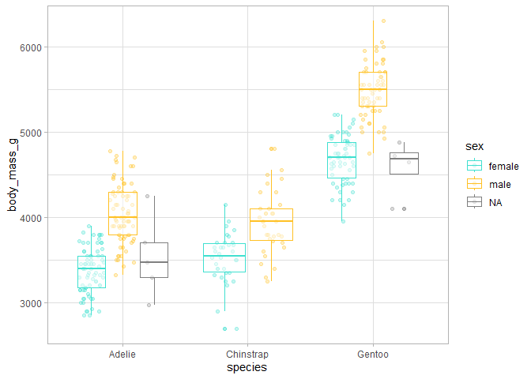
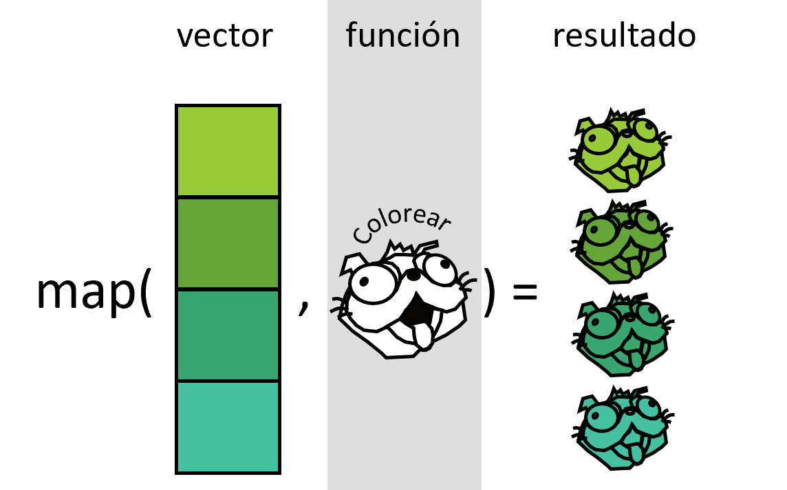

# Ciencia de datos en R


Julen Astigarraga and Verónica Cruz-Alonso
23/09/2024

- [<span class="toc-section-number">1</span> Objetivos del día
  3](#objetivos-del-día-3)
- [<span class="toc-section-number">2</span> Introducción a la
  programación funcional](#introducción-a-la-programación-funcional)
  - [<span class="toc-section-number">2.1</span> ¿Cuándo hay que usar
    una función?](#cuándo-hay-que-usar-una-función)
- [<span class="toc-section-number">3</span> Teoría sobre funciones en
  R](#teoría-sobre-funciones-en-r)
- [<span class="toc-section-number">4</span> Cómo escribir
  funciones](#sec-writefun)
  - [<span class="toc-section-number">4.0.1</span>
    Ejercicio](#ejercicio)
  - [<span class="toc-section-number">4.0.2</span>
    Ejercicio](#ejercicio-1)
  - [<span class="toc-section-number">4.1</span>
    Argumentos](#argumentos)
  - [<span class="toc-section-number">4.2</span> Valores de
    retorno](#valores-de-retorno)
- [<span class="toc-section-number">5</span> Iteraciones con bucles
  *for*](#iteraciones-con-bucles-for)
- [<span class="toc-section-number">6</span> Iteraciones con
  funcionales](#iteraciones-con-funcionales)
  - [<span class="toc-section-number">6.1</span> Nuestro primer
    funcional: generando listas,
    `map()`](#nuestro-primer-funcional-generando-listas-map)
    - [<span class="toc-section-number">6.1.1</span>
      Ejercicio](#ejercicio-2)
  - [<span class="toc-section-number">6.2</span> Nuestro segundo
    funcional: generando vectores,
    `map_*()`](#nuestro-segundo-funcional-generando-vectores-map_)
    - [<span class="toc-section-number">6.2.1</span>
      Ejercicio](#ejercicio-3)
  - [<span class="toc-section-number">6.3</span> Nuestro tercer
    funcional: dos entradas,
    `map2()`](#nuestro-tercer-funcional-dos-entradas-map2)
    - [<span class="toc-section-number">6.3.1</span>
      Ejercicio](#sec-ejercicio-map2)
  - [<span class="toc-section-number">6.4</span> Enlaces de
    interés](#enlaces-de-interés)

## Objetivos del día 3

Los **objetivos** del día de hoy son:

- aprender a escribir funciones

- aplicar funciones en programación iterativa mediante el paquete
  {purrr} de {tidyverse}

Dentro del modelo de ciencia de datos de Hadley Wickham, Mine
Çetinkaya-Rundel y Garrett Grolemund
(<a href="#fig-datascience" class="quarto-xref">Figure 1</a>), el día de
hoy se centra en el marco que envuelve todo el proceso, es decir, la
programación.


## Introducción a la programación funcional

La creciente disponibilidad de datos y de versatilidad de los programas
de análisis han provocado el incremento en la cantidad y complejidad de
los análisis que realizamos. Esto hace cada vez más necesaria la
eficiencia en el proceso de gestión y análisis de datos. Una de las
posibles formas para optimizar estos procesos y acortar los tiempos de
trabajo para los usuarios de R es la programación basada en funciones.
Las funciones permiten automatizar tareas comunes (por ejemplo, leer
diferentes bases de datos) simplificando el código.

Como las funciones en R son objetos, es posible llamarlas a través de
otras funciones e iterar este proceso, lo que constituye la base de la
programación funcional y convierte a R en una herramienta muy poderosa.
Las iteraciones sirven para realizar la misma acción a múltiples
entradas.

``` r
# install.packages("palmerpenguins")
library(palmerpenguins)
library(tidyverse)

df <- penguins |> 
  select(bill_length_mm, bill_depth_mm, flipper_length_mm, body_mass_g)

df_rescaled1 <- df |> 
  mutate(bill_length_mm = (bill_length_mm - min(bill_length_mm, na.rm = TRUE)) / (max(bill_length_mm, na.rm = TRUE) - min(bill_length_mm, na.rm = TRUE)),
    bill_depth_mm = (bill_depth_mm - min(bill_depth_mm, na.rm = TRUE)) / (max(bill_depth_mm, na.rm = TRUE) - min(bill_length_mm, na.rm = TRUE)),
    flipper_length_mm = (flipper_length_mm - min(flipper_length_mm, na.rm = TRUE)) / (max(flipper_length_mm, na.rm = TRUE) - min(flipper_length_mm, na.rm = TRUE)),
    body_mass_g = (body_mass_g - min(body_mass_g, na.rm = TRUE)) / (max(body_mass_g, na.rm = TRUE) - min(body_mass_g, na.rm = TRUE)))
    
View(df_rescaled1)

#
rescale01 <- function(x) {
  rng <- range(x, na.rm = TRUE)   
  (x - rng[1]) / (rng[2] - rng[1]) 
} 

df_rescaled2 <- df |> 
  mutate(bill_length_mm = rescale01(bill_length_mm),
         bill_depth_mm = rescale01(bill_depth_mm),
         flipper_length_mm = rescale01(flipper_length_mm), 
         body_mass_g = rescale01(body_mass_g))  

View(df_rescaled2)

#
df_rescaled3 <- lapply(df, rescale01)

View(df_rescaled3)
```

Las principales **ventajas de la programación funcional** (uso de
funciones e iteraciones) son:

- Facilidad para ver la intención del código y, por tanto, mejorar la
  **comprensión** para uno mismo, colaboradores y revisores:
  - Las funciones tienen un nombre evocativo.
  - El código queda más ordenado.
- **Rapidez** si se necesitan hacer cambios ya que las funciones son
  piezas independientes que resuelven un problema concreto.
- **Disminuye la probabilidad de error**.

### ¿Cuándo hay que usar una función?

Se recomienda seguir el principio “do not repeat yourself” ([DRY
principle](https://en.wikipedia.org/wiki/Don%27t_repeat_yourself#:~:text=%22Don't%20repeat%20yourself%22,redundancy%20in%20the%20first%20place.)):
cada unidad de conocimiento o información debe tener una representación
única, inequívoca y autoritativa en un sistema.

Escribir una función ya merece la pena cuando has copiado y pegado más
de dos veces lo mismo (don’t be WET! - Write Everything Twice). Cuantas
más veces esté repetido un código, en más sitios necesitarás
actualizarlo si hay algun cambio y más aumenta la probabilidad de error.

## Teoría sobre funciones en R

Según el tipo de output generado hay dos tipos de funciones:

- Las **funciones de transformación** transforman el objeto que entra en
  la función (primer argumento) y devuelven otro objeto o el anterior
  modificado. Los funcionales son tipos especiales de funciones de
  transformación.

- Las **funciones secundarias** (*side-effect functions*) tienen efectos
  colaterales y ejecutan una acción, como guardar un archivo o dibujar
  un plot. Algunos ejemplos de funciones secundarias que se usan
  comunmente son: `library()`, `setwd()`, `plot()`, `write_delim()`…
  Estas funciones retornan *de forma invisible* el primer argumento, que
  no se guarda, pero puede ser usado en un *pipeline*.

En general, sintácticamente, las funciones tienen tres componentes:

- Función `function()` (primitiva)
- Argumentos: lista de entradas.
- Cuerpo: trozo de código que sigue a `function()`, tradicionalmente
  entre llaves.

``` r
nombre1_v1 <- function(x, y) {
  paste(x, y, sep = "_")
}  

nombre1_v2 <- function(x, y) paste(x, y, sep = "_")  

nombre1_v3 <- \(x, y) paste(x, y, sep = "_")

nombre1_v1("Vero", "Cruz") 
```

    [1] "Vero_Cruz"

``` r
nombre1_v2("Vero", "Cruz") 
```

    [1] "Vero_Cruz"

``` r
nombre1_v3("Vero", "Cruz") 
```

    [1] "Vero_Cruz"

📝 Si la función tiene más de dos lineas es mejor usar llaves siempre
para que quede bien delimitada. La llave de apertura nunca debe ir sola
pero sí la de cierre (excepto con *else*). Las sangrías también ayudan
mucho a entender la jerarquía del código dentro de las funciones.

En general las funciones tienen un nombre que se ejecuta cuando se
necesita como hemos visto hasta ahora, pero esto no es obligatorio.
Algunos paquetes como {purrr} o las funciones de la familia `apply`
permiten el uso de **funciones anónimas** para iterar.

``` r
penguins |> 
  map(function(x) length(unique(x)))
```

    $species
    [1] 3

    $island
    [1] 3

    $bill_length_mm
    [1] 165

    $bill_depth_mm
    [1] 81

    $flipper_length_mm
    [1] 56

    $body_mass_g
    [1] 95

    $sex
    [1] 3

    $year
    [1] 3

📝 Mejor reservar el uso de funciones anónimas para funciones cortas y
simples. Si la función es larga, ocupa varias líneas o tenemos que
usarla con frecuencia mejor darle un nombre.

## Cómo escribir funciones

#### Ejercicio

Genera tu primera función que divida un valor siempre entre 100.

💡Atajo para escribir funciones: escribir la palabra fun + tabulador

Imaginad que para un set de datos quisieramos hacer un gráfico de
distribución de cada variable numérica, en función de otra variable
categórica que nos interese especialmente, para ver cómo se distribuye.

``` r
penguins_num <- penguins |> 
  select(species, sex, where(is.numeric))

# nos interesan las diferencias entre especie y sexo

ggplot(penguins_num, aes(x = species, y = bill_length_mm, color = sex)) +
  geom_point(position = position_jitterdodge(), alpha = 0.3) +
  geom_boxplot(alpha = 0.5) +
  scale_color_manual(values = c("turquoise", "goldenrod1")) +
  theme_light()
```


``` r
ggplot(penguins_num, aes(x = species, y = bill_depth_mm, color = sex)) +
  geom_point(position = position_jitterdodge(), alpha = 0.3) +
  geom_boxplot(alpha = 0.5) +
  scale_color_manual(values = c("turquoise", "goldenrod1")) +
  theme_light()
```


``` r
ggplot(penguins_num, aes(x = species, y = flipper_length_mm, color = sex)) +
  geom_point(position = position_jitterdodge(), alpha = 0.3) +
  geom_boxplot(alpha = 0.5) +
  scale_color_manual(values = c("turquoise", "goldenrod1")) +
  theme_light()
```


``` r
# etc
```

Hemos copiado un código más de dos veces para realizar una misma acción
(es decir, un gráfico para ver como se distribuye una variable en
función de otras dos que se mantienen constantes) así que hay que
considerar la posibilidad de que estemos necesitando una función. A
continuación vamos a seguir unos sencillos pasos para transformar
cualquier código repetido en función.

1.  Analizar el código: ¿cuáles son las partes replicadas? ¿cuantas
    entradas tenemos? ¿cuáles varían y cuáles no?

2.  Simplificar y reanalizar duplicaciones

``` r
var <- penguins_num$bill_length_mm

ggplot(penguins_num, aes(x = species, y = var, color = sex)) +
  geom_point(position = position_jitterdodge(), alpha = 0.3) +
  geom_boxplot(alpha = 0.5) +
  scale_color_manual(values = c("turquoise", "goldenrod1")) +
  theme_light()
```


``` r
var <- body_mass_g
```

    Error in eval(expr, envir, enclos): object 'body_mass_g' not found

``` r
var <- "body_mass_g"

ggplot(penguins_num, aes(x = species, y = var, color = sex)) +
  geom_point(position = position_jitterdodge(), alpha = 0.3) +
  geom_boxplot(alpha = 0.5) +
  scale_color_manual(values = c("turquoise", "goldenrod1")) +
  theme_light() +
  ylab(var) # grafico erroneo
```


``` r
ggplot(penguins_num, aes(x = species, y = .data[[var]], color = sex)) +
  geom_point(position = position_jitterdodge(), alpha = 0.3) +
  geom_boxplot(alpha = 0.5) +
  scale_color_manual(values = c("turquoise", "goldenrod1")) +
  theme_light() +
  ylab(var) # grafico correcto
```



👀 La función `ggplot` necesita argumentos (data-variable) que estén
dentro del `data.frame` que va a representar. Para poder generalizar la
función hemos guardado el nombre de la variable en un objeto (tipo
`character`), pero `ggplot` no acepta `characters`. Por ello necesitamos
utilizar una función intermedia que sí los acepte. Para resolver
problemas comunes de programación funcional derivados de la
*non-standard evaluation* de *tidyverse* [mira este
enlace](https://dplyr.tidyverse.org/articles/programming.html#introduction).

3.  Elegir un nombre para la función (📝). Idealmente tiene que ser
    corto y evocar lo que la función hace. En general, debe ser un verbo
    (p. ej. imputar_valores) mientras que los argumentos son sustantivos
    (p. ej. data, variable, etc.). Usar un sustantivo para una función
    está permitido si la función calcula algo muy conocido (p. ej.
    `mean()`) o si sirve para acceder a partes de un objeto (p. ej.
    `residuals()`). También se recomienda evitar verbos muy genéricos
    (p. ej. calcular) y si el nombre tiene varias palabras separarlas
    con guión bajo o mayúsculas, pero ser consistente. Si programas
    varias funciones que hacen cosas parecidas se recomienda usar el
    mismo prefijo para todas (p. ej. “str\_” en el paquete {stringr}).

4.  Enumerar los argumentos dentro de `function()` y poner el código
    simplificado dentro de las llaves.

``` r
explorar_penguins <- function (var) {
  ggplot(penguins_num, aes(x = species, y = .data[[var]], color = sex)) +
    geom_point(position = position_jitterdodge(), alpha = 0.3) +
    geom_boxplot(alpha = 0.5) +
    scale_color_manual(values = c("turquoise", "goldenrod1")) +
    theme_light() +
    ylab(var) 
}
```

📝 Utiliza comentarios (#) para explicar el razonamiento detrás de tus
funciones. Se debe evitar explicar qué se está haciendo o cómo, ya que
el propio código ya lo comunica. También se recomienda usar \# para
separar apartados (Cmd/Ctrl + Shift + R).

5.  Probar con entradas diferentes

``` r
explorar_penguins(var = "body_mass_g") 
```

    Warning: Removed 2 rows containing non-finite outside the scale range
    (`stat_boxplot()`).

    Warning: Removed 2 rows containing missing values or values outside the scale range
    (`geom_point()`).


``` r
explorar_penguins(var = "flipper_length_mm") 
```

    Warning: Removed 2 rows containing non-finite outside the scale range
    (`stat_boxplot()`).
    Removed 2 rows containing missing values or values outside the scale range
    (`geom_point()`).


``` r
explorar_penguins(var = "bill_depth_mm")
```

    Warning: Removed 2 rows containing non-finite outside the scale range
    (`stat_boxplot()`).
    Removed 2 rows containing missing values or values outside the scale range
    (`geom_point()`).


#### Ejercicio

Genera una función para estandarizar (es decir, restar la media y
dividir por la desviación típica) las variables numéricas de penguins.

### Argumentos

En general hay dos grupos: los que especifican los **datos** y los que
especifican **detalles** de la ejecución de la función. Normalmente los
que especifican datos se colocan primero y los de detalle después. Estos
últimos suelen tener valores por defecto (los más comunes), para cuando
no se especifique nada.

<!--# Ver ayuda de quantile -->

📝 Los nombres de los argumentos deben ser cortos y descriptivos. Hay
algunos comunes pero poco descriptivos que ya son conocidos para la
mayoría de los usuarios y está bien aprovecharlos:

`x, y, z`: vectores

`w`: vector de pesos

`df`: data frame

`i, j`: indices numericos, filas y columnas respectivamente

`n`: longitud o número de filas

`p`: numero de columnas

`na.rm`: valores faltantes

### Valores de retorno

La última expresión ejecutada en una función es el valor de retorno.

📝 La función `return()` se usa para indicar explicitamente qué se
quiere obtener en una función. Se recomienda su uso cuando el retorno no
se espera al final de la función. P. ej. en las ramas de una estructura
`if-else`, sobre todo cuando hay alguna rama larga y compleja.

## Iteraciones con bucles *for*

Los bucles son recomendables para adentrarse en el mundo de las
iteraciones porque hacen cada iteración muy explícita para que quede
claro lo que está pasando.


Para programar un bucle es necesario definir tres partes diferentes: la
salida, la secuencia y el cuerpo.

``` r
set.seed(123)

df_ej <- data.frame(
  a = sample(1:5),
  b = sample(1:5),
  c = sample(1:5)
)

salida <- vector("double", 3)           # 1. salida
for (i in 1:3) {                        # 2. secuencia
  salida[[i]] <- first(df_ej[[i]])      # 3. cuerpo
}

salida
```

    [1] 3 3 2

``` r
# podriamos generalizar el for
salida <- vector("double", ncol(df_ej))   # 1. salida
for (i in seq_along(df_ej)) {             # 2. secuencia
  salida[[i]] <- first(df_ej[[i]])        # 3. cuerpo
}

salida
```

    [1] 3 3 2

``` r
# tambien podriamos iterar sobre filas
salida <- vector("double", nrow(df_ej)) 
for(i in 1:nrow(df_ej)) {
    salida[[i]] <- sum(df_ej[i, ])
}

salida
```

    [1]  8  6  8 13 10

1.  Salida: aquí determinamos el espacio de la salida, es decir, primero
    tenemos que crear la libreta donde vamos a ir apuntando todos los
    resultados.

2.  Secuencia: aquí determinamos sobre lo que queremos iterar. Cada
    ejecución del bucle *for* asignará un valor diferente de
    `seq_along(y)` a `i`.

3.  Cuerpo: aquí determinamos lo que queremos que haga cada iteración.
    Se ejecuta repetidamente, cada vez con un valor diferente para `i`.

Existe la creencia de que los bucles *for* son lentos, pero la
desventaja real de *los bucles for es que son demasiado flexibles* y
pueden realizar muchas tareas diferentes. En cambio, cada funcional
({[purrr](https://purrr.tidyverse.org/)},
[`apply`](https://www.r-bloggers.com/2022/03/complete-tutorial-on-using-apply-functions-in-r/))
está diseñado para una tarea específica, por lo que en cuanto lo ves en
el código, inmediatamente sabes por qué se está utilizando. Es decir, la
principal ventaja es su claridad al hacer que el código sea más fácil de
escribir y de leer.

Los bucles pueden ser más explícitos en cuanto a que se ve claramente la
iteración, pero se necesita más tiempo para entender qué se está
haciendo. Por el contrario, los funcionales necesitan un paso más de
abstracción y pueden requerir tiempo hasta que los comprendamos. Lo más
importante es que soluciones el problema y poco a poco ir escribiendo
código cada vez más sencillo y elegante.

> Para ser significativamente más fiable, el código debe ser más
> transparente. En particular, las condiciones anidadas y los bucles
> deben considerarse con gran recelo. Las esctructuras de control
> complicados confunden a los programadores. El código desordenado suele
> ocultar errores.
>
> — Bjarne Stroustrup ([Advanced R](https://adv-r.hadley.nz/index.html))

## Iteraciones con funcionales


Un funcional es una función que toma una función como entrada y devuelve
un vector u otro tipo de objeto como salida.

``` r
aleatorizacion <- function(f) {
  f(rnorm(5))
}

aleatorizacion(f = median)
```

    [1] 0.3598138

Para programar un funcional, primero, solucionamos el problema para un
elemento. Después, generamos una función que nos permita envolver la
solución en una función (como lo hicimos en
<a href="#sec-writefun" class="quarto-xref">Section 4</a>). Por último,
*aplicamos la función a todos los elementos que estamos interesados.* Es
decir, dividimos los problemas grandes en problemas más pequeños y
resolvemos cada tarea con una o más funciones.

En *tidyverse* se iteran procesos mediante el paquete {purrr}.
Comparando los funcionales con los bucles, el foco está en la operación
que se está ejecutando, y no en el código necesario para iterar sobre
cada elemento y guardar la salida.

``` r
map(df_ej, first)
```

    $a
    [1] 3

    $b
    [1] 3

    $c
    [1] 2

``` r
df_ej |> 
  map(first)
```

    $a
    [1] 3

    $b
    [1] 3

    $c
    [1] 2

``` r
salida <- vector("list", length = 3)
for (i in 1:3) {
  salida[[i]] <- first(df_ej[[i]])
}
salida
```

    [[1]]
    [1] 3

    [[2]]
    [1] 3

    [[3]]
    [1] 2

### Nuestro primer funcional: generando listas, `map()`

`map_*()` está vectorizado sobre un argumento, p. ej. `(x)`. La función
operará en todos los elementos de `x`, es decir, cada valor si `x` es un
vector, cada columna si `x` es un `data.frame`, o cada elemento si `x`
es una lista.

Toma un vector y una función, llama a la función una vez por cada
elemento del vector y devuelve los resultados en una lista.
`map(1:3, f)` es equivalente a `list(f(1), f(2), f(3))`. Es el
equivalente de `lapply()` de R base.

``` r
cuadratica <- function(x) {
  x ^ 2
}

map_ouput_list <- map(.x = 1:4, .f = cuadratica)

lapply_ouput_list <- lapply(X = 1:4, FUN = cuadratica)

# seleccionar cada elemento de la lista
map_ouput_list[[1]]
```

    [1] 1

``` r
map_ouput_list |>
  pluck(1)
```

    [1] 1

``` r
# algun uso mas interesante 
glimpse(penguins)
```

    Rows: 344
    Columns: 8
    $ species           <fct> Adelie, Adelie, Adelie, Adelie, Adelie, Adelie, Adel…
    $ island            <fct> Torgersen, Torgersen, Torgersen, Torgersen, Torgerse…
    $ bill_length_mm    <dbl> 39.1, 39.5, 40.3, NA, 36.7, 39.3, 38.9, 39.2, 34.1, …
    $ bill_depth_mm     <dbl> 18.7, 17.4, 18.0, NA, 19.3, 20.6, 17.8, 19.6, 18.1, …
    $ flipper_length_mm <int> 181, 186, 195, NA, 193, 190, 181, 195, 193, 190, 186…
    $ body_mass_g       <int> 3750, 3800, 3250, NA, 3450, 3650, 3625, 4675, 3475, …
    $ sex               <fct> male, female, female, NA, female, male, female, male…
    $ year              <int> 2007, 2007, 2007, 2007, 2007, 2007, 2007, 2007, 2007…

``` r
# atajo para generar una funcion anonima:  \(nombre_del_argumento)
map(.x = penguins, .f = \(x) length(unique(x)))
```

    $species
    [1] 3

    $island
    [1] 3

    $bill_length_mm
    [1] 165

    $bill_depth_mm
    [1] 81

    $flipper_length_mm
    [1] 56

    $body_mass_g
    [1] 95

    $sex
    [1] 3

    $year
    [1] 3

``` r
# salida dataframe
map_df(.x = penguins, .f = \(x) length(unique(x)))
```

    # A tibble: 1 × 8
      species island bill_length_mm bill_depth_mm flipper_length_mm body_mass_g
        <int>  <int>          <int>         <int>             <int>       <int>
    1       3      3            165            81                56          95
    # ℹ 2 more variables: sex <int>, year <int>



#### Ejercicio

Generad un vector, una función y aplicadle la función a cada uno de los
elementos del vector utilizando `map()`.

### Nuestro segundo funcional: generando vectores, `map_*()`

#### Ejercicio

Dedicadle un par de minutos a entender lo que hacen las siguientes
funciones:

``` r
map_lgl(penguins, is.numeric)
```

              species            island    bill_length_mm     bill_depth_mm 
                FALSE             FALSE              TRUE              TRUE 
    flipper_length_mm       body_mass_g               sex              year 
                 TRUE              TRUE             FALSE              TRUE 

``` r
penguins_num <- penguins[ , map_lgl(penguins, is.numeric)] 
map_dbl(penguins_num, median, na.rm = T)
```

       bill_length_mm     bill_depth_mm flipper_length_mm       body_mass_g 
                44.45             17.30            197.00           4050.00 
                 year 
              2008.00 

``` r
map_chr(penguins, class)
```

              species            island    bill_length_mm     bill_depth_mm 
             "factor"          "factor"         "numeric"         "numeric" 
    flipper_length_mm       body_mass_g               sex              year 
            "integer"         "integer"          "factor"         "integer" 

``` r
map_int(penguins, \(x) length(unique(x)))
```

              species            island    bill_length_mm     bill_depth_mm 
                    3                 3               165                81 
    flipper_length_mm       body_mass_g               sex              year 
                   56                95                 3                 3 

``` r
1:4 |> 
  map_vec(\(x) as.Date(ISOdate(x + 2024, 09, 25)))
```

    [1] "2025-09-25" "2026-09-25" "2027-09-25" "2028-09-25"

### Nuestro tercer funcional: dos entradas, `map2()`

`map2()` está vectorizado sobre dos argumentos, p. ej. `(x, y)`

``` r
potencia <- function(base, exponente) {
  base ^ exponente
}

set.seed(123)

x <- sample(5)
y <- sample(5)

map2(x, y, potencia)
```

    [[1]]
    [1] 27

    [[2]]
    [1] 2

    [[3]]
    [1] 25

    [[4]]
    [1] 1024

    [[5]]
    [1] 1

⚡¡Importante! La primera iteración corresponde al primer valor del
vector `x` y al primer valor del vector `y`. La segunda iteración
corresponde al segundo valor del vector `x` y al segundo valor del
vector `y`. No se hacen todas las combinaciones posibles entre ambos
vectores.


#### Ejercicio

A partir del código que se muestra a continuación generad un
`data.frame`, agregando una columna al `data.frame` con el nombre que le
hemos asignado a cada lista.

``` r
penguins_list <- penguins |>
  group_split(species)

# asignamos nombres a las listas
names(penguins_list) <- c("p1", "p2", "p3")
```

💡Se puede iterar sobre más de dos entradas con
[`pmap()`](https://github.com/DatSciR/intro_prog_fun/blob/main/lleida/intro_prog_fun.md#nuestro-cuarto-funcional-m%C3%BAltiples-entradas-pmap),
iterar cuando no hay un objeto de salida con
[`walk()`](https://github.com/DatSciR/intro_prog_fun/blob/main/lleida/intro_prog_fun.md#iteraciones-sin-salida)
e iterar sobre índices con
[`imap()`](https://github.com/DatSciR/intro_prog_fun/blob/main/lleida/intro_prog_fun.md#m%C3%A1s-variantes-de-map-modify-e-imap),
entre otras opciones.

### Enlaces de interés

- [R for data Science
  (functions)](https://r4ds.had.co.nz/functions.html)

- [Advanced R (functions)](https://adv-r.hadley.nz/functions.html)

- [R for data Science
  (iteration)](https://r4ds.had.co.nz/iteration.html)

- [Advanced R (functionals)](https://adv-r.hadley.nz/functionals.html)

- [purrr 1.0.0](https://www.tidyverse.org/blog/2022/12/purrr-1-0-0/)

- [Learn to purrr (Rebecca
  Barter)](https://www.rebeccabarter.com/blog/2019-08-19_purrr)

------------------------------------------------------------------------

<details>
<summary>
Session Info
</summary>

``` r
Sys.time()
```

    [1] "2024-09-23 11:01:51 CEST"

``` r
sessionInfo()
```

    R version 4.4.1 (2024-06-14 ucrt)
    Platform: x86_64-w64-mingw32/x64
    Running under: Windows 10 x64 (build 19045)

    Matrix products: default


    locale:
    [1] LC_COLLATE=English_United Kingdom.utf8 
    [2] LC_CTYPE=English_United Kingdom.utf8   
    [3] LC_MONETARY=English_United Kingdom.utf8
    [4] LC_NUMERIC=C                           
    [5] LC_TIME=English_United Kingdom.utf8    

    time zone: Europe/Madrid
    tzcode source: internal

    attached base packages:
    [1] stats     graphics  grDevices utils     datasets  methods   base     

    other attached packages:
     [1] lubridate_1.9.3      forcats_1.0.0        stringr_1.5.1       
     [4] dplyr_1.1.4          purrr_1.0.2          readr_2.1.5         
     [7] tidyr_1.3.1          tibble_3.2.1         ggplot2_3.5.1       
    [10] tidyverse_2.0.0      palmerpenguins_0.1.1

    loaded via a namespace (and not attached):
     [1] gtable_0.3.5      jsonlite_1.8.8    compiler_4.4.1    tidyselect_1.2.1 
     [5] scales_1.3.0      yaml_2.3.9        fastmap_1.2.0     R6_2.5.1         
     [9] labeling_0.4.3    generics_0.1.3    knitr_1.48        munsell_0.5.1    
    [13] pillar_1.9.0      tzdb_0.4.0        rlang_1.1.4       utf8_1.2.4       
    [17] stringi_1.8.4     xfun_0.45         timechange_0.3.0  cli_3.6.3        
    [21] withr_3.0.1       magrittr_2.0.3    digest_0.6.36     grid_4.4.1       
    [25] rstudioapi_0.16.0 hms_1.1.3         lifecycle_1.0.4   vctrs_0.6.5      
    [29] evaluate_0.24.0   glue_1.7.0        farver_2.1.2      fansi_1.0.6      
    [33] colorspace_2.1-1  rmarkdown_2.27    tools_4.4.1       pkgconfig_2.0.3  
    [37] htmltools_0.5.8.1

</details>
