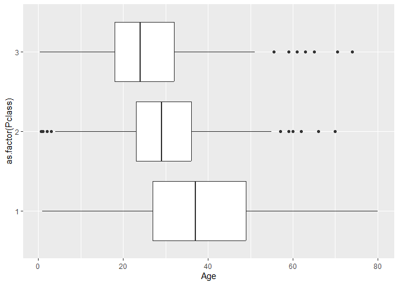

# Ciencia de datos en R


Verónica Cruz-Alonso and Julen Astigarraga
24/09/2024

- [<span class="toc-section-number">1</span> Visualización: contando
  historias](#visualización-contando-historias)
  - [<span class="toc-section-number">1.1</span> Ejercicio
    3.0.1](#ejercicio-301)
  - [<span class="toc-section-number">1.2</span> Ejercicio
    3.1.1](#ejercicio-311)
  - [<span class="toc-section-number">1.3</span> Ejercicio
    4.2.1](#ejercicio-421)
  - [<span class="toc-section-number">1.4</span> Ejercicio
    4.3.2](#ejercicio-432)
  - [<span class="toc-section-number">1.5</span> Ejercicio
    5.2.1](#ejercicio-521)
  - [<span class="toc-section-number">1.6</span> Ejercicio
    5.5.1](#ejercicio-551)
  - [<span class="toc-section-number">1.7</span> Ejercicio
    5.7.1](#ejercicio-571)

## Visualización: contando historias

### Ejercicio 3.0.1

Representa un gráfico para ver la relación entre el sexo de los
pasajeros y la clase.

``` r
library(tidyverse)
```

    ── Attaching core tidyverse packages ──────────────────────── tidyverse 2.0.0 ──
    ✔ dplyr     1.1.4     ✔ readr     2.1.5
    ✔ forcats   1.0.0     ✔ stringr   1.5.1
    ✔ ggplot2   3.5.1     ✔ tibble    3.2.1
    ✔ lubridate 1.9.3     ✔ tidyr     1.3.1
    ✔ purrr     1.0.2     
    ── Conflicts ────────────────────────────────────────── tidyverse_conflicts() ──
    ✖ dplyr::filter() masks stats::filter()
    ✖ dplyr::lag()    masks stats::lag()
    ℹ Use the conflicted package (<http://conflicted.r-lib.org/>) to force all conflicts to become errors

``` r
library(titanic)

titanic <- titanic::titanic_train 

ggplot(data = titanic, aes(x = Sex, y = Pclass)) + 
  geom_count(color = "purple")
```


``` r
  # geom_col()
```

### Ejercicio 3.1.1

¿Cómo modificarías el siguiente código para representar la puerta de
embarque con diferentes formas pero los puntos de color rosa?

``` r
ggplot(data = titanic) + 
  geom_point(aes(x = Age, y = Fare))
```

    Warning: Removed 177 rows containing missing values or values outside the scale range
    (`geom_point()`).


``` r
ggplot(data = titanic) + 
  geom_point(aes(x = Age, y = Fare, shape = Embarked), color = "pink")
```

    Warning: Removed 177 rows containing missing values or values outside the scale range
    (`geom_point()`).


### Ejercicio 4.2.1

Describe la distribución de las tarifas pagadas por los pasajeros.

``` r
ggplot(data = titanic, aes(x = Fare)) +
  geom_histogram()
```

    `stat_bin()` using `bins = 30`. Pick better value with `binwidth`.


``` r
ggplot(data = titanic) + 
  geom_density(aes(x = Fare))
```


``` r
ggplot(data = titanic) + 
  geom_boxplot(aes(y = Fare, fill = as.factor(Pclass), x = as.factor(Pclass), group = as.factor(Pclass)))
```


### Ejercicio 4.3.2

Haz un gráfico para averiguar en qué clase sobrevivieron más personas.

``` r
ggplot(data = titanic) + 
  geom_bar(aes(x = as.factor(Survived), fill = as.factor(Pclass), group = as.factor(Pclass)))
```


``` r
ggplot(data = titanic) + 
  geom_bar(aes(x = as.factor(Pclass), fill = as.factor(Survived)))
```


### Ejercicio 5.2.1

Cambia la posición de los ejes X e Y en el sistema de coordenadas de
pnumcat.

``` r
pnumcat <- ggplot(data = titanic) + 
  geom_boxplot(aes(x = as.factor(Pclass), y = Age, group = as.factor(Pclass)))

pnumcat + 
  coord_flip()
```

    Warning: Removed 177 rows containing non-finite outside the scale range
    (`stat_boxplot()`).



### Ejercicio 5.5.1

¿Qué harías para cambiar la escala de la edad a un degradado de colores
de azul a amarillo en el siguiente gráfico?

``` r
ggplot(data = titanic, aes(x = Age, y = Fare, color = Age)) + 
  geom_point()
```

    Warning: Removed 177 rows containing missing values or values outside the scale range
    (`geom_point()`).


``` r
ggplot(data = titanic, aes(x = Age, y = Fare, color = Age)) + 
  geom_point() + 
  scale_color_gradient(low = "blue", high = "yellow")
```

    Warning: Removed 177 rows containing missing values or values outside the scale range
    (`geom_point()`).


### Ejercicio 5.7.1

Dibuja una linea negra que represente los ejes de `miplot` y quita el
fondo del gráfico.

``` r
miplot <- ggplot(data = titanic) + 
  geom_bar(aes(x = Pclass, group = 1)) 

miplot + 
  theme(
    panel.background = element_blank(), 
    # panel.background = element_rect(fill = "transparent"), 
    axis.line = element_line(color = "black", size = 1)
    )
```

    Warning: The `size` argument of `element_line()` is deprecated as of ggplot2 3.4.0.
    ℹ Please use the `linewidth` argument instead.


------------------------------------------------------------------------

<details>
<summary>
Session Info
</summary>

``` r
Sys.time()
```

    [1] "2024-09-24 13:33:04 CEST"

``` r
sessionInfo()
```

    R version 4.4.1 (2024-06-14 ucrt)
    Platform: x86_64-w64-mingw32/x64
    Running under: Windows 10 x64 (build 19045)

    Matrix products: default


    locale:
    [1] LC_COLLATE=English_United Kingdom.utf8 
    [2] LC_CTYPE=English_United Kingdom.utf8   
    [3] LC_MONETARY=English_United Kingdom.utf8
    [4] LC_NUMERIC=C                           
    [5] LC_TIME=English_United Kingdom.utf8    

    time zone: Europe/Madrid
    tzcode source: internal

    attached base packages:
    [1] stats     graphics  grDevices utils     datasets  methods   base     

    other attached packages:
     [1] titanic_0.1.0   lubridate_1.9.3 forcats_1.0.0   stringr_1.5.1  
     [5] dplyr_1.1.4     purrr_1.0.2     readr_2.1.5     tidyr_1.3.1    
     [9] tibble_3.2.1    ggplot2_3.5.1   tidyverse_2.0.0

    loaded via a namespace (and not attached):
     [1] gtable_0.3.5      jsonlite_1.8.8    compiler_4.4.1    tidyselect_1.2.1 
     [5] scales_1.3.0      yaml_2.3.9        fastmap_1.2.0     R6_2.5.1         
     [9] labeling_0.4.3    generics_0.1.3    knitr_1.48        munsell_0.5.1    
    [13] pillar_1.9.0      tzdb_0.4.0        rlang_1.1.4       utf8_1.2.4       
    [17] stringi_1.8.4     xfun_0.45         timechange_0.3.0  cli_3.6.3        
    [21] withr_3.0.1       magrittr_2.0.3    digest_0.6.36     grid_4.4.1       
    [25] rstudioapi_0.16.0 hms_1.1.3         lifecycle_1.0.4   vctrs_0.6.5      
    [29] evaluate_0.24.0   glue_1.7.0        farver_2.1.2      fansi_1.0.6      
    [33] colorspace_2.1-1  rmarkdown_2.27    tools_4.4.1       pkgconfig_2.0.3  
    [37] htmltools_0.5.8.1

</details>
